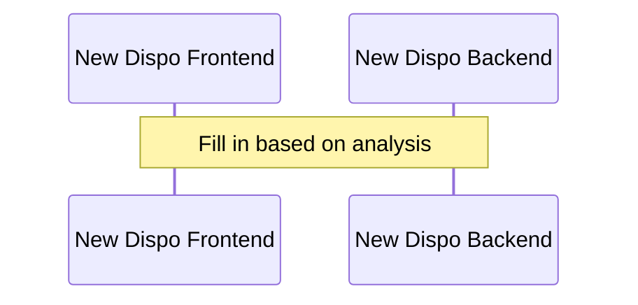

# BUG-{ID}: {Title}

## Ticket Info

| Field            | Value |
| ---------------- | ----- |
| Ticket Number    |       |
| Type             |       |
| Priority         |       |
| Severity         |       |
| State            |       |
| Sprint           |       |
| Tags             |       |
| Created          |       |
| Created By       |       |
| Last Updated     |       |
| Last Updated By  |       |
| System Info      |       |
| Found In         |       |
| Parent Work Item |       |
| Environment      |       |

**Current Behavior:** {from ticket}

**Expected Behavior:** {from ticket}

**Repro Steps:** {from ticket}

## Components Involved

| Component | Repository | Role | GCP Project / Service |
| --------- | ---------- | ---- | --------------------- |
|           |            |      |                       |

## Architecture of the {Feature} Flow

### Error Zone Summary

| Zone | Location | Error | Active Period | Root Cause |
|------|----------|-------|---------------|------------|
|      |          |       |               |            |

### Key Files

- {file paths from code analysis}

## Log Evidence (GCP Cloud Run, {environment})

{Summary: failure rate, anomalies}

### Phase 1: {Error Description} ({date range})

| Timestamp | Latency | Error Message |
| --------- | ------- | ------------- |
|           |         |               |

**Interpretation:** {analysis}

## Log Entry Correlation: Confirming Error Attribution

{For each error zone: why is the error attributed to that component?}
{Include trace ID match tables for cross-component correlation}

## Root Causes

### 1. {Root Cause Title}

{Explanation with code references}

## Recommendations

### Immediate

1. {Fix the current blocker}

### Short-Term

2. {Fix logging / observability}

### Medium-Term

3. {Robustness improvements}

---

  Created and maintained by <strong>Virtual Architect</strong>

