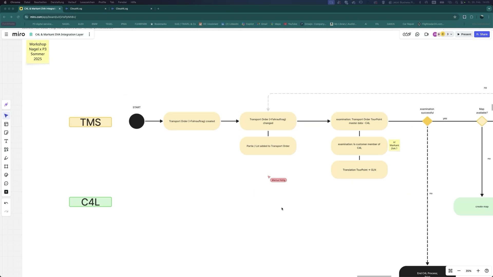
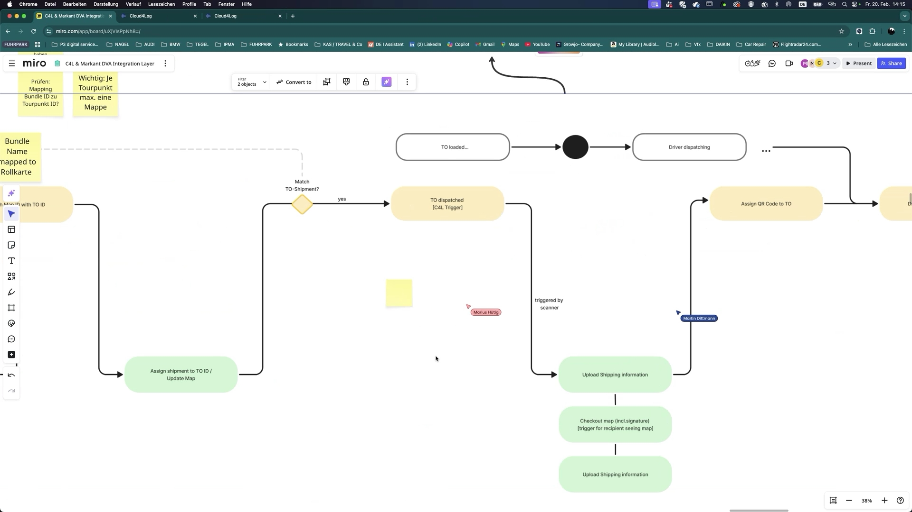
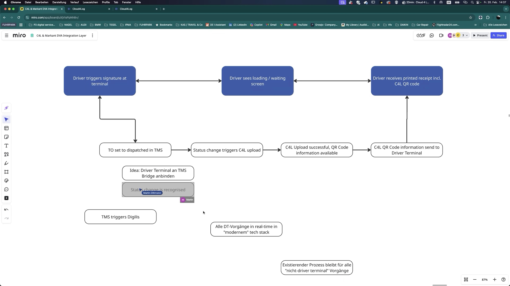
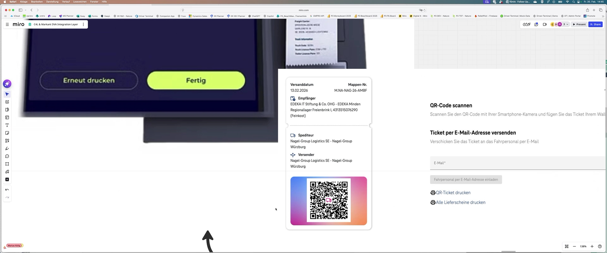
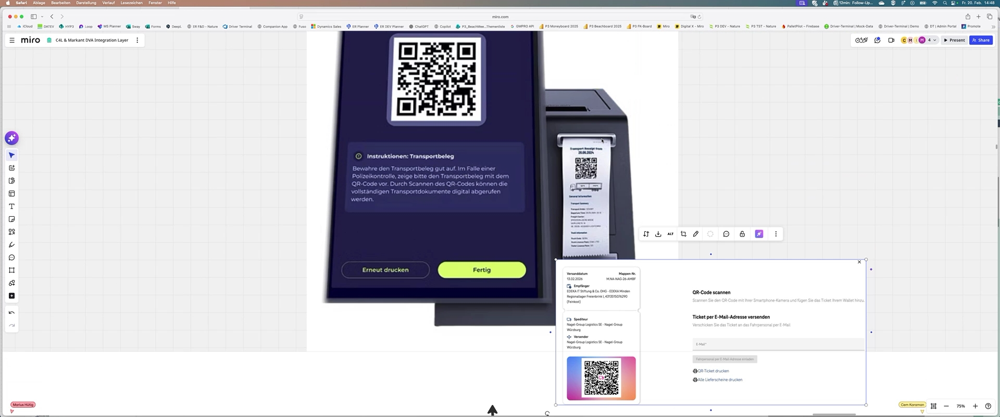
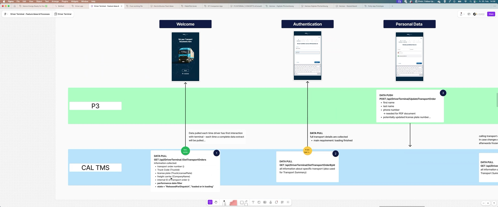
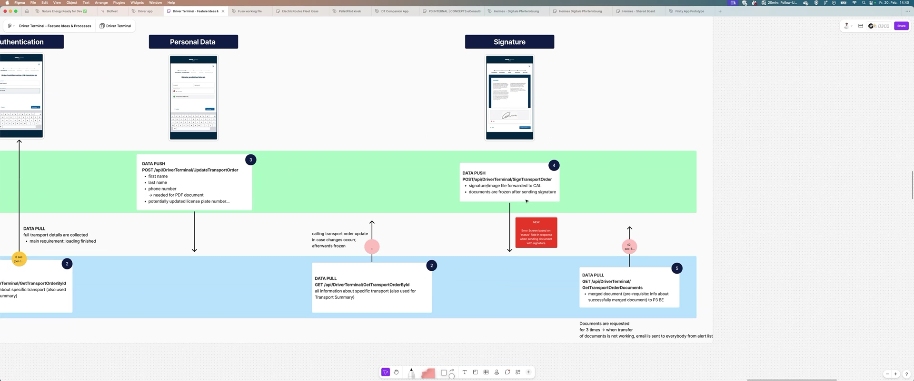
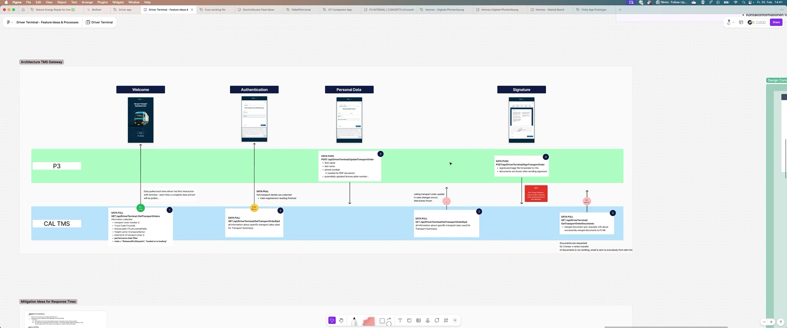
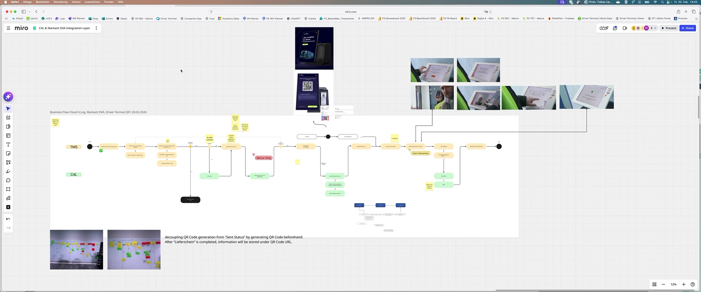

Besprechungsnotizen:

Business Flow und QR-Code-Prozess Cloud for Lock: 

Cem, Martin, Marius Hütig und Matthias diskutierten detailliert den End-to-End-Business-Flow von TMS zu Cloud for Lock, insbesondere die Generierung und Zuordnung von Mappen und QR-Codes pro Tourpunkt sowie die technischen und prozessualen Anforderungen für die Integration in den Fahrerprozess.
	Mappen- und QR-Code-Logik: Im Prozess wird für jeden Empfänger (GLN) eine eigene Mappe in Cloud for Lock angelegt, die alle Lieferscheine für diesen Tourpunkt bündelt. Die Zuordnung erfolgt über einen Mappennamen, der aus internen Nummern wie Rollkarte oder Bordeaux-Nummer gebildet wird. Für jede Mappe wird ein eindeutiger QR-Code generiert, der später für den Check-in-Prozess beim Empfänger genutzt wird.
	Statuswechsel und QR-Code-Verfügbarkeit: Der QR-Code wird in Cloud for Lock verfügbar, sobald alle Lieferscheine und ein Unterschriftsbild hochgeladen wurden und die Mappe den Status 'versendet' erhält. Die Unterschrift wird aktuell technisch erzeugt und nicht zwingend vom Fahrer geleistet. Erst nach Abschluss dieses Prozesses ist der QR-Code für den Empfänger sichtbar und kann genutzt werden.
	Integration in den Fahrerprozess: Im Fernverkehr wird der Abschluss des Transportauftrags am Driver Terminal durch die Unterschrift des Fahrers ausgelöst. Danach werden die Dokumente und das Unterschriftsbild hochgeladen, was den Statuswechsel und die QR-Code-Generierung triggert. Der QR-Code wird anschließend dem Fahrer zur Verfügung gestellt, entweder direkt am Terminal oder als Ausdruck.
	Synchronisationsmechanismen und Performance: Aktuell erfolgt der Upload der Dokumente zu Cloud for Lock intervallbasiert (z.B. minütlich), was zu Wartezeiten führen kann. Es wurde diskutiert, diesen Prozess zukünftig eventbasiert und in Echtzeit über die TMS Bridge zu gestalten, um die Benutzererfahrung für den Fahrer zu verbessern und Wartezeiten zu minimieren.
	Fehlerfälle und Prozesssicherheit: Es wurde betont, dass der Upload und Statuswechsel transaktionsbasiert erfolgen sollte, um Fehlerfälle zu vermeiden, bei denen ein QR-Code generiert wird, obwohl der Transportauftrag noch nicht korrekt abgeschlossen ist. Die technische Umsetzung soll sicherstellen, dass alle notwendigen Schritte abgeschlossen sind, bevor der QR-Code bereitgestellt wird.

    
    
    
    
    

Umstellung Driver Terminal von TMS Proxy auf TMS Bridge: 

Martin, Matthias und Marius Hütig besprachen die geplante Migration des Driver Terminals von der bisherigen TMS Proxy-Anbindung auf die TMS Bridge, um eine moderne, eventgetriebene und performantere Integration zu ermöglichen.
	Technische Migration und Endpunkte: Die Migration umfasst die Übernahme und Anpassung bestehender Endpunkte vom Proxy auf die Bridge. Es wurde festgestellt, dass die meisten Endpunkte bereits existieren oder mit geringem Aufwand übernommen werden können. Die Migration wird als technisch machbar und mit überschaubarem Aufwand eingeschätzt.
	Vorteile der Bridge-Anbindung: Durch die Anbindung an die TMS Bridge können Statusänderungen in Echtzeit erkannt und als Trigger für nachgelagerte Prozesse wie den Cloud for Lock Upload genutzt werden. Dies ermöglicht eine bessere Integration in moderne Systemlandschaften und reduziert die Abhängigkeit von Legacy-Systemen.
	Konzeptentwicklung und Aufgabenverteilung: Es wurde vereinbart, ein technisches Konzept zu erstellen, das sowohl die klassische als auch die moderne Variante beleuchtet. Die Bewertung und Umsetzung der Migration soll gemeinsam mit relevanten Stakeholdern wie Christian, Mario und Max erfolgen, um alle Anforderungen und Schnittstellen abzudecken.

    
    
    
    

Integration und Besonderheiten Markant DVA: 

Marius Hütig und Matthias erläuterten, dass der Prozess für Markant DVA inhaltlich und technisch weitgehend identisch zu Cloud for Lock abläuft, jedoch noch offene Punkte bezüglich der QR-Code-Generierung und API-Spezifika bestehen.
	Prozessangleichung und offene Fragen: Für Markant DVA soll der gleiche Ablauf wie bei Cloud for Lock gelten: Der Fahrer erhält anstelle von Direktpapieren einen QR-Code, der alle relevanten Informationen enthält. Es muss noch geklärt werden, ob Markant DVA die QR-Code-Information als Bild oder als Text bereitstellt und wie die Integration technisch erfolgt.

****

Nächste Schritte und Verantwortlichkeiten: 

Martin, Matthias und Marius Hütig legten fest, dass ein technisches Konzept für die Migration und Integration erstellt wird, die Aufgabenverteilung mit Max und Mario abgestimmt wird und Christian über die geplanten Schritte informiert wird.
	Konzept- und Workshopplanung: Ein technischer Workshop soll aufgesetzt werden, um die Details der Migration und Integration zu klären. Die Bewertung der Umstellung auf die TMS Bridge erfolgt gemeinsam mit den relevanten Entwicklern und Architekten.
	Abstimmung mit Stakeholdern: Christian wird über die geplanten Maßnahmen informiert und kann Feedback geben. Die Aufgaben für die Anpassung des Driver Terminals und die Migration werden zwischen Max, Mario und dem Team verteilt.

Folgeaufgaben:

Technisches Konzept für Cloud for Lock und Driver Terminal: 
Erarbeite ein technisches Konzept, das beide Optionen (moderne Umsetzung über die TMS Bridge und bestehender Prozess) für die Integration von Cloud for Lock und Driver Terminal bewertet und alle notwendigen Anpassungen sowie Aufwände darstellt. (Matthias, Martin)
Abstimmung mit Christian zur Vorgehensweise und Aufwände: 
Stimme das geplante Vorgehen und die entstehenden Aufwände für den Umzug auf die Bridge sowie die Konzeptarbeit mit Christian ab und hole sein Feedback ein. (Martin)
Evaluation der QR-Code-Generierung für Markant und Cloud for Lock: 
Prüfe, ob Markant und Cloud for Lock die Möglichkeit bieten, den Inhalt des QR-Codes (anstatt eines Bildes) bereitzustellen, um eine einheitliche und technisch einfache Lösung zu ermöglichen. (Matthias)
Workshop zur technischen Abstimmung Driver Terminal und Cloud for Lock: 
Organisiere einen technischen Workshop mit den relevanten Entwicklern (u.a. Mario, Max), um die Anpassungen am Driver Terminal und die Integration mit Cloud for Lock im Detail zu besprechen. (Martin, Matthias)
Abstimmung der Verantwortlichkeiten für Umzug und Anpassungen: 
Kläre mit Max und Mario, ob sie Verantwortlichkeiten für den Umzug des Terminals und die Anpassungen am Driver Terminal übernehmen können. (Marius Hütig)