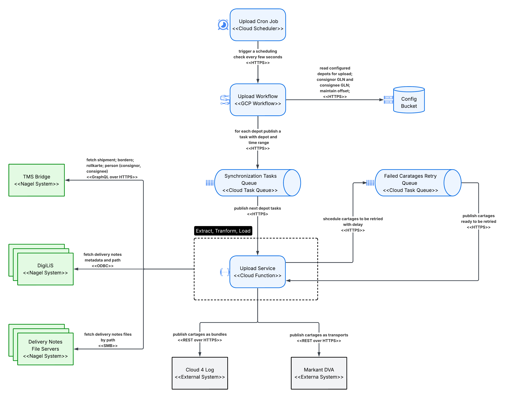
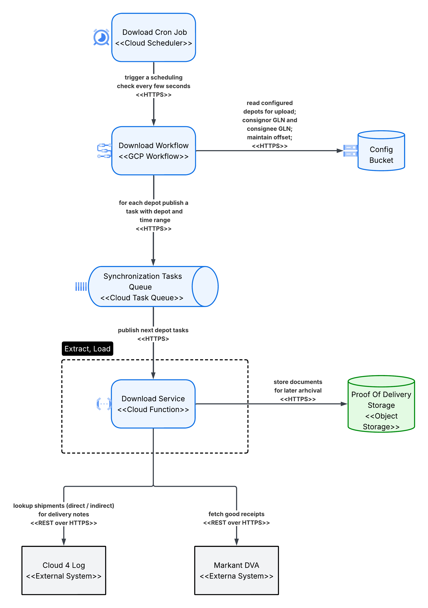

<h1 style="display: inline; margin: 0; vertical-align: middle;">&#8203;</h1>


# MARKANT DVA Integration – Demand Outline
===========================

The requirements needs to been aligned with business and IT and show the requirements by the state of **We 17.12.2025**.  
The business requirements must be aligned with **Marius Hütig**.  
The technical solution design must be aligned with **Christian Lang** or **Pascal Leicht**.

---

## 1. Objective
------------

* **Short description of the Markant DVA integration**  
Integrate the Markant DVA (Digitale Versandavisierung) platform alongside Cloud4Log for delivery note, goods receipt, and proof-of-delivery exchange.

* **Business goals and expected impact**
  * Enable digital delivery note exchange with Markant partners
  * Allow parallel usage of Cloud4Log and Markant DVA per depot
  * Keep TMS as single source of truth

* **Solution approach**
  * Platform-agnostic integration using Adapter Pattern
  * Shared abstraction layer for multiple platforms
  * Backend-driven configuration

---

## 2. Context
----------

### Current DVA / POD process overview
------------------------------------

Delivery note and POD handling is currently implemented via Cloud4Log.  
Markant DVA introduces an additional external platform with separate APIs, authentication, and data models.

---

### Role of TMS as source of truth
---------------------------------

The TMS Database acts as the authoritative system for:

* Transport orders
* Consignments
* Delivery note metadata
* Depot configuration

External platforms do not own business logic or master data.

---

### Assumptions and constraints
-------------------------------

* TMS remains the single source of truth
* No MVP – full scope implementation
* Platform selection configurable per depot
* Backend-only integration
* Image upload is explicitly out of scope

---

## 3. Scope of This Increment
----------------------------

### Overview of included capabilities
-------------------------------------

* Markant DVA integration
* Multi-platform support (Cloud4Log + DVA)
* Upload and download workflows
* Full DVA API coverage

---

### Non-goals
-------------

* Image upload for damaged pallets
* Replacement of Cloud4Log
* Business logic outside TMS

---

## 4. User Stories / Use Cases
-----------------------------

### 4.1 Markant DVA Integration  
**User Story – ADO #120153 **
------------------------------------

**WHO**  
As a business and IT user, I want to integrate Markant DVA so that delivery notes and goods receipts can be exchanged digitally.

**Description**  
The system must support sending and receiving delivery-note-related data via Markant DVA while allowing Cloud4Log to remain active.

**Actors**  
Business users, backend systems

**Preconditions**
* Depot configuration exists
* DVA credentials available

**Postconditions**
* Data successfully exchanged with Markant DVA
* No impact on existing Cloud4Log usage

---

### Technical Solution  
**Technical PBI – ADO #119849 **
------------------------------------

#### Architecture Overview

**Upload**



**Download**



**Performance**
1. Batching - should be utilized for polling or fetching data from different sources to:
   - Approach:
      - reduce overheads (N+1 query complexity) - try to localize fetching of data from a single HTTP request or single SQL query
      - reduce resources requirements (memory constraints) - instead of fetching all data at once, batching as pagination or offset/based iteration should be used; numeric offset (page number, record offset) is usually not performing well, try to use sort and comparison on a field in conjunction with last record values from previous batch (`WHERE date_created > :last_record_date_created AND id > :last_record_id ORDER BY date_created ASC, id ASC`
   - Applicable:
     - TMS Bridge - GraphQL requests
     - DigiLiS - DB queries
     - Failed Cartages Retry Queue - publishing and consumption
     - Download Service - C4L and Markant DVA - fetching of proof of deliveries
2. Autoscaling
    - Approach:
      - Ability to scale out when handling increased volumes
      - Partition data on ranges 
    - Applicable:
      - Download and Upload Service - on incoming HTTP requests from Cloud Task Queues
3. Throttling
     - Approach:
       - limiting the max concurrency to prevent saturating underlying resources and degrade further the performance and reliability
     - Applicable:
       - Configure max concurrency on Cloud Task Queues
4. Polling interval
      - Approach:
         - the polling interval should balance between fetching too little data at once (throughput) and fetching data with delay (latency)
      - Applicable:
         - Upload Cron Job and Download Cron Job
         - Upload Workflow and Download Workflow - time range window size
5. Streaming Files
      - Approach:
         - buffer uploads / download with in-memory buffer if possible with underlying APIs instead of fetching whole files in memory
         - Write chunks into sockets being part of the same request or use APIs that allow assembling chunks over multiple requests
      - Applicable:
         - Download Service and Upload Service

**Reliability**
1. Retries
   - Approach:
     - On transient errors for every I/O operation
     - Classification of transient errors is critical 
        - false positive transient error leads to occupying resources for endless retires
        - false positive non-transient error leads to discarding data from processing
     - In memory vs persistent - in-memory for retries < 3 seconds of cumulative retry time and persistent in Cloud Task Queues for all the rest 
     - Checkpointing
       - storing an offset when generating tasks so that the next iteration will yield the same 
       - storing failed records only in dedicated task queue
    - Applicable:
      - Upload Cron Job and Download Cron Jobs - work only with simple invocation of the Workflows without specifying date ranges; invocation is frequent
      - Upload Workflow and Download Workflow - checkpointing on generating and interval; should yield the same (depot, start_date, end_date) tuple based on the preserved offset during retries
      - Upload Service - when making requests queries to TMS Birdge, DigiLiS, Delivery Notes File Servers
      - Download Service - when making requests queries to Proof Of Delivery Storage
2. Fault Isolation
    - Approach
      - partition tasks per platform and per date range (instead of having big date ranges tasks on both Markant DVA and C4L)
      - concurrent message processing; since messages are not related even if there are data quality issues with some of the cartages the rest of the cartages are processed independently
     - Applicable:
       - Upload Service publishing to Failed Cartages Retry Queue - so that processing can continue
       - Upload Workflow and Download Workflow - publish tasks for different depots
3. Concurrency isolation
    - Approach:
      - preventing multiple processing of bordero / rollkarte batches on same (depot, offset) tuple
    - Applicable: 
      - Task Queue - internal implementation, unique task id 
4. At least-once-delivery - awaiting submission first before marking data as processed (confirming message, updating offsets) and potential retry on the same data
5. Idempotent processing
    - Approach
       - critical for preventing duplicates on the destination platforms
       - Prefer native support (unique constraints, upsert (insert or update), deduplication)
       - Fallback to query and update 
     - Applicable:
       - Cloud Tasks Queues - deduplication
       - Upload Service - when inserting data to C4L and Markant DVA
       - Download Service - when inserting data to Proof Of Delivery Storage

**Testability**
1. Component tests - simulating the components behavior in isolation, threating them as black boxes and working with their interfaces
2. Using Stubs - to simulate various scenarios using WireMock library
3. Using emulators - for Storage, Cloud Task Queue, DigiLis DB using Test Containers library
4. Using replacement implementations - for Cloud Tasks Queue
5. Covering not only the positive scenarios but various failure scenarios

**Modfiability**
1. Adapter pattern - Upload Service to include common interface for upload and separate classes as implementation for different platforms
2. Bordero and Rollkarte processing unification - working with unified domain model of caratages. Common codebase for NFRs concerns.


#### External APIs

* Cloud4Log API
* DVA API

---

## 5. DVA API Endpoints
----------------------
API Docs are available at: [`Markant DVA Docs`](https://demo.dva.markant.services/docs/api/dva-api-wms-integration/)

### Transport Controller (v2)

| Endpoint                                                                  | Method | Purpose                            |
| ------------------------------------------------------------------------- | ------ | ---------------------------------- |
| `/v2/transports`                                                          | POST   | Create transport with consignments |
| `/v2/transports/{transportId}/consignments/{consignmentId}/delivery-note` | POST   | Upload delivery note PDF           |

### Delivery Note Controller (v1)

| Endpoint                                        | Method | Purpose                     |
| ----------------------------------------------- | ------ | --------------------------- |
| `/v1/delivery-notes`                            | POST   | Create goods receipt bundle |
| `/v1/delivery-notes/{goodsReceiptId}/hard-copy` | POST   | Upload hard copy            |

### Goods Receipt Controller (v1)

| Endpoint                                                                          | Method | Purpose                                                                                   |
| --------------------------------------------------------------------------------- | ------ | ----------------------------------------------------------------------------------------- |
| `/incoming-goods/api/v1/goods-receipts`                                           | GET    | Query all good receipts metadata over pages that have been modified since a specific date |
| `/incoming-goods/api/v1/goods-receipts/:goodsReceiptId/attachments/:attachmentId` | GET    | Retrieves the content of a specific attachment associated with a goods receipt            |


---

### Authentication

| Platform  | Mechanism                                              |
| --------- | ------------------------------------------------------ |
| DVA       | OAuth 2.0 Client Credentials (Bearer Token, 1h expiry) |
| Cloud4Log | API Key (`dlssessionid` header)                        |

---

## 6. Open Business Questions
----------------------------


---

## 7. Non-Functional Requirements
---------------------------------
### 1. Performance / Scalability

* (NFR-01-01) The system should process 2 cartages per depot per minute on average with maximum of 40 delivery notes per cartage and total of 70 depots.
* (NFR-01-02) (Assumption) The system should accommodate 20% YoY growth in records count processing for the next 5 years.
* (NFR-01-03) (Assumption) The system should support 5 times increase of records to process compared to average for 20 days during seasonal peaks:
    * pre-Christmas
    * Easter
* (NFR-01-04) (Assumption) The system should support 3 times increase of records to process compared to average for that day (can be stacked with seasonal peaks) during rush hours:
    * Morning rush hours (≈ 05:00–09:00)
    * Afternoon / evening rush (≈ 17:00–22:00)
* (NFR-01-05) The system should support data synchronization to Markant DVA in less than 1 minutes per records on average and less than 2.5 minutes as upper boundary during both normal operation and peaks (seasonal peaks, rush hours) excluding the cases when any of the external systems being integrated is not available or when recovering from downtime (both the target system and any external systems).
* (NFR-01-06) The system should support delivery notes upload and good receipts download of size 3MB on average and less than 10MB as upper boundary.

---

### 2. Reliability

*  (NFR-02-01) The system should synchronize data with 99.999999999% (11 9's) success ratio considering the data is valid and consistent.
*  (NFR-02-02) In case of data quality issues in the delivery notes or consignees the system should synchronize the rest of the valid data with 99.999999999% (11 9's) success ratio.
*  (NFR-02-03) In case of data quality issues in any of the data the system should log an error with 99.95% success ratio. 
*  (NFR-02-04) None of the cartages have relative order to each other and the system should not assume a particular order to synchronize the data assuming the processing latency requirements are met.
*  (NFR-02-05) The system should support 99.9% uptime on average except for the maintenance windows **Saturday noon → Sunday evening (to be clarified)** German Time.
*  (NFR-02-06) The system should retry at least 3 times with exponential backoff when transient errors are detected in any of the external system applications integrations.
*  (NFR-02-07) (Assumption) The system should prevent saturating external systems in the scenario of big processing spikes (especially after recovering from longer downtime).
*  (NFR-02-08) (Assumption) The system should prioritize latest records when recovering from downtimes to limit as much as possible using a non-software business continuity paper-based solution.

### 3. Modifiability / Extensibility / Configurability
*   (NFR-04-01) (Assumption) The system should enable onboarding one similar platform to Markant DVA within 1 month.
*   (NFR-04-02) The system should enable onboarding a new depot within 1 to 2 business days.
*   (NFR-04-03) The system should enable onboarding a new consignee within 1 to 2 business days.
*  (NFR-04-04) (Assumption) All non-functional related configurations such as retry counts and intervals, batch sizes, throttling should be made configurable and updated in less than 2 hours

### 4. Manageability
*  (NFR-05-01) The following events need to be logged
    * Cartage not uploaded / Cartage upload failed with the following properties: Depot, Cartage,  Rollkarte,  Bordero
    * Delivery notes not uploaded with the following properties: Depot, Delivery Note Number(s)
    * Proof of delivery not downloaded / POD not saved in GCP bucket with the following properties: Depot, Delivery Note Number(s)
    * Upload delay with duration > 5 minutes with the following properties: Depot, Delivery Note Number(s)
    * Download delay with duration > 30 minutes with the following properties: Depot, Delivery Note Number(s)
    * Cloud4Log not available / Cloud4Log system unreachable
    * Upload / Download functions down for more than 3 minutes
*  (NFR-05-02) Alerts should be sent over email

##4. Auditability
* (NFR-06-01) (Assumption) Proof of Delivery documents stored temporary in GCP should be preserved for 30 days

### 5. Constraints
* (NFR-07-01) GDPR compliance for PII data in Proof of Delivery documents stored temporary in GCP

---

## 8. Project Boundaries & Collaboration Guidelines
--------------------------------------------------

* Clear ownership per component
* Interface-based delivery
* No environment deployment in scope
* SLA support via separate purchase order

### Key Structural Differences

```
Cloud4Log Flow:
DeliveryNote → Bundle → Tour → Checkout

DVA Flow:
Transport (with Consignments) → Delivery Note Upload per Consignment
