# Datastream CDC Analysis Report

**Stream:** orauat-1060-bucket  
**Source:** Oracle UAT (TMS1060_SENDUNG)  
**Target:** gs://tms-alloydb-datastream-bucket-wl5-t-t//UATDataStream  
**Period:** 2026-03-30 13:00 — 2026-04-02 12:00

---

## Throughput

| Metric | Value |
|--------|-------|
| Write events (log entries) | 1,271 |
| **Total records written** | **23,751** |
| Errors | 0 |
| **Delivery rate** | **100.00%** |
| Batch size (min / avg / max) | 1 / 19 / 1,098 |

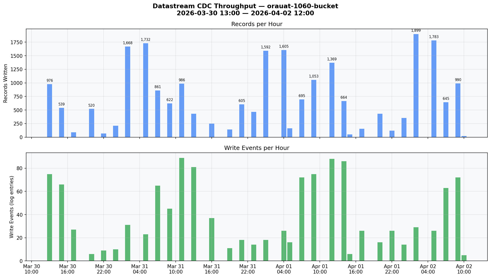

---

## End-to-End Latency (DB change to GCS object)

Metric: `datastream.googleapis.com/stream/total_latencies`

> **Official definition:** Time from when data is written to the source until the corresponding events are written to the destination.  
> Source: [Monitor a stream | GCP Docs](https://cloud.google.com/datastream/docs/monitor-a-stream)

| Percentile | Min | Avg | Max |
|-----------|-----|-----|-----|
| **P50** | 4.8 min | **66.5 min** | 157.8 min |
| **P95** | 30.3 min | **113.5 min** | 165.8 min |
| **P99** | 32.7 min | **127.7 min** | 166.5 min |

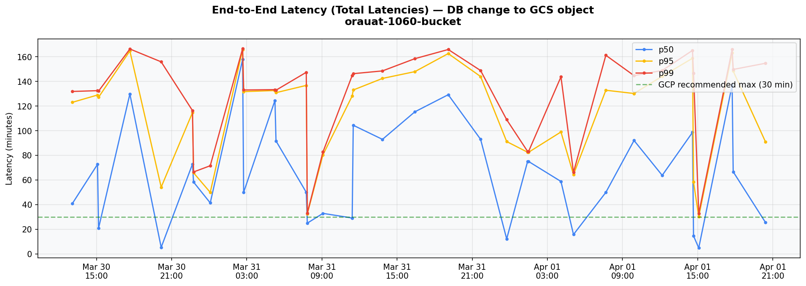

---

## System Latency (Datastream processing)

Metric: `datastream.googleapis.com/stream/system_latencies`

> **Official definition:** Time from when Datastream reads the event until it writes to the destination.  
> Source: [Monitor a stream | GCP Docs](https://cloud.google.com/datastream/docs/monitor-a-stream)

| Percentile | Min | Avg | Max |
|-----------|-----|-----|-----|
| **P50** | 5.0s | **22.7s** | 75.0s |
| **P95** | 9.5s | **41.2s** | 88.5s |
| **P99** | 9.9s | **50.9s** | 102.1s |

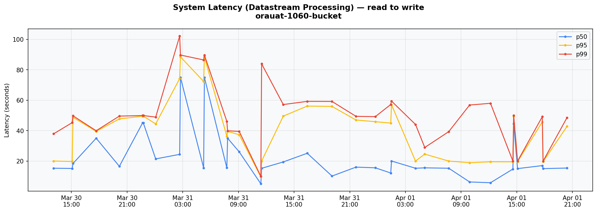

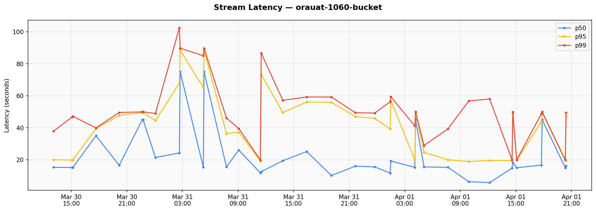

---

## Stream Freshness

Metric: `datastream.googleapis.com/stream/freshness`

> **Official definition:** Difference between when data was committed to the source and when Datastream reads it. Set to 0 if there are no new events to read.  
> **Formula: Total Latency = Freshness + System Latency**  
> Source: [Monitor a stream | GCP Docs](https://cloud.google.com/datastream/docs/monitor-a-stream)

709 data points, **almost entirely 0** — the stream is keeping up with the source whenever it polls.

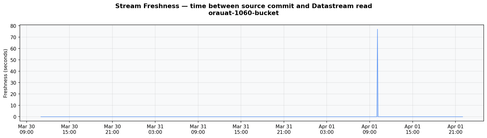

---

## Latency Breakdown

| Component | Value | % of total |
|-----------|-------|------------|
| **Total end-to-end (p50 avg)** | **66.5 min** | 100% |
| Datastream processing (p50 avg) | 23s | 0.6% |
| **Read lag / queue time** | **~66 min** | **99.4%** |

**99.4% of the end-to-end latency is NOT Datastream processing** — it is the time between the database change occurring and Datastream reading it from Oracle's archived redo logs via LogMiner.

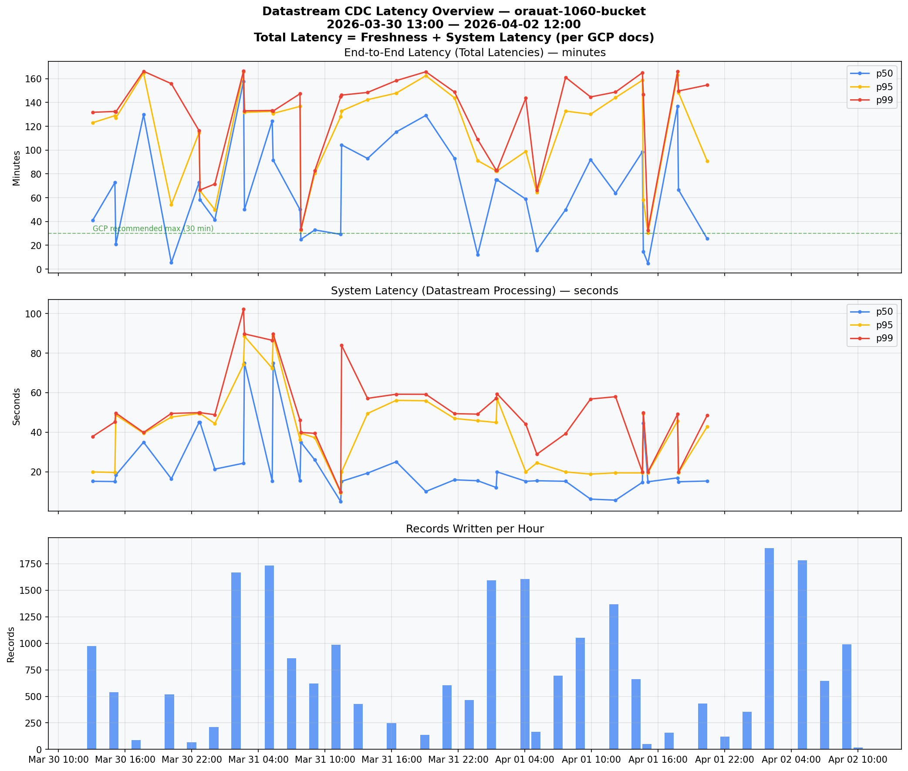

---

## Key Factors Affecting Read Lag

Per GCP documentation, the following factors determine how quickly Datastream can read changes from Oracle:

1. **Oracle redo log archival frequency** (primary factor)
   - Datastream reads from *archived* redo logs, not online logs
   - Minimum latency = redo log switch interval
   - Recommended: switch every 10-20 minutes, log size < 256MB
   - Current avg latency of ~66 min suggests switches may be ~60 min apart

2. **LogMiner is single-threaded**
   - Subject to higher latency with high transaction volumes
   - Alternative: Binary Log Reader (Preview) — multithreaded, reads online + archived logs

3. **`maxConcurrentCdcTasks` parameter**
   - Tune in Datastream to read more logs in parallel during peak hours

4. **Oracle source health**
   - CPU, SGA/PGA sizing, disk I/O, Streams Pool Size
   - Source overload: when logs are generated faster than Datastream can read them

5. **Oracle 19c deprecated `CONTINUOUS_MINE`**
   - Before 19c, LogMiner could read online redo logs in real-time
   - Now archived-log-only, adding inherent latency

**GCP expected latency:** up to 30 min end-to-end. Our observed avg of 66 min suggests the redo log switch frequency on the Oracle source should be optimized.

---

## Oracle Redo Log Tuning — Reducing CDC Latency

The archived redo log frequency is determined by **how often Oracle switches redo log files**. This is the most impactful tuning lever for Datastream latency and is configurable via two settings:

### 1. `ARCHIVE_LAG_TARGET` — Forced Log Switch Interval

Forces a redo log switch after a maximum number of seconds, even if the log isn't full:

```sql
-- Force a switch every 15 minutes (900 seconds)
ALTER SYSTEM SET ARCHIVE_LAG_TARGET = 900 SCOPE=BOTH;
```

| Setting | Effect on Datastream latency |
|---------|-----|
| `ARCHIVE_LAG_TARGET = 0` (default) | Switches only when log is full — unpredictable, can be hours during low activity |
| `ARCHIVE_LAG_TARGET = 1800` (30 min) | Max ~30 min before changes become visible |
| `ARCHIVE_LAG_TARGET = 900` (15 min) | GCP recommended sweet spot |
| `ARCHIVE_LAG_TARGET = 600` (10 min) | More aggressive — lower latency, more I/O overhead |

### 2. Redo Log File Size

Smaller redo log files fill up faster = more frequent switches = lower CDC latency.

```sql
-- Check current redo log size and groups
SELECT group#, bytes/1024/1024 AS size_mb, status FROM v$log;
```

**GCP recommendation:** keep redo log files < 256MB. Smaller (e.g., 128MB) = more frequent switches.

### 3. Diagnostic Queries

```sql
-- Current archive lag target
SHOW PARAMETER ARCHIVE_LAG_TARGET;

-- Current redo log switch frequency (recent history)
SELECT TO_CHAR(first_time, 'YYYY-MM-DD HH24:MI') AS switch_time,
       sequence#,
       ROUND((next_time - first_time) * 24 * 60, 1) AS duration_min
FROM v$archived_log
WHERE first_time > SYSDATE - 3
ORDER BY first_time;
```

### Trade-offs of Increasing Switch Frequency

- **More I/O** on the Oracle server (more frequent writes to archive destination)
- **More archive log files** to manage (storage, cleanup)
- **Slightly more CPU** for LogMiner processing of more, smaller files
- Need to increase Datastream's `maxConcurrentCdcTasks` to keep up with more frequent smaller logs

### Recommendation

Current avg latency of ~66 min suggests `ARCHIVE_LAG_TARGET` is likely 0 (default) or very high. Setting it to **900 (15 min)** combined with reducing redo log size to **128-256MB** should bring Datastream latency down to the ~15-30 min range that GCP targets.

---

## Oracle DBA Response (Robert Zanter, 2026-04-16)

Results from UAT1060:

### Redo Log Configuration

| Group | Size | Status |
|-------|------|--------|
| 1 | 1024 MB | ACTIVE |
| 2 | 1024 MB | ACTIVE |
| 3 | 1024 MB | CURRENT |
| 4 | 1024 MB | INACTIVE |
| 5 | 1024 MB | INACTIVE |

**Log size is 1 GB per group** — 4x larger than GCP's recommended max of 256 MB.

### ARCHIVE_LAG_TARGET

```
archive_lag_target = 0
```

**Default (no forced log switch)** — Oracle only switches when a log is full.

### Actual Log Switch Frequency (Apr 13-16)

Despite the large log size and no forced switching, logs are switching roughly **every ~30 minutes** during daytime due to high write volume on UAT1060. Overnight (01:00-05:00) switches are even more frequent (3-15 min) due to batch jobs.

### Why ~30 Min Switches But ~66 Min Datastream Latency?

Important context: `ARCHIVE_LAG_TARGET = 0` means there is **no time-based trigger**. The logs switch **only when the 1 GB is full**. The ~30 min switch frequency observed on Apr 13-16 is not a configured interval — it's a side effect of the current write volume happening to produce ~1 GB of redo data every ~30 minutes.

**This is volume-dependent, not time-guaranteed.** If write volume drops (weekends, holidays, low-activity periods), the 1 GB log could take **hours** to fill. During the POC period (Mar 30 - Apr 2, including a weekend), the write volume was likely lower, leading to longer gaps between log switches and explaining the ~66 min average — a mix of ~30 min during busy hours and much longer gaps during quiet periods.

### Current State vs. Proposed Change

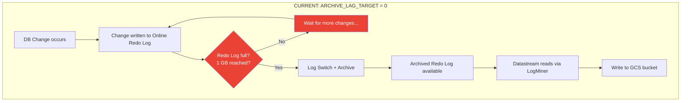

**Problem:** During low-activity periods, the 1 GB log may take hours to fill. All changes written during that time are invisible to Datastream until the log finally switches.

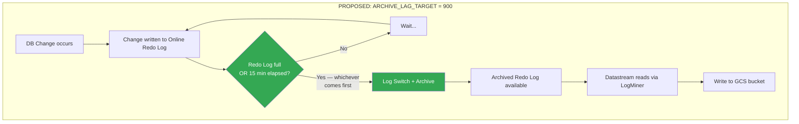

**Effect:** Even during nights/weekends with minimal write activity, a log switch happens at most every 15 minutes. Combined with smaller log files (256 MB), this guarantees consistent low latency regardless of DB activity level.

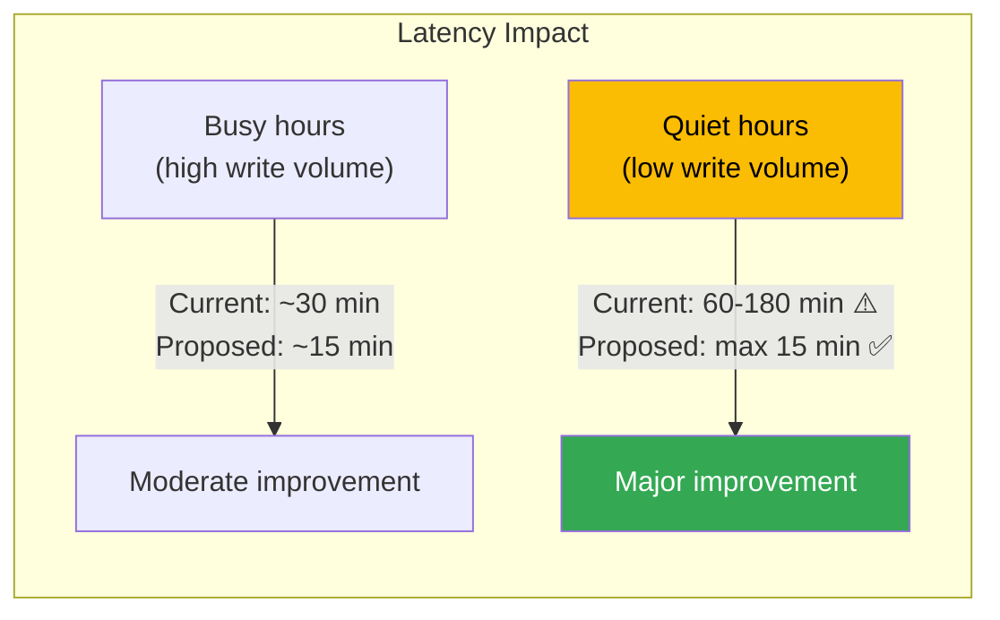

### DBA Data: Log Switch Pattern by Hour of Day (Apr 13-16)

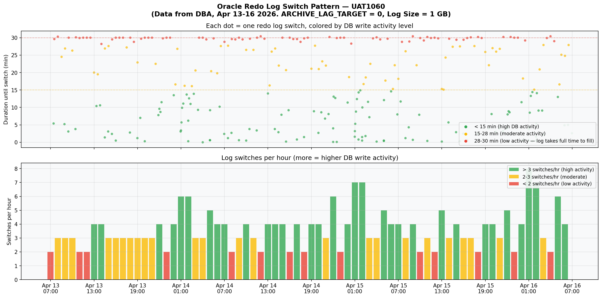

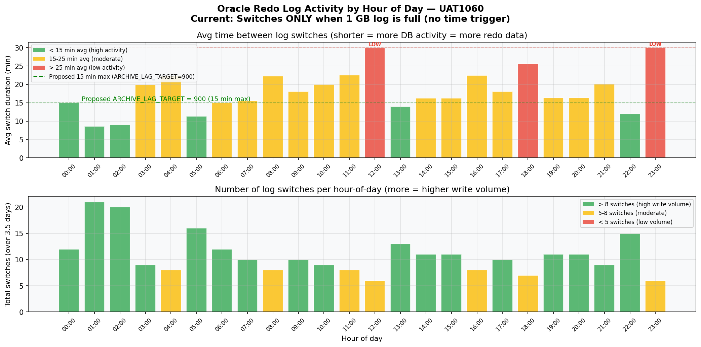

The charts show clear activity patterns:
- **12:00 and 23:00**: Red bars — avg 30 min switch duration = LOW write activity, log takes the full 30 min to fill 1 GB
- **01:00-02:00**: Green bars — avg 8-9 min = HIGH write activity (overnight batch jobs), 1 GB fills very fast
- **Business hours (07:00-17:00)**: Mostly yellow — moderate activity, 15-25 min per switch

**With `ARCHIVE_LAG_TARGET = 0`**, the low-activity periods (12:00, 23:00) have no safety net. If a weekend or holiday reduces write volume further, switches could take **hours**.

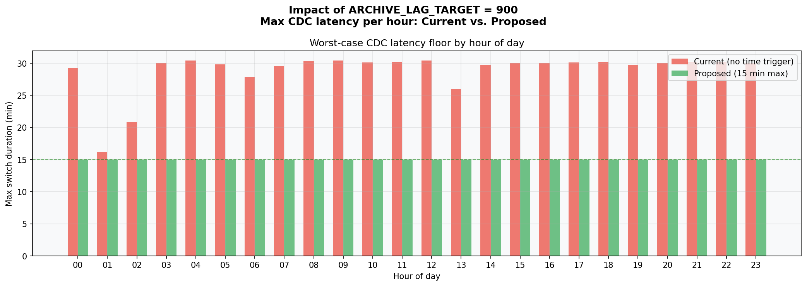

### Does More Frequent Log Switching Cause CPU Exhaustion?

**No.** The log switch operation is primarily **I/O-bound, not CPU-bound**:

- **Log switching** = flush current log buffer, mark log for archiving — lightweight I/O operation
- **Archiving** = copying redo log file to archive destination — disk I/O, minimal CPU
- The DB generates the **same amount of redo data** regardless of switch frequency — the data is just cut into smaller chunks
- Oracle's LGWR (Log Writer) and ARCn (Archiver) processes are highly optimized for this

The real overhead of more frequent switching is:
- **Slightly more I/O** — more frequent archive writes, more smaller files to manage
- **More archive log files** — requires storage and cleanup management
- **Checkpoint frequency** may increase — but Oracle handles this automatically

**Key evidence from the DBA data:** During overnight batch processing (01:00-02:00), UAT1060 is ALREADY switching every **3-9 minutes** without any reported issues. Setting `ARCHIVE_LAG_TARGET = 900` (15 min) would only force switches during **low-activity periods** when the DB has spare capacity anyway — it would never trigger during busy hours because the logs already fill within 15 min.

### Tuning Recommendations

Setting `ARCHIVE_LAG_TARGET = 900` adds a **time-based safety net**: whichever comes first — 1 GB full OR 15 min elapsed — triggers the log switch. This:
- **Guarantees** a max 15 min switch interval regardless of write volume
- **Eliminates the quiet-period latency spikes** that likely caused the ~66 min POC average
- Combined with reducing log size to **256 MB**: faster LogMiner parsing + even more frequent switches during busy hours

---

## Batch Size Distribution

| Batch size | Entries | Records | % of total records |
|-----------|---------|---------|-------------------|
| 1 | 213 | 213 | 0.9% |
| 2-5 | 497 | 1,515 | 6.4% |
| 6-10 | 215 | 1,651 | 7.0% |
| 11-50 | 271 | 5,482 | 23.1% |
| 51-100 | 37 | 2,615 | 11.0% |
| 101-500 | 31 | 7,668 | 32.3% |
| 500+ | 7 | 4,607 | 19.4% |

Large batches (500+) occur overnight (~02:00-05:00) — accumulated changes flushed in bulk during low-activity hours.

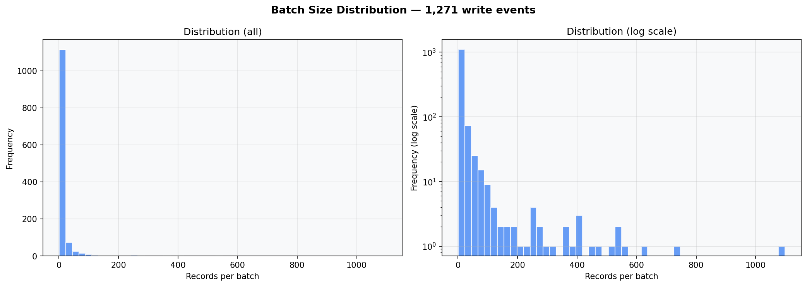

---

## Datastream vs. Striim — Why Striim is Faster

The observed avg end-to-end latency of ~66 min with GCP Datastream raises the question: why does Striim achieve sub-second latency on the same Oracle source?

### Root Cause: How They Read Oracle Redo Logs

| | GCP Datastream | Striim |
|---|---|---|
| **Read method** | LogMiner, **archived redo logs only** | Reads **online redo logs** directly (+ archived) |
| **Mining mode** | Waits for log archival before reading | **Active Log Mining (ALM)** — reads in real-time |
| **Alternative reader** | Binary Log Reader (Preview, not GA) | **OJet** — reads Oracle LCRs directly via API |
| **Throughput** | Not published | Oracle Reader: 20-80 GB/hr, OJet: 150+ GB/hr |
| **Latency** | ~30-60+ min (depends on log rotation) | **Sub-second** |

**GCP Datastream waits for Oracle to archive the redo log** before it can read changes. This means the minimum latency equals the redo log switch interval (typically 15-60 min). **Striim reads from the online redo log in real-time** — it does not wait for the archive step.

Analogy:
- **Datastream** = waits for the newspaper to be printed and delivered
- **Striim** = reads the journalist's screen as they type

### Oracle 19c Deprecation of CONTINUOUS_MINE — Impact on All Three Approaches

Oracle 19c deprecated `CONTINUOUS_MINE`, a LogMiner API feature that previously allowed reading online redo logs in real-time. **None of the current CDC solutions rely on it** — they all work around it differently:

| Solution | Uses CONTINUOUS_MINE? | Workaround |
|----------|----------------------|------------|
| **Datastream LogMiner (GA)** | No | Only reads archived logs — accepts the latency |
| **Datastream Binary Log Reader (Preview)** | No | Bypasses LogMiner entirely — parses raw binary redo files directly |
| **Striim ALM** | No | Own implementation reading online redo logs without CONTINUOUS_MINE |
| **Striim OJet** | No | Bypasses LogMiner entirely — reads Oracle LCRs via API |

### Datastream Binary Log Reader (Preview) — The Comparable Option

GCP's Binary Log Reader is conceptually similar to Striim's approach:
- Reads **online + archived** redo log files (not just archived)
- **Multithreaded** (not single-threaded like LogMiner)
- **Bypasses LogMiner** — parses raw binary redo files directly via ASM or database directory objects
- Supports **low-latency CDC**

Limitations vs. Striim:
- **Preview / Pre-GA** — not production-ready, limited support
- **Reduced data type coverage** compared to LogMiner method
- Does not support Oracle 11g (12c+ only)
- Still recommends tuning `maxConcurrentCdcTasks` and log switch frequency

### Implication for This POC

The ~66 min avg latency observed in this Datastream POC is **inherent to the LogMiner (GA) method's architecture** (archived-log-only mode), not a configuration issue. Options to reduce latency:

1. **Tune redo log rotation** — aim for 10-20 min switches to approach the GCP-stated ~30 min target
2. **Switch to Binary Log Reader (Preview)** — would significantly reduce latency by reading online logs, but is not yet GA
3. **Use Striim** — sub-second latency, production-ready, but adds a third-party dependency and cost

---

## Documentation Sources

### GCP Datastream
- [Monitor a stream | Datastream](https://cloud.google.com/datastream/docs/monitor-a-stream) — official metric definitions
- [General best practices | Datastream](https://cloud.google.com/datastream/docs/best-practices-general) — latency tuning guidance
- [Work with Oracle redo log files | Datastream](https://cloud.google.com/datastream/docs/work-with-oracle-database-redo-log-files) — redo log configuration
- [Stream data from Oracle databases | Datastream](https://docs.cloud.google.com/datastream/docs/sources-oracle) — LogMiner vs Binary Log Reader comparison
- [Configure a self-managed Oracle database | Datastream](https://cloud.google.com/datastream/docs/configure-self-managed-oracle) — Binary Log Reader setup
- [End-to-end latency for Oracle to BigQuery | Google Cloud Community](https://medium.com/google-cloud/understand-end-to-end-latency-for-oracle-to-bigquery-replication-with-datastream-and-dataflow-55f350526eb1) — deep dive on latency components
- [Life After LogMiner: Oracle CDC with Datastream | ExpertBeacon](https://expertbeacon.com/life-after-logminer-implementing-oracle-cdc-with-datastream-on-google-cloud/) — LogMiner limitations and alternatives

### Striim
- [Striim Oracle Database CDC readers](https://www.striim.com/docs/en/oracle-database-cdc.html) — Oracle Reader vs OJet comparison
- [Striim: Oracle CDC Methods, Benefits, Challenges](https://www.striim.com/blog/oracle-cdc/) — architecture overview
- [Striim: LogMiner Continuous Mining Deprecation](https://www.striim.com/blog/logminer-continuous-mining-deprecation-what-you-need-to-know/) — ALM and OJet as replacements
- [Google Cloud Blog: Oracle to BigQuery with Striim](https://cloud.google.com/blog/products/data-analytics/data-integration-from-oracle-to-google-bigquery-using-striim/) — GCP + Striim integration

---

## Output Files

| File | Contents |
|------|----------|
| `consolidated_report.csv` | Hourly breakdown: events, records, all latencies |
| `consolidated_summary.json` | Machine-readable full summary |
| `consolidated_report.md` | This file |
