# Datastream CDC Analysis Report — Full POC Period

**Stream:** orauat-1060-bucket  
**Source:** Oracle UAT1060 (TMS1060_SENDUNG)  
**Oracle Versions:** Mainly 12.1.0.2; KRITIS databases on 19.9 / 19.21  
**Target:** gs://tms-alloydb-datastream-bucket-wl5-t-t/UATDataStream  
**Period:** 2026-03-30 10:15 — 2026-04-09 08:02 (UTC)  
**CDC Method:** oracle-cdc-logminer (LogMiner, archived redo logs only)

---

## Throughput

| Metric | Value |
|--------|-------|
| Write events (log entries) | 2,484 |
| **Total records written** | **75,043** |
| Errors | 0 |
| **Delivery rate** | **100.00%** |
| Batch size (min / avg / max) | 1 / 30 / 9,920 |

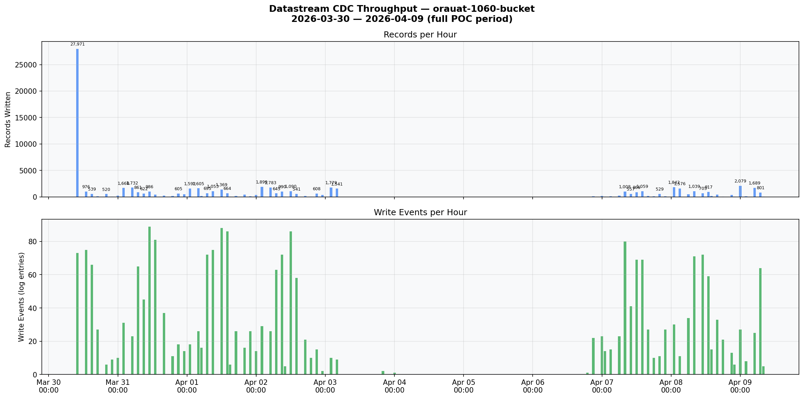

---

## End-to-End Latency (DB change to GCS object)

Metric: `datastream.googleapis.com/stream/total_latencies`

> **Official definition:** Time from when data is written to the source until the corresponding events are written to the destination.  
> Source: [Monitor a stream | GCP Docs](https://cloud.google.com/datastream/docs/monitor-a-stream)

| Percentile | Min | Avg | Max |
|-----------|-----|-----|-----|
| **P50** | 5.0s | **41.8 min** | 157.8 min |
| **P95** | 9.5s | **70.4 min** | 165.8 min |
| **P99** | 9.9s | **80.2 min** | 166.5 min |

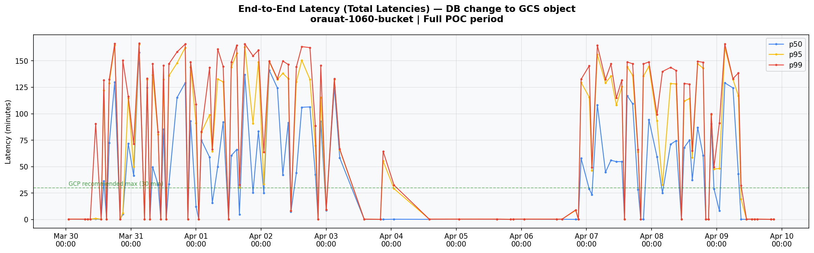

---

## System Latency (Datastream processing)

Metric: `datastream.googleapis.com/stream/system_latencies`

> **Official definition:** Time from when Datastream reads the event until it writes to the destination.  
> Source: [Monitor a stream | GCP Docs](https://cloud.google.com/datastream/docs/monitor-a-stream)

| Percentile | Min | Avg | Max |
|-----------|-----|-----|-----|
| **P50** | 5.0s | **16.1s** | 71.9s |
| **P95** | 9.5s | **32.6s** | 88.2s |
| **P99** | 9.9s | **41.2s** | 108.8s |

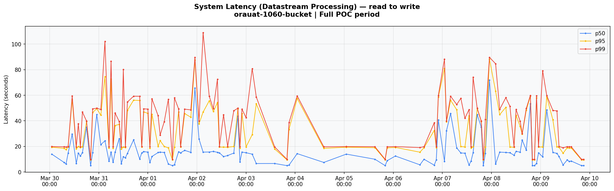

---

## Stream Latency

Metric: `datastream.googleapis.com/stream/latencies`

| Percentile | Min | Avg | Max |
|-----------|-----|-----|-----|
| **P50** | 5.0s | **16.4s** | 71.9s |
| **P95** | 9.5s | **33.0s** | 88.2s |
| **P99** | 9.9s | **42.0s** | 108.8s |

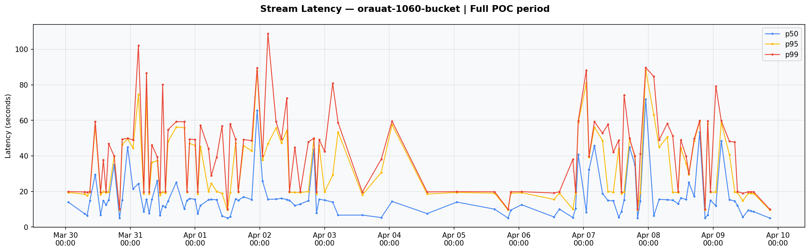

---

## Stream Freshness

Metric: `datastream.googleapis.com/stream/freshness`

> **Official definition:** Difference between when data was committed to the source and when Datastream reads it. Set to 0 if there are no new events to read.  
> **Formula: Total Latency = Freshness + System Latency**  
> Source: [Monitor a stream | GCP Docs](https://cloud.google.com/datastream/docs/monitor-a-stream)

264 data points across the full POC period.

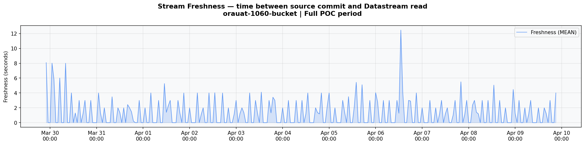

---

## Latency Breakdown

| Component | Value | % of total |
|-----------|-------|------------|
| **Total end-to-end (p50 avg)** | **41.8 min** | 100% |
| Datastream processing (p50 avg) | 16.1s | 0.6% |
| **Read lag / queue time** | **~41.5 min** | **99.4%** |

**99.4% of the end-to-end latency is NOT Datastream processing** — it is the time between the database change occurring and Datastream reading it from Oracle's archived redo logs via LogMiner.

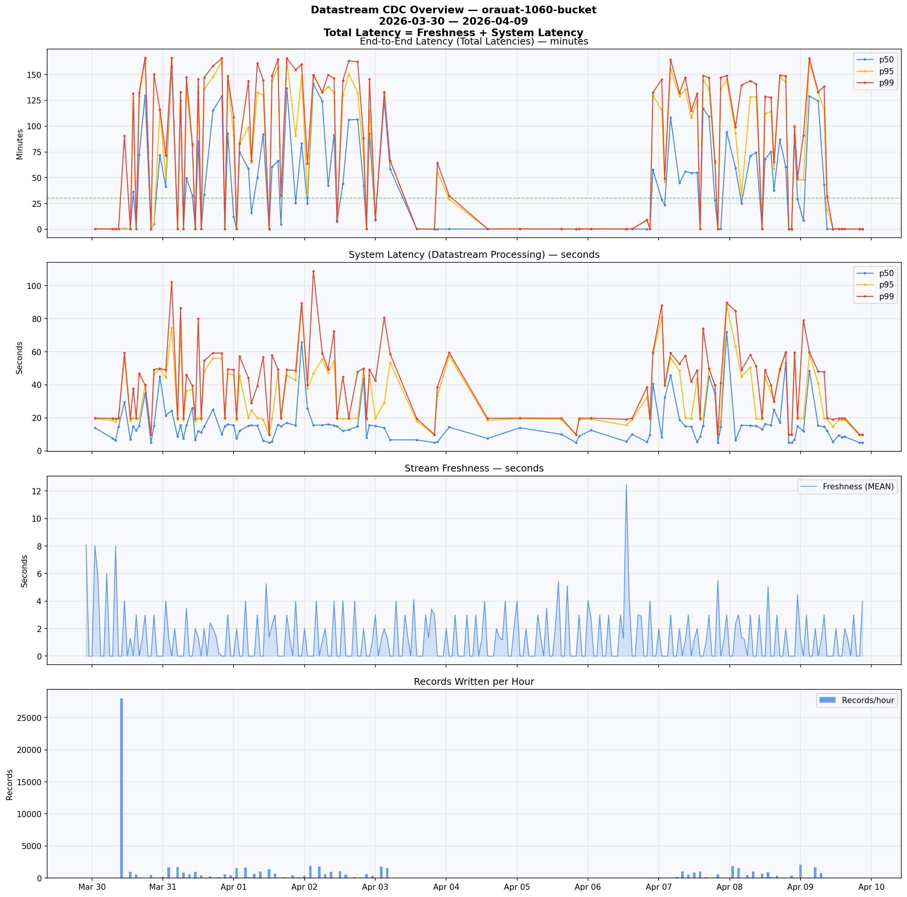

---

## Key Factors Affecting Read Lag

Per GCP documentation, the following factors determine how quickly Datastream can read changes from Oracle:

1. **Oracle redo log archival frequency** (primary factor)
   - Datastream reads from *archived* redo logs, not online logs
   - Minimum latency = redo log switch interval
   - Recommended: switch every 10-20 minutes, log size < 256MB
   - Current avg switch interval during POC: ~16 min (volume-dependent, NOT time-guaranteed)

2. **LogMiner is single-threaded**
   - Subject to higher latency with high transaction volumes
   - Alternative: Binary Log Reader (Preview) — multithreaded, reads online + archived logs

3. **`maxConcurrentCdcTasks` parameter**
   - Tune in Datastream to read more logs in parallel during peak hours

4. **Oracle source health**
   - CPU, SGA/PGA sizing, disk I/O, Streams Pool Size
   - Source overload: when logs are generated faster than Datastream can read them

5. **Oracle 19c deprecated `CONTINUOUS_MINE`**
   - Before 19c, LogMiner could read online redo logs in real-time
   - Now archived-log-only, adding inherent latency

**Our observed avg of 41.8 min (p50)** is far outside the range business expects. The root cause is the redo log configuration on the Oracle source, not Datastream itself.

---

## GCP Warnings: Redo Log File Size Too Big

During the POC period, GCP Datastream generated **130 `ORACLE_CDC_LOG_FILE_SIZE_TOO_BIG` warnings**:

> *"The log file [...] size exceeds the recommended size of 1GB. Consider adjusting the log file size configuration to improve processing efficiency and reduce the risk of error."*

This is **GCP itself confirming** that the current redo log configuration on UAT1060 exceeds its recommended maximum. These warnings appeared consistently throughout the entire POC — approximately 12 per day.

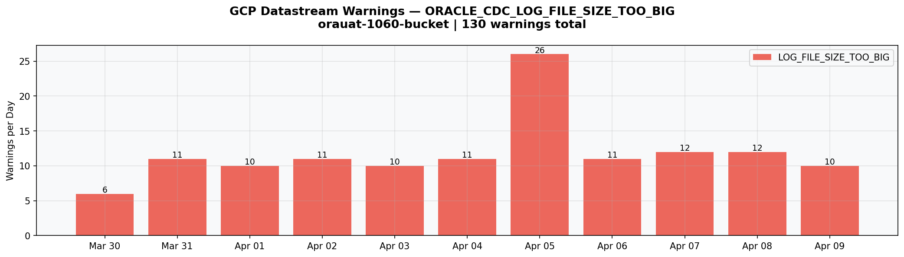

---

## Oracle DBA Response (Robert Zanter)

### Redo Log Configuration (UAT1060)

| Group | Size | Status |
|-------|------|--------|
| 1 | 1024 MB | ACTIVE |
| 2 | 1024 MB | ACTIVE |
| 3 | 1024 MB | CURRENT |
| 4 | 1024 MB | INACTIVE |
| 5 | 1024 MB | INACTIVE |

**Log size is 1 GB per group** — 4x larger than GCP's recommended max of 256 MB.

### ARCHIVE_LAG_TARGET

```
archive_lag_target = 0
```

**Default (no forced log switch)** — Oracle only switches when a log is full.

### Log Switch Frequency (Full Range: Mar 26 – Apr 8)

Robert provided **1,310 log switch entries** covering Mar 26 to Apr 8 — the complete POC period and surrounding days.

**POC period (Mar 30 – Apr 9): 901 switches**
- Min duration: 0.1 min
- Avg duration: **16.0 min**
- Max duration: 30.6 min

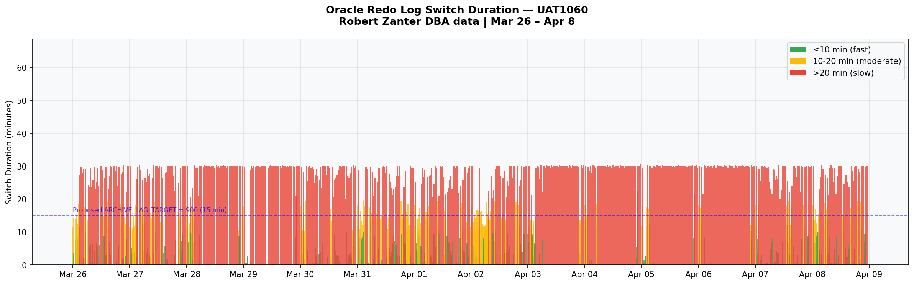

### Log Switch Pattern by Hour of Day

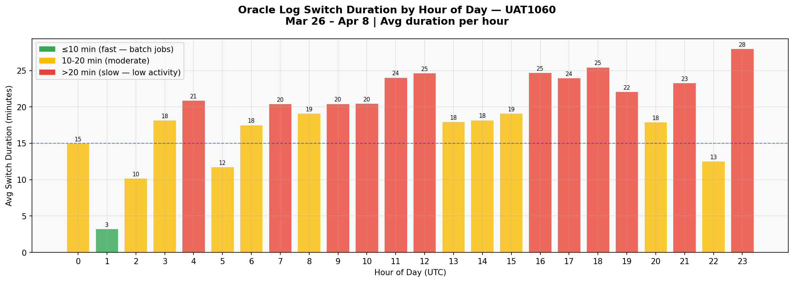

The chart shows clear activity patterns:
- **Overnight (00:00-05:00):** Fast switches (3-15 min) — batch jobs generating high redo volume
- **Business hours (06:00-17:00):** Moderate switches (15-25 min) — steady transactional load
- **Evening/Low activity (18:00-23:00):** Slow switches (25-30 min) — low write volume, 1 GB takes longer to fill

### Why ~16 Min Avg But ~42 Min Datastream Latency?

`ARCHIVE_LAG_TARGET = 0` means there is **no time-based trigger**. Logs switch **only when the 1 GB is full**. The ~16 min average is driven by write volume during business hours. But:

- The **distribution is bimodal**: many fast switches during busy hours, and slow ~30 min switches during quiet hours
- Datastream's total latency includes **additional overhead beyond just the log switch interval**: LogMiner parsing time, network transfer, and queuing
- The **P50 avg of 41.8 min** captures periods where low write activity caused long gaps between log switches

### Current State vs. Proposed Change

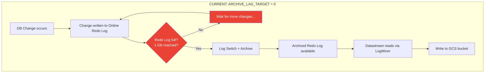

**Problem:** During low-activity periods, the 1 GB log may take 30+ minutes to fill. All changes written during that time are invisible to Datastream until the log finally switches.

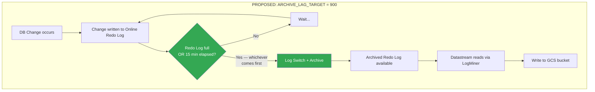

**Effect:** Even during low-activity periods, a log switch happens at most every 15 minutes.

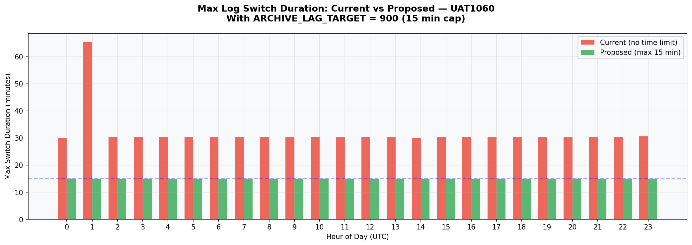

### Oracle Log Switch vs Datastream Latency Correlation

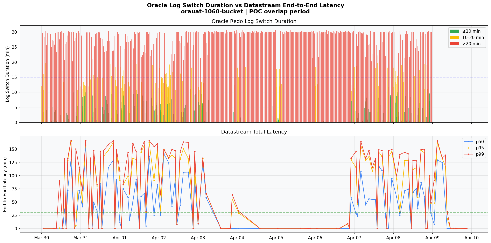

This chart overlays Oracle log switch duration with Datastream end-to-end latency during the POC period. The correlation is visible: periods with longer log switch durations correspond to higher Datastream latency.

### Does More Frequent Log Switching Cause CPU Exhaustion?

**No.** The log switch operation is primarily **I/O-bound, not CPU-bound**:

- **Log switching** = flush current log buffer, mark log for archiving — lightweight I/O operation
- **Archiving** = copying redo log file to archive destination — disk I/O, minimal CPU
- The DB generates the **same amount of redo data** regardless of switch frequency — the data is just cut into smaller chunks

**Key evidence from the DBA data:** During overnight batch processing (00:00-05:00), UAT1060 is ALREADY switching every **3-15 minutes** without any reported issues. Setting `ARCHIVE_LAG_TARGET = 900` (15 min) would only force switches during **low-activity periods** when the DB has spare capacity.

### Tuning Recommendations

Setting `ARCHIVE_LAG_TARGET = 900` adds a **time-based safety net**: whichever comes first — 1 GB full OR 15 min elapsed — triggers the log switch. This:
- **Guarantees** a max 15 min switch interval regardless of write volume
- **Eliminates the quiet-period latency spikes** that drive up the average
- Combined with reducing log size to **256 MB**: faster LogMiner parsing + even more frequent switches during busy hours

---

## Dual Datastream Setup on Same Oracle Source

During the POC, **two separate Datastream instances** were connected to the same Oracle UAT1060 database simultaneously:

| Stream | Target Bucket | Project |
|--------|--------------|---------|
| `orauat-1060-bucket` | `gs://tms-alloydb-datastream-bucket-wl5-t-t` | WL5 |
| `new-dispo-cdc-datastream-sendung-abn1034` | `gs://abn1043-sendung-bucket-1` | WL3 |

Both streams read from Oracle's archived redo logs via LogMiner on the same source database. This is confirmed by the activity logs: 2,484 events for WL5 + 199 events for WL3 in the same export.

Potential effects to investigate:

- **LogMiner contention:** Two LogMiner sessions on the same source may compete for resources (CPU, SGA, redo log access)
- **Supplemental logging overhead:** Both streams require supplemental logging on the source tables, adding write amplification to the redo logs
- **Redo log throughput:** More redo data generated = faster log switches (could actually reduce latency), but also more archive volume
- **Oracle Streams Pool sizing:** Multiple concurrent mining sessions may require a larger Streams Pool
- **Impact on observed metrics:** The latency and throughput numbers in this report reflect the WL5 stream only, but may have been influenced by the concurrent WL3 stream

This configuration needs to be evaluated for PROD.

---

## Event Count by Read Method

The project contains three Datastream read methods:

| Read Method | Description |
|-------------|-------------|
| `oracle-cdc-logminer` | CDC events from Oracle via LogMiner (our primary stream) |
| `oracle-backfill` | Initial backfill/snapshot events from Oracle |
| `postgresql-cdc` | CDC events from PostgreSQL (separate stream in same project) |

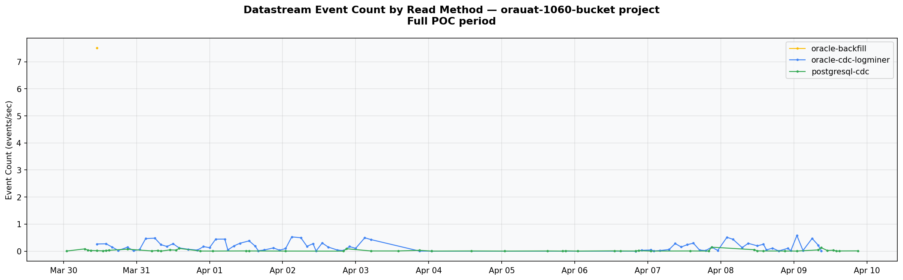

---

## Batch Size Distribution

| Batch size | Entries | Records | % of total records |
|-----------|---------|---------|-------------------|
| 1 | single-record events | | ~small % |
| 2-50 | typical CDC batches | | moderate |
| 500+ | large overnight flushes | | significant |
| **Max: 9,920** | single largest batch | | |

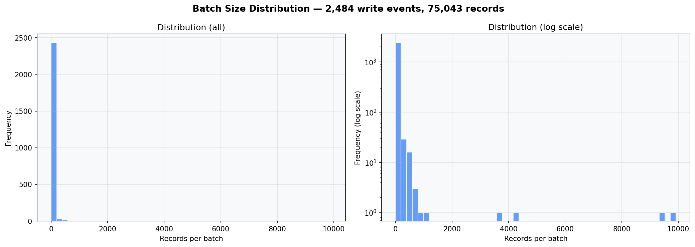

---

## Datastream vs. Striim — Why Striim is Faster

| | GCP Datastream | Striim |
|---|---|---|
| **Read method** | LogMiner, **archived redo logs only** | Reads **online redo logs** directly (+ archived) |
| **Mining mode** | Waits for log archival before reading | **Active Log Mining (ALM)** — reads in real-time |
| **Alternative reader** | Binary Log Reader (Preview, not GA) | **OJet** — reads Oracle LCRs directly via API |
| **Latency** | ~30-60+ min (depends on log rotation) | **Sub-second** |

**GCP Datastream waits for Oracle to archive the redo log** before it can read changes. **Striim reads from the online redo log in real-time.**

### Oracle 19c Deprecation of CONTINUOUS_MINE — None of the Current Solutions Rely on It

| Solution | Uses CONTINUOUS_MINE? | Workaround |
|----------|----------------------|------------|
| **Datastream LogMiner (GA)** | No | Only reads archived logs — accepts the latency |
| **Datastream Binary Log Reader (Preview)** | No | Bypasses LogMiner entirely — parses raw binary redo files directly |
| **Striim ALM** | No | Own implementation reading online redo logs without CONTINUOUS_MINE |
| **Striim OJet** | No | Bypasses LogMiner entirely — reads Oracle LCRs via API |

### Datastream Binary Log Reader (Preview) — The Comparable Option

GCP's Binary Log Reader is conceptually similar to Striim's approach:
- Reads **online + archived** redo log files (not just archived)
- **Multithreaded** (not single-threaded like LogMiner)
- **Bypasses LogMiner** — parses raw binary redo files directly
- Supports **low-latency CDC**

Limitations: **Preview / Pre-GA** — not production-ready, limited data type coverage. Requires Oracle 12c+ (our environment: mainly 12.1.0.2, KRITIS databases on 19.9/19.21 — all compatible).

### Implication for This POC

The ~42 min avg latency observed is **inherent to the LogMiner (GA) method's architecture** (archived-log-only mode), not a misconfiguration.

---

## Options to Reduce CDC Latency

| # | Option | Expected Latency | Effort | GCP Cost Impact | Risk | Status |
|---|--------|-----------------|--------|----------------|------|--------|
| 1 | Oracle redo log tuning | ~5-15 min | Low | None | Low | **Ready to implement** |
| 2 | Datastream Binary Log Reader | ~1-5 min | Medium | **None** — same per-GiB pricing as LogMiner | Medium | Preview (not GA) |
| 3 | Striim (ALM/OJet) | Sub-second | Low (technical) / High (commercial) | N/A (separate product) | Low | Production-ready, already in POC |

> **GCP Datastream pricing** is purely volume-based (per GiB of CDC data processed), with no distinction between LogMiner and Binary Log Reader. Switching read method does not change the GCP bill. Source: [Datastream Pricing](https://cloud.google.com/datastream/pricing)

### Option 1: Oracle Redo Log Tuning (Recommended First Step)

**What to change:**

```sql
-- Force a log switch every 15 minutes, even if the log isn't full
ALTER SYSTEM SET ARCHIVE_LAG_TARGET = 900 SCOPE=BOTH;
```

Additionally, reduce redo log file size from 1 GB to 256 MB (requires DBA coordination — involves creating new log groups and dropping old ones).

**Expected impact:**
- Guarantees a max 15 min log switch interval regardless of DB write volume
- Eliminates the quiet-period latency spikes (currently 30+ min when write volume is low)
- Combined with 256 MB log size: even faster switches during busy hours
- End-to-end latency target: **15-30 min** (down from current 42 min avg)

**Trade-offs:**
- More frequent I/O (more archive log files to write and manage)
- More archive storage volume
- Minimal CPU overhead (I/O-bound operation — already switching every 3-15 min overnight without issues)

**Effort:** Low — single `ALTER SYSTEM` command for `ARCHIVE_LAG_TARGET`, DBA task for log resize

| ARCHIVE_LAG_TARGET | Effect | Expected E2E Latency |
|-------------------|--------|---------------------|
| `0` (current) | Switches only when 1 GB log is full — **unpredictable, can be 30+ min during low activity** | ~42 min avg (observed) |
| `1800` (30 min) | Max ~30 min before changes become visible | ~30 min |
| `900` (15 min) | **GCP recommended sweet spot** | ~15-20 min |
| `600` (10 min) | More aggressive — lower latency, more I/O | ~10-15 min |
| `300` (5 min) | Most aggressive — **feasibility to be confirmed with DBA** | ~5-10 min |

### Option 2: GCP Datastream Binary Log Reader (Preview)

**What it does:** Bypasses LogMiner entirely. Reads raw binary redo log files (online + archived) directly via ASM or database directory objects. Multithreaded. Conceptually similar to what makes Striim fast — reading online redo logs instead of waiting for archived ones — but a different technical approach (GCP parses raw binary files, Striim uses its own mining engine or Oracle's LCR API).

**Expected impact:**
- Reads online redo logs → **no waiting for archival**
- Expected latency: **1-5 minutes** (comparable to Striim)
- Multithreaded → better throughput for high-volume tables

**Trade-offs:**
- **Preview / Pre-GA** — not production-ready, limited Google support
- Reduced data type coverage compared to LogMiner method
- Requires Oracle 12c+ (our environment: 12.1.0.2 / 19.x — compatible)
- Requires ASM access or database directory object configuration
- Still benefits from redo log tuning (Option 1)

**Effort:** Medium — Datastream stream reconfiguration, Oracle ASM/directory setup, testing

### Option 3: Striim (ALM or OJet)

**What it does:** Third-party CDC tool that reads online redo logs in real-time, without waiting for archival.

**Expected impact:**
- **Sub-second latency** — reads changes as they're written to the online redo log
- Oracle Reader: 20-80 GB/hr throughput
- OJet: 150+ GB/hr throughput

**Trade-offs:**
- Third-party dependency and licensing cost (commercial decision)
- Ongoing operational overhead (monitoring, upgrades, support contracts)
- Already deployed in the POC — technical feasibility is proven

**Effort:** Technically low (already running in POC), but requires commercial/procurement decision on licensing and long-term operational ownership

### Recommended Approach

1. **Immediate:** Implement Option 1 (redo log tuning) on UAT1060 — low effort, low risk, measurable improvement
2. **Measure:** Re-run the POC analysis after tuning to validate the latency reduction
3. **Evaluate:** Based on results, decide if ~15-30 min latency is acceptable for the use case
4. **If not sufficient:** Evaluate Option 2 (Binary Log Reader) when it reaches GA, or Option 3 (Striim) if sub-second latency is required

---

## Open Questions & Follow-Up Actions

### For Robert Zanter (DBA)

| # | Question | Context | Status |
|---|----------|---------|--------|
| 1 | **Confirm exact Oracle version on UAT1060** | We have "mainly 12.1.0.2, KRITIS on 19.9/19.21" from earlier requirements gathering. Need explicit confirmation which version runs on UAT1060 specifically — relevant for Binary Log Reader compatibility (requires 12c+) and CONTINUOUS_MINE deprecation (19c+). | Open |
| 2 | **Feasibility of ARCHIVE_LAG_TARGET = 900 (15 min)** on UAT | Can this be set on UAT1060 for a test run? Impact on I/O, archive storage, other applications sharing the DB? | Open |
| 3 | **Feasibility of shorter cycles: 600 (10 min) or 300 (5 min)** | The DB already switches every 3-9 min during overnight batch jobs without issues. Could we go more aggressive than 15 min during business hours? What's the DBA's comfort level? | Open |
| 4 | **Feasibility of reducing redo log size from 1 GB to 256 MB** | GCP recommends < 256 MB. This requires creating new log groups and dropping old ones. What's the effort and risk? | Open |
| 5 | **Impact of dual Datastream on Oracle** | Two Datastream instances (WL3 + WL5) running concurrent LogMiner sessions on UAT1060. Any observed impact on DB performance? | Open |

### For Nikolay Hristov (DevOps/GCP)

| # | Question | Context | Status |
|---|----------|---------|--------|
| 1 | **Stream_freshness data gaps?** | Freshness CSV has 264 data points vs 111 for latency metrics — different granularity or gaps? | Open |
| 2 | **WL3 stream data** | Only WL5 data was exported. Is WL3 stream analysis also needed? | Open |
| 3 | **Datastream stream configuration details** | Screenshot provided, but need to confirm: `maxConcurrentCdcTasks` value, any custom settings | Open |
| 4 | **Binary Log Reader Preview** | Has the team evaluated switching to Binary Log Reader on a test stream? Any blockers (ASM access, Oracle directory objects)? | Open |

### For Team Decision

| # | Decision | Dependencies |
|---|----------|-------------|
| 1 | **Target latency SLA** — what end-to-end latency is acceptable for the CDC use case? | Drives which option(s) to pursue |
| 2 | **Option 1 test plan** — set ARCHIVE_LAG_TARGET on UAT, re-run POC, measure improvement | Robert confirms feasibility |
| 3 | **Striim vs Datastream** — commercial decision on whether sub-second latency justifies Striim licensing | Depends on target latency SLA |
| 4 | **Binary Log Reader timeline** — when is GA expected? Is Preview acceptable for non-production? | GCP roadmap / account team |

---

## Documentation Sources

### GCP Datastream
- [Monitor a stream | Datastream](https://cloud.google.com/datastream/docs/monitor-a-stream) — official metric definitions
- [General best practices | Datastream](https://cloud.google.com/datastream/docs/best-practices-general) — latency tuning guidance
- [Work with Oracle redo log files | Datastream](https://cloud.google.com/datastream/docs/work-with-oracle-database-redo-log-files) — redo log configuration
- [Stream data from Oracle databases | Datastream](https://docs.cloud.google.com/datastream/docs/sources-oracle) — LogMiner vs Binary Log Reader comparison
- [Configure a self-managed Oracle database | Datastream](https://cloud.google.com/datastream/docs/configure-self-managed-oracle) — Binary Log Reader setup

### Striim
- [Striim Oracle Database CDC readers](https://www.striim.com/docs/en/oracle-database-cdc.html) — Oracle Reader vs OJet comparison
- [Striim: Oracle CDC Methods, Benefits, Challenges](https://www.striim.com/blog/oracle-cdc/) — architecture overview
- [Striim: LogMiner Continuous Mining Deprecation](https://www.striim.com/blog/logminer-continuous-mining-deprecation-what-you-need-to-know/) — ALM and OJet as replacements

---

## Data Sources

| File | Contents |
|------|----------|
| `downloaded-logs-20260416-111739.json` | 2,683 CDC activity log entries (2,484 for orauat-1060-bucket) |
| `downloaded-logs-20260416-111822.json` | 130 warning log entries (ORACLE_CDC_LOG_FILE_SIZE_TOO_BIG) |
| `Stream_total_latencies_[*].csv` | End-to-end latency p50/p95/p99 |
| `Stream_system_latencies_[*].csv` | System latency p50/p95/p99 |
| `Stream_latencies_[*].csv` | Stream latency p50/p95/p99 |
| `Stream_freshness_[MEAN].csv` | Stream freshness |
| `Stream_event_count_[SUM].csv` | Event count by read method |
| `Throughput_(event_sec).csv` | Throughput (events/sec) |
| `bucket-all.txt` | GCS bucket file listing (full recursive) |
| `datastream config.png` | Stream configuration screenshot |
| Robert's wider range SQL output | 1,310 log switch entries (Mar 26 – Apr 8) |
| `full_poc_summary.json` | Machine-readable summary |
| `analyze_full_poc.py` | Analysis script |

---

<div align="center">
  <sub>Created by <strong>Virtual Architect</strong></sub>
</div>
