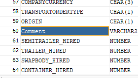
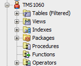
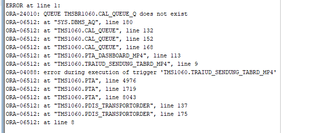
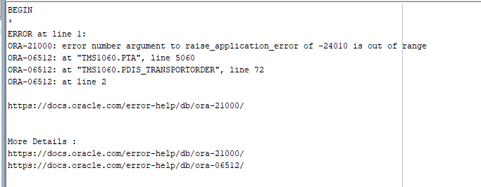

# Chat repsonses from Ivailo reg. Database Checks of ABN1060

## Issue 1

Hello everyone  I just connected the backend and TMS bridge with the Oracle DB, however on loading the pickup planning and the transport order list pages I am getting  this:
 
Oracle.ManagedDataAccess.Client.OracleException (0x80004005): ORA-00942: table or view does not exist

the respective views are:
v_dis_to_filter
v_dis_to_pickupplanning

## Issue 2

in V_DIS_TRANSPORTORDER view, the comment field does not follow the naming convention as the other fields:

so the bridge is throwing an error that such field does not exist due to the fact that we are looking for fields with all uppercase in Oracle

Matthias:
"The others" being? The others string-based fields in that view? Or other COMMENT fields on other objects?

Ivailo:
the other fields in the views. All other fields are with uppercase
 

## Issue 3

Column U_TIME is missing in V_DIS_TO_PICKUPPLANNING view

## Issue 4

The Procedures and Function folders seems to be empty or the user does not have access to see these. 

Can anyone check with someone from the TMS team whether the functions and procedures are applied to that database?

Ivo go to the users and select the correct user context and then you will see them Ivaylo Petrov
 
Now when looking closely it seems you're actually there or?
 
yeah TMS1060
 
found them under the Packages folder
 
## Issue 5

CreateTransportOrderFromLeg function seems to be missing from the pdis_transportorder package.
CreateAndAddLeg - throws an error when called in the database:

with the following call:
DECLARE
    v_PickupPointId       NUMBER;
    v_IsNewPickupPoint    BOOLEAN;
    v_DeliveryPointId     NUMBER;
    v_IsNewDeliveryPoint  BOOLEAN;
    v_LegId               NUMBER;
BEGIN
    tms1060.PDIS_TRANSPORTORDER.CreateAndAddLeg(TransportorderId   => 10600644002446,
        ShipmentId         => 10600605256602,
        LegType            => 'HL',
        nMode              => 1,
        PickupPointId      => v_PickupPointId,
        IsNewPickupPoint   => v_IsNewPickupPoint,
        DeliveryPointId    => v_DeliveryPointId,
        IsNewDeliveryPoint => v_IsNewDeliveryPoint,
        LegId              => v_LegId);
END;

## Isuue 6

Delete procedure from pdis_transportoder throws an error as well:

with input:
BEGIN
    tms1060.PDIS_TRANSPORTORDER.Delete(10600644002446, 1);
END;
 
or with:
BEGIN
    tms1060.PDIS_TRANSPORTORDER.Delete(10600644002446, null);
END;