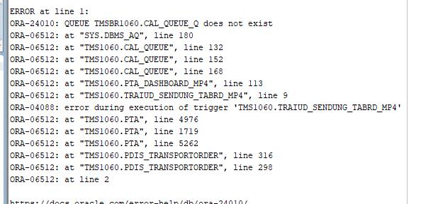

# New insights from Dev Team

## Ivailo

It seems that calling SetParticipant works and I am not getting the CAL_QUEUE_Q error, however on the CreateAndAddLeg I am still getting it. 

## Yosif

Ivaylo Petrov is it exactly the same overload of CAL_QUEUE_Q that it is being used in SetParticipant and CreateAndAddLeg?

## Ivailo

not sure how I can check, but this is the error:

## Matthias

You mean the signature? The "variant" of the function, right?