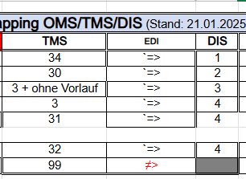

## Maximilian Kehder
05.06.26 16:29
Hi Joachim,
ich hab in meiner Dokumentation folgende Info:

Max hat gesagt, dass 31 -> der New Dispo Traffic mode 3 sein soll.
Ist das dann analog zu TMS traffic mode 3?
Ergo:
31 + ohne Vorlauf -> 3
31 -> 4
 
Könntest du das einmal aufklären?

## Joachim

Hi Max, da hab ich wohl nicht richtig zugehört. Aktuell können wir den Traffic Mode 3 "Relationsverladung" in TMS (noch) nicht direkt abbilden. Das muss ich mit Max klären. Kann ich mich dabei auf deine Aussage berufen?

## Maximilian

Klar kannst du das! 