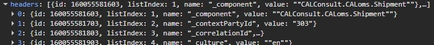

# Chat with Max Kehder

## Max

Just received this for the change of EDI.

Translation:

To enable CALsuite WM to correctly map our JSON to the route planning, we need to include some additional information in the header.

This is a static value that depends on the environment we wish to address.

## Patrick
Damit CALsuite WM unser JSON mit der Tourenplanung richtig zuordnen kann, benötigen die eine weitere Information im Header.
Ist ein statischer Wert abhängig von der Umgebung, die wir ansprechen möchten.
 
ACC: 303
Prod: 507

## Max

Like this

 
This is another code change isn’t it?
 
ACC = UAT

