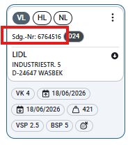

# EDI Requirement

## Anfrage (Patrick Uschmann)

Hi Matthias,
 
WM Team hat mich informiert, dass sie den ersten Datensatz über die Schnittstelle erhalten haben.
 
Jetzt ist uns leider aufgefallen, dass wir im Inhalt bisher die Sendungsnummer nicht übertragen. Können wir die noch hinzufügen, damit WM darüber die Daten miteinander verknüpfen kann?

## Prepared PBI

User Story 126097: CR: Adding the shipment number to the EDI message

(by Max Kehder)