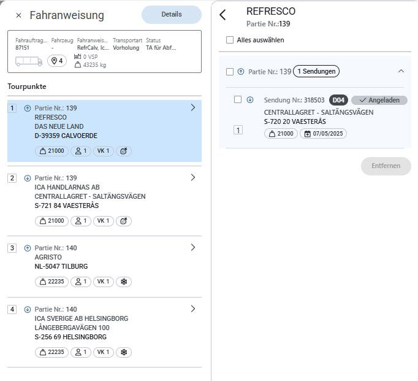

# Fahranweisung - Doku und Unterlagen New Dispo App

## Finale Antwort PO an Kunde

Hi,

Ich habe Matthias mit der Anfrage aufgegleist. Er wird sich bis heute EOD bei dir zurückmelden mit einer Aufschlüsselung, wo was zu finden ist.
Viele Grüße
PO

## Interne Anfrage

Hi Matthias,
diese Anfrage kam grad rein. 
Hab grad mit ihm kurz gesprochen. Anfrage kam von seinem Chef. Antwort würde Montag reichen. 

Was er möchte ist zu wissen, wo bei uns im Repo der Code abliegt, für die Fahranweisung:
Ich gehe davon aus, dass folgendes benötigt wird:
- move tourpoints
- change loading sequence
  - für Partien
  - und für Sendungen innerhalb der Partien
- FE, wie das ganze dargestellt wird im
  - Transport Order slider (siehe das Bild von Max)
  - Fahranweisungen in den Transport Order Details

Kannst du mir hier weiterhelfen?

Falls du nicht, würde ich unseren Lead Dev am Montag fragen.
Ansonsten eine gute Fahrt noch und ein tolles Wochenende!
Gruß

## Original E-Mail

Hallo,

wir brauchen so schnell wie möglich die Dokumentation zur Struktur der Fahranweisung in der New Dispo App, besonders was auf BE & FE entwickelt wurde. 

https://test.dispo.gcp.nagel-group.com/de/planning

Es ist wichtig zu wissen, welche Struktur ihr für die Darstellung der Tourpunkte und Sendungen verwendet. Außerdem brauchen wir Infos darüber, was bereits als Funktion gewrapped wurde und welche Informationen in die Datenbank zurückgeschrieben werden. Auch bitte Details zum Feature 119752 Edit Flow - 14.1 Edit Tour Point Data.

Lass uns gerne kurz abstimmen, falls noch etwas unklar ist. Danke.

Mit freundlichen Grüßen