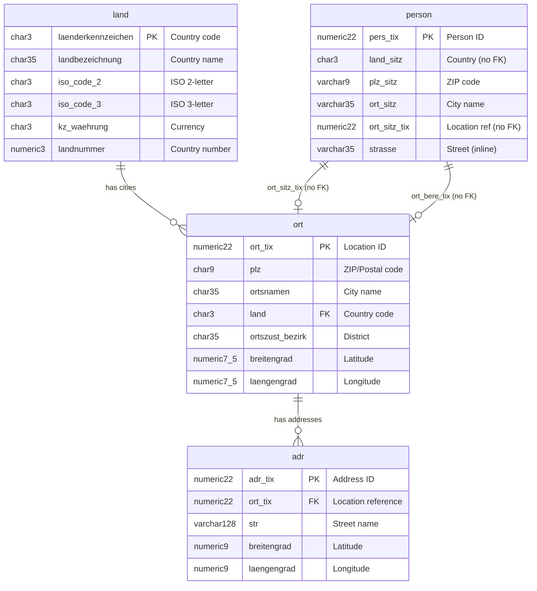
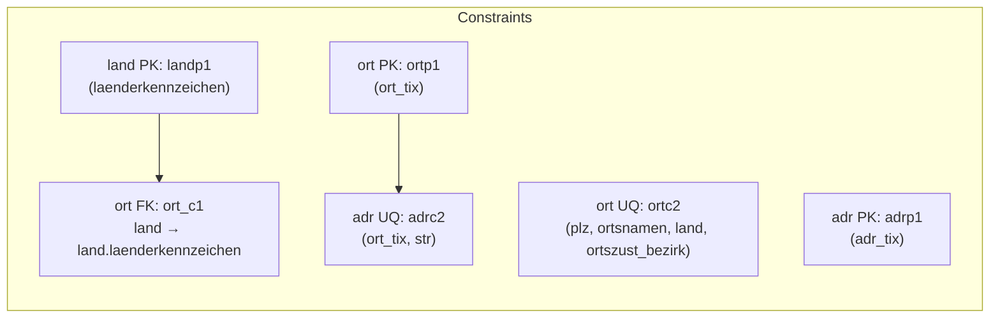
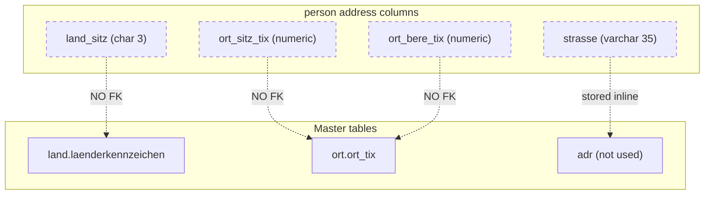

# Address Tables: land, ort, adr

This document describes the core address/location tables in the TMS schema and their relationships.

## Overview

The TMS uses a hierarchical structure for geographic data:

- **land** - Country master data
- **ort** - City/location with PLZ (postal code)
- **adr** - Street address



## Table Details

### land (Country)

Master table for countries with VAT/tax information.

| Column | Type | Description |
|--------|------|-------------|
| `laenderkennzeichen` | char(3) | **PK** - Country code (e.g., "D", "AT", "CH") |
| `landbezeichnung` | char(35) | Country name |
| `iso_code_2` | char(3) | ISO 2-letter code |
| `iso_code_3` | char(3) | ISO 3-letter code |
| `kz_waehrung` | char(3) | Currency code |
| `mwst_*` | various | VAT/tax rates and validity dates |

**Source:** `src/sql/table/land.sql`

### ort (City/Location)

Location table with PLZ (postal code) and city information.

| Column | Type | Description |
|--------|------|-------------|
| `ort_tix` | numeric(22,0) | **PK** - Location ID |
| `plz` | char(9) | ZIP/postal code |
| `ortsnamen` | char(35) | City name |
| `land` | char(3) | **FK** to `land.laenderkennzeichen` |
| `ortszust_bezirk` | char(35) | District |
| `breitengrad` | numeric(7,5) | Latitude |
| `laengengrad` | numeric(7,5) | Longitude |

**Unique Constraint:** `(plz, ortsnamen, land, ortszust_bezirk)`

**Source:** `src/sql/table/ort.sql`

### adr (Street Address)

Street-level address linked to a location.

| Column | Type | Description |
|--------|------|-------------|
| `adr_tix` | numeric(22,0) | **PK** - Address ID |
| `ort_tix` | numeric(22,0) | Location reference (NOT NULL) |
| `str` | varchar(128) | Street name (NOT NULL) |
| `breitengrad` | numeric(9,0) | Latitude |
| `laengengrad` | numeric(9,0) | Longitude |

**Unique Constraint:** `(ort_tix, str)`

**Source:** `src/sql/table/adr.sql`

## Constraints



### Existing Foreign Keys

| Table | Constraint | Definition |
|-------|------------|------------|
| `ort` | `ort_c1` | `FOREIGN KEY (land) REFERENCES land(laenderkennzeichen)` |

### Missing Foreign Keys

> **Note:** The `adr` table does **NOT** have a foreign key constraint to `ort`, despite having `ort_tix` as a NOT NULL column.

```sql
-- Suggested constraint to add:
ALTER TABLE ONLY adr ADD CONSTRAINT adr_c1
  FOREIGN KEY (ort_tix) REFERENCES ort(ort_tix);
```

## person Table - Address Relationship

The `person` table stores address data **directly as text fields** rather than via FK references to `land`, `ort`, or `adr`.

### Address Columns in person

| Column | Type | Description |
|--------|------|-------------|
| `land_sitz` | char(3) | Country code (Sitz = seat/location) |
| `plz_sitz` | varchar(9) | ZIP code |
| `ort_sitz` | varchar(35) | City name |
| `bezirk_sitz` | varchar(35) | District |
| `ort_sitz_tix` | numeric(22,0) | Reference to `ort.ort_tix` |
| `land_berechnung` | char(3) | Country for calculation |
| `plz_berechnung` | varchar(9) | ZIP for calculation |
| `ort_berechnung` | varchar(35) | City for calculation |
| `bezirk_berechnung` | varchar(35) | District for calculation |
| `ort_bere_tix` | numeric(22,0) | Reference to `ort.ort_tix` |
| `strasse` | varchar(35) | Street address (stored inline) |
| `postf_land` | char(3) | Post box country |

**Source:** `src/sql/table/person.sql`

### person Foreign Keys

The `person_fk.sql` only defines:

- `person_c2` → `verbund`
- `person_c1` → `region`



> **Note:** There are **NO foreign key constraints** from `person` to `land`, `ort`, or `adr`. Data integrity between `person` and address master data is **not enforced at the database level**.

### Missing Foreign Keys for person

```sql
-- Suggested constraints to add:
ALTER TABLE ONLY person ADD CONSTRAINT person_c3
  FOREIGN KEY (land_sitz) REFERENCES land(laenderkennzeichen);

ALTER TABLE ONLY person ADD CONSTRAINT person_c4
  FOREIGN KEY (ort_sitz_tix) REFERENCES ort(ort_tix);

ALTER TABLE ONLY person ADD CONSTRAINT person_c5
  FOREIGN KEY (ort_bere_tix) REFERENCES ort(ort_tix);

ALTER TABLE ONLY person ADD CONSTRAINT person_c6
  FOREIGN KEY (land_berechnung) REFERENCES land(laenderkennzeichen);

ALTER TABLE ONLY person ADD CONSTRAINT person_c7
  FOREIGN KEY (postf_land) REFERENCES land(laenderkennzeichen);
```

## Related Tables

Other tables using address/location data:

| Table | Purpose |
|-------|---------|
| `person` | Customer/partner with inline address (no FK to land/ort/adr) |
| `zone` | Zone definitions with `land_ber`, `plz_ber`, `ort_ber` |
| `zone_plz` | Zone to PLZ mapping |
| `sendgort` | Shipment routing locations |
| `sen_land` | International shipment data (border crossings) |
| `distort` | Distance between locations (ort_tix pairs) |
| `distort_strasse` | Distance between street addresses |

## Import Process from CMD

Address data is imported from the CMD system (owner: Patrick Uschmann) through a manual process:

1. **CMD provides a JSON file** containing address data
2. **JSON is distributed** to all branches with Oracle databases
3. **JobJOT checks for the file** - The job `pJobJOT.Import` runs every 5 minutes to check a folder for this JSON file
4. **Addresses are resolved and imported** into the tables `land`, `ort`, `person`, etc.

### Job Details

| Property | Value |
|----------|-------|
| Job | `pJobJOT.Import` |
| Schedule | `*/5 * * * *` (every 5 minutes) |
| Job file | `src/sql/job/job_pjobjot_import.sql` |
| Status | **DISABLED** in AlloyDB schema |

> **Note:** The job is currently disabled in `src/sql/scripts/job/all_create_cron_jobs.sql` (line 34) and the package `pJobJOT` is not present in this repository. The import functionality exists in the Oracle/CALtms environment but is not active in the AlloyDB migration.

## File Locations

- Table definitions: `src/sql/table/`
- Primary/Unique constraints: `src/sql/constraint/pk_uq/`
- Foreign key constraints: `src/sql/constraint/fk/`
