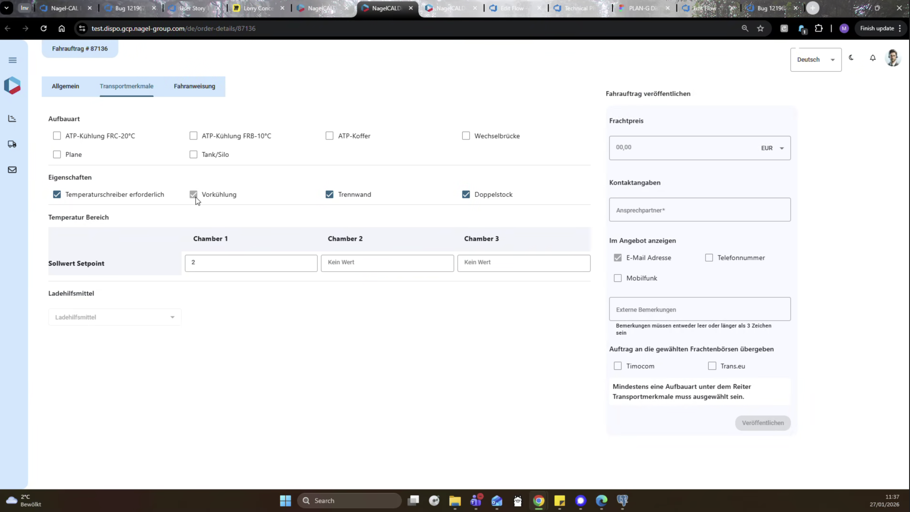

# 2026-01-27

## Start-Zeit

## Neue TOP-Dll / Berechnung

- Deployment mit Pascal abstimmen

## Vehicle Properties

ATP-Kühliung
- In UAT2820 wird es nicht default gesetzt
- In 1034 aber schon
=> Erwsrtung ist: das TMS das setzt
=> Wenn nicht, kann New DIspo das machen, dann aber Abstimmung wo im COde / STack

## Transport Mode: Vorbelegungen berücksichtigen

- In der user Story wird die Vorbelegungsbedingung genannt, ich habe diese aber nicht berücksichtigt => prüfen!
- Parallel prüft Max, ob wir dies aus dem Konzept rausnehmen können