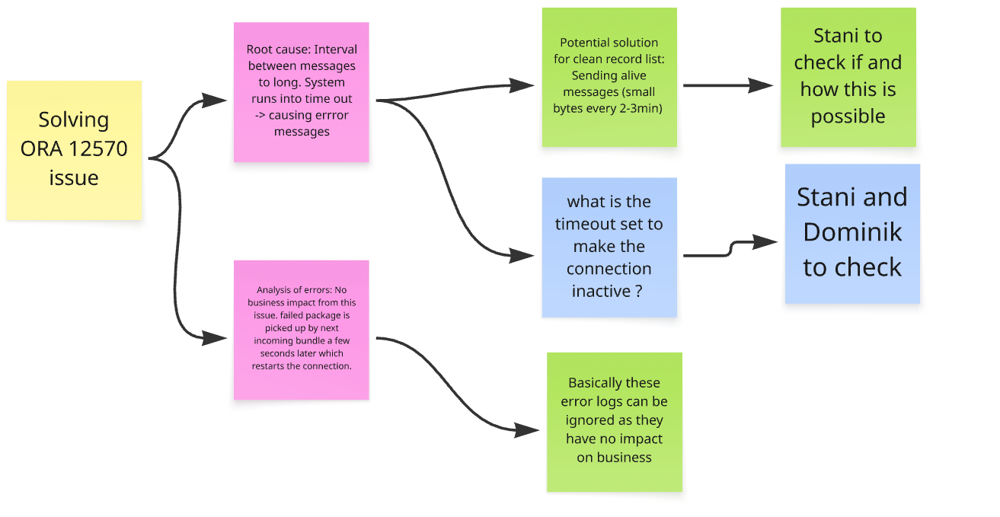

Hey Alle 
 
thanks for your time and further support on these GCP Infrastructure related items: 
 
Here the notes taken by facilitator: 
Analysis of ORA 12570 Connection Timeout Error: Dominik, Stanislav, and Nikolay discussed the recurring ORA 12570 error, identifying that long idle periods between messages cause database connections to time out, with Tim seeking clarification on the business impact and technical causes.
Error Identification and Log Analysis: Dominik demonstrated how to trace the ORA 12570 error by filtering logs for specific connection IDs, showing that errors occur after long idle periods between messages, with successful packages sent before and after the error event.
Technical Cause of Timeout: Stanislav and Dominik explained that the error is triggered when a connection remains idle for over 15 minutes, leading to the server or firewall dropping the connection, so the next message fails until the connection is reestablished.
Retry Mechanism and Data Integrity: Stanislav described the implementation of a retry mechanism that ensures data is resent after a failed attempt, clarifying that there is no data loss, only a misleading error log entry, and subsequent messages are processed successfully.
Business Impact Clarification: Tim asked about the practical implications, and Stanislav and Dominik confirmed that the error does not cause significant delays or data loss, as the system quickly recovers and delivers the required information to end users.
 
Proposed Solutions for Connection Timeout: Dominik, Stanislav, and Nikolay evaluated potential solutions to prevent connection timeouts, including keep-alive messages, connection timeouts, and infrastructure adjustments, with Tim inquiring about the operational and cost implications.
Keep-Alive Message Proposal: Dominik suggested sending periodic keep-alive messages every few minutes to prevent the connection from being dropped due to inactivity, which would keep the firewall and server aware of the active connection.
Discussion of Implementation Challenges: Stanislav noted that implementing keep-alive messages may be complicated by the stateless nature of HTTP requests and the lifecycle of cloud functions, which typically terminate after handling a request.
Infrastructure Adjustment Suggestion: Nikolay proposed configuring the cloud function to maintain a minimum number of instances to keep connections alive, but Stanislav expressed concerns about scalability, concurrency, and potential new issues with this approach.
Cost and Traffic Considerations: Tim asked about the cost and data volume impact of keep-alive messages, and Dominik and Stanislav responded that the overhead would be minimal, but scaling and cloud function triggers might need further investigation.
Next Steps and Action Items: Stanislav recommended replacing the retry mechanism with keep-alive messages to reduce misleading error logs, and the team agreed to further investigate server timeout settings and monitor the impact of any changes.
Investigation of File Server Connectivity Issues: Stanislav raised additional networking issues related to intermittent file server access, with Dominik agreeing to review logs and collaborate with the team for further analysis and troubleshooting.
Description of File Server Issues: Stanislav described problems with logging into on-premise file servers, intermittent failures to connect to domain machines, and timeouts when reading files, suggesting these may be related to network instability or packet drops.
Collaboration and Access to Logs: Dominik requested access to relevant log methods or strings to investigate the errors, and Stanislav agreed to share backlog items and descriptions, with Cem offering to add the group to Azure DevOps for better access.
Action Plan for Troubleshooting: The team decided to share logs and error descriptions via email and chat for immediate support, with Dominik planning to review the issues and consult with Ron or others as needed for further insights.
Clarification of ICMP and 504 Error Relationship: Tim, Stanislav, and Cem clarified that the 504 network error and ICMP message drops are related to the same underlying connectivity issue as the ORA 12570 error, consolidating their troubleshooting efforts.
Error Relationship Explanation: Cem and Stanislav confirmed that the 504 error and suspected ICMP message drops are manifestations of the same network timeout issue affecting Oracle connectivity, and agreed to address them together in ongoing investigations.
Access and Collaboration on Issue Tracking: Cem, Nahide, and Tim discussed providing the team with access to Azure DevOps and sharing relevant backlog items and logs to facilitate collaborative troubleshooting and support.
Azure DevOps Access Coordination: Cem offered to add team members with appropriate accounts to Azure DevOps for direct access to issue tracking, while Tim and Stanislav arranged to share information via email and chat for those without access.
Follow Up tasks:
Query Reference Sharing: Paste the work query discussed in the meeting into the chat for personal reference. (Dominik)
Error Log Investigation: Review the error logs and provide feedback or consult with Ron for additional insights on the file server connectivity issues. (Dominik)
Backlog Item Sharing: Send the backlog item regarding networking and file server issues to Dominik via email for further investigation. (Stanislav, Tim)
Azure DevOps Access: Add the relevant team members to Azure DevOps to facilitate access to Cloudflow Azure resources. (Cem)

