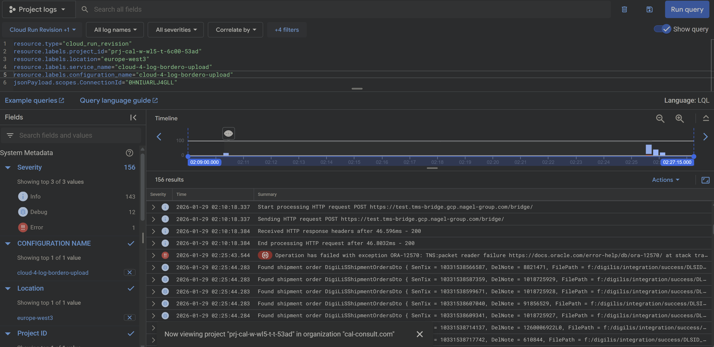

Hi Matthias,

I was talking to him yesterday, but he has also no direct idea on solving this. 
Not really, I currently don't know which we can test.

The attached ideas seem promising. I looked at two errors and here the error occurred when there was a big gap between the packets. So setting a timeout for the connections could help. 

Log Explorer:
resource.type="cloud_run_revision"
resource.labels.project_id="prj-cal-w-wl5-t-6c00-53ad"
resource.labels.location="europe-west3"
resource.labels.service_name="cloud-4-log-bordero-upload"
resource.labels.configuration_name="cloud-4-log-bordero-upload"
jsonPayload.scopes.ConnectionId="0HNITP41D6Q88"

Log Explorer:
resource.type="cloud_run_revision"
resource.labels.project_id="prj-cal-w-wl5-t-6c00-53ad"
resource.labels.location="europe-west3"
resource.labels.service_name="cloud-4-log-bordero-upload"
resource.labels.configuration_name="cloud-4-log-bordero-upload"
jsonPayload.scopes.ConnectionId="0HNIUARLJ4GLL"

