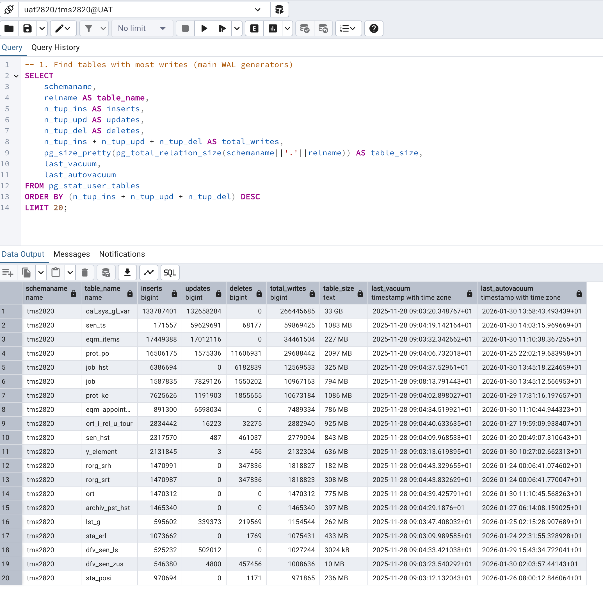
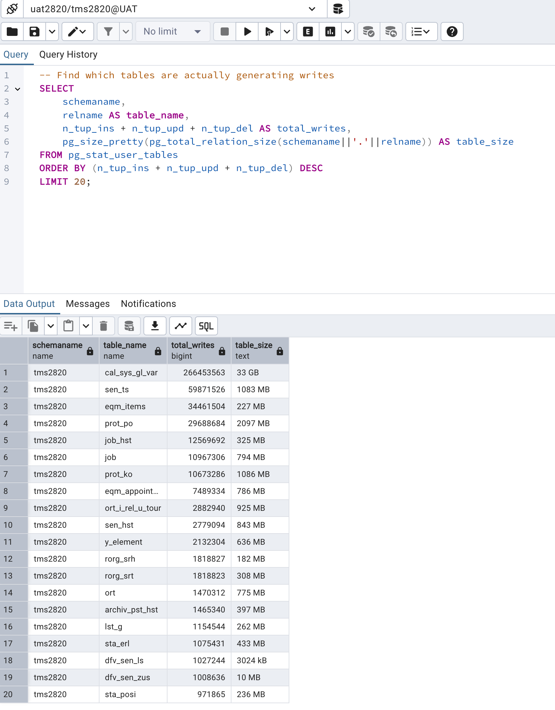
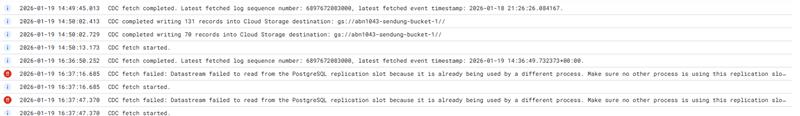
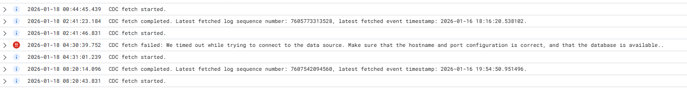
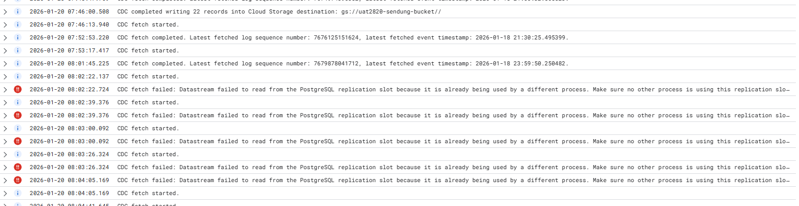
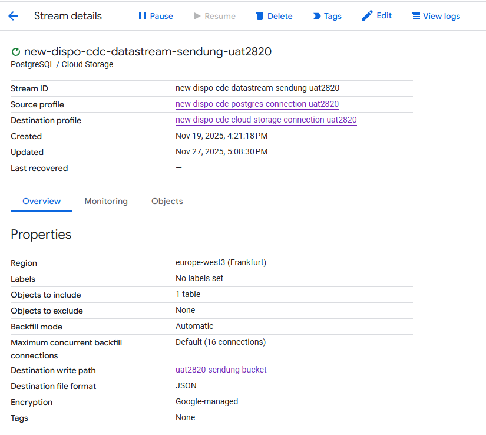

# Chat in Teams: TMS CDC/Datastream Issue

Matthias Max:
Hey
 
Let's try here, can every one see this chat?
 
Matthias Max hat den Gruppennamen zu TMS CDC/Datastream Issue geändert.

 
My assumption: The sendung table is NOT the problem. With only ~253 updates in 24 hours and ~7 in the past 7 days, it's generating minimal WAL.                                                                                 

This means the 422+ GB of WAL is coming from:                                                                                                                                                                    

  - Other tables in the database (the slot likely replicates more than just sendung)                                                                                                                               

  - Queue tables (like the ones written by triggers: ta_dashboard_mp4, ESB queues)                                                                                                                                 

  - High-volume operational tables (logs, events, tracking)                                                                                                                                                        

  - Possible bulk operations on other tables             
 
The table csik_sys_gl_sm has:                                                                                                                                                                                    

  - 119,917,607 inserts                                                                                                                                                                                            

  - 336,025,034 updates                                                                                                                                                                                            

  - Total: ~456 MILLION write operations!                                                                                                                                                                          

  This is BY FAR the largest WAL generator.
 
 

 

 Analysis:
csik_sys_gl_sm is responsible for the massive WAL
256 GB table size - enormous operational table
456 million write operations (119M inserts + 336M updates)
WAL calculation: 456M operations × ~1.5 KB avg = ~684 GB raw WAL
With compression/deduplication in slot: ~422-426 GB 
This is clearly a system log, message queue, or tracking table
 
Matthias Max hat Maximilian Kehder und Martin Dittmann dem Chat hinzugefügt und den gesamten Chatverlauf geteilt.

 
Vervenne, Ron hat Meijers, Eric dem Chat hinzugefügt und den gesamten Chatverlauf geteilt.

Thomas Paulus:
This table is used for emulating the package CAL_SYS. It is used to hold the package variables (analog to Oracle packages),

Matthias Max:

HI all, our internal analysis has resulted in this:
 
Current Configuration Status:
✅ PostgreSQL publication sendung_pub: Contains ONLY sendung table
✅ Datastream stream configuration: Replicating ONLY sendung table (1 table selected)
✅ Datastream using publication: sendung_pub
 
There must be an issue somehwere else. Outside the config.
 
Thomas Paulus:
 The only thing I see is that the TMS1034 user is used to access data from a TMS2820 database.

Nikolay:
There is another error that I have found
 
 
but after that the datastream continued to work without errors
nothing on our side was changed, I haven't touched datastream from December last year

Everyone any news on that issue? data lag now is 541gb

Eric Meijers:
Thomas Paulus
The only thing I see is that the TMS1034 user is used to access data from a TMS2820 database.
Why is this user configured/used in DB UAT2820?

Nikolay:
because the other one didn't have permissions to use replication slot

Eric Meijers:
because the other one didn't have permissions to use replication slot
I noticed that, that is now corrected.
 

 Nikolay:
 I will change the use but will this resolve the issue?
 
 Eric:
I still have to see what is happening. But lets use the correct names for there purpose.
 
 Nikolay:
I will change the user but probably will need to recreate the datastream
 
I've seen now in the logs of the datastream that there are errors like this:
 
ERROR 2026-01-23T01:43:31.436086Z CDC fetch failed: Datastream failed to read from the PostgreSQL replication slot because it is already being used by a different process. Make sure no other process is using this replication slot, or create a new replication slot for this stream. If this error occurred while the stream was running, a new stream must be created..

  {

    "insertId": "7e4057e5-4380-412e-b54d-1700276fde45",

    "jsonPayload": {

      "message": "CDC fetch failed: Datastream failed to read from the PostgreSQL replication slot because it is already being used by a different process. Make sure no other process is using this replication slot, or create a new replication slot for this stream. If this error occurred while the stream was running, a new stream must be created..",

      "read_method": "postgresql-cdc",

      "event_code": "POSTGRES_CDC_FETCH_FAILED",

      "original_message": "replication slot \"sendung_slot_abn1034\" is active for PID 2777278\n",

      "context": "CDC"

    },

    "resource": {

      "type": "datastream.googleapis.com/Stream",

      "labels": {

        "resource_container": "projects/840030134620",

        "stream_id": "new-dispo-cdc-datastream-sendung-abn1034-1",

        "location": "europe-west3"

      }

    },

    "timestamp": "2026-01-23T01:43:31.436086Z",

    "severity": "ERROR",

    "logName": "projects/prj-cal-w-wl5-t-6c00-53ad/logs/datastream.googleapis.com%2Fstream_activity",

    "receiveTimestamp": "2026-01-23T01:43:32.050406904Z"

  }

 these errors are on both datastreams that we have in GCP, one is for abn1034 (connects to 10.100.47.236) and the other one is for uat2820 (connects to 10.100.47.238)
the errors started in 18 jan 2026 and there are more than 10 times this error a day
 
Is it possible this issue to be in the proxy infront of the database? 
these ip addresses both looks like proxy because I can see that the connection to database is coming from 10.100.47.23x
 
 Thomas:
 10.100.47.236 and 10.100.47.238 are the adresses of the proxy servers. They were not touched for almost a year.
 
 Eric:
 the errors started in 18 jan 2026 and there are more than 10 times this error a day
 
==> are the errors started in both databases (ABN1034 and UAT2820) at the same time?

Nikolay:
one is a day later
 
can you check the logs of the proxy server?
 
abn1034

uat2820
first there is this error

and after that we have the other error
 

 Eric:
 Just one short question, does the replication work? Do you get data or not at all?

 Nikolay:
 we are getting data but we are 1+ week behind, today I've seen datastream to upload changes in the bucket from 23 jan 2026
 
https://docs.cloud.google.com/datastream/docs/sources-postgresql#postgres-manage-slots

Stream data from PostgreSQL databases  |  Datastream  |  Google Cloud Documentation

Learn how Datastream handles data from PostgreSQL sources. Discover the types of PostgreSQL databases that it supports and their limitations.

Proactively manage replication slots

Datastream uses a logical replication slot on your PostgreSQL primary instance, which ensures that WAL files are retained until Datastream confirms that they've been processed. If a stream fails, is paused or deleted without dropping the replication slot, PostgreSQL continues to retain WAL files indefinitely. This can fill up your database server disk and lead to a production outage.

If proxy connection lead to "stream fails, is paused or deleted" this will put the DataStream into unrecoverable state

What happens pretty much after the DataStream connection has been lost is that DataStream will restart and try to establish new connection to the slot but then Postgres starts throwing: slot already active for PID X (which is the error we have in our log)

Stream data from PostgreSQL databases  |  Datastream  |  Google Cloud Documentation
Learn how Datastream handles data from PostgreSQL sources. Discover the types of PostgreSQL databases that it supports and their limitations.
 
can we use direct connection to the databases for these datastreams?
 

 Thomas:
 Yes. I think VMs in Google can connect to the Alloy DB directly (like the proxies do)

 Nijkolay:
 what IP I should use for direct connection?
 
both for TEST and UAT
 
10.100.47.236 - using this for abn databases
10.100.47.238 - using this for uat databases
 
 Thomas:
 The servers are 10.100.48.41 for ABN and 10.100.48.40 for UAT

 Eric:
 Still facing issues?
I'm still looking at this topic.

Nikolay:
I think the issue is in the db scripts that creates the replication slots
there is a line that kills all the connection to the database before creating it 
 
we are investigating this with Boyan and Yosif
 
https://github.com/cal-consult/tms-alloydb-schema/blob/master/src/sql/scripts/misc/datastream_setup.sql
this is the script that kills all the connections 
 
currently we are looking into it
 
is it possible to find out when is the last time this was executed?
 
 Eric:
 I have never seen this script and don't think it is used recently
 
Meijers, Eric
I have never seen this script and don't think it is used recently
Thomas, do you know?
 
 Thomas:
 Ido not know this script either.

 Nikolay:
 we are trying to find what exactly broke the datastream because once broken it needs to be deleted and recreated and that should not happen in future

 Eric:
 Nikolay, how/what command do you start the replication?

 Nikolay:
 I am configuring a Datastream in Google cloud, it has source and destination profiles, source is the database and it tracks changes to particular table(s) and puts the changes in the destination profile which is in our case a google cloud bucket
 

 Eric:
 
 You mentioned the 23Th of January. Is see there are still WAL files starting from that date. If you start reading those WAL files again you have to process al lot of data .... 
 
I do not know why there are still old WAL files, I have to investigate this closer.

Hi see this statement UAT2820, 
 
START_REPLICATION SLOT "sendung_slot_uat2820" LOGICAL 0/00000000 ("publication_names" 'sendung_pub', "proto_version" '1', "messages" 'True')
 
Doesn't "0/00000000" mean you start with the first available entry (2026-01-23 16:54:22+01)?

Nikolay:
this is from google docs:
 
Datastream uses a logical replication slot on your PostgreSQL primary instance, which ensures that WAL files are retained until Datastream confirms that they've been processed. If a stream fails, is paused or deleted without dropping the replication slot, PostgreSQL continues to retain WAL files indefinitely. This can fill up your database server disk and lead to a production outage.
 
If proxy connection lead to "stream fails, is paused or deleted" this will put the DataStream into unrecoverable state
 
we will need to recreate the replication slot and make sure this won't happen again
 
also will change the db ip to the real one, not the proxy ip but we will have a meeting for this with our devs in 1 and half hour
 
 Eric:
 Hi, what is the current status on this topic? I see in abn new slots, but we have to drop the old ones. 
sendung_slot_abn2820 is in lost status and I need to drop it.
Also in sendung_slot_uat1034 is in lost state and will need to be dropped.

Nikolay:
Meijers, Eric Sonja Petkovic will contact you for this