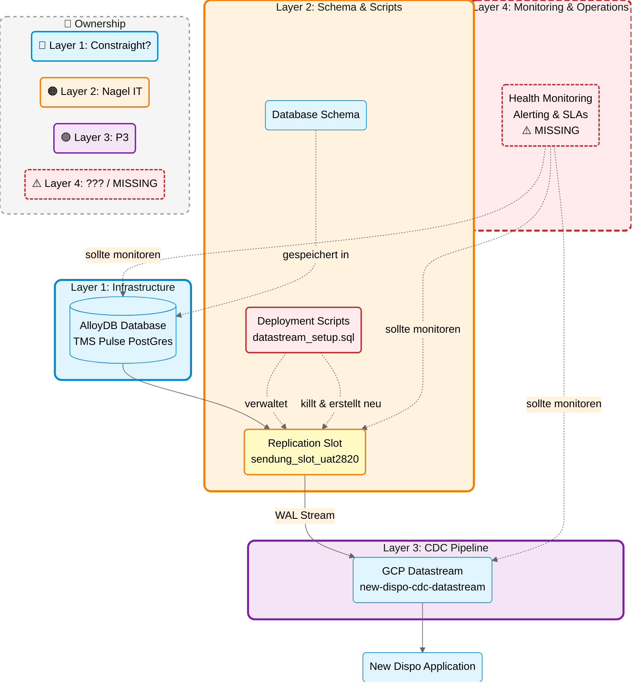

# TMS Pulse (PostGres): Replication Slot Issues & Operational Governance Gap

**To:** Christian, Pascal
**From:** Matthias (Architect)
**Date:** 2026-02-04

---

Hallo Christian, hallo Pascal,

derzeit gibt es technische Probleme bei TMS Pulse (PostGres), konkret mit den Replication Slots der Alloy-Datenbanken. Die Analyse mit Nikolay Hristov, Ron Vervenne, Eric Meijers und Thomas Paulus hat das konkrete Problem identifiziert.

---

## Management Summary

**TL;DR:** TMS Pulse CDC hat drei technische Herausforderungen: (1) Deployment-Scripts von Nagel IT brechen unabsichtlich die Datastream-Verbindung, (2) Proxy-Verbindungen verstärken das Problem, und (3) ein ungeklärter Debezium-Connector erscheint in neuen 2026-Instanzen (Security-Klärung mit Google erforderlich). Die Root Cause ist fehlende Koordination zwischen Teams (Nagel IT, P3, Constraight) und fehlendes Monitoring (Layer 4). Diese Situation bestätigt unsere laufenden Governance-Initiativen: Das Operations & Governance Framework, das derzeit in Abstimmung ist, adressiert genau diese Lücken für alle Cloud-Projekte. Die Details unten zeigen konkrete Maßnahmen für TMS Pulse und wie das Framework auch Cloud4Log und Markant DVA absichern wird.

---

## Teil 1: Das konkrete TMS Pulse CDC Problem

### Was ist passiert?
- Replication Slots sind auf 422-500 GB angewachsen (7 Tage Verzögerung)
- New Dispo erhält einwöchige alte Daten
- Issue wurde zufällig während manuellem Testing entdeckt

### Mögliche Root Causes

**1. Deployment-Scripts von Nagel IT brechen die Datastream-Verbindung:**
- Das Script `datastream_setup.sql` killt bei jedem Deployment alle Datenbankverbindungen
- Dabei werden auch die Replication Slots neu erstellt
- Dies führt dazu, dass P3's Datastream die Verbindung verliert und in einen unrecoverable State geht
- Laut Nikolay: "*This happened before*" - es ist ein wiederkehrendes Problem

**2. Proxy-Verbindungen als möglicher Faktor:**
- Datastream verbindet sich über Proxy-Server (10.100.47.236 und 10.100.47.238) zur Datenbank
- Errors im Log zeigen: "*replication slot is already being used by a different process*"
- Proxy-Disconnects können das Problem verstärken oder triggern
- Diskussion läuft: Direkte Datenbankverbindung statt Proxy nutzen

**Keine Koordination zwischen den Teams:**
- Nagel IT war nicht bewusst, dass ihre Deployment-Scripts CDC beeinflussen
- P3 hatte keine Visibility über anstehende Deployments
- Kein Monitoring hat die entstehende Datenlücke detektiert

### Ungeklärte Debezium-Connector Aktivität (kritische Sicherheitsfrage)

**Was wurde entdeckt?**
- In den Logs erscheint ein Debezium-Connector für CDC
- **Nur bei neuen Datastream-Instanzen, die 2026 erstellt wurden**
- Bei älteren, bestehenden Instanzen tritt dies nicht auf

**Vermutung:**
- Google hat möglicherweise begonnen, Debezium intern für Datastream zu verwenden
- Keine öffentliche Dokumentation oder Bestätigung dafür online verfügbar

**Kritisches Risiko:**
- **Bevor wir die Replication-Slot-Untersuchung fortsetzen, müssen wir Datenlecks ausschließen**
- Unbekannte Connector-Aktivität könnte bedeuten, dass Daten an unbekannte Ziele gestreamt werden
- Security-Governance verlangt Klärung vor weiteren Maßnahmen

**Erforderliche Maßnahme:**
- **Google Support-Ticket muss sofort eröffnet werden**
- Frage: "Nutzt Google Datastream intern Debezium-Connectoren? Wenn ja, seit wann und warum nur bei neuen Instanzen?"
- Erst nach Klärung können wir sicher mit der Replication-Slot-Investigation fortfahren

### Ownership & Dependencies (Warum das passiert ist)

**Hinweis:** Layer 4 (Monitoring & Operations) ist derzeit in Klärung/Arbeit mit Harun.

**Das Kernproblem:**
- P3 provisioniert und konfiguriert Datastream (Layer 3)
- Nagel IT führt Deployments durch, die Datastream brechen (Layer 2)
- Niemand monitored, keiner bekommt Alerts (Layer 4 fehlt komplett)
- Constraight managed die Infrastruktur ohne Visibility in CDC (Layer 1)

### Vorschlag für unmittelbare Maßnahmen (2 Wochen)

1. **🔴 PRIORITÄT: Google Support-Ticket für Debezium-Connector öffnen** (Security-relevanter Blocker)
2. **`datastream_setup.sql` im nächsten Deployment deaktivieren/anpassen**
3. **Direkte Datenbankverbindung evaluieren:** Datastream direkt zur Datenbank statt über Proxy (reduziert Fehlerquellen)
4. **Basis-Monitoring für Datastream einrichten** (aktuell: 0 Monitoring)
5. **Deployment-Koordination:** Nagel IT informiert P3 48h vor Deployments, die Replication Slots betreffen

### Fazit Teil 1
**Kernprobleme:**
1. **Ownership und Abstimmung:** Komponenten und Deployments nicht aufeinander abgestimmt - jedes Team arbeitet korrekt, aber ohne Koordination brechen die Abhängigkeiten
2. **Ungeklärte Debezium-Aktivität:** Sicherheitsrelevante Frage muss mit Google geklärt werden, bevor Investigation fortgesetzt werden kann

---

## Teil 2: Positive Bestätigung unserer Governance-Initiative

**Kontext:** Das Operations & Governance Framework, das derzeit im Angebot ausgearbeitet wird, adressiert genau die Lücken, die bei TMS Pulse sichtbar geworden sind.

### Das TMS Pulse Problem bestätigt unseren Ansatz

Dieses konkrete TMS Pulse Beispiel zeigt sehr deutlich, warum das geplante Operations & Governance Framework wichtig ist. Wir sehen ein wiederkehrendes Pattern:

**Projekte mit ähnlichen Herausforderungen:**
- **TMS Pulse (PostGres)** - Wie gerade erlebt: fehlende Team-Koordination, kein Monitoring
- **Cloud4Log** - Operational Ownership zwischen Teams noch in Klärung
- **Markant DVA** - Aktuell in Konzeptionsphase, idealer Zeitpunkt für Framework-Anwendung

**Die gute Nachricht:** Wir haben dies erkannt und arbeiten bereits an der Lösung. Das geplante Framework würde folgende Bereiche abdecken:

1. **Operations & Governance Framework für alle Cloud-Deliveries:** Monitoring, Alerting, SLAs, Handoff-Prozeduren als Standard-Bestandteile
2. **Delivery Standards:** Klare Definition was Teil einer technischen Delivery sein muss (Monitoring, Dokumentation, Runbooks, Alert-Routing)
3. **Ownership Model für Layer 4:** Verantwortlichkeiten für operatives Monitoring definieren (Delivery-Teams, zentrales Ops, oder cross-funktional)
4. **Proactive statt Reactive:** Strukturiertes Monitoring und Alerting statt zufälliger Entdeckung von Problemen

### Warum wir das jetzt teilen

TMS Pulse ist ein konkretes, real aufgetretenes Beispiel, das den Business Case für das Framework bestätigt. Es zeigt nicht nur theoretische Risiken, sondern messbare Impacts (7 Tage Datenverzögerung, mehrtägige Investigation, manuelle Entdeckung). Dies hilft bei der Priorisierung und Budgetierung der geplanten Governance-Initiative.

---

## Next Steps

**Kurzfristig (TMS Pulse CDC):**
- 🔴 **Google Support-Ticket für Debezium-Connector eröffnen** (blockiert weitere Investigation aus Security-Gründen)
- Deployment-Script anpassen (koordiniert mit Nagel IT)
- Basis-Monitoring für Datastream aufsetzen
- Koordination bei Deployments: Nagel IT informiert P3 48h vorher bei Änderungen an Replication Slots

**Mittelfristig (Governance - bereits in Arbeit):**
- Laufendes Operations & Governance Framework-Angebot finalisieren
- Framework auf TMS Pulse, Cloud4Log und Markant DVA anwenden
- TMS Pulse Learnings in Framework-Definition einfließen lassen

**Follow-up Meeting Vorschlag:**
- Teilnehmer: Christian, Pascal, Ron Vervenne, Matthias, Nikolay Hristov, Eric Meijers, Matt Wilkinson
- Dauer: 90 Min
- Agenda:
  1. TMS Pulse CDC: Deployment-Koordination etablieren, Google Support-Ticket Status (30 Min)
  2. Governance Framework: Alignment zum laufenden Angebot, TMS Pulse Learnings einarbeiten (60 Min)

---

**Aktueller Status:** Technisches Root Cause bei TMS Pulse identifiziert, Recovery läuft. **🔴 Nächster Schritt:** Debezium-Connector mit Google klären (Security). Das Governance Framework ist bereits in Arbeit und wird durch diese Learnings gestärkt.

Beste Grüße
Matthias
