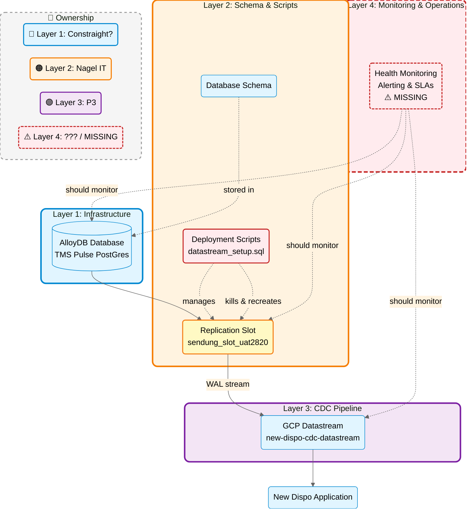

# Management Summary: TMS Pulse (PostGres) Replication Slot Issues

**To:** Christian, Pascal
**From:** Matthias (Architect)
**Date:** 2026-02-04
**Subject:** TMS Pulse (PostGres) Technical Issues & Responsibility Clarification Required

---

## Executive Summary

TMS Pulse (PostGres) is currently experiencing technical issues with the database replication infrastructure, with replication slots reaching nearly 500 GB in size. During the investigation conducted by P3 (Matthias - Architect, Nikolay - DevOps Engineer) together with Ron and colleagues from your teams (Eric, Thomas from Nagel IT), we've identified not only technical root causes but also **critical gaps in ownership and responsibility** - similar to the recent Oracle connection issues at DIGLIS.

**Impact:**
- Data replication is currently 7 days behind (422+ GB backlog)
- Risk of database disk exhaustion
- New Dispo (sole consumer) receiving week-old shipment data

**Status:** Technical root cause identified; actively working on resolution. However, **organizational clarity is needed to prevent recurrence.**

---

## 1. The Technical Problem

### What Happened
Replication slots on the Alloy databases grew to 422-500 GB, causing severe lag in data replication. The system is currently processing data from January 23rd (we are now February 4th).

### Root Cause (Technical)
Our investigation revealed:

1. **Deployment Process Breaking Replication** (PRIMARY ISSUE - ongoing):
   - Database deployment scripts include `datastream_setup.sql` which kills all database connections before recreating replication slots
   - **Critical finding from Nikolay:** "*When the replication slot is recreated, the datastream stops and needs to be deleted and created again*"
   - This is **not a new issue** - Nikolay confirms: "*This happened before but now this is different issue*"
   - When reconnecting after slot recreation, PostgreSQL reports "slot already active for PID X"
   - According to Google Cloud documentation: "*If a stream fails, is paused or deleted without dropping the replication slot, PostgreSQL continues to retain WAL files indefinitely*"
   - **Impact:** Each deployment that recreates slots requires manual intervention to recreate Datastream, causing data lag to accumulate

2. **Massive WAL Accumulation from System Tables**:
   - Replication slots capture **ALL database WAL**, not just selected tables
   - One system table (`csik_sys_gl_sm` - 256 GB, 456 million operations) generated 99% of the current 422 GB backlog
   - While Datastream was **always configured to replicate only the `sendung` table** (confirmed by Nikolay), the replication slot itself must hold WAL for all database activity
   - This creates massive backlogs that take days/weeks to process, even though only a small fraction is actually needed

3. **Proxy-Related Interruptions** (contributing factor):
   - Data Stream connects via proxy servers (10.100.47.236 and 10.100.47.238)
   - Errors started appearing on Jan 18-19, 2026: "*replication slot is already being used by a different process*"
   - Proxy disconnections may be compounding the slot recreation issues

### Current Status & Mitigation Efforts
- **Active:** Processing through 422 GB backlog (will take several more days)
- **Investigation:** Working to prevent replication slot recreation during deployments
- **Workaround:** Exploring direct database connections instead of proxy
- **Critical Need:** Coordination with database team to modify deployment scripts

### Why This Keeps Happening

According to P3's DevOps Engineer (Nikolay):
> "When the replication slot is recreated, the datastream stops and needs to be deleted and created again. This happened before but now this is different issue."

**Translation:** Every time the database team runs deployments that recreate replication slots, P3 must manually intervene to recreate the entire Datastream configuration.

---

## 2. The Organizational Challenge

This incident has exposed **unclear ownership boundaries** in the TMS Pulse (PostGres) infrastructure, with three distinct responsibility areas that must coordinate:

### Three Responsibility Layers

**The Problem Visualized:**
- **Constraight** manages the database infrastructure but has limited visibility into CDC issues
- **Nagel IT** controls deployment scripts that recreate the replication slot **without coordinating with P3**
- **P3** provisions and configures the Datastream that depends on the replication slot **but cannot prevent it from being disrupted**
- **Layer 4 (Monitoring & Operations)** is shown with dashed borders and warning colors because **it doesn't exist** - no owner, no monitoring, no alerts

| Layer                          | Component                                                                    | Current Owner     | Our Understanding                                           |
| ------------------------------ | ---------------------------------------------------------------------------- | ----------------- | ----------------------------------------------------------- |
| **1. Infrastructure**          | AlloyDB Database (GCP Managed Service)                                       | Constraight?      | Database platform itself                                    |
| **2. Schema & Scripts**        | Database schema, deployment scripts, replication slots                       | Nagel IT          | Includes the problematic `datastream_setup.sql`             |
| **3. CDC Pipeline**            | Data Stream configuration (GCP)                                              | P3                | Data replication to New Dispo                               |
| **4. Monitoring & Operations** | Health monitoring, alerting, SLAs, incident response, operational governance | **??? / MISSING** | **Critical gap - discovered accidentally during testing** |

### The Problem

**According to Matt Wilkinson:** P3 is responsible for the entire CDC Stream (TMS Pulse (PostGres)).

However, the actual control points are split:

**What We Control (Layer 3 - P3):**
- Datastream provisioning in GCP ✅ (created the infrastructure)
- Datastream configuration ✅ (configured according to feature requirements)
- Troubleshooting data flow ✅ (identified the problem after discovery)
- Manual incident response ✅ (when issues are reported)

**What We DON'T Control (Layer 2 - Database Team):**
- Deployment scripts that recreate replication slots ❌ (breaks P3's Datastream)
- Database schema changes ❌ (can affect replication)
- Replication slot lifecycle management ❌ (critical dependency)

**What We DON'T Have (Even Within Our Layer):**
- Proactive monitoring of Datastream health ❌ (no alerts, no dashboards)
- Automated alerting for replication lag ❌ (issues discovered manually during testing)
- Operational governance framework ❌ (no defined SLAs, escalation paths, or runbooks)

**The Gap:**
- **Layer 2 (Nagel IT)** runs deployment scripts that kill replication connections **without notifying P3**
- **Layer 2** recreates replication slots that break Datastream, requiring **manual intervention from P3**
- **Layer 3 (P3)** provisions and configures the Datastream but **cannot prevent Layer 2 from disrupting it**
- **Layer 4 (Monitoring & Operations)** is **completely undefined** - no owner, no monitoring, no alerts, no governance
- **Layer 1** experiences the disk space issues but has **limited visibility into Layers 2-4**
- **Result:** P3 is accountable for CDC delivery but the operational infrastructure (Layer 4) and control over dependencies (Layer 2) are missing

### Pattern: This Is Not An Isolated Incident

This mirrors the recent **Oracle connection problems at DIGLIS** where responsibilities between teams were not clearly defined.

**Common Pattern:**
1. One team (P3) is told they own a system
2. Critical components are controlled by another team
3. The controlling team lacks expertise in that component
4. Changes happen without coordination
5. System breaks, causing production impact
6. Teams spend days investigating and finger-pointing
7. Issue is resolved reactively
8. **No structural changes made**
9. **Pattern repeats** (Nikolay: "*this happened before*")

**Results:**
- Extended resolution times (multiple days per incident)
- Team friction and unclear accountability
- Reactive firefighting instead of proactive management
- **Issues discovered accidentally** (this incident found during manual testing, not monitoring)
- **Silent failures** (New Dispo received week-old data with no alerts)
- Erosion of stakeholder confidence

### Broader Impact: Multiple Projects Affected

**This unclear ownership pattern is not limited to TMS Pulse (PostGres).** Similar operational responsibility challenges are emerging across new cloud-based projects:

#### Projects Currently Affected:

1. **TMS Pulse (PostGres)** - Current incident
   - CDC replication infrastructure
   - Split responsibility between Cloud team (Datastream) and Nagel IT (database/slots)
   - Recurring breakage from uncoordinated deployments

2. **Cloud4Log**
   - New cloud-based logging infrastructure
   - Unclear operational ownership between Cloud team and application teams
   - Questions around who monitors, who troubleshoots, who has authority to make changes

3. **Markant DVA**
   - New cloud-based data validation/analytics platform
   - Similar split responsibilities across infrastructure, data pipelines, and application layers
   - Operational handoffs not clearly defined

#### Common Thread:

All three projects share the same structural issue:
- **Cloud infrastructure** managed by one team
- **Application/business logic** managed by another team
- **Integration points and dependencies** not clearly owned
- **No defined coordination process** for changes
- **Reactive incident response** instead of proactive operational governance

**Strategic Risk:** As we migrate more systems to cloud-based architectures, this pattern will multiply. Each new project risks becoming another source of unclear accountability and extended incident resolution times.

**Without addressing the organizational model now, we're building operational debt that will compound as we scale.**

### Evidence: Knowledge Gap at Database Team

**During the investigation, the team chat logs reveal that the database team (Nagel IT) was not familiar with the CDC/replication infrastructure they are supposed to manage:**

#### Lack of Awareness of Critical Scripts

When asked about `datastream_setup.sql` (the script that kills connections and recreates replication slots):

> **Eric Meijers:** "I have never seen this script and don't think it is used recently"
>
> **Thomas Paulus:** "I do not know this script either."

**Context:** This script is in their own GitHub repository (`tms-alloydb-schema/src/sql/scripts/misc/datastream_setup.sql`) and is central to the replication slot issues we're experiencing.

#### Unfamiliarity with Basic CDC Concepts

**Eric asking for basic information about replication status:**
> "Just one short question, does the replication work? Do you get data or not at all?"

**Eric asking how replication is started:**
> "Nikolay, how/what command do you start the replication?"

**Eric discovering WAL retention behavior (a fundamental CDC concept):**
> "I do not know why there are still old WAL files, I have to investigate this closer."

**Eric's ongoing investigation:**
> "I'm still looking at this topic." (after several days)

#### P3 Team's Perspective (Nikolay)

Meanwhile, P3's DevOps Engineer Nikolay who configured and manages the Datastream stated:

> "I have selected only that table, nothing else"
>
> "the datastream worked properly when we configured it"
>
> "so it must be on the database side"
>
> "something happened on the database side but I don't know what exactly"

**Key insight:** The team operating Datastream configured it correctly from day one, but database-side operations they had no visibility into (deployment scripts recreating slots) kept breaking it.

#### What This Reveals

1. **Script Ownership vs. Understanding:** The database team owns the repository containing critical CDC scripts but is not aware of their existence or purpose.

2. **Knowledge Gap on Both Sides:**
   - Database team lacks CDC expertise (asking basic replication questions)
   - Cloud team lacks visibility into database deployment processes affecting their infrastructure

3. **Reactive Learning:** The teams are learning about each other's domains during the incident rather than having established coordination.

4. **Documentation Gap:** If the team that manages the database schema doesn't know about these scripts, there's clearly insufficient documentation and knowledge transfer.

5. **Recurring Problem Pattern:** Nikolay confirms "*this happened before*" - indicating this is not a one-time incident but a systemic coordination failure.

### The Core Issue

**This is not a criticism of individuals** - Eric and Thomas are doing their best to help during the incident. Instead, it highlights a **systemic problem:**

The root issue is not a lack of expertise, but **the absence of an operational governance framework**. When Nagel IT delivered the database infrastructure, no operational boundaries, monitoring requirements, or handoff procedures were defined.

**This creates a dangerous gap:**
- Technical components were delivered without operational governance
- No defined monitoring, alerting, or SLA framework for the CDC pipeline
- The team with CDC expertise (P3) doesn't control the database configuration
- The team controlling the database configuration (Nagel IT) didn't establish operational handoff procedures
- **No higher-level operations & governance concept** defines who monitors what, who gets alerted, or how incidents are handled

This is a **recipe for repeated incidents** until ownership and expertise are properly aligned.

---

## 3. Impact & Risk Assessment

### Current Business Impact
- **New Dispo Application:** Currently the sole consumer of this CDC stream
- **Data Freshness:** New Dispo receiving shipment updates delayed by 7+ days
- **Operational Impact:** Shipment tracking and status updates in New Dispo are outdated by one week
- **Discovery Method:** Issue found **accidentally during manual testing** - no monitoring alerted anyone to the problem
- **Silent Failure:** The application has been operating with week-old data with no visibility into the issue
- **Future Risk:** Any planned downstream consumers (analytics, reporting) will face the same issues

### Technical Risk (If Unresolved)
- **High Risk:** Database disk exhaustion leading to production outage
- **High Risk:** Complete replication failure requiring multi-day full resync
- **Medium Risk:** Continued interruptions from deployment processes

### Organizational Risk (If Unaddressed)
- **Repeated incidents** due to uncoordinated changes across teams
- **Extended resolution times** due to unclear ownership
- **Erosion of trust** between teams and with stakeholders

---

## 4. Path Forward

### Immediate Technical Actions (This Week)
1. ✅ Complete catchup on 422 GB backlog (monitoring progress)
2. 🔄 Implement direct database connections (bypassing proxy)
3. 🔄 Coordinate with Nagel IT on deployment script modifications
4. ⏳ Set up monitoring alerts for replication lag

### Required Organizational Clarity (Urgent)

We need a **clear decision and documentation** on:

#### A. Ownership Model Decision

**Option 1: Single Owner (Recommended)**
- **One team** owns the entire CDC pipeline end-to-end
- That team coordinates with others but has final authority
- Clear escalation path when issues arise

**Option 2: Shared Ownership with Interface Contract**
- Define **clear interfaces** between teams
- Document **coordination requirements** (e.g., "48h notice before deployment")
- Establish **communication protocol** for changes affecting CDC
- Create **joint troubleshooting runbook**

**Option 3: Current State (Not Recommended)**
- Continue as-is with unclear boundaries
- Risk: Continued incidents and finger-pointing

#### B. Specific Decisions Needed

1. **Who owns the replication slot lifecycle?**
   - Creation, monitoring, recreation, deletion
   - Coordination requirements with Data Stream team

2. **What is the change management process?**
   - Database schema deployments that affect replication
   - Notification requirements and lead times
   - Rollback procedures if CDC breaks

3. **Who is the incident commander for CDC issues?**
   - Primary contact for triage
   - Authority to make decisions during outages
   - Escalation path

4. **What are the SLAs and monitoring responsibilities?**
   - Acceptable replication lag thresholds
   - Who monitors what metrics
   - Alert routing and on-call rotation

---

## 5. Recommendations

### Immediate (This Week)
1. **Assign interim incident owner** for current issue resolution
2. **URGENT: Modify or disable `datastream_setup.sql`** in deployment pipeline to stop recreating replication slots
3. **Establish emergency communication protocol:** Database team must notify P3 48h before any deployment affecting replication slots
4. **Implement basic monitoring:** Set up alerts for Datastream lag/failures (currently none exist - this incident was discovered accidentally during testing)
5. **Document current state** of responsibilities (even if imperfect)

### Short-term (Next 2 Weeks)
1. **Hold cross-team workshop** to map out responsibilities
2. **Create interface contract** between database and CDC teams
3. **Establish communication protocol** for changes
4. **Implement comprehensive monitoring** with dashboards and alert routing
5. **Define operational governance:** SLAs, escalation paths, incident response procedures
6. **Create monitoring dashboard** for Datastream health (lag, throughput, errors)

### Long-term (Next Month)
1. **Establish operations & governance framework** as mandatory for all cloud infrastructure deliveries
2. **Define delivery standards** that include operational requirements (monitoring, alerting, SLAs, runbooks)
3. **Document finalized ownership model** in architecture docs, including Layer 4 (Monitoring & Operations)
4. **Create operational runbook** for common scenarios
5. **Implement automated checks** to prevent configuration drift
6. **Quarterly review** of CDC health and team coordination
7. **Apply framework retroactively** to Cloud4Log and Markant DVA to prevent similar issues

---

## 6. Questions for Leadership

To move forward effectively, we need clarity on:

1. **Operational Governance:** Should there be a **mandatory operations & governance framework** for all cloud infrastructure deliveries that defines monitoring, alerting, SLAs, and handoff procedures?

2. **Delivery Standards:** When technical components are delivered (databases, pipelines, infrastructure), what operational requirements must be included? (monitoring, documentation, runbooks, alert routing)

3. **Strategic Priority:** How critical is TMS Pulse (PostGres) to business operations? This determines the urgency of establishing operational governance.

4. **Ownership Model:** Should operational governance (Layer 4) be:
   - Part of every delivery team's responsibility?
   - A centralized operations team's responsibility?
   - Defined in a cross-functional operations framework?

5. **Risk Tolerance:** Are current incident resolution times (discovered accidentally, multi-day investigations) acceptable, or do we need defined SLAs and proactive monitoring?

6. **Authority:** Who has decision-making authority when teams disagree on operational boundaries during an incident?

---

## 7. Next Steps

### By End of Week
- [ ] Complete technical resolution of current backlog
- [ ] Document lessons learned from this incident
- [ ] Prepare proposal for ownership model (based on leadership input)

### By End of Month
- [ ] Implement agreed-upon ownership model
- [ ] Update architecture documentation
- [ ] Train teams on new processes

### Ongoing
- [ ] Monthly CDC health reviews
- [ ] Quarterly cross-team retrospectives

---

## Summary

**Technical Issue:** Identified and being resolved. Current backlog recovery: 48-72 hours. **However, without process changes, this will recur at next deployment.**

**Organizational Issue:** **Requires immediate leadership decision and action.** This is a **recurring problem** (confirmed by Nikolay: "*this happened before*"), not a one-time incident. The root cause is **the absence of operational governance** - technical components are delivered without monitoring, alerting, SLAs, or defined operational boundaries. Without establishing an operations & governance framework, we will continue experiencing:
- Silent failures discovered accidentally during testing (not through monitoring)
- Datastream breakage with every database deployment (no coordination)
- Manual recreation of CDC infrastructure (no automation or runbooks)
- Multi-day data delays for New Dispo (no SLAs or escalation paths)
- Extended troubleshooting and team friction (no defined operational boundaries)

**Critical Findings:**
- **No operational governance concept exists** - monitoring, alerting, SLAs, and operational boundaries were never defined during delivery
- **No monitoring exists** - this 7-day data lag was discovered accidentally during manual testing, not through alerts
- Database deployment scripts break the CDC stream without coordination
- **Delivery without operational framework** - Nagel IT delivered technical components (database, replication slots) but operational handoff procedures and monitoring requirements were never established
- P3 has no visibility or control over database deployments that disrupt CDC
- Database team was unaware their scripts were causing the issue
- New Dispo has been receiving week-old data with no one aware until developers manually tested

This is not about blame - it's about establishing **operational governance that should have been defined during delivery**. When Nagel IT delivered the database infrastructure, monitoring, alerting, SLAs, and operational handoff procedures should have been part of the delivery. They weren't. Similar to the DIGLIS Oracle connection issues, this incident highlights a **systemic gap: technical deliveries without operational frameworks.**

**Immediate Action Required:**
1. Prevent `datastream_setup.sql` from running in next deployment
2. Implement basic monitoring and alerting for CDC pipeline (currently none exists)
3. Schedule working session with key stakeholders to:
   - Define operational governance framework for cloud infrastructure deliveries
   - Establish ownership boundaries and coordination requirements for TMS Pulse (PostGres)
   - Apply framework to Cloud4Log and Markant DVA before they experience similar issues

---

Best regards,
Matthias

**Attachments:**
- Detailed technical analysis: `2026-01-30-replication-slot-size-architekt-exploration/`
- Team chat transcript: `2026-02-02-team-chat-history.md`
- Dev lead exchange notes: `2026-02-03-dev-lead-exchange.md`
