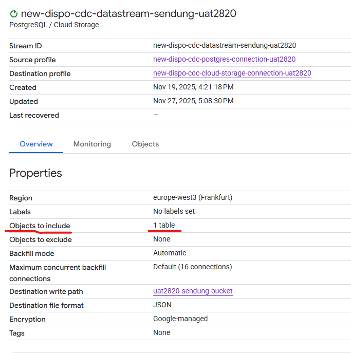
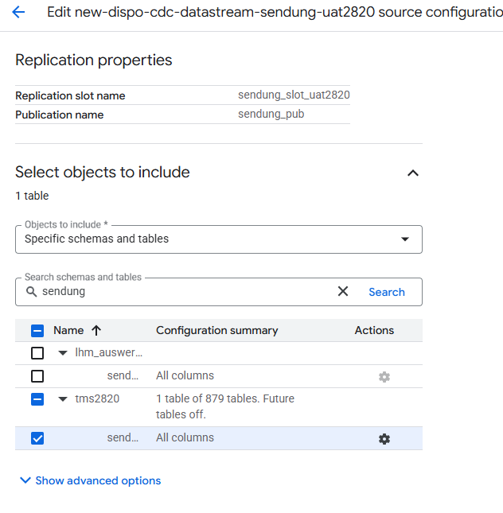
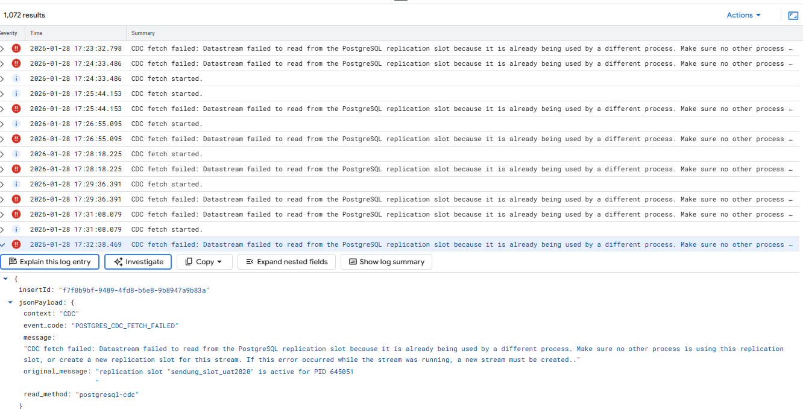

only table sending is in the replication slot
 
Yes, but Datastream might still be interfering on more/all columns. Is this true?
 
 
 
I have selected only that table, nothing else
 
Ok, then I'm out of knowledge. Slots setup fine, Datastream fine.
 
we are getting also this error
 
 
but after that the stream continued to work
 
something happened on the database side but I don't know what exactly
 
also the datastream worked properly when we configured it
 
so it must be on the database side
 
when the replication slot is recreated, the datastream stops and needs to be deleted and created again
this happened before but now this is different issue
 
Was the Datastream set to all tables once in the beginning (before Nov 27th)?
 
And then re-configured to only one table?
 
no
 
it has been always configured with just table sendung

Matthias:
Hi!
 
Do we actively monitor the Datastream (and Object Store / PubSub) or is this open as part of a "Governance" concept?
 
Like the recent failure caused by the overflowing replication slot. Who discovered it and how?
 
Nikolay:
No we don't monitor this
We found it when me and Atanas were doing test scenarios and he tried to change something in the database and waited to see the change uploaded in the bucket
 
but that didn't happen and then we started to look why we don't receive the change
 