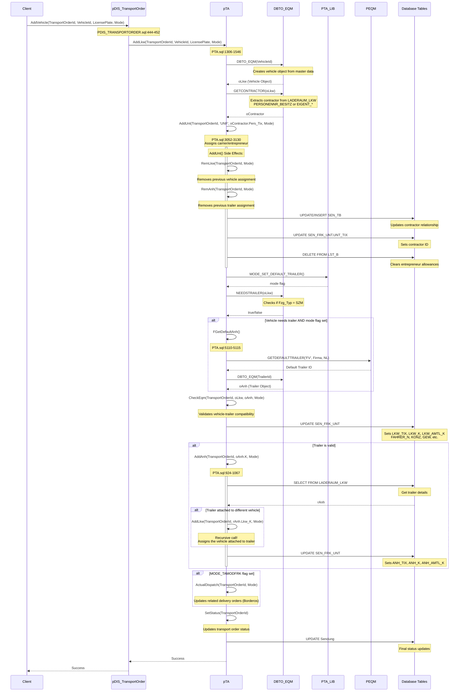

# AddVehicle Sequence Diagram

## Overview
This document provides a comprehensive analysis of what happens when a vehicle is assigned to a transport order via `pDIS_TransportOrder.AddVehicle()`.

## Answer: Do Other Assignments Happen Automatically?

**YES, several automatic assignments occur** when you call `pDIS_TransportOrder.AddVehicle()`.

### 1. **Contractor Assignment** (Automatic)
- The contractor is **automatically extracted** from the vehicle master data (`LADERAUM_LKW` table)
- Source: `LADERAUM_LKW.PERSONENNR_BESITZ` (owner) or `EIGENT_N/EIGENT_I` (proprietor)
- Code location: `src/sql/package/PTA.sql:1499`
- Stored in: `oLkw.oContractor`

### 2. **Carrier/Entrepreneur Assignment** (Automatic)
- The system **automatically calls** `pTA.AddUnt()` with the contractor from the vehicle
- This adds the carrier (UNF - Unternehmer) relationship to the transport order
- Updates the `SEN_FRK_UNT` table with `UNT_TIX` (contractor ID)
- Code location: `src/sql/package/PTA.sql:1502`

### 3. **Default Trailer Assignment** (Conditional)
- **Automatically assigns a default trailer** if:
  - The vehicle requires a trailer (`Fzg_Typ = SZM` type)
  - The `MODE_SET_DEFAULT_TRAILER` flag is set in the Mode parameter
  - No trailer is currently assigned
- Fetches via `pTA.FGetDefaultAnh()`
- Code location: `src/sql/package/PTA.sql:1387-1391`

### 4. **Important Side Effect: Previous Assignments Removed**
When the contractor is assigned via `AddUnt()`, it **removes**:
- Any previous vehicle assignment (`pTA.RemLkw`)
- Any previous trailer assignment (`pTA.RemAnh`)
- Code location: `src/sql/package/PTA.sql:3052-3130`

## Data Updated in SEN_FRK_UNT Table

The `AddVehicle` flow updates these fields in `SEN_FRK_UNT`:
- `LKW_TIX`, `LKW_K`, `LKW_AMTL_K` - Vehicle info
- `UNT_TIX` - **Contractor/Carrier** (automatically assigned)
- `ANH_TIX`, `ANH_K`, `ANH_AMTL_K` - **Trailer info** (conditionally assigned)
- `FAHRER_N`, `FAHRER_NAME` - Driver info (if not already set)
- `KONZ` - Concession number from vehicle
- `GEW` - Weight from vehicle
- `VERTRAUEN_B` - Trust indicator
- `MOBIL_TEL_N` - Mobile phone number
- Other vehicle-related metadata

## Complete Sequence Diagram



## Detailed Call Flow Analysis

### Entry Point
**File**: `src/sql/package/PDIS_TRANSPORTORDER.sql:444-452`

Two overloaded procedures:
```sql
-- With VehicleId
call pDIS_TransportOrder.AddVehicle(
    TransportOrderId => <id>,
    VehicleId => '<vehicle_id>',
    LicensePlate => '<license_plate>',
    Mode => <mode>
);

-- With LicensePlate only
call pDIS_TransportOrder.AddVehicle(
    TransportOrderId => <id>,
    LicensePlate => '<license_plate>',
    Mode => <mode>
);
```

Both call: `pTA.AddLkw()` with appropriate parameters.

### Core Logic: pTA.AddLkw()
**File**: `src/sql/package/PTA.sql:1306-1546`

Multiple overloaded versions handling different parameter combinations.

**Key cascading actions:**

#### Step 1: Extract Contractor (Line 1499)
```sql
oLkw.oContractor := DBTO_EQM.GETCONTRACTOR(oLkw);
```
- Reads from `LADERAUM_LKW` table
- Sources: `PERSONENNR_BESITZ` (owner) or `EIGENT_N/EIGENT_I` (proprietor)

#### Step 2: Assign Carrier (Line 1502)
```sql
CALL PTA.ADDUNT(nTATix, 'UNF', (oLkw.oContractor).Pers_Tix, ...);
```
- Automatically assigns contractor as carrier/entrepreneur (UNF = Unternehmer)
- Updates `SEN_FRK_UNT` and `SEN_TB` tables

#### Step 3: Default Trailer Check (Lines 1387-1391)
```sql
if (((nMode)::bigint & PTA_LIB.MODE_SET_DEFAULT_TRAILER()::bigint) > 0
    and DBTO_EQM.NEEDSTRAILER(oLkw)
    and not DBTO_EQM.ISVALID(oAnh)) then
   oAnh := PTA.FGETDEFAULTANH();
```
- Checks vehicle type (`Fzg_Typ = SZM` = tractor unit)
- Fetches default trailer if needed
- Controlled by mode flag

#### Step 4: Equipment Validation (Line 1393)
```sql
CALL PTA.CHECKEQM(nTATix, oLkw, oAnh, nMode);
```
- Validates compatibility between vehicle and trailer

#### Step 5: Database Updates (Lines 1399-1420)
```sql
UPDATE SEN_FRK_UNT SET
   LKW_TIX = oLkw.Tix,
   LKW_K = oLkw.K,
   LKW_AMTL_K = oLkw.Amtl_K,
   FAHRER_N = ...,
   UNT_TIX = oContractor.Pers_Tix,  -- Contractor assigned here
   ...
WHERE SEN_TIX = nTATix AND LFD_N = 1;
```

#### Step 6: Add Trailer (Lines 1422-1424)
```sql
if (DBTO_EQM.ISVALID(oAnh)) then
   CALL PTA.ADDANH(nTATix, oAnh.K, ...);
```

### Contractor Assignment: pTA.AddUnt()
**File**: `src/sql/package/PTA.sql:3052-3130`

**Critical side effects:**

1. **Removes previous assignments:**
```sql
CALL PTA.REMLKW(nTATix, nMode);    -- Previous vehicle
CALL PTA.REMANH(nTATix, ...);      -- Previous trailer
```

2. **Updates contractor relationship:**
```sql
UPDATE/INSERT SEN_TB
UPDATE SEN_FRK_UNT.UNT_TIX
```

3. **Clears entrepreneur allowances:**
```sql
DELETE FROM LST_B WHERE SENDUNG_TIX = nTATix
```

### Trailer Assignment: pTA.AddAnh()
**File**: `src/sql/package/PTA.sql:924-1067`

**Important recursive behavior:**
```sql
if (rAnh.Lkw_K is not null and rAnh.Lkw_K != nCurrentLkwK) then
   CALL PTA.ADDLKW(nTATix, rAnh.Lkw_K, nMode);
```
If the trailer is attached to a different vehicle, that vehicle is automatically assigned too (recursive call).

### Status Updates (Lines 1427-1430)
```sql
if (MODE_TAMODFRK) then
   CALL PTA.ACTUALDISPATCH(nTATix, nMode);
end if;
CALL PTA.SETSTATUS(nTATix);
```
- Updates all related delivery orders (Borderos)
- Recalculates transport order status

## Database Tables Affected

### Primary Table: SEN_FRK_UNT
Updates in this order:
1. **Vehicle fields** - LKW_TIX, LKW_K, LKW_AMTL_K
2. **Contractor field** - UNT_TIX (via AddUnt)
3. **Trailer fields** - ANH_TIX, ANH_K, ANH_AMTL_K (conditional)
4. **Driver fields** - FAHRER_N, FAHRER_NAME, BEIFAH_N, BEIFAH_NAME
5. **Metadata** - KONZ, GEW, MOBIL_TEL_N, VERTRAUEN_B

### Related Tables:
- **SEN_TB** - Contractor relationship (via AddUnt)
- **LST_B** - Entrepreneur allowances (deleted via AddUnt)
- **Sendung** - Transport order status

### Active Triggers
**File**: `src/sql/trigger/all_trigger_events.sql`

On SEN_FRK_UNT:
- `TRAD_SEN_FRK_UNT` - AFTER DELETE
- `TRAD_SEN_FRK_UNT_AUDIT` - AFTER DELETE (audit trail)
- `TRBIU_SEN_FRK_UNT_CRYPT` - BEFORE INSERT/UPDATE (encryption)

## Mode Flags

### MODE_SET_DEFAULT_TRAILER
Controls automatic trailer assignment:
- **Enabled** → Default trailer assigned if vehicle type requires it
- **Disabled** → No automatic trailer assignment

### MODE_TAMODFRK
Controls dispatch updates:
- **Enabled** → All related delivery orders (Borderos) are updated
- **Disabled** → Only transport order is updated

## Summary

**When you call `pDIS_TransportOrder.AddVehicle()`:**

✅ **Contractor** is automatically assigned from vehicle master data
✅ **Carrier/Entrepreneur** is automatically assigned via AddUnt()
✅ **Trailer** is conditionally assigned if vehicle needs one (SZM type) and mode flag is set
⚠️ **Previous vehicle and trailer** are removed when contractor is assigned
🔄 **Recursive behavior**: If trailer is attached to different vehicle, that vehicle is also assigned
📊 **Status updates**: Transport order status and dispatch orders are recalculated

All changes occur **within a single transaction** through cascading procedure calls.

## Code References

### Main Files
- `src/sql/package/PDIS_TRANSPORTORDER.sql` - DIS wrapper layer
- `src/sql/package/PTA.sql` - Core transport order logic
- `src/sql/trigger/all_trigger_events.sql` - Database triggers

### Key Line References
- AddVehicle wrapper: `PDIS_TRANSPORTORDER.sql:444-452`
- AddLkw core logic: `PTA.sql:1306-1546`
- Contractor extraction: `PTA.sql:1499`
- Carrier assignment: `PTA.sql:1502`
- Default trailer logic: `PTA.sql:1387-1391`
- AddUnt procedure: `PTA.sql:3052-3130`
- AddAnh procedure: `PTA.sql:924-1067`
- Default trailer function: `PTA.sql:5110-5115`
