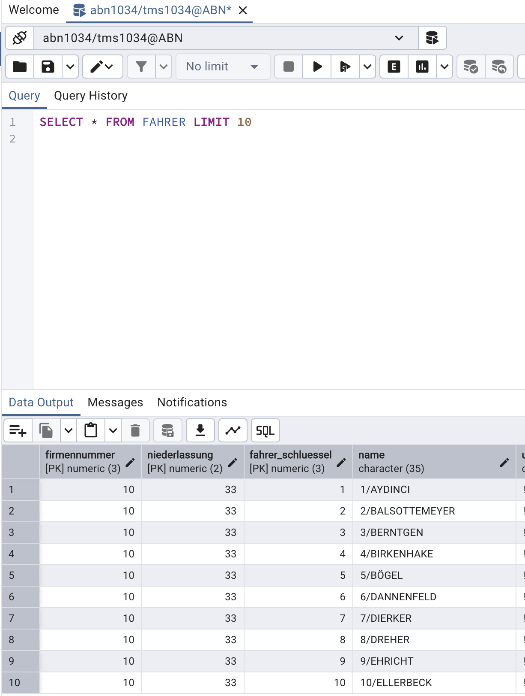

# Fahrer Table Encryption Analysis

**Date:** 2026-02-24
**Component:** TMS Database (Code/tms-alloydb-schema)

## Question

Does the "fahrer" table in the TMS Database store encrypted or clear data for properties like driver name etc.?

## Answer

The **"fahrer" table stores data in clear text (unencrypted)**.

## Evidence

### Table Schema Location
`Code/tms-alloydb-schema/src/sql/table/fahrer.sql`

### Table Definition

```sql
CREATE TABLE fahrer (
    firmennummer numeric(3,0) NOT NULL,
    niederlassung numeric(2,0) NOT NULL,
    fahrer_schluessel numeric(3,0) NOT NULL,
    name character(35),
    u_version character(1),
    c_date timestamp without time zone,
    c_time timestamp without time zone,
    u_date timestamp without time zone,
    u_time timestamp without time zone,
    ols_user character(8),
    eintrittsdatum timestamp without time zone,
    fuehrerschein_kl character(20),
    fs_geprueft_am timestamp without time zone,
    ggvs_fs character(1),
    ggvs_klassen character(20),
    text character(175),
    del_flag character(1)
);
```

### Key Findings

1. **Driver Name (line 18)**: `name character(35)`
   - Standard PostgreSQL character type
   - No encryption applied

2. **Driver's License Class (line 26)**: `fuehrerschein_kl character(20)`
   - Plain text storage

3. **Additional Text (line 30)**: `text character(175)`
   - Plain text storage

### Database Verification

The following screenshot shows actual data from the fahrer table, **verified on ABN1034 database**:



As shown in the query results, driver names are stored in plain text format (e.g., "YAVRINCI", "HAHNEKAMP", "SIEBENTIAN", "SCHROENBAUMER", etc.).

### No Encryption Indicators

The schema shows no signs of encryption:
- No encrypted data types (e.g., `bytea` for binary encrypted data)
- No encryption functions
- No encryption-related metadata columns
- All personal data fields use standard character types

## Conclusion

All driver information including names, license information, and other personal properties are stored as **plain text** in the TMS Database without encryption at the database column level.

## Implications

- Database-level encryption (at-rest encryption) may still be applied at the infrastructure level
- Application-level encryption would need to be implemented if column-level encryption is required
- Consider GDPR and data protection requirements for personal driver information
