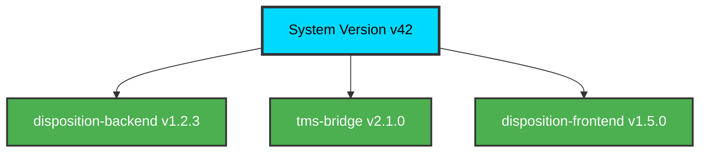
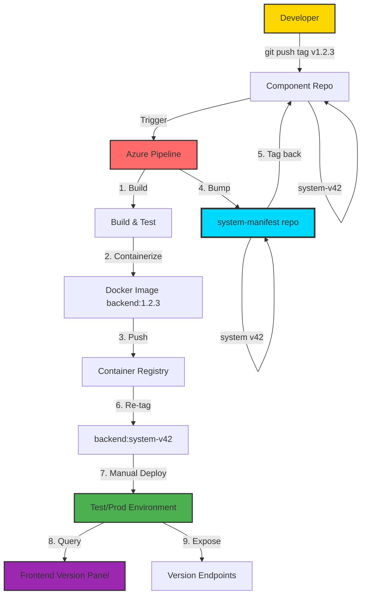
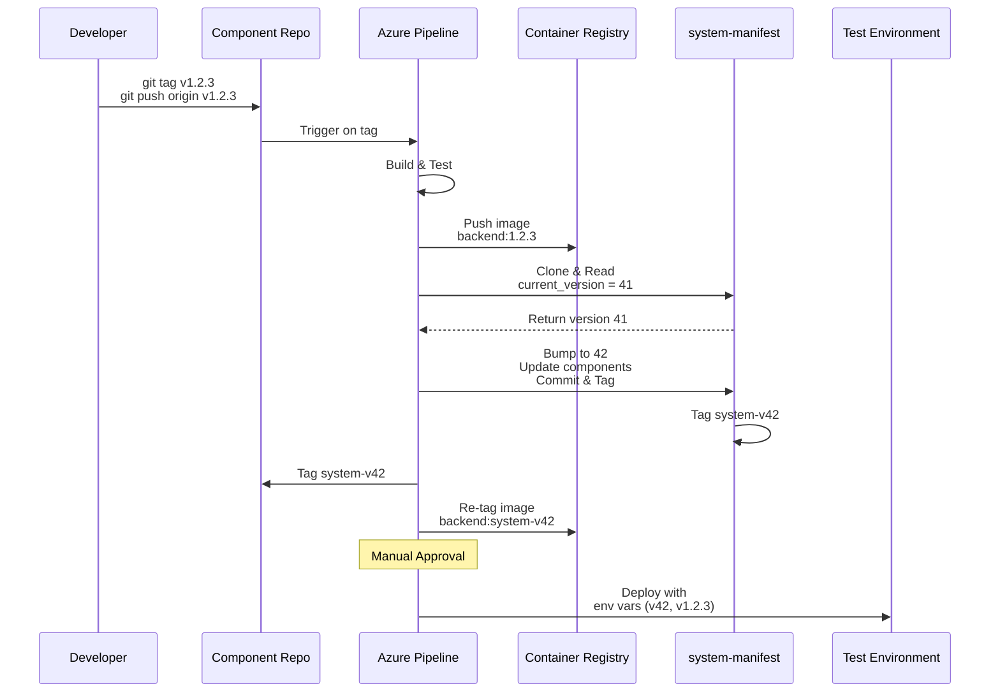
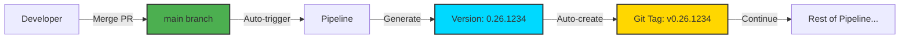
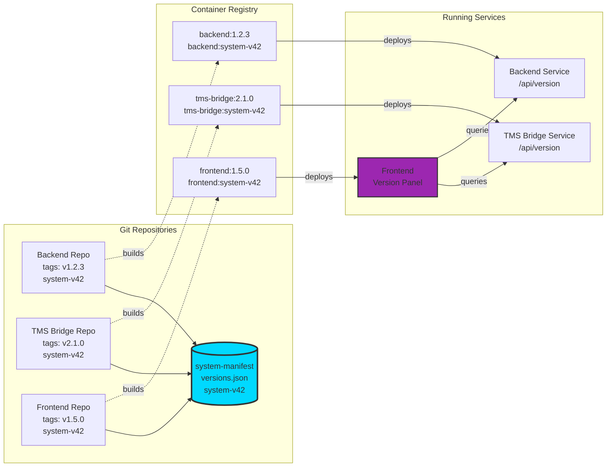
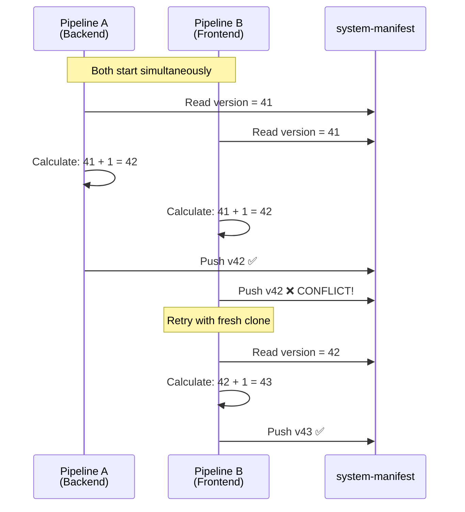
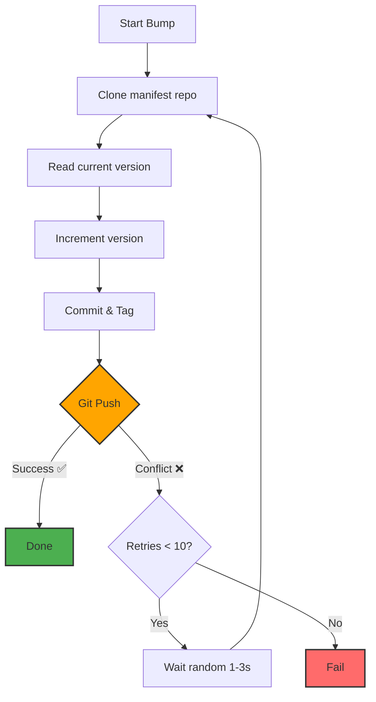
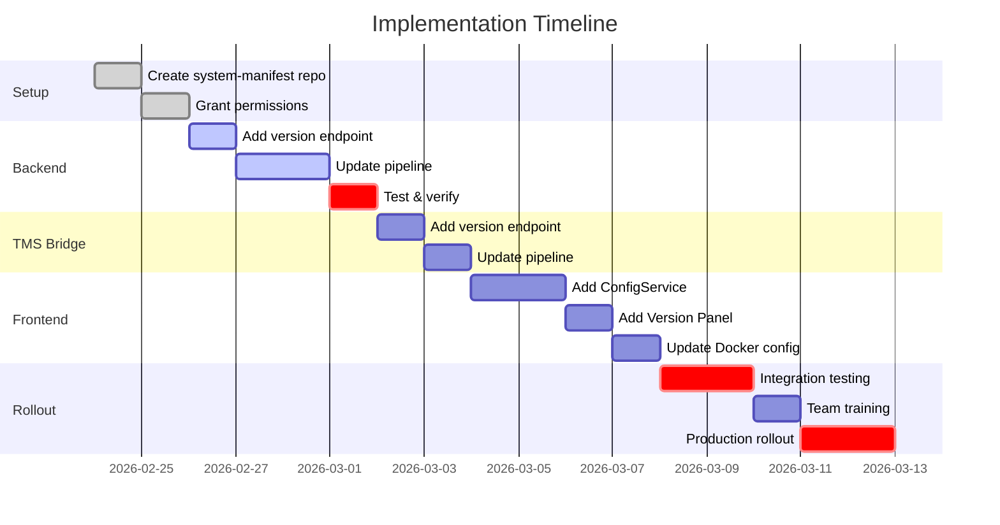

# Microservice Versioning System - Team Presentation

## Problem Statement

**Challenge**: In a microservice architecture with 3+ components (Backend, TMS Bridge, Frontend), how do we:
- Track which versions of components work together?
- Identify what's deployed in each environment?
- Reproduce old system states for debugging?
- Know which component triggered each release?

**Current Pain Points**:
- No unified "system version"
- Hard to answer "what was running on Feb 15?"
- Difficult to correlate component versions across services

---

## Solution: Automatic System Versioning

Every component release automatically generates a **monotonically increasing system version** that captures a complete snapshot of all component versions.



---

## Core Principles

### 1. **Decentralized**
- No central versioning service to maintain
- Everything lives in Git repos and Docker labels
- Works offline, no single point of failure

### 2. **Automatic**
- Developer only pushes a Git tag: `git tag v1.2.3 && git push origin v1.2.3`
- CI/CD handles everything else automatically

### 3. **Complete History**
- Git maintains full history
- Can query any past system version
- Reproducible builds

### 4. **Atomic**
- Race condition handling with retry logic
- Multiple simultaneous releases don't conflict

---

## How It Works: The Flow

### Overall Architecture



### Detailed Pipeline Flow



### Developer Workflow (Simple)

```bash
# Developer makes changes, ready to release
git tag v1.2.3
git push origin v1.2.3

# ✅ Everything else happens automatically:
# - Build & test
# - Create Docker images
# - Bump system version
# - Tag repos
# - Ready to deploy
```

---

## High-Frequency Releases (10+ per day)

### Problem: Manual Tagging is Tedious

For test environments with frequent releases, manual tagging becomes overhead:

```bash
# Manual workflow (tedious for 10+ releases/day)
git tag v1.2.3
git push origin v1.2.3
```

### Solution: Auto-Tag on Merge

**Pipeline triggers on every merge to main** → automatically generates version:



### Automated Developer Workflow (Zero Manual Tagging)

```bash
# Developer just merges to main
git checkout -b feature/my-feature
# ... make changes ...
git commit -m "Add new feature"
git push origin feature/my-feature

# Create PR → Review → Merge
# ✅ Pipeline automatically:
#    - Generates version (0.26.1234)
#    - Creates Git tag
#    - Builds & deploys
#    - Bumps system version
```

### Version Format Options

**Option 1: Build Number** (Recommended for Test)
- Format: `0.{year}.{build-number}`
- Example: `0.26.1234` (year 2026, build 1234)
- ✅ Simple, unique, sortable
- ✅ Works for unlimited releases

**Option 2: Calendar Versioning**
- Format: `YYYY.MM.BUILD`
- Example: `2026.02.0034` (34th build in Feb)
- ✅ Date-based, easy to understand

### Recommendation

- **Test Environment**: Auto-tag on merge (no manual work)
- **Production**: Manual semantic tags (controlled releases)

This gives you:
- Fast iteration in test (10+ releases/day, zero overhead)
- Controlled releases in production (manual approval)

**All versioning benefits still work**: past resolution, system versions, full traceability.

---

## Component Interaction



---

## Storage & Tagging Strategy

### 1. System-Manifest Repository

**Single file: `versions.json`**

```json
{
  "system_version": 42,
  "components": {
    "disposition-backend": "1.2.3",
    "tms-bridge": "2.1.0",
    "disposition-frontend": "1.5.0"
  },
  "released_at": "2026-02-15T14:30:00Z",
  "trigger": {
    "component": "disposition-backend",
    "from_version": "1.2.2",
    "to_version": "1.2.3",
    "git_commit": "abc123"
  }
}
```

**Git history = system version history:**

```
$ git log --oneline
f4e2a1b  v52: disposition-backend → 1.3.0
c3d4e5f  v51: tms-bridge → 2.2.0
a1b2c3d  v50: disposition-frontend → 1.6.0
9e8d7c6  v49: disposition-backend → 1.2.5
```

### 2. Component Repositories (Dual Tagging)

Each component gets **two Git tags** per release:

```bash
# Example: Disposition-Backend release
git tag v1.2.3         # Component version
git tag system-v42     # System version it belongs to
```

**Benefits**:
- `git checkout system-v42` → Get exact code from that system version
- `git tag --contains <commit>` → See which system version

### 3. Docker Images (Multiple Tags)

```bash
# Each Docker image gets tagged 3 ways:
disposition-backend:1.2.3          # Component version
disposition-backend:system-v42     # System version
disposition-backend:latest         # Latest
```

**Docker Labels** (metadata inside image):

```dockerfile
com.calconsult.component.name=disposition-backend
com.calconsult.component.version=1.2.3
com.calconsult.system.version=42
com.calconsult.git.commit=abc123
com.calconsult.git.repo=Disposition-Backend
```

Query running containers:
```bash
docker inspect <container> | jq '.[0].Config.Labels'
```

---

## Version Resolution: Past & Present

### Past Resolution: "What was in system v42?"

**1. View complete snapshot:**
```bash
cd system-manifest
git show system-v42:versions.json
```

**Output:**
```json
{
  "system_version": 42,
  "components": {
    "disposition-backend": "1.2.3",
    "tms-bridge": "2.1.0",
    "disposition-frontend": "1.5.0"
  },
  "released_at": "2026-02-15T14:30:00Z"
}
```

**2. Checkout code at system v42:**
```bash
cd Disposition-Backend
git checkout system-v42
# You now have the exact code that was released in system v42
```

**3. Compare two system versions:**
```bash
# What changed between v40 and v50?
diff <(git show system-v40:versions.json | jq '.components') \
     <(git show system-v50:versions.json | jq '.components')
```

**4. Find when component version was released:**
```bash
# Which system version had backend v1.2.3?
cd Disposition-Backend
git tag --contains v1.2.3 | grep system-v
# Output: system-v42
```

**5. Historical query:**
```bash
# What was running on February 15, 2026?
cd system-manifest
git log --before="2026-02-16" --format="%h %s" -1
# Output: abc1234 v42: disposition-backend → 1.2.3

git show system-v42:versions.json
```

### Present Resolution: "What's running now?"

**1. Frontend Version Panel** (for logged-in users):

```
┌─────────────────────────────────────────┐
│  System v42                           ▼ │
├─────────────────────────────────────────┤
│  MANIFEST (Expected)                    │
│  Component              Version         │
│  disposition-backend    1.2.3           │
│  tms-bridge            2.1.0            │
│  disposition-frontend   1.5.0           │
│                                         │
│  LIVE (Actual)                      ↻   │
│  Component          Version   Status    │
│  disposition-backend 1.2.3      ✅      │
│  tms-bridge         2.1.0       ✅      │
│  disposition-frontend 1.5.0     ✅      │
└─────────────────────────────────────────┘
```

**2. Query deployed containers:**
```bash
gcloud run services describe disposition-backend \
  --region=europe-west3 \
  --format='value(spec.template.spec.containers[0].image)'

# Output: europe-west3-docker.pkg.dev/.../disposition-backend:1.2.3
```

**3. Backend API endpoints:**
```bash
curl https://test.api.com/api/version

# Response:
{
  "component": "disposition-backend",
  "version": "1.2.3",
  "systemVersion": "42",
  "gitCommit": "abc123"
}
```

---

## Race Condition Handling

### Problem: Multiple Releases at Same Time



### Solution: Atomic Bump with Retry Loop

**`bump-system-version.sh` strategy:**

```bash
for attempt in 1..10; do
  # 1. Fresh clone (always latest)
  git clone system-manifest

  # 2. Read current version
  CURRENT=$(jq '.system_version' versions.json)
  NEW=$((CURRENT + 1))

  # 3. Update JSON
  jq '.system_version = $NEW' versions.json > tmp.json

  # 4. Commit & tag
  git commit -m "v${NEW}: ${COMPONENT} → ${VERSION}"
  git tag "system-v${NEW}"

  # 5. Push (fails atomically if outdated)
  if git push && git push --tags; then
    echo "Success! System version: ${NEW}"
    exit 0
  fi

  # 6. Retry (someone else was faster)
  sleep random(1-3 seconds)
done
```

**Why it works:**
- `git push` fails atomically if remote is ahead
- Next attempt clones fresh → reads the version the other pipeline wrote
- Eventually all pipelines succeed with unique version numbers



---

## Benefits Summary

### For Developers
✅ **Simple workflow**: Just push a tag
✅ **No manual coordination**: Everything automatic
✅ **Clear history**: See what changed and when

### For Operations
✅ **Environment visibility**: Know exactly what's deployed
✅ **Reproducibility**: Can redeploy any old system version
✅ **Debugging**: "What was running when bug X appeared?"

### For Testing
✅ **Version alignment**: Ensure all components match
✅ **Mismatch detection**: Frontend shows if services are out of sync
✅ **Test traceability**: Link test results to exact system version

---

## Migration Path



### Phase Details

**Week 1**: Setup (2 days)
1. Create `system-manifest` repository in Azure DevOps
2. Initialize with `versions.json` and `bump-system-version.sh`
3. Grant pipeline permissions

**Week 2**: Backend Integration (4 days)
1. Add `/api/version` endpoint to Backend & TMS Bridge
2. Update pipelines with version steps
3. Test & verify system version bumping

**Week 3**: Frontend Integration (4 days)
1. Add Angular ConfigService + APP_INITIALIZER
2. Create SystemVersionPanel component
3. Add docker-entrypoint.sh for runtime config
4. Update Azure Pipeline

**Week 4**: Rollout (5 days)
1. Integration testing across all components
2. Team presentation (this document)
3. First production release with new system
4. Documentation and runbook updates

---

## Avoiding Pipeline Code Duplication

### Concern: Pipeline Creep

Versioning logic could be duplicated across 3 pipelines (hard to maintain, no testing, complex YAML).

### Solution: Reusable Scripts

To avoid pipeline code duplication, all versioning logic lives in the **`system-manifest` repository** alongside `versions.json`:

**Repository**: `system-manifest` (already created)

```
system-manifest/
├── versions.json                   # System version state
├── scripts/
│   ├── extract-version.sh          # Version extraction logic
│   ├── bump-system-version.sh      # System version bump (already here!)
│   ├── tag-component-repo.sh       # Git tagging
│   └── tag-docker-image.sh         # Docker re-tagging
└── tests/                          # Unit tests
```

Component pipelines **download and execute** these scripts from system-manifest.

### Pipeline Implementation (Clean & Simple)

```yaml
# Download scripts from system-manifest repo
- task: Bash@3
  script: git clone system-manifest /tmp/manifest

# Extract version
- task: Bash@3
  script: /tmp/manifest/scripts/extract-version.sh

# Bump system version
- task: Bash@3
  script: /tmp/manifest/scripts/bump-system-version.sh "backend" "1.2.3" "abc123"

# Tag component repo
- task: Bash@3
  script: /tmp/manifest/scripts/tag-component-repo.sh "42"

# Tag Docker image
- task: Bash@3
  script: /tmp/manifest/scripts/tag-docker-image.sh "backend:1.2.3" "42"
```

**Benefits**:
- ✅ Logic centralized in one repository
- ✅ Unit tested before pipeline use
- ✅ Update once, affects all components
- ✅ Can test locally before deployment
- ✅ No duplication across pipelines

**Why system-manifest repo?**
- ✅ Scripts and data in one place
- ✅ One repository to maintain (not two)
- ✅ `bump-system-version.sh` already lives here
- ✅ Simpler architecture

See `REUSABLE-SCRIPTS.md` for complete implementation.

---

## Questions & Discussion

**Q: What happens to existing pipelines?**
A: Keep them running in parallel during migration. New tag-based pipelines are separate.

**Q: Do we need to change how we develop?**
A: No. You still develop the same way. Only the release process changes.

**Q: What if system-manifest repo is unavailable?**
A: Build still succeeds, but system version bump fails. Can be retried later. Component versions are reconstructable from Git tags.

**Q: Can we skip version numbers?**
A: No. System versions are sequential. Any gaps indicate a failed/rolled-back release (still visible in Git history).

**Q: How much storage does this need?**
A: Minimal. System-manifest repo is <1MB. Git tags add no significant space. Docker registry may grow (multiple tags per image) but images are the same.

---

## Next Steps

1. **Review & Discuss** this proposal
2. **Assign owner** for implementation
3. **Create Azure DevOps tasks** for each phase
4. **Schedule** implementation sprints
5. **Plan** team training session

---

*Ready to proceed with implementation?*
