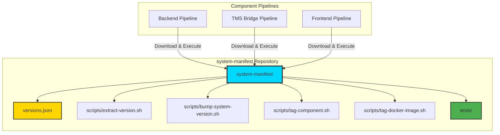

# Reusable Versioning Scripts - Avoiding Pipeline Creep

This document shows how to extract versioning logic into reusable, testable bash scripts instead of duplicating code across pipelines.

---

## Problem: Pipeline Code Duplication

**Current Issue**: Each component pipeline has similar versioning steps:
- Version extraction logic
- System version bumping
- Component repo tagging
- Docker image re-tagging

**Concerns**:
- ❌ Code duplication (DRY violation)
- ❌ Hard to maintain (change in 3 places)
- ❌ No unit testing
- ❌ Pipeline code becomes complex and brittle

---

## Solution: Scripts in system-manifest Repository

### Architecture



**Why in system-manifest?**
- ✅ Scripts and data in one place
- ✅ `bump-system-version.sh` already lives there
- ✅ One repository to maintain (not two)
- ✅ Simpler architecture

---

## Part 1: Add Scripts to system-manifest Repository

### Repository Structure

```
system-manifest/
├── versions.json                   # System version state
├── bump-system-version.sh          # Already exists
├── README.md
├── scripts/
│   ├── extract-version.sh          # Extract version from Git tag or build
│   ├── tag-component-repo.sh       # Tag component with system version
│   ├── tag-docker-image.sh         # Re-tag Docker image
│   └── lib/
│       └── common.sh               # Shared utilities
└── tests/
    ├── test-extract-version.sh
    ├── test-tag-component.sh
    └── run-tests.sh
```

**Note**: `bump-system-version.sh` stays at root for backward compatibility, but can be moved to `scripts/` folder.

---

## Part 2: Script Implementations

### scripts/lib/common.sh

```bash
#!/bin/bash
# Common utilities for versioning scripts

set -euo pipefail

# Colors for output
RED='\033[0;31m'
GREEN='\033[0;32m'
YELLOW='\033[1;33m'
BLUE='\033[0;34m'
NC='\033[0m' # No Color

# Logging functions
log_info() {
    echo -e "${BLUE}[INFO]${NC} $1"
}

log_success() {
    echo -e "${GREEN}[SUCCESS]${NC} $1"
}

log_warning() {
    echo -e "${YELLOW}[WARNING]${NC} $1"
}

log_error() {
    echo -e "${RED}[ERROR]${NC} $1" >&2
}

# Validate required environment variable
require_env() {
    local var_name=$1
    local var_value="${!var_name:-}"

    if [[ -z "$var_value" ]]; then
        log_error "Required environment variable not set: $var_name"
        exit 1
    fi
}

# Validate required command exists
require_command() {
    local cmd=$1
    if ! command -v "$cmd" &> /dev/null; then
        log_error "Required command not found: $cmd"
        exit 1
    fi
}

# Azure DevOps output variable
set_azure_variable() {
    local name=$1
    local value=$2
    local is_output=${3:-true}

    if [[ "$is_output" == "true" ]]; then
        echo "##vso[task.setvariable variable=$name;isOutput=true]$value"
    else
        echo "##vso[task.setvariable variable=$name]$value"
    fi
}

# Check if running in Azure Pipelines
is_azure_pipelines() {
    [[ -n "${SYSTEM_TEAMPROJECT:-}" ]]
}
```

### scripts/extract-version.sh

```bash
#!/bin/bash
# Extract version from Git tag or auto-generate from build number

SCRIPT_DIR="$(cd "$(dirname "${BASH_SOURCE[0]}")" && pwd)"
source "$SCRIPT_DIR/lib/common.sh"

# Configuration
MODE="${VERSION_MODE:-tag}"  # tag, auto-build, auto-calver
BUILD_NUMBER="${BUILD_NUMBER:-1}"
SOURCE_BRANCH="${SOURCE_BRANCH:-}"

log_info "Extracting version (mode: $MODE)"

extract_from_tag() {
    # Extract version from Git tag (refs/tags/v1.2.3 -> 1.2.3)
    local tag="${SOURCE_BRANCH#refs/tags/v}"

    if [[ "$tag" == "$SOURCE_BRANCH" ]]; then
        log_error "Not triggered by a tag. Branch: $SOURCE_BRANCH"
        exit 1
    fi

    # Validate semantic version format
    if [[ ! "$tag" =~ ^[0-9]+\.[0-9]+\.[0-9]+(-[a-zA-Z0-9]+)?$ ]]; then
        log_error "Invalid semantic version format: $tag"
        exit 1
    fi

    echo "$tag"
}

auto_generate_build_version() {
    # Format: 0.{year}.{build-number}
    local year=$(date +%y)
    echo "0.$year.$BUILD_NUMBER"
}

auto_generate_calver() {
    # Format: {year}.{month}.{build-number}
    local year=$(date +%Y)
    local month=$(date +%m)
    local build_padded=$(printf "%04d" "$BUILD_NUMBER")
    echo "$year.$month.$build_padded"
}

# Extract version based on mode
case "$MODE" in
    tag)
        VERSION=$(extract_from_tag)
        ;;
    auto-build)
        VERSION=$(auto_generate_build_version)
        log_info "Auto-generated version from build: $VERSION"
        ;;
    auto-calver)
        VERSION=$(auto_generate_calver)
        log_info "Auto-generated CalVer: $VERSION"
        ;;
    *)
        log_error "Unknown version mode: $MODE"
        exit 1
        ;;
esac

# Extract Git commit hash
COMMIT=$(git rev-parse --short HEAD 2>/dev/null || echo "unknown")

log_success "Version: $VERSION"
log_info "Commit: $COMMIT"

# Output for Azure Pipelines
if is_azure_pipelines; then
    set_azure_variable "VERSION" "$VERSION"
    set_azure_variable "COMMIT" "$COMMIT"
else
    # Local testing
    echo "VERSION=$VERSION"
    echo "COMMIT=$COMMIT"
fi
```

### scripts/bump-system-version.sh

```bash
#!/bin/bash
# Bump system version atomically (already exists in system-manifest repo)
# This is a wrapper that downloads and executes the canonical version

SCRIPT_DIR="$(cd "$(dirname "${BASH_SOURCE[0]}")" && pwd)"
source "$SCRIPT_DIR/lib/common.sh"

# Required parameters
COMPONENT_NAME="${1:-}"
COMPONENT_VERSION="${2:-}"
GIT_COMMIT="${3:-}"
MANIFEST_REPO_URL="${MANIFEST_REPO_URL:-}"

# Validation
require_env "MANIFEST_REPO_URL"

if [[ -z "$COMPONENT_NAME" || -z "$COMPONENT_VERSION" || -z "$GIT_COMMIT" ]]; then
    log_error "Usage: bump-system-version.sh <component-name> <version> <commit>"
    exit 1
fi

require_command "git"
require_command "jq"

log_info "Bumping system version for $COMPONENT_NAME $COMPONENT_VERSION"

# Create temp directory
TEMP_DIR=$(mktemp -d)
trap "rm -rf $TEMP_DIR" EXIT

# Clone manifest repo
log_info "Cloning manifest repo..."
git clone --depth 1 "$MANIFEST_REPO_URL" "$TEMP_DIR/manifest" || {
    log_error "Failed to clone manifest repo"
    exit 1
}

# Execute the canonical bump script from manifest repo
cd "$TEMP_DIR/manifest"

if [[ ! -f "bump-system-version.sh" ]]; then
    log_error "bump-system-version.sh not found in manifest repo"
    exit 1
fi

bash bump-system-version.sh "$COMPONENT_NAME" "$COMPONENT_VERSION" "$GIT_COMMIT"
```

### scripts/tag-component-repo.sh

```bash
#!/bin/bash
# Tag component repository with system version

SCRIPT_DIR="$(cd "$(dirname "${BASH_SOURCE[0]}")" && pwd)"
source "$SCRIPT_DIR/lib/common.sh"

# Parameters
SYSTEM_VERSION="${1:-}"
COMPONENT_VERSION="${2:-}"

# Validation
if [[ -z "$SYSTEM_VERSION" ]]; then
    log_error "Usage: tag-component-repo.sh <system-version> [component-version]"
    exit 1
fi

require_command "git"

log_info "Tagging component repo with system-v$SYSTEM_VERSION"

# Configure Git
git config user.email "azure-pipelines@cal-consult.com"
git config user.name "Azure Pipelines"

# Create system version tag
SYSTEM_TAG="system-v$SYSTEM_VERSION"

if git rev-parse "$SYSTEM_TAG" >/dev/null 2>&1; then
    log_warning "Tag $SYSTEM_TAG already exists, skipping"
else
    git tag "$SYSTEM_TAG" || {
        log_error "Failed to create tag $SYSTEM_TAG"
        exit 1
    }

    git push origin "$SYSTEM_TAG" || {
        log_warning "Failed to push tag $SYSTEM_TAG (may already exist remotely)"
    }

    log_success "Tagged with $SYSTEM_TAG"
fi

# Optionally create component version tag if not exists
if [[ -n "$COMPONENT_VERSION" ]]; then
    COMPONENT_TAG="v$COMPONENT_VERSION"

    if ! git rev-parse "$COMPONENT_TAG" >/dev/null 2>&1; then
        log_info "Creating component tag $COMPONENT_TAG"
        git tag "$COMPONENT_TAG"
        git push origin "$COMPONENT_TAG" || true
    fi
fi
```

### scripts/tag-docker-image.sh

```bash
#!/bin/bash
# Re-tag Docker image with system version

SCRIPT_DIR="$(cd "$(dirname "${BASH_SOURCE[0]}")" && pwd)"
source "$SCRIPT_DIR/lib/common.sh"

# Parameters
IMAGE_NAME="${1:-}"
COMPONENT_VERSION="${2:-}"
SYSTEM_VERSION="${3:-}"

# Validation
if [[ -z "$IMAGE_NAME" || -z "$COMPONENT_VERSION" || -z "$SYSTEM_VERSION" ]]; then
    log_error "Usage: tag-docker-image.sh <image-name> <component-version> <system-version>"
    exit 1
fi

require_command "docker"

log_info "Re-tagging Docker image"

SOURCE_TAG="$IMAGE_NAME:$COMPONENT_VERSION"
TARGET_TAG="$IMAGE_NAME:system-v$SYSTEM_VERSION"

log_info "Source: $SOURCE_TAG"
log_info "Target: $TARGET_TAG"

# Tag image
docker tag "$SOURCE_TAG" "$TARGET_TAG" || {
    log_error "Failed to tag Docker image"
    exit 1
}

log_success "Image tagged: $TARGET_TAG"

# Push image
log_info "Pushing image..."
docker push "$TARGET_TAG" || {
    log_error "Failed to push Docker image"
    exit 1
}

log_success "Image pushed successfully"
```

---

## Part 3: Unit Tests

### tests/test-extract-version.sh

```bash
#!/bin/bash
# Unit tests for extract-version.sh

source "$(dirname "$0")/../scripts/lib/common.sh"

TESTS_PASSED=0
TESTS_FAILED=0

# Test helper
assert_equals() {
    local expected=$1
    local actual=$2
    local test_name=$3

    if [[ "$expected" == "$actual" ]]; then
        log_success "✓ $test_name"
        ((TESTS_PASSED++))
    else
        log_error "✗ $test_name"
        log_error "  Expected: $expected"
        log_error "  Actual: $actual"
        ((TESTS_FAILED++))
    fi
}

# Test: Extract version from tag
test_extract_from_tag() {
    export SOURCE_BRANCH="refs/tags/v1.2.3"
    export VERSION_MODE="tag"

    VERSION=$(bash scripts/extract-version.sh | grep "^VERSION=" | cut -d= -f2)

    assert_equals "1.2.3" "$VERSION" "Extract version from tag"
}

# Test: Auto-generate build version
test_auto_build_version() {
    export VERSION_MODE="auto-build"
    export BUILD_NUMBER="1234"

    VERSION=$(bash scripts/extract-version.sh | grep "^VERSION=" | cut -d= -f2)
    YEAR=$(date +%y)

    assert_equals "0.$YEAR.1234" "$VERSION" "Auto-generate build version"
}

# Test: Invalid tag format
test_invalid_tag() {
    export SOURCE_BRANCH="refs/tags/invalid"
    export VERSION_MODE="tag"

    if bash scripts/extract-version.sh 2>/dev/null; then
        log_error "✗ Should fail on invalid tag"
        ((TESTS_FAILED++))
    else
        log_success "✓ Rejects invalid tag format"
        ((TESTS_PASSED++))
    fi
}

# Run tests
log_info "Running extract-version tests..."
test_extract_from_tag
test_auto_build_version
test_invalid_tag

# Summary
echo ""
log_info "Test Summary: $TESTS_PASSED passed, $TESTS_FAILED failed"

if [[ $TESTS_FAILED -gt 0 ]]; then
    exit 1
fi
```

### tests/run-tests.sh

```bash
#!/bin/bash
# Run all tests

SCRIPT_DIR="$(cd "$(dirname "${BASH_SOURCE[0]}")" && pwd)"

echo "========================================="
echo "Running Versioning Scripts Tests"
echo "========================================="
echo ""

FAILED=0

# Run each test file
for test_file in "$SCRIPT_DIR"/test-*.sh; do
    echo "Running $(basename "$test_file")..."
    if ! bash "$test_file"; then
        FAILED=1
    fi
    echo ""
done

if [[ $FAILED -eq 0 ]]; then
    echo "✅ All tests passed"
    exit 0
else
    echo "❌ Some tests failed"
    exit 1
fi
```

---

## Part 4: Using in Azure Pipelines

### Simplified Pipeline (Backend Example)

```yaml
# azure-pipelines-cloudrun-t-t.yml

trigger:
  branches:
    include:
      - main

variables:
  - name: ComponentName
    value: 'disposition-backend'
  - name: ScriptsRepoUrl
    value: 'https://github.com/your-org/versioning-scripts.git'
  - name: ManifestRepoUrl
    value: 'https://$(System.AccessToken)@dev.azure.com/your-org/your-project/_git/system-manifest'

stages:
  - stage: Build
    jobs:
      - job: BuildJob
        steps:
          # Download versioning scripts
          - task: Bash@3
            displayName: 'Download versioning scripts'
            inputs:
              targetType: 'inline'
              script: |
                git clone --depth 1 $(ScriptsRepoUrl) /tmp/versioning-scripts
                chmod +x /tmp/versioning-scripts/scripts/*.sh

          # Extract version (1 line!)
          - task: Bash@3
            displayName: 'Extract version'
            name: version
            inputs:
              targetType: 'inline'
              script: |
                export VERSION_MODE=auto-build
                export BUILD_NUMBER=$(Build.BuildNumber)
                export SOURCE_BRANCH=$(Build.SourceBranch)
                /tmp/versioning-scripts/scripts/extract-version.sh
            env:
              SYSTEM_ACCESSTOKEN: $(System.AccessToken)

          # Build application (your existing steps)
          - task: DotNetCoreCLI@2
            displayName: 'Build & Publish'
            # ... your build steps ...

          # Build & Push Docker image (your existing steps)
          - task: Docker@2
            displayName: 'Build and push image'
            # ... your docker steps ...

          # Bump system version (1 step!)
          - task: Bash@3
            displayName: 'Bump system version'
            name: systemversion
            inputs:
              targetType: 'inline'
              script: |
                /tmp/versioning-scripts/scripts/bump-system-version.sh \
                  "$(ComponentName)" \
                  "$(version.VERSION)" \
                  "$(version.COMMIT)"
            env:
              MANIFEST_REPO_URL: $(ManifestRepoUrl)
              SYSTEM_ACCESSTOKEN: $(System.AccessToken)

          # Tag component repo (1 step!)
          - task: Bash@3
            displayName: 'Tag component repo'
            inputs:
              targetType: 'inline'
              script: |
                /tmp/versioning-scripts/scripts/tag-component-repo.sh \
                  "$(systemversion.SYSTEM_VERSION)" \
                  "$(version.VERSION)"
            env:
              SYSTEM_ACCESSTOKEN: $(System.AccessToken)

          # Re-tag Docker image (1 step!)
          - task: Bash@3
            displayName: 'Tag Docker image with system version'
            inputs:
              targetType: 'inline'
              script: |
                /tmp/versioning-scripts/scripts/tag-docker-image.sh \
                  "$(DockerImageName)" \
                  "$(version.VERSION)" \
                  "$(systemversion.SYSTEM_VERSION)"
```

**Result**: Pipeline is much cleaner! All logic is in tested scripts.

---

## Part 5: Alternative: Azure Pipeline Templates

### Option: YAML Templates (Azure-specific)

Create reusable YAML templates instead of scripts:

**templates/versioning-steps.yml** (in versioning-scripts repo):

```yaml
# Reusable versioning steps template
parameters:
  - name: componentName
    type: string
  - name: versionMode
    type: string
    default: 'auto-build'
  - name: manifestRepoUrl
    type: string
  - name: dockerImageName
    type: string

steps:
  - task: Bash@3
    displayName: 'Extract version'
    name: version
    inputs:
      targetType: 'filePath'
      filePath: '$(Pipeline.Workspace)/versioning-scripts/scripts/extract-version.sh'
    env:
      VERSION_MODE: ${{ parameters.versionMode }}
      BUILD_NUMBER: $(Build.BuildNumber)
      SOURCE_BRANCH: $(Build.SourceBranch)

  - task: Bash@3
    displayName: 'Bump system version'
    name: systemversion
    inputs:
      targetType: 'filePath'
      filePath: '$(Pipeline.Workspace)/versioning-scripts/scripts/bump-system-version.sh'
      arguments: '${{ parameters.componentName }} $(version.VERSION) $(version.COMMIT)'
    env:
      MANIFEST_REPO_URL: ${{ parameters.manifestRepoUrl }}

  - task: Bash@3
    displayName: 'Tag component repo'
    inputs:
      targetType: 'filePath'
      filePath: '$(Pipeline.Workspace)/versioning-scripts/scripts/tag-component-repo.sh'
      arguments: '$(systemversion.SYSTEM_VERSION) $(version.VERSION)'

  - task: Bash@3
    displayName: 'Tag Docker image'
    inputs:
      targetType: 'filePath'
      filePath: '$(Pipeline.Workspace)/versioning-scripts/scripts/tag-docker-image.sh'
      arguments: '${{ parameters.dockerImageName }} $(version.VERSION) $(systemversion.SYSTEM_VERSION)}'
```

**Usage in component pipeline**:

```yaml
# Backend pipeline
resources:
  repositories:
    - repository: templates
      type: git
      name: versioning-scripts
      ref: main

stages:
  - stage: Build
    jobs:
      - job: BuildJob
        steps:
          - checkout: self
          - checkout: templates

          # Your build steps here...

          # Use versioning template (1 line!)
          - template: templates/versioning-steps.yml@templates
            parameters:
              componentName: 'disposition-backend'
              versionMode: 'auto-build'
              manifestRepoUrl: '$(ManifestRepoUrl)'
              dockerImageName: '$(DockerImageName)'
```

---

## Part 6: Hosting Options

### Option 1: Git Repository (Recommended)

**Pros**:
- ✅ Version controlled
- ✅ Easy to review changes
- ✅ Can be tested in CI/CD
- ✅ Free

**Setup**:
```bash
# Create repo in Azure DevOps or GitHub
az repos create --name versioning-scripts --project YourProject

# Push scripts
cd versioning-scripts
git init
git add .
git commit -m "Initial versioning scripts"
git remote add origin https://dev.azure.com/your-org/your-project/_git/versioning-scripts
git push -u origin main
```

### Option 2: Azure Artifacts

Package scripts as a build artifact:

```yaml
# In versioning-scripts repo CI pipeline
- task: PublishPipelineArtifact@1
  inputs:
    targetPath: 'scripts'
    artifact: 'versioning-scripts'
    publishLocation: 'pipeline'
```

Download in component pipelines:

```yaml
- task: DownloadPipelineArtifact@2
  inputs:
    source: 'specific'
    project: 'YourProject'
    pipeline: 'versioning-scripts-ci'
    artifact: 'versioning-scripts'
    path: '/tmp/versioning-scripts'
```

### Option 3: Container Image

Package as Docker image:

```dockerfile
# Dockerfile
FROM alpine:3.18
RUN apk add --no-cache bash git jq docker-cli
COPY scripts/ /usr/local/bin/
RUN chmod +x /usr/local/bin/*.sh
```

Use in pipeline:

```yaml
- task: Docker@2
  inputs:
    command: 'run'
    arguments: 'versioning-scripts:latest extract-version.sh'
```

---

## Part 7: CI/CD for Scripts Repository

### azure-pipelines.yml (in versioning-scripts repo)

```yaml
# CI/CD for versioning scripts

trigger:
  branches:
    include:
      - main
  paths:
    include:
      - scripts/*
      - tests/*

pool:
  vmImage: 'ubuntu-latest'

stages:
  - stage: Test
    jobs:
      - job: RunTests
        steps:
          - checkout: self

          - task: Bash@3
            displayName: 'Run unit tests'
            inputs:
              targetType: 'filePath'
              filePath: 'tests/run-tests.sh'

          - task: PublishTestResults@2
            condition: always()
            inputs:
              testResultsFormat: 'JUnit'
              testResultsFiles: '**/test-results.xml'

  - stage: Publish
    dependsOn: Test
    condition: succeeded()
    jobs:
      - job: PublishArtifact
        steps:
          - task: PublishPipelineArtifact@1
            inputs:
              targetPath: 'scripts'
              artifact: 'versioning-scripts'
              publishLocation: 'pipeline'
```

---

## Summary

### Before (Pipeline Creep)

❌ 50+ lines of complex logic in each pipeline
❌ Duplicated across 3 repos
❌ No testing
❌ Hard to maintain

### After (Reusable Scripts)

✅ 5-10 lines per pipeline (just call scripts)
✅ Logic centralized and versioned
✅ Unit tested
✅ Easy to update (change once, affects all)

### Benefits

| Aspect | Before | After |
|--------|--------|-------|
| **Code Duplication** | 3x copies | 1x source |
| **Testing** | None | Unit tested |
| **Maintenance** | 3 places to update | 1 place |
| **Pipeline Complexity** | High | Low |
| **Debugging** | Hard | Easy (test scripts locally) |
| **Reusability** | None | Fully reusable |

### Recommendation

Use **bash scripts in Git repository** approach:
- Simple to implement
- Easy to test locally
- Version controlled
- Works with any CI/CD system (not just Azure)
- Can be unit tested

Your team's concern is valid and this solution addresses it completely!
