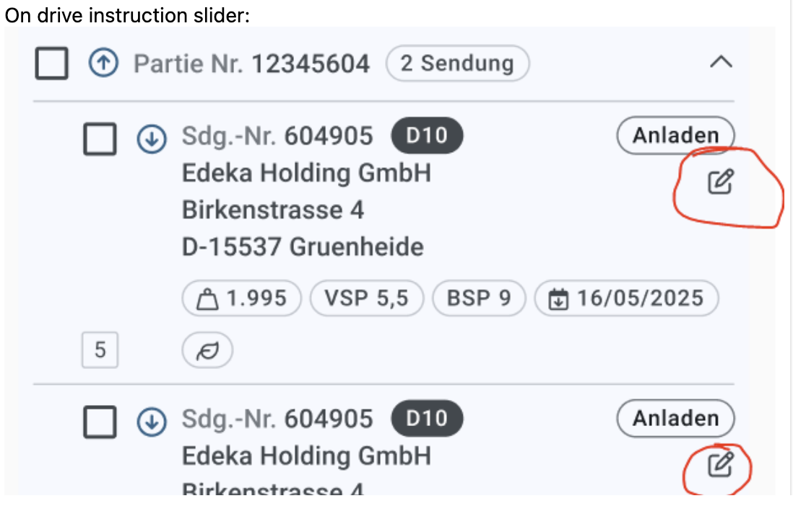

# User Story 103821: Display OMS_ID in Drive Instructions

**Date:** 2026-02-25
**Updated:** 2026-02-27
**Status:** Approved - Option 3A Selected
**Decision:** Team Refinement 2026-02-27
**Related User Story:** 103821

---

## Objective

Display the **OMS_ID** for OMS shipments in the New Dispo Frontend Drive Instructions drawer, next to the shipment number.

**User Input:**
> Quell_K für OMS-Sendungen kann jeder Kleinbuchstabe oder O sein.
> (Quell_K for OMS shipments can be any lowercase letter or O)



---

## Executive Summary

**OMS Shipment Identification (Database):**

- `SENDUNG.QUELL_K` = lowercase letter (a-z) OR uppercase 'O'
- `SEN_REF` table: `TYP='OMS_ID'` → `REF` contains OMS_ID value
- OMS_ID is **shipment-level data**, not TourPoint-level (one TourPoint can have multiple shipments with different OMS_IDs; legs are children of shipments)

**Implementation Options:**

**Option 1 (Batch Only):** ❌ Not viable - only covers initial migration, all new shipments via CDC would lack OMS_ID

**Option 2 (Store in CDC):** ⚠️ Too complex, not performant, expensive

- Store OMS_ID in `LegEntity` by querying during CDC event processing or publishing `sen_ref` in CDC
- 4+ layers affected, database schema change, CDC modifications, queries every shipment (even if never viewed)

**Option 3 (Query On-Demand):** ✅ **SELECTED** (Team Decision 2026-02-27)

- Query OMS_ID from `sen_ref` directly when Drive Instructions drawer opens
- 2 layers (Backend + Frontend), no TMS Database changes, no schema changes, no CDC changes

**Option 4 (Extend TourPoint Pipeline):**

- Modify existing Frontend → Backend → TMS Bridge → Database flow to include OMS_ID in leg collection
- 4 layers affected, modifies shared `V_DIS_TO_TOURPOINT` view, increased complexity

---

## Architecture Overview

### Data Pipelines

The system has **two independent pipelines** that create/update Legs in the Backend:

1. **CDC Pipeline (Real-time)**
   - Captures changes directly from `sendung` table via PostgreSQL logical replication
   - Data embedded in CDC event payload (does NOT query database during processing)
   - ❌ Does NOT use `v_dis_shipment_all` view
   - ❌ Does NOT capture `sen_ref` table (not published in CDC)

2. **Pickup Planning Pipeline (One-Time Migration)**
   - GraphQL query to TMS Bridge → `v_dis_shipment_all` view
   - Triggered by POST /Initialize (one-time or rare re-initialization)
   - ✅ Uses `v_dis_shipment_all` view
   - Bulk loads unplanned shipments (initial data migration)

**Reference:** See [Shipment Data Flow Architecture](../../08_Documentation/2026-02-26_leg-lot-creation-table-sendung/shipment-data-flow-architecture.md) for complete details.

### Key Data Entities

**TMS Database (AlloyDB):**

**Shipment Level:**

- `SENDUNG` - Main shipment table with `SENDUNG_TIX` (ID), `SENDUNG_N` (Number), `QUELL_K` (Source Key)
- `SEN_REF` - References table: `TYP='OMS_ID'` → `REF` (the OMS ID value)
- `v_dis_shipment_all` - View used by Pickup Planning Pipeline
- **Note:** Legs are children of shipments; OMS_ID is at the shipment level

**TourPoint Level:**

- `RES_HST` - TourPoint table (stops on a tour)
- `RES_HST_ZUS` - TourPoint assignments (links TourPoints to Shipments)
- `V_DIS_TO_TOURPOINT` - View used by Drive Instructions (aggregates TourPoints, used by TMS Bridge GraphQL)

**Backend Database:**

- `LegEntity` - Represents a leg (child of shipment), currently has:
  - `ShipmentId` (long) - references TMS `SENDUNG.SENDUNG_TIX`
  - `ShipmentNumber` (long?) - the `SENDUNG.SENDUNG_N`
  - **Note:** OMS_ID not stored here (OMS_ID is shipment-level data in TMS)

**Data Hierarchy - Drive Instructions Context:**

- **Tour** → has multiple **TourPoints** (stops)
- **TourPoint** → has multiple **Shipments** (deliveries/pickups at that stop)
- **Shipment** → has **OMS_ID** (for OMS shipments only) and has **Legs** as children
- **Leg** → child record of a shipment

**Critical Constraint:** OMS_ID is a **shipment-level property**, not a TourPoint-level property. The Drive Instructions drawer loads data through TourPoints (aggregated view), but OMS_ID must be displayed at the shipment/leg level within each TourPoint. Legs reference their parent shipment via `ShipmentId`, which is used to retrieve the shipment's OMS_ID.

### OMS Shipment Identification

**Quell_K (Source Key):**

- Any lowercase letter (a-z), OR
- Uppercase 'O'

**Sendungsart (Shipment Type):**

- 'A' (Avis/Notification) - used in `v_dis_shipment_all`
- 'N' (Normal shipment)
- 'T' (Grobavis/Rough notification)

---

## Implementation Challenges

### Key Architectural Constraints

**Data Storage vs. On-Demand Query:**

- OMS_ID could be stored in `LegEntity` or queried when needed
- Storing requires capturing during leg creation via both pipelines
- Querying requires access to `sen_ref` table at runtime

**Two-Pipeline Architecture:**

- CDC events contain only `sendung` table data
- `sen_ref` table is not published in CDC
- Batch pipeline runs only once (initial migration)
- All subsequent shipments enter via CDC only

**Impact on Implementation Scope:**

- Storing OMS_ID requires modifying CDC event handling
- Querying OMS_ID avoids CDC changes but adds runtime queries

---

## Implementation Options

### ❌ OPTION 1: Store During Batch Migration Only (NOT VIABLE)

**Approach:** Add OMS_ID to Pickup Planning Pipeline only.

**Scope:**

1. Add OMS_ID to `v_dis_shipment_all` view (LEFT JOIN to `sen_ref`)
2. Add OMS_ID to TMS Bridge GraphQL schema
3. Add OMS_ID to Backend `LegEntity` and DTOs
4. Display OMS_ID in Frontend
5. **Do NOT modify CDC Pipeline**

**Behavior:**

- ✅ Legs created during initial migration have OMS_ID
- ❌ **All subsequent shipments via CDC have NULL OMS_ID forever**
- ⚠️ Batch pipeline is a one-time migration, NOT recurring

**Why this doesn't work:**

The batch pipeline only runs once (or very rarely for re-initialization). After that, **ALL new shipments enter the system via CDC only**. This means:

- Existing shipments at migration time: ✅ Have OMS_ID
- New shipments after migration: ❌ NO OMS_ID forever

**Verdict:** ❌ Not viable for production use.

---

### OPTION 2: Real-time OMS_ID via CDC (STORE IT)

**Approach:** Modify both pipelines to capture and store OMS_ID.

Since the batch pipeline only runs once and all subsequent shipments come via CDC, we **must** add OMS_ID to the CDC path.

**Sub-options:**

#### 2A: Query OMS_ID During CDC Event Processing

**Implementation:**

- When `NewShipmentCreatedEventHandler` processes a `sendung` event, make additional query to TMS Bridge GraphQL or directly to `sen_ref` table
- Lookup OMS_ID using `shipmentId` → `sen_ref` where `TYP='OMS_ID'`
- Store in `LegEntity.OmsId`

**Pros:**

- ✅ Relatively simple implementation
- ✅ No CDC reconfiguration needed
- ✅ Guaranteed fresh data
- ✅ No runtime queries when displaying

**Cons:**

- ⚠️ Additional query per CDC event (every shipment)
- ⚠️ Database schema change (add column to leg table)
- ⚠️ Query happens even if user never views Drive Instructions

#### 2B: Publish `sen_ref` Table in CDC

**Implementation:**

- Add `sen_ref` to CDC publication configuration
- Create `SenRefChangedEventHandler` to process SEN_REF events
- Correlate SEN_REF events (where `TYP='OMS_ID'`) with existing Legs
- Update `LegEntity.OmsId` when matching record found

**Pros:**

- ✅ No additional queries
- ✅ Event-driven, consistent with architecture

**Cons:**

- ⚠️ CDC reconfiguration required
- ⚠️ Complex event correlation logic
- ⚠️ Database schema change

---

### ✅ OPTION 3: Query OMS_ID On-Demand (SIMPLEST)

**Approach:** Don't store OMS_ID. Query it only when needed.

**Sub-options:**

#### 3A: Query When Drive Instructions Drawer Opens

**Implementation:**

- Backend: When `GetDriveInstructionsQueryHandler` builds the response, query OMS_ID for each leg
- Query `sen_ref` table for all shipment IDs in the response: `WHERE sen_tix IN (...) AND typ = 'OMS_ID'`
- Include OMS_ID in `DriveInstructionsLegCardDto`
- Frontend displays it

**Pros:**

- ✅ **No database schema changes** (no column in leg table)
- ✅ **No CDC handler changes**
- ✅ **No TMS Database changes** (queries `sen_ref` directly, no DIS wrapper needed)
- ✅ **Simplest implementation** - Backend query logic + Frontend display (2 layers only)
- ✅ Only queries when actually needed (user opens drawer)
- ✅ Always fresh data from source of truth

**Cons:**

- ⚠️ Additional query every time Drive Instructions drawer opens
- ⚠️ Slight latency when opening drawer (batch query for all legs in drawer)

**Performance:** Single batch query for all legs in a drawer (typically 10-50 shipments) - efficient with proper index on `sen_ref(sen_tix, typ)`.

#### 3B: Query When User Clicks OMS Link

**Implementation:**

- Frontend: Display a clickable OMS icon/link next to shipment number
- On click: Backend endpoint `/api/shipments/{shipmentId}/oms-id` queries `sen_ref` and returns OMS_ID
- Frontend uses OMS_ID to construct OMS system URL and navigates

**Pros:**

- ✅ **No database schema changes**
- ✅ **No CDC handler changes**
- ✅ **Minimal implementation** - just add one endpoint
- ✅ Only queries if user actually clicks (rare action)
- ✅ Always fresh data

**Cons:**

- ⚠️ User must wait for query when clicking link
- ⚠️ Slightly worse UX (not visible until click)
- ⚠️ Additional HTTP request on every click

---

### OPTION 4: Extend Existing TourPoint Pipeline

**Approach:** Modify the existing Drive Instructions data flow (Frontend → Backend → TMS Bridge → Database) to include OMS_ID.

**Architectural Challenge:**

The Drive Instructions drawer loads data through **TourPoints**, not Shipments directly:

- **TourPoint** = One stop on a tour (aggregated, from `RES_HST` table)
- **Shipment** = Individual shipment assigned to a TourPoint (from `SENDUNG` via `RES_HST_ZUS`)
- **Leg** = Child record of a Shipment (references parent via `ShipmentId`)
- **OMS_ID** = Property of Shipments, NOT the TourPoint itself (retrieved via the leg's shipment ID reference)

**Current Data Flow:**

1. Frontend → `GET /api/pickup-drive-instructions?transportOrderId={id}`
2. Backend → `GetDriveInstructionsQueryHandler`
3. TMS Bridge → GraphQL query to `TourpointEntity`
4. Database → `V_DIS_TO_TOURPOINT` view

**The Problem:**

`V_DIS_TO_TOURPOINT` uses `GROUP BY` aggregation (line 101) to roll up TourPoint-level data (shipmentamount, weight, pallets, etc.). However:

- One TourPoint can have **multiple Shipments**
- Each Shipment has its own OMS_ID (shipments have legs as children)
- OMS_ID cannot be aggregated - it's a shipment-level property

**Implementation:**

**Option 4A: Add Shipment/Leg Collection to TourPoint Response**

Restructure the response to include shipment-level details (with legs) within each TourPoint:

1. **Database:** Create new view or query that returns TourPoint → Shipment → Leg relationships with OMS_ID
   - Either: Modify `V_DIS_TO_TOURPOINT` to include shipment/leg array
   - Or: Create separate `V_DIS_TOURPOINT_SHIPMENTS` view
   - Join to `SEN_REF` to get OMS_ID per shipment

2. **TMS Bridge:** Extend `TourpointEntity` to include `Shipments[]` collection
   - Add `ShipmentDto` with `ShipmentId`, `ShipmentNumber`, `OmsId`, `Legs[]`

3. **Backend:** Map shipment data from TMS Bridge to `DriveInstructionsLegCardDto`
   - Already builds leg cards, would need to populate OMS_ID from shipment data within TourPoint

4. **Frontend:** Display OMS_ID in leg cards (uses leg's shipment ID to retrieve parent shipment's OMS_ID)

**Option 4B: Return TourPoint-Shipment-Leg Pairs (No Aggregation)**

Avoid aggregation, return flat structure of TourPoint-Shipment-Leg tuples:

1. **Database:** Create view that returns one row per TourPoint-Shipment-Leg combination
   - Join `RES_HST` → `RES_HST_ZUS` → `SENDUNG` → `SEN_REF`
   - Include OMS_ID from shipment in each row

2. **TMS Bridge:** Query returns multiple rows per TourPoint
   - Client-side grouping in Backend

3. **Backend:** Group by TourPoint and Shipment, build leg cards with shipment's OMS_ID

4. **Frontend:** Display (same as Option 4A)

**Pros:**

- ✅ Uses existing data pipeline (Frontend → Backend → TMS Bridge → Database)
- ✅ OMS_ID flows through the system naturally
- ✅ All shipment-level data (including OMS_ID) available in one query

**Cons:**

- ⚠️ **4 layers affected:** Database view + TMS Bridge + Backend + Frontend
- ⚠️ Modifies shared `V_DIS_TO_TOURPOINT` view (affects other consumers) OR requires new view
- ⚠️ TMS Bridge schema changes (add shipment/leg collection to TourpointEntity)
- ⚠️ Backend mapping complexity (handle shipment/leg hierarchies from TourPoint)
- ⚠️ More complex than querying on-demand

**Verdict:** ⚠️ Viable but significantly more complex than Option 3A. Only justified if other shipment-level data is needed in the future.

---

## ✅ Approved Decision: Option 3A (Query On-Demand)

**Team Decision:** Selected in Team Refinement on 2026-02-27

**Rationale:**

- **Simplest implementation** - no schema changes, no CDC changes, no TMS Database changes
- **2 layers only:** Backend query logic + Frontend display
- Queries `sen_ref` table directly (no DIS wrapper needed)
- Queries only when needed (drawer opens)
- Efficient batch query for all legs
- Always accurate (no stale data concerns)

---

## Implementation Plan: Option 3A

### Why Option 3A?

**Simplest approach** - query OMS_ID on-demand when Drive Instructions drawer opens.

**Key advantages:**

1. ✅ **No database schema changes** - no new column in leg table, no migration
2. ✅ **No CDC handler changes** - CDC pipeline remains untouched
3. ✅ **No TMS Database changes** - queries `sen_ref` directly, no DIS wrapper needed
4. ✅ **Minimal scope** - Backend query logic + Frontend display (2 layers only)
5. ✅ **Always accurate** - reads from source of truth (sen_ref)
6. ✅ **Efficient** - single batch query for all legs when drawer opens
7. ✅ **Only queries when needed** - no wasted queries for shipments user never views

**Performance:** With proper index on `sen_ref(sen_tix, typ)`, batch query for 10-50 shipments in a drawer is very fast (sub-millisecond per lookup).

### Implementation Strategy

**Layers requiring changes (2 layers):**

- **Backend:** Add OMS_ID query in `GetDriveInstructionsQueryHandler` (queries `sen_ref` directly)
- **Frontend:** Display OMS_ID in UI

**Layers that DON'T need changes:**

- ⏭️ TMS Database (no view changes, no DIS wrapper - queries `sen_ref` directly)
- ⏭️ TMS Bridge GraphQL (no schema changes needed)
- ⏭️ CDC event handlers (no changes needed)
- ⏭️ Backend database schema (no migrations needed)

---

## Comparison: All Options

| Aspect | Option 1 (Batch Only) | Option 2A (Store in CDC) | Option 3A (On-Demand) | Option 4 (Extend Pipeline) |
|--------|----------------------|--------------------------|----------------------|---------------------------|
| **Viability** | ❌ Not viable | ⚠️ Viable but not recommended | ✅ Viable | ✅ Viable |
| **Scope** | 4 layers | 4 layers + CDC + migration | 2 layers (Backend + Frontend) | 4 layers** |
| **Database Schema Change** | ✅ Add column to leg | ✅ Add column to leg | ❌ None | ⚠️ View modification |
| **TMS Bridge Changes** | ✅ GraphQL schema | ✅ GraphQL schema | ❌ None | ✅ GraphQL + Entity |
| **CDC Handler Changes** | ❌ None | ✅ Required | ❌ None | ❌ None |
| **Query Frequency** | Never after migration | Every shipment (CDC) | Every drawer open | Never (in pipeline) |
| **Performance Impact** | ❌ N/A | ⚠️ High (queries all shipments) | ✅ Low (queries on user action) | ✅ Low (in pipeline) |
| **Cost** | ❌ N/A | ⚠️ High (every shipment) | ✅ Low (only when viewed) | ✅ Medium (pipeline load) |
| **Data Freshness** | Stale after migration | Fresh at creation | Always current | Current at load |
| **Complexity** | Low | ⚠️ High | ✅ Very Low | Medium-High |
| **Works for new shipments?** | ❌ No | ✅ Yes | ✅ Yes | ✅ Yes |
| **Pipeline Integration** | Batch only | CDC + Batch | Separate query | Existing TourPoint flow |
| **Impact on Shared Views** | ❌ Low | ❌ Low | ❌ None (direct `sen_ref` query) | ⚠️ Modifies V_DIS_TO_TOURPOINT |

**Option 4 requires 4 layers: TMS Database view + TMS Bridge entity/GraphQL + Backend mapping + Frontend display. Also impacts shared view used by other consumers.

---

## Backup: Detailed Implementation Guide

### Implementation Layers

#### Backend: Query OMS_ID On-Demand

**File:** `CALConsult.Disposition.API/Application/Features/PickupDriveInstructions/Requests/GetDriveInstructions/GetDriveInstructionsQueryHandler.cs`

**Current flow:**

1. Queries `LotAssignments` from Backend database
2. Reads `LegEntity` data (shipmentId, shipmentNumber, etc.)
3. Builds `DriveInstructionsLegCardDto` array
4. Returns to Frontend

**Add OMS_ID query:**

```csharp
public async Task<List<DriveInstructionsTourPointCardDto>> Handle(...)
{
    // ... existing code to get lot assignments and legs ...

    // Extract all shipment IDs from legs
    var shipmentIds = legs.Select(l => l.ShipmentId).Distinct().ToList();

    // Batch query OMS_IDs from TMS database
    var omsIds = await GetOmsIdsForShipments(shipmentIds);

    // Build DTOs with OMS_IDs
    var legDtos = legs.Select(leg => new DriveInstructionsLegCardDto
    {
        ShipmentId = leg.ShipmentId,
        ShipmentNumber = leg.ShipmentNumber,
        OmsId = omsIds.GetValueOrDefault(leg.ShipmentId),  // ADD THIS
        // ... other fields
    });

    return tourPoints;
}

private async Task<Dictionary<long, long?>> GetOmsIdsForShipments(List<long> shipmentIds)
{
    // Option A: Query via TMS Bridge GraphQL
    // Option B: Direct database query to TMS sen_ref table via connection

    // Example SQL (if using direct query):
    // SELECT sen_tix, ref::numeric(22) as oms_id
    // FROM sen_ref
    // WHERE sen_tix = ANY(@shipmentIds) AND typ = 'OMS_ID'

    // Return dictionary: shipmentId -> omsId (null if not found)
}
```

**Files to modify:**

- `GetDriveInstructionsQueryHandler.cs` - Add OMS_ID query logic
- `DriveInstructionsLegCardDto.cs` - Add `OmsId` property

**No database migration needed** - not storing OMS_ID in leg table.

#### Frontend: Display OMS_ID

**Files:**

- `apps/nagel-cal-disposition/src/models/planningPageTypes.ts`
- `apps/nagel-cal-disposition/src/app/components/tour-point/leg-tour-point/leg-tour-point.component.html`

Add property to interfaces:

```typescript
export interface LegResponseStructure {
  shipmentNumber: number;
  omsId?: number | null;  // ADD THIS
  // ...
}

export interface LegTourPointConfig {
  legId: string;
  shipmentNumber: number;
  omsId?: number | null;  // ADD THIS
  // ...
}
```

Update component template:

```html
<div class="flex justify-start items-center">
    <span class="legNumberLabel grey-label" i18n>Shipment number: </span>
    <span class="value ml-1">{{legTourPoint.shipmentNumber}}</span>

    @if(legTourPoint.omsId) {
        <span class="label grey-label ml-3" i18n>OMS ID: </span>
        <span class="value ml-1">{{legTourPoint.omsId}}</span>
    }

    <app-chip ... />
</div>
```

---

### Implementation Checklist (Option 3A)

#### Prerequisites

- [ ] Verify index exists on `sen_ref(sen_tix, typ)` for query performance
- [ ] Determine query method: TMS Bridge GraphQL vs direct TMS database access

#### Backend Implementation

- [ ] Add `OmsId` property to `DriveInstructionsLegCardDto`
- [ ] Create `GetOmsIdsForShipments()` helper method in `GetDriveInstructionsQueryHandler`
  - Implement batch query to `sen_ref` table
  - Return dictionary mapping shipmentId → omsId
- [ ] Update `Handle()` method to:
  - Extract shipment IDs from legs
  - Call `GetOmsIdsForShipments()`
  - Include OMS_ID in DTOs
- [ ] Test backend returns OMS_ID in `/api/pickup-drive-instructions` response

#### Frontend Implementation

- [ ] Add `omsId` property to `LegTourPointConfig` interface
- [ ] Update `leg-tour-point.component.html` to display OMS_ID
- [ ] Ensure null handling (don't display if OMS_ID is null)
- [ ] Test Drive Instructions drawer displays OMS_ID correctly

#### Testing

- [ ] **OMS Shipments:** Open drawer for OMS shipments, verify OMS_ID appears
- [ ] **Non-OMS Shipments:** Verify non-OMS shipments don't show OMS_ID
- [ ] **Performance:** Monitor query time when opening drawer (expect < 50ms for batch query)
- [ ] **Index Verification:** Run EXPLAIN on query to confirm index usage

#### Deployment

- [ ] Deploy Backend API (no database migration needed)
- [ ] Deploy Frontend

---

## Reference: How OMS_ID is Retrieved

### V_ESB_SENDUNG Pattern

**File:** `Code/tms-alloydb-schema/src/sql/view/V_ESB_SENDUNG.sql`

Proven production pattern for OMS_ID retrieval:

```sql
create or replace view V_ESB_SENDUNG as
  select s.SENDUNG_TIX     SEN_TIX,
         r.REF :: numeric(22) OMS_ID,
         s.VERKEHRSSTROM   VK_STROM
    from SENDUNG s
    left join SEN_REF r on (r.SEN_TIX = s.SENDUNG_TIX and r.TYP = 'OMS_ID')
   where s.SENDUNGSART in ('A','N','T')
     and (s.QUELL_K between 'a' and 'z' or s.QUELL_K = 'O');
```

**Key points:**

- Simple LEFT JOIN to `sen_ref`
- Filter on `typ = 'OMS_ID'`
- Cast `ref` to `numeric(22)` for type safety
- LEFT JOIN ensures NULL for non-OMS shipments

---

## Background Context

### OMS Integration

OMS shipments are integrated via ESB (Enterprise Service Bus). When traffic flow changes, TMS notifies OMS via trigger `TRAIU_SENDUNG_ESB`.

**File:** `Code/tms-alloydb-schema/src/sql/trigger/TRAIU_SENDUNG_ESB.sql`

```sql
elsif new.SENDUNGSART in ('A','N','T')
  and new.VERKEHRSSTROM <> coalesce(old.VERKEHRSSTROM,new.VERKEHRSSTROM)
  and (new.QUELL_K between 'a' and 'z' or new.QUELL_K = 'O')
then
  call TMS2ESB.PutToEntityChangedQueue(...);
end if;
```

OMS_ID identifies the shipment in the OMS system for synchronization.

### Related User Stories

- DEMPM-332: Avis-Handling: Übernahme aus OMS - Task 167434
- PBI-145369: DEMPM-332: Rückübertragung des Verkehrsstroms an OMS
- User Story 103821: Display OMS_ID in Frontend (current)

---

## Summary

**Objective:** Display OMS_ID in Drive Instructions drawer next to shipment number.

**Architecture:** Two independent pipelines - CDC (real-time, ongoing) and Pickup Planning (one-time migration).

**Critical Constraint:** Batch pipeline runs once. After that, ALL new shipments enter via CDC only.

**✅ Approved Solution:** **Option 3A** - Query OMS_ID on-demand when drawer opens (Team Decision 2026-02-27).

**Why Option 3A?**

- ✅ **Simplest implementation** - 2 layers only (Backend + Frontend)
- ✅ **No database schema changes** - no migration needed
- ✅ **No TMS Database changes** - queries `sen_ref` directly
- ✅ **No CDC changes** - CDC pipeline untouched
- ✅ **Always accurate** - reads from source of truth
- ✅ **Efficient** - single batch query for all legs in drawer

**Implementation Scope:**

1. **Backend:** Add OMS_ID batch query in `GetDriveInstructionsQueryHandler` (direct `sen_ref` query)
2. **Frontend:** Display OMS_ID in UI

**Performance:** With proper index on `sen_ref(sen_tix, typ)`, batch query is very fast (< 50ms for typical drawer with 10-50 shipments).

**Key Decision:** Don't store OMS_ID - query it when needed. Simpler and always accurate.
