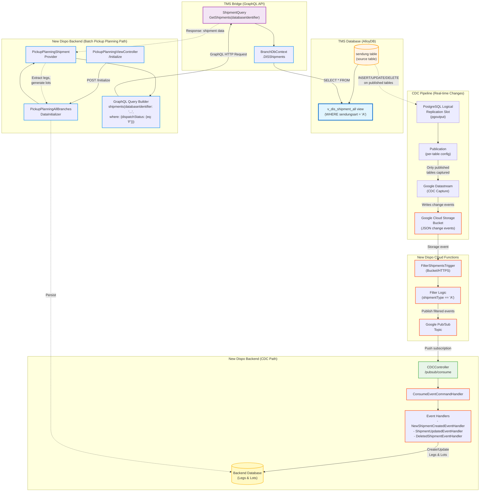

# Shipment Data Flow Architecture

**Date:** 2026-02-26
**Context:** User Story 103821 - OMS Shipment Analysis
**Focus:** Complete data flow from TMS Database to Backend, highlighting `v_dis_shipment_all` usage

---

## Overview

This document maps the complete architecture for shipment data flows in the New Dispo system, with special focus on how `v_dis_shipment_all` is used in different contexts.

There are **two independent data pipelines** that both read from the `sendung` table:

1. **CDC Pipeline (Real-time)** - Captures changes and publishes events
2. **Batch Pickup Planning Pipeline** - Queries unplanned shipments via GraphQL

---

## Complete Architecture Diagram



---

## Data Flow Paths

### Path 1: CDC Flow (Real-time) 🔴

**Purpose:** Capture and propagate shipment changes in real-time

**Flow:**
1. `sendung` table changes (INSERT/UPDATE/DELETE)
2. CDC mechanism captures **full row data** from the change
3. Changes written to Google Cloud Storage Bucket (JSON format with complete shipment data)
4. Cloud Functions (`FilterShipmentsTrigger`) triggered by bucket events
5. Filter shipments where `shipmentType == 'A'`
6. Publish filtered events to Google Pub/Sub (includes **full shipment data in payload**)
7. Pub/Sub pushes message to Backend CDC endpoint (`/pubsub/consume`)
8. `ConsumeEventCommandHandler` deserializes the Pub/Sub message:
   ```csharp
   // Extract JSON from Pub/Sub message
   var json = Encoding.UTF8.GetString(Convert.FromBase64String(request.Message.Message.Data));

   // Deserialize to GoogleRecordChangeDto
   GoogleRecordChangeDto eventDataChanges = JsonConvert.DeserializeObject<GoogleRecordChangeDto>(json);

   // Contains OldRecord and NewRecord with full shipment data in Payload
   GoogleBucketFileContentDto oldRecord = eventDataChanges.OldRecord;
   GoogleBucketFileContentDto newRecord = eventDataChanges.NewRecord;
   ```
9. Event handlers extract shipment data from the event payload:
   ```csharp
   // From BaseEventHandler.GetDbRecordFromBucketAsDto()
   var shipmentAsJson = JsonConvert.SerializeObject(record.Payload);
   GoogleBucketShipmentData shipment = JsonConvert.DeserializeObject<GoogleBucketShipmentData>(shipmentAsJson);
   ```
10. Event handlers process the embedded shipment data:
    - `NewShipmentCreatedEventHandler` - Creates new Legs & Lots
    - `ShipmentUpdatedEventHandler` - Updates existing Legs & Lots
    - `DeletedShipmentEventHandler` - Removes Legs & Lots
11. Changes persisted to Backend Database

**Key Characteristics:**
- ❌ **Does NOT use `v_dis_shipment_all` view**
- ❌ **Does NOT query the database** - shipment data is embedded in the event
- ✅ Reads raw data from CDC bucket
- ✅ Full shipment row data included in each event
- ✅ Real-time propagation
- ✅ Event-driven architecture
- ✅ Handles incremental changes

**Critical Detail: Shipment Data Source**

The event handlers **DO NOT query the database**. Instead, they consume the complete shipment data from the Pub/Sub message payload:

**Data Structure:**
```
Pub/Sub Message
└── Data (base64 encoded JSON)
    └── GoogleRecordChangeDto
        ├── OldRecord: GoogleBucketFileContentDto
        │   ├── Payload: GoogleBucketShipmentData (complete sendung row)
        │   │   ├── ShipmentId
        │   │   ├── ShipmentNumber
        │   │   ├── ShipmentType
        │   │   ├── ConsignorName
        │   │   ├── ... (all sendung columns)
        │   │   └── ⚠️ OmsId (MISSING - needs to be added to CDC)
        │   └── SourceMetadata (table, changeType, isDeleted)
        └── NewRecord: GoogleBucketFileContentDto
            └── (same structure as OldRecord)
```

**Code Reference:**
```csharp
// File: BaseEventHandler.cs:16-26
protected T GetDbRecordFromBucketAsDto<T>(GoogleBucketFileContentDto record) where T : class
{
    // Extracts the Payload object from the CDC event
    var shipmentAsJson = JsonConvert.SerializeObject(record.Payload);

    // Deserializes to GoogleBucketShipmentData with all sendung columns
    T shipmentFromGoogleBucket = JsonConvert.DeserializeObject<T>(shipmentAsJson);

    return shipmentFromGoogleBucket;
}
```

**Current State Analysis for OMS_ID:**
- ❓ Unknown: Does CDC capture process include data from `sen_ref` table?
- ❌ Confirmed: `GoogleBucketShipmentData` DTO does NOT have an `OmsId` property
- ❌ Result: OMS_ID is NOT flowing through CDC pipeline currently
- 📝 Note: CDC path does NOT use database views - data comes from CDC capture

**Visual: CDC Event Data Extraction**

```
┌─────────────────────────────────────────────────────────────────┐
│ Pub/Sub Message (Base64 JSON)                                  │
│ ┌─────────────────────────────────────────────────────────────┐ │
│ │ GoogleRecordChangeDto                                       │ │
│ │ ┌──────────────────────┐  ┌──────────────────────┐         │ │
│ │ │ OldRecord            │  │ NewRecord            │         │ │
│ │ │ ┌──────────────────┐ │  │ ┌──────────────────┐ │         │ │
│ │ │ │ SourceMetadata   │ │  │ │ SourceMetadata   │ │         │ │
│ │ │ │ - table          │ │  │ │ - table          │ │         │ │
│ │ │ │ - changeType     │ │  │ │ - changeType     │ │         │ │
│ │ │ │ - isDeleted      │ │  │ │ - isDeleted      │ │         │ │
│ │ │ └──────────────────┘ │  │ └──────────────────┘ │         │ │
│ │ │ ┌──────────────────┐ │  │ ┌──────────────────┐ │         │ │
│ │ │ │ Payload          │ │  │ │ Payload          │ │         │ │
│ │ │ │ ┌──────────────┐ │ │  │ │ ┌──────────────┐ │ │         │ │
│ │ │ │ │ Shipment     │ │ │  │ │ │ Shipment     │ │ │         │ │
│ │ │ │ │ Data:        │ │ │  │ │ │ Data:        │ │ │         │ │
│ │ │ │ │ - ShipmentId │ │ │  │ │ │ - ShipmentId │ │ │         │ │
│ │ │ │ │ - Company    │ │ │  │ │ │ - Company    │ │ │         │ │
│ │ │ │ │ - Branch     │ │ │  │ │ │ - Branch     │ │ │         │ │
│ │ │ │ │ - Type       │ │ │  │ │ │ - Type       │ │ │         │ │
│ │ │ │ │ - Status     │ │ │  │ │ │ - Status     │ │ │         │ │
│ │ │ │ │ - Weight     │ │ │  │ │ │ - Weight     │ │ │         │ │
│ │ │ │ │ - ...40+ flds│ │ │  │ │ │ - ...40+ flds│ │ │         │ │
│ │ │ │ │ ⚠️ OmsId??? │ │ │  │ │ │ ⚠️ OmsId??? │ │ │         │ │
│ │ │ │ └──────────────┘ │ │  │ │ └──────────────┘ │ │         │ │
│ │ │ └──────────────────┘ │  │ └──────────────────┘ │         │ │
│ │ └──────────────────────┘  └──────────────────────┘         │ │
│ └─────────────────────────────────────────────────────────────┘ │
└─────────────────────────────────────────────────────────────────┘
                              │
                              ▼
            ConsumeEventCommandHandler extracts
                              │
                              ▼
              Event Handlers process embedded data
                              │
                              ▼
                    Backend DB (Legs & Lots)
```

**Code Locations:**
- Cloud Functions: `Code/Nagel-GCP/CALConsult.Disposition.Functions/CALConsult.Disposition.Functions.FilterShipments.Bucket/Trigger/FilterShipmentsTrigger.cs`
- CDC Controller: `Code/Disposition-Backend/CALConsult.Disposition.API/Application/Features/CDC/CDCController.cs`
- Event Handlers: `Code/Disposition-Backend/CALConsult.Disposition.API/Application/Features/CDC/EventHandlers/`
- Data Extraction: `Code/Disposition-Backend/CALConsult.Disposition.API/Application/Features/CDC/EventHandlers/BaseEventHandler.cs:16`

---

### Path 2: Pickup Planning Initialization (Batch) 🔵

**Purpose:** Bulk load unplanned shipments for pickup planning

**Flow:**
1. User/System triggers initialization via POST `/Initialize` endpoint
2. Backend calls `PickupPlanningAllBranchesDataInitializer`
3. For each branch, `PickupPlanningShipmentProvider` builds GraphQL query:
   ```graphql
   query {
     shipments(
       databaseIdentifier: "BRANCH_KEY",
       where: { dispatchStatus: { eq: "F" } }
     ) {
       shipmentId
       shipmentNumber
       consignorName
       # ... more fields
     }
   }
   ```
4. GraphQL request sent to TMS Bridge API
5. TMS Bridge `ShipmentQuery.GetShipments()` processes query
6. `BranchDbContext.DISShipments` queries **`v_dis_shipment_all` view**
7. View returns filtered shipments (`WHERE sendungsart = 'A'`)
8. GraphQL applies additional filters (`dispatchStatus = 'F'`)
9. Response returned to Backend
10. Backend extracts Legs from shipments
11. Backend generates Lots based on routing rules
12. Legs & Lots persisted to Backend Database

**Key Characteristics:**
- ✅ **Uses `v_dis_shipment_all` view**
- ✅ Batch processing
- ✅ Filters for unplanned shipments (`dispatchStatus = 'F'`)
- ✅ One-time or periodic execution
- ✅ Generates complete Lot structure

**Code Locations:**
- Backend Controller: `Code/Disposition-Backend/CALConsult.Disposition.API/Application/Features/PickupPlanningView/PickupPlanningViewController.cs:59`
- Shipment Provider: `Code/Disposition-Backend/CALConsult.Disposition.API/Application/_Shared/Services/ShipmentProvider/PickupPlanningShipmentProvider.cs:39-47`
- TMS Bridge Query: `Code/Disposition-Abstraction-Layer/CALConsult.TMSBridge.API/GraphQL/Queries/ShipmentQuery/ShipmentQuery.cs:15`
- DB Context: `Code/Disposition-Abstraction-Layer/CALConsult.TMSBridge.API/Data/DbContexts/BranchDbContext.cs:137-139`

---

## CDC Replication Configuration Details

**Location:** `Code/tms-alloydb-schema/src/sql/scripts/misc/datastream_setup.sql`

**Technology Stack:**
- PostgreSQL Logical Replication (native feature)
- Plugin: `pgoutput` (standard PostgreSQL logical decoding plugin)
- Google Datastream (captures from replication slot)

**How It Works:**

```sql
-- 1. Create replication slot
PG_CREATE_LOGICAL_REPLICATION_SLOT('slot_name', 'pgoutput');

-- 2. Create publication for specific table
CREATE PUBLICATION publication_name FOR TABLE tablename;
```

**Key Characteristics:**
- ✅ Replication slot captures logical changes (INSERT/UPDATE/DELETE)
- ✅ Publications define **which tables** are replicated
- ✅ Per-table configuration (not database-wide)
- ✅ Configuration is external to application code
- ⚠️ Script is parameterized - actual table names configured at runtime

**What Gets Captured:**
- Only tables explicitly added to a publication
- Full row data for INSERT operations (all columns)
- Old and new row data for UPDATE operations
- Old row data for DELETE operations
- Metadata: table name, change type, timestamp

**What Does NOT Get Captured:**
- Tables not in any publication
- Related table data (e.g., if only `sendung` published, `sen_ref` NOT captured)
- JOIN results or computed values
- Data from views

**Critical Unknown:**
- ❓ Which tables are currently published?
  - Query needed: `SELECT * FROM pg_publication_tables;`
- ❓ Is `sendung` table published?
- ❓ Is `sen_ref` table published?

**Implications for OMS_ID:**
- If only `sendung` is published → OMS_ID from `sen_ref` NOT in CDC events
- If `sen_ref` is also published → Two separate change events (one for `sendung`, one for `sen_ref`)
- To get OMS_ID in CDC: Either publish `sen_ref` OR modify what `sendung` publication captures

---

## `v_dis_shipment_all` View Details

**Location:** `Code/tms-alloydb-schema/src/sql/view/V_DIS_SHIPMENT_ALL.sql`

**Definition:**
```sql
CREATE OR REPLACE VIEW v_dis_shipment_all AS
SELECT
    sendung_tix as shipmentid,
    firma as company,
    niederlassung as branch,
    sendungsart as shipmenttype,
    status_dis as dispatchstatus,
    sendung_n as shipmentnumber,
    -- ... many more fields ...
FROM sendung s
WHERE sendungsart = 'A';  -- Only type 'A' shipments
```

**Purpose:**
- Exposes shipment data specifically for disposition/pickup planning
- Filters only type 'A' shipments (Abholsendung/Pickup shipments)
- Provides standardized column naming for GraphQL API

**Mapped to Entity:**
- Entity: `DISShipmentEntity`
- Mapping: `Code/Disposition-Abstraction-Layer/CALConsult.TMSBridge.API/Data/DbContexts/BranchDbContext.cs:137-139`
  ```csharp
  modelBuilder.Entity<DISShipmentEntity>()
      .ToView("v_dis_shipment_all")
      .HasKey(to => to.ShipmentId);
  ```

**Used By:**
- TMS Bridge GraphQL API (`GetShipments` query)
- Called by Backend Pickup Planning initialization

**NOT Used By:**
- CDC pipeline (uses raw bucket data instead)
- Real-time event handlers

---

## Components Using `shipments(databaseIdentifier:...)` GraphQL Query

### TMS Bridge (Defines the Query)
- **File:** `ShipmentQuery.cs:15`
- **Method:** `GetShipments(string databaseIdentifier, ...)`
- **Returns:** `IQueryable<DISShipmentEntity>`
- **Data Source:** `v_dis_shipment_all` view

### New Dispo Backend (Consumes the Query)

#### 1. PickupPlanningShipmentProvider
- **File:** `PickupPlanningShipmentProvider.cs`
- **Methods:**
  - `GetAllUnplanned(string branchKey)` - Line 39-47
  - `GetSingleShipment(string branchKey, long shipmentId)` - Line 75-83
- **Purpose:** Builds and executes GraphQL queries for shipments

#### 2. PickupPlanningAllBranchesShipmentProvider
- **File:** `PickupPlanningAllBranchesShipmentProvider.cs:55`
- **Purpose:** Retrieves shipments for multiple branches in parallel
- **Calls:** `_shipmentProvider.GetAllUnplanned(key)`

#### 3. PickupPlanningAllBranchesDataInitializer
- **File:** `PickupPlanningAllBranchesDataInitializer.cs:203`
- **Purpose:** Orchestrates batch initialization of pickup planning data
- **Calls:** `_allBranchesShipmentProvider.Get(branchKeys)`

#### 4. InitializePickupPlanningDataCommandHandler
- **File:** `InitializePickupPlanningDataCommandHandler.cs:16`
- **Purpose:** Command handler for initialization request
- **Calls:** `_dataInitializer.Initialize()`

#### 5. PickupPlanningViewController
- **File:** `PickupPlanningViewController.cs:59`
- **Endpoint:** `POST /Initialize`
- **Purpose:** HTTP endpoint to trigger initialization
- **Calls:** `_mediator.Send(new InitializePickupPlanningDataCommand())`

---

## Key Insights for OMS_ID Implementation

### For CDC Path (Real-time) - Current State Analysis

**CDC Configuration Discovery:**
- **Technology**: PostgreSQL Logical Replication using `pgoutput` plugin
- **Configuration File**: `Code/tms-alloydb-schema/src/sql/scripts/misc/datastream_setup.sql`
- **Setup Mechanism**:
  - Creates replication slot: `PG_CREATE_LOGICAL_REPLICATION_SLOT(slot_name, 'pgoutput')`
  - Creates publication: `CREATE PUBLICATION publication_name FOR TABLE tablename`
  - Script is parameterized (`:slot_name`, `:publication`, `:tablename`)
  - Publications are configured **per-table basis**
- **Key Finding**: CDC replication is **externally configured** - not automatic for all tables
- **Implication**: Only tables explicitly added to a publication are captured by CDC

**Current State Analysis:**
- **Data Source**: CDC captures data from tables configured in publications
- **Current Scope**:
  - ❓ Unknown which tables are currently published for replication
  - ❓ Unknown if `sendung` table is published
  - ❓ Unknown if `sen_ref` table is published
  - 📝 Publication configuration is external to the codebase (configured in database)
- **Bucket Data**: Contains `GoogleBucketShipmentData` with ~40+ fields
- **OMS_ID Status**:
  - ❓ Unknown if CDC currently captures data from `sen_ref` table (depends on publication)
  - ❓ Unknown if OMS_ID is in bucket data
  - ❌ Confirmed: `GoogleBucketShipmentData` DTO does NOT have an `OmsId` property (checked in both Backend and Cloud Functions)
- **Event Handlers**: Currently extract shipment data from `Payload` - no database queries
- **View Dependency**: ❌ Does NOT use `v_dis_shipment_all` view

**Critical Gap in Analysis:**
- Cannot determine from codebase alone which tables are currently published for CDC replication
- Need to query database: `SELECT * FROM pg_publication_tables;` to see configured publications

### For Pickup Planning Path (Batch) - Current State Analysis
- **Data Source**: GraphQL query to TMS Bridge → `v_dis_shipment_all` view
- **Current Scope**: View selects from `sendung` table WHERE `sendungsart = 'A'`
- **OMS_ID Status**:
  - ❌ `v_dis_shipment_all` view does NOT join to `sen_ref` table
  - ❌ `DISShipmentEntity` does NOT have an `OmsId` property
  - ❌ `PickupPlanningShipmentDto` does NOT have an `OmsId` property
  - ❌ TMS Bridge GraphQL schema does NOT expose OMS_ID
- **Query Pattern**: Backend builds GraphQL query with filters (e.g., `dispatchStatus = 'F'`)
- **View Dependency**: ✅ DOES use `v_dis_shipment_all` view

### Performance Observations
- Both paths ultimately read from `sendung` table (different mechanisms)
- CDC path: Data embedded in events (no query overhead at Backend)
- Pickup Planning path: Queries view on-demand (query performance matters)
- Unknown: Current `sen_ref` table indexes and query performance
- Unknown: Impact of potential `sen_ref` JOIN on view performance

---

## Related Files

### Database Schema & CDC Configuration
- **CDC Setup**: `Code/tms-alloydb-schema/src/sql/scripts/misc/datastream_setup.sql` (replication slot & publication config)
- **Views**: `Code/tms-alloydb-schema/src/sql/view/V_DIS_SHIPMENT_ALL.sql`
- **Tables**:
  - `Code/tms-alloydb-schema/src/sql/table/SENDUNG.sql`
  - `Code/tms-alloydb-schema/src/sql/table/SEN_REF.sql`

### TMS Bridge
- `Code/Disposition-Abstraction-Layer/CALConsult.TMSBridge.API/GraphQL/Queries/ShipmentQuery/ShipmentQuery.cs`
- `Code/Disposition-Abstraction-Layer/CALConsult.TMSBridge.API/Data/DbContexts/BranchDbContext.cs`
- `Code/Disposition-Abstraction-Layer/CALConsult.TMSBridge.API/Data/Entities/Shipment/DISShipmentEntity.cs`

### Backend - Pickup Planning
- `Code/Disposition-Backend/CALConsult.Disposition.API/Application/Features/PickupPlanningView/PickupPlanningViewController.cs`
- `Code/Disposition-Backend/CALConsult.Disposition.API/Application/_Shared/Services/ShipmentProvider/PickupPlanningShipmentProvider.cs`
- `Code/Disposition-Backend/CALConsult.Disposition.API/Shared/GraphQL/Dtos/Queries/shipment/PickupPlanningShipmentDto.cs`

### Backend - CDC
- `Code/Disposition-Backend/CALConsult.Disposition.API/Application/Features/CDC/CDCController.cs`
- `Code/Disposition-Backend/CALConsult.Disposition.API/Application/Features/CDC/EventHandlers/NewShipmentCreated/NewShipmentCreatedEventHandler.cs`
- `Code/Disposition-Backend/CALConsult.Disposition.API/Infrastructure/GooglePubSub/Dtos/GoogleBucketShipmentData.cs`

### Cloud Functions
- `Code/Nagel-GCP/CALConsult.Disposition.Functions/CALConsult.Disposition.Functions.FilterShipments.Bucket/Trigger/FilterShipmentsTrigger.cs`
- `Code/Nagel-GCP/CALConsult.Disposition.Functions/CALConsult.Disposition.Functions.FilterShipments.Bucket/Dtos/GoogleBucketShipmentData.cs`

---

## Summary: Two Independent Data Pipelines

The New Dispo system has **two completely independent pipelines** for shipment data:

### Comparison Table

| Aspect | CDC Pipeline (Real-time) | Pickup Planning Pipeline (Batch) |
|--------|--------------------------|-----------------------------------|
| **Trigger** | Database change events | Manual POST /Initialize |
| **Data Source** | CDC event payload (embedded data) | GraphQL query to TMS Bridge |
| **Uses `v_dis_shipment_all`?** | ❌ No | ✅ Yes |
| **Queries Database?** | ❌ No - data in event | ✅ Yes - via GraphQL |
| **Data Freshness** | Real-time (seconds) | On-demand batch |
| **Processing Model** | Event-driven, incremental | Query-based, bulk loading |
| **Complete Row Data?** | ✅ Yes - in Payload | ✅ Yes - from query |
| **Target** | Creates/Updates Legs & Lots | Creates initial Legs & Lots |

### Critical Insight: Where Does Shipment Data Come From?

**CDC Pipeline:**
```
sendung table change
  → CDC captures FULL ROW
    → Bucket stores complete data
      → Cloud Functions passes through
        → Pub/Sub includes FULL DATA in message
          → Backend extracts from Payload
            ⚠️ NO DATABASE QUERY
```

**Pickup Planning Pipeline:**
```
POST /Initialize
  → Backend builds GraphQL query
    → TMS Bridge receives query
      → Queries v_dis_shipment_all view
        → View queries sendung table
          → Returns filtered data
            ⚠️ QUERIES DATABASE
```

### Analysis: OMS_ID Gap in Both Pipelines

**Observation**: OMS_ID is stored in `sen_ref` table (TMS Database) but is **not currently flowing** through either pipeline.

**CDC Pipeline - Current OMS_ID State:**
- CDC captures data: ❓ Unknown scope - only `sendung` or also related tables like `sen_ref`?
- Bucket data: ❓ Unknown if OMS_ID is present in bucket JSON
- `GoogleBucketShipmentData` DTO: ❌ No `OmsId` property exists
- Event handlers: Extract only what's in `GoogleBucketShipmentData` DTO
- Result: ❌ OMS_ID does NOT flow to Backend via CDC

**Pickup Planning Pipeline - Current OMS_ID State:**
- `v_dis_shipment_all` view: ❌ Does NOT join to `sen_ref` table
- `DISShipmentEntity`: ❌ No `OmsId` property exists
- GraphQL schema: ❌ Does NOT expose OMS_ID field
- `PickupPlanningShipmentDto`: ❌ No `OmsId` property exists
- Result: ❌ OMS_ID does NOT flow to Backend via Pickup Planning

**Backend Database - Current OMS_ID State:**
- `LegEntity`: ❓ Need to verify if `OmsId` property exists
- Both pipelines populate `LegEntity`
- Both pipelines would need to provide OMS_ID data

**Gap Summary**: OMS_ID exists in TMS (`sen_ref` table) but is not accessible through either data pipeline to the Backend.
