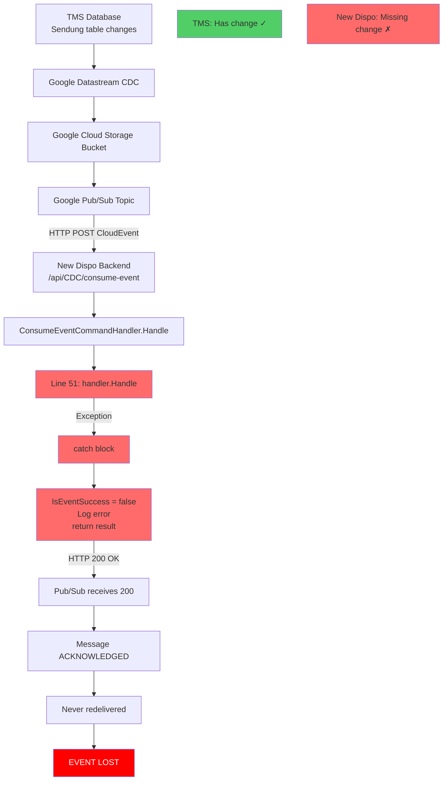
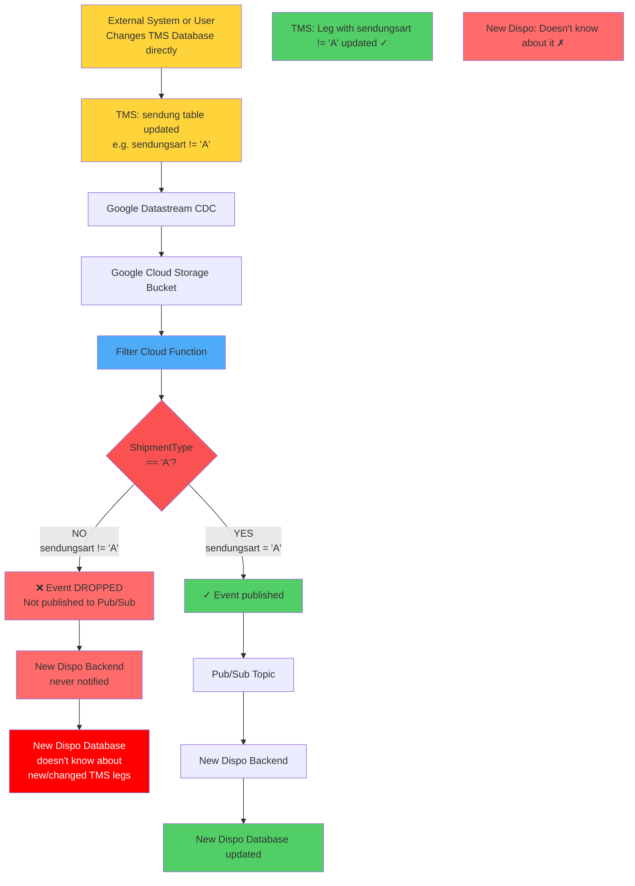
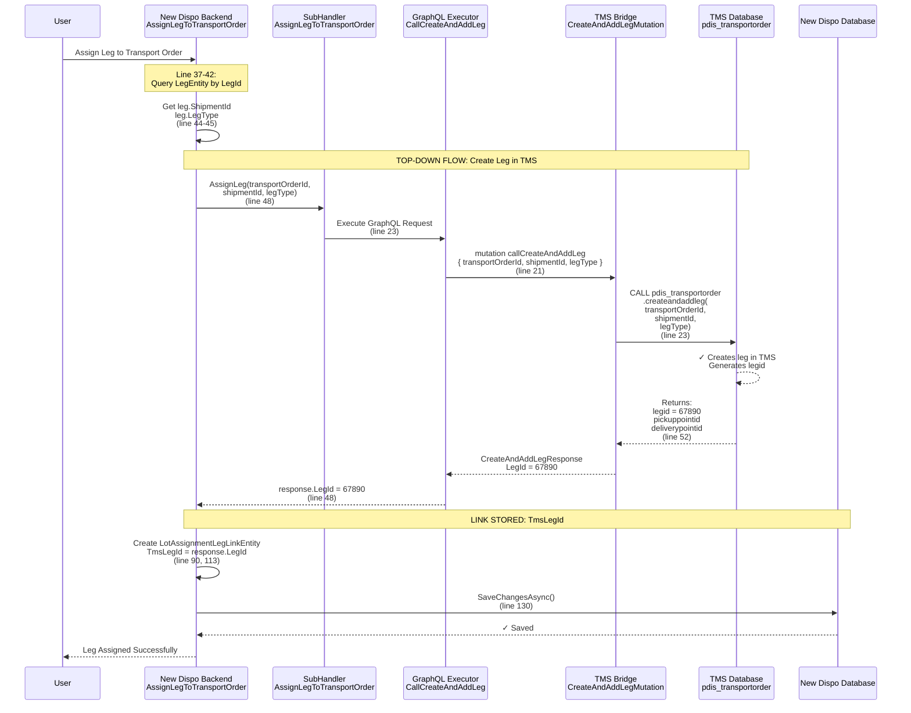
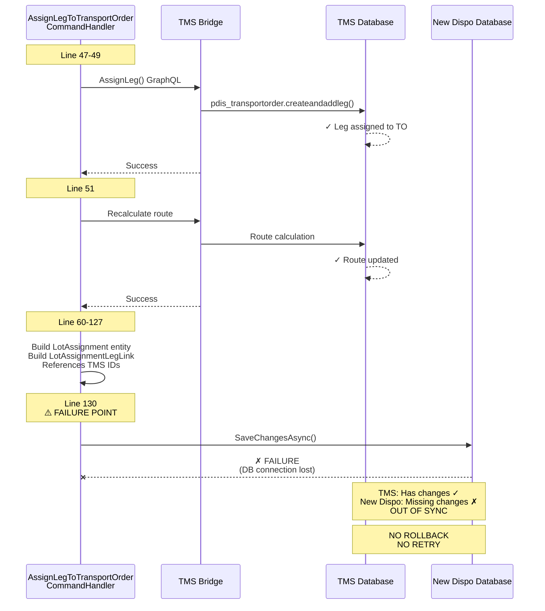
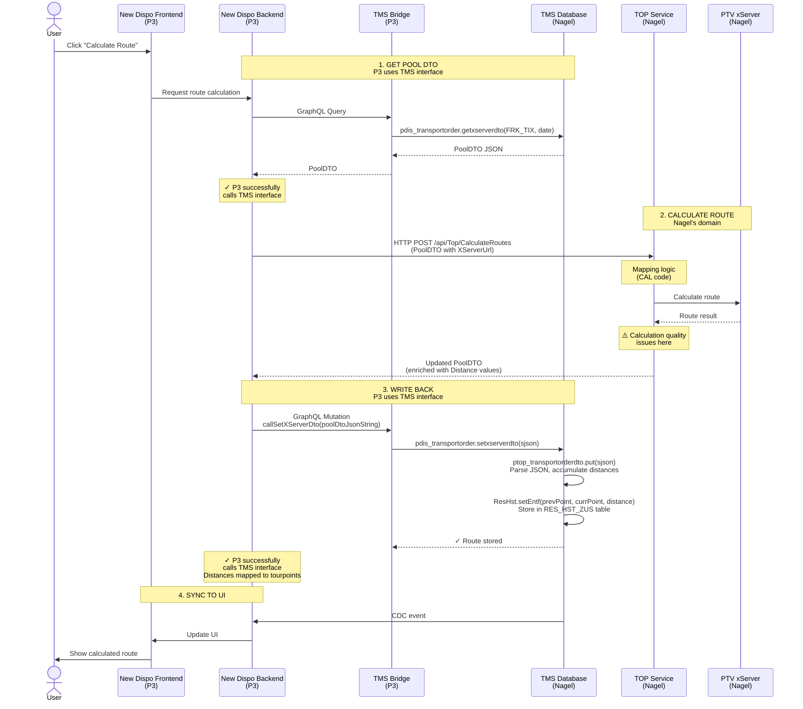
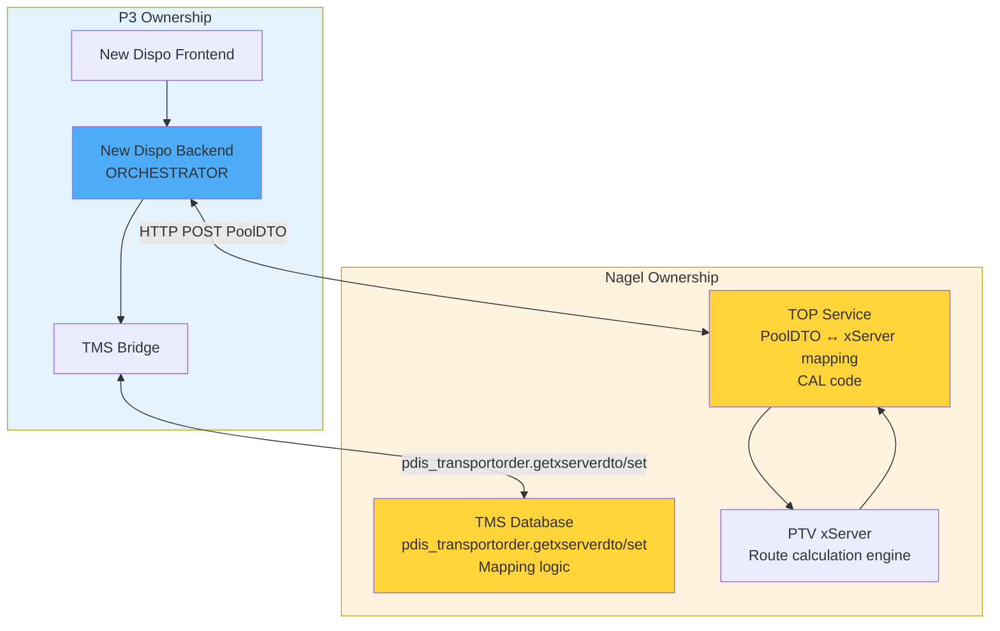

# Current State Diagrams - Workshop

## 1. CDC Error Handling (Current State - Broken)



**Problem:** Pub/Sub sees 200 OK = success, doesn't know we failed.

**Code:** `ConsumeEventCommandHandler.cs:53-57`

---

## 2. Bottom-Up Sync Gap (ShipmentType Filter)



**Problem:** The FilterShipmentsTrigger Cloud Function (lines 40-41) only publishes CDC events to Pub/Sub when:
```csharp
oldRecord?.Payload.ShipmentType == "A" || newRecord?.Payload.ShipmentType == "A"
```

**Current Filter Logic:**
- ✅ **Published:** ShipmentType "A" → any changes to these legs ARE synced
- ❌ **Dropped:** ShipmentType "B", "C", "D", etc. → changes to these legs are NOT synced
- ⚠️ **Partial:** "A" → "B" transition IS published (old = "A"), but "B" → "C" is NOT

**Impact:**
- When `sendungsart` changes from "A" to another value in TMS Database
- Or when ANY field changes on a leg with `sendungsart != "A"`
- The Filter Cloud Function drops the CDC event
- New Dispo never receives the change notification
- Users see stale/incorrect data in New Dispo UI

**Code:** `FilterShipmentsTrigger.cs:40-41`

**Gap:** Only ShipmentType "A" is currently handled. Other shipment types exist in TMS Database but are not synced to New Dispo.

---

### 2a. Top-Down Linking - AddLeg Flow (✅ Working)



**How Top-Down Linking Works (✅):**

1. **User Action → Backend Query (Line 37-42):**
   - User assigns a leg to transport order
   - Backend queries `LegEntity` by `LegId` (GUID)
   - Gets `ShipmentId` (long) and `LegType` from leg

2. **Backend → TMS Bridge → TMS Database (Line 47-49):**
   - Backend calls: `AssignLeg(transportOrderId, shipmentId, legType, databaseIdentifier)`
   - GraphQL mutation: `callCreateAndAddLeg`
   - TMS Bridge calls: `pdis_transportorder.createandaddleg()`
   - **TMS Database generates and returns `legid`** (e.g., `67890`)

3. **Backend Stores TMS Leg ID (Line 90, 113):**
   - Backend creates `LotAssignmentLegLinkEntity`
   - **Stores `TmsLegId = response.LegId`** (the ID returned from TMS)
   - This links New Dispo's internal `LegId` (GUID) to TMS's `legid` (long)

4. **Key Linking Fields:**

   | Component | Field | Type | Purpose | Flow Direction |
   |-----------|-------|------|---------|----------------|
   | New Dispo `LegEntity` | `LegId` | `Guid` | Internal primary key | — |
   | New Dispo `LegEntity` | `ShipmentId` | `long` | Link to TMS sendung_tix | ← TMS (via CDC) |
   | New Dispo `LotAssignmentLegLinkEntity` | `TmsLegId` | `long` | Link to TMS leg ID | ← TMS (via AddLeg) |
   | TMS DB `sendung` | `sendung_tix` | `long` | Primary key | → CDC |
   | TMS DB `v_dis_leg` | `legid` | `decimal` | Leg identifier | → AddLeg response |

5. **Why This Works (✅):**
   - **Synchronous call:** Backend waits for TMS response before saving
   - **TMS generates ID:** TMS Database creates the leg and returns its ID
   - **ID stored immediately:** Backend stores `TmsLegId` in same transaction
   - **Bidirectional link:** New Dispo has both `ShipmentId` (from CDC) and `TmsLegId` (from AddLeg)

**Code References:**
- Backend Handler: `AssignLegToTransportOrderCommandHandler.cs:47-49, 90, 113, 130`
- SubHandler: `AssignLegToTransportOrderSubHandler.cs:13-26`
- GraphQL Executor: `CallCreateAndAddLegRequestExecutor.cs:14-41`
- TMS Bridge Mutation: `CreateAndAddLegMutation.cs:15-56` (calls `pdis_transportorder.createandaddleg`)
- Link Entity: `LotAssignmentLegLinkEntity` (stores `TmsLegId`)

**What This Shows:**
- ✅ **Top-Down (New Dispo → TMS):** Works correctly via synchronous GraphQL call
- ✅ **Linking established:** New Dispo stores TMS leg ID immediately
- ⚠️ **Bottom-Up (TMS → New Dispo):** Relies on CDC + filter (next section)

---

## 3. Top-Down Sync Vulnerability



**Problem:** No distributed transaction, no compensation.

**Code:** `AssignLegToTransportOrderCommandHandler.cs:47-130`

---

## 4. Route Calculation - End-to-End Flow



**Ownership:**
- **P3 Responsibility:** New Dispo Frontend, Backend, TMS Bridge
- **Nagel Responsibility:** TMS Database, TOP Service, PTV xServer

**P3 Status:** ✓ Successfully integrates with TMS Database interfaces (pdis_transportorder.getxserverdto/set)

**Issues:** Calculation quality in TMS Database + TOP Service (Nagel's domain)

---

## 5. Route Calculation - Component Ownership



**Flow:**
1. Backend → TMS Bridge → TMS DB (get PoolDTO)
2. Backend → TOP Service (HTTP POST PoolDTO)
3. TOP Service → xServer → returns calculated route
4. Backend → TMS Bridge → TMS DB (set PoolDTO)

**Key:** Backend orchestrates everything. TMS DB and TOP Service do NOT communicate directly.

**Network:** ✓ Already set up (not a blocker)

**Interface:** TMS Database functions (pdis_transportorder.getxserverdto/setxserverdto)

**P3 Integration Status:** ✓ Working correctly

**Issues:** Calculation quality, master data quality, TMS DB logic, TOP Service mapping

---

## 6. PoolDTO Structure (Simplified)

```json
{
  "Id": 10340429359153,                    // FRK_TIX
  "PlanningDate": "2025-03-26T00:00:00",
  "Configurations": [{                     // xServer config
    "Url": "http://xserver2.nagel-group.local:30000",
    "CostPerKilometer": 1.2,
    "WorkingCostPerHour": 20.5,
    ...
  }],
  "Locations": [{                          // Pickup/Delivery points
    "Id": "10340430073544",
    "Type": 0,                             // 0 = Depot, 1 = Customer
    "Name1": "NAGEL-GROUP LOGISTICS SE",
    "Street": "SCHWARZE BREITE 16",
    "PostalCode": "34260",
    "City": "KAUFUNGEN",
    "Longitude": 9.5735,
    "Latitude": 51.28465,
    "OpeningIntervals": [{
      "Start": "2025-03-26T06:59:00",
      "End": "2025-03-26T16:01:00"
    }],
    "ServiceDuration": 600                 // Verweildauer
  }],
  "Orders": [{                             // Shipments/Legs
    "Id": "0",
    "Type": 1,                             // Delivery
    "StartLocationId": "10340430073544",
    "EndLocationId": "10340430073545",
    "ProductGroupsQuantities": [{
      "Id": "Fresh",
      "Weight": 500.0,
      "PalletSpaces": 2.0
    }],
    "Priority": 4
  }],
  "Vehicles": [{                           // LKWs
    "Id": "0",
    "VehicleProfile": "6-nagel-top-euro6-11.99t",
    "ProductGroupQuantityScenarios": [[{
      "Id": "Fresh",
      "Weight": 6680.0,
      "PalletSpaces": 15.0
    }]],
    "StartTime": "1900-01-01T05:30:00",
    "MaximumTourDuration": 36000
  }],
  "Plans": [{                              // Calculated routes (output)
    "Id": "0",
    "Tours": [{
      "Id": "10340429359153",
      "VehicleId": "0",
      "TourElements": [{
        "Type": 0,                         // Stop
        "LocationId": "10340430073544",
        "StartTime": "...",
        "EndTime": "..."
      }, {
        "Type": 1,                         // Drive
        "Distance": 15000,
        "Duration": 900
      }]
    }]
  }]
}
```


**Source:** TMS Database function `pdis_transportorder.getxserverdto(FRK_TIX, date)`
  - Internally calls: `ptop_loadinglistdto.get(sid, dplanningdate)`
  - Returns: JSON text

**Example based on:** Actual query execution from 2025-07-28 exploration
  - Query: `SELECT ptop_loadinglistdto.get('10340429359153', trunc(localtimestamp))`
  - Database: TMS 1034
  - Result: Above JSON structure (simplified, key fields shown)

**Populated by:** TMS Database (Nagel's code)

**Consumed by:** TOP Service + PTV xServer (Nagel's infrastructure)

**P3 Role:** Call get(), pass PoolDTO to TOP Service, call set() with result

---

## 7. TOP Service Endpoint Details

**Endpoint:** `/api/Top/CalculateRoutes`

**Method:** `POST`

**Request Body:** PoolDTO (JSON)

**Backend Implementation:** `Code/Disposition-Backend/CALConsult.Disposition.API/Shared/Application/ExternalHttpServices/TOP/TOPService.cs:23`

**Configuration:**
```json
{
  "TOPService": {
    "BaseUrl": "[TOP Service URL]",
    "XServerUrl": "http://xserver2.nagel-group.local:30000"
  }
}
```

**Request Processing:**
1. Backend injects `XServerUrl` into each `Configuration.Url` in the PoolDTO
2. Sends HTTP POST to TOP Service `/api/Top/CalculateRoutes` endpoint
3. TOP Service receives PoolDTO and performs route calculations via PTV xServer
4. Returns enriched PoolDTO with calculated distance/duration values

**Response: Distance/Kilometer Properties Returned**

The endpoint returns distance values at multiple aggregation levels:

| Property | Location | Type | Description |
|----------|----------|------|-------------|
| `PlanDto.Distance` | `Plans[].Distance` | `double` | Total distance for entire plan |
| `PlanDto.TollDistance` | `Plans[].TollDistance` | `double` | Distance on toll roads (plan level) |
| `TourDto.Distance` | `Plans[].Tours[].Distance` | `double` | Total distance for specific vehicle/tour |
| `TourDto.TollDistance` | `Plans[].Tours[].TollDistance` | `double` | Distance on toll roads (tour level) |
| `TourElementDto.Distance` | `Plans[].Tours[].TourElements[].Distance` | `double` | Distance for individual leg between stops |
| `TourElementDto.TollDistance` | `Plans[].Tours[].TourElements[].TollDistance` | `double` | Distance on toll roads (leg level) |

**Data Hierarchy:**
```
PoolDto
└── Plans[] (PlanDto)
    ├── Distance (total for plan)
    └── Tours[] (TourDto)
        ├── Distance (total for tour/vehicle)
        └── TourElements[] (TourElementDto)
            └── Distance (individual leg)
```

**DTO Definitions:**
- `PoolDto`: `Code/Disposition-Backend/.../xserverDto/Dtos/PoolDto/PoolDto.cs`
- `PlanDto`: `Code/Disposition-Backend/.../xserverDto/Dtos/PoolDto/PlanDto.cs:25`
- `TourDto`: `Code/Disposition-Backend/.../xserverDto/Dtos/PoolDto/TourDto.cs:32`
- `TourElementDto`: `Code/Disposition-Backend/.../xserverDto/Dtos/PoolDto/TourElementDto.cs:27`

---

## 8. Distance Mapping to TMS Tourpoints

**How TOP-calculated distances get stored in TMS Database:**

### Call Chain

```
Backend
  └── SetPoolDtoExecutor.Execute(enrichedPoolDto, databaseIdentifier)
      └── Serialize PoolDto to JSON
          └── TMS Bridge: callSetXServerDto mutation
              └── TMS Database: pdis_transportorder.setxserverdto(sjson)
                  └── ptop_transportorderdto.put(sJson)
                      └── ResHst.setEntf(sourceTourPoint, destTourPoint, distance)
                          └── RES_HST_ZUS table (distance storage)
```

### Code References

| Step | Component | File:Line | Description |
|------|-----------|-----------|-------------|
| 1 | Backend | `SetPoolDtoExecutor.cs:15-19` | Serializes PoolDto to JSON string |
| 2 | Backend | `CallSetXServerDtoRequestExecutor.cs:17-18` | GraphQL mutation callSetXServerDto |
| 3 | TMS Bridge | `SetXServerDtoMutation.cs:23` | Calls `pdis_transportorder.setxserverdto` |
| 4 | TMS DB | `PDIS_TRANSPORTORDER.sql:1161` | Calls `ptop_transportorderdto.put(sJson)` |
| 5 | TMS DB | `PTOP_TRANSPORTORDERDTO.sql:1607` | Parses JSON: `getJson(sJsonResult)` |
| 6 | TMS DB | `PTOP_TRANSPORTORDERDTO.sql:1680` | Accumulates: `nDistance + TourElementDistance` |
| 7 | TMS DB | `PTOP_TRANSPORTORDERDTO.sql:1664` | Writes: `ResHst.setEntf(prev, curr, distance)` |
| 8 | TMS DB | `RESHST.sql:3884-3888` | Stores in `RES_HST_ZUS` table |

### Distance Storage Details

**Table:** `RES_HST_ZUS` (TMS Database)

**Purpose:** Stores additional attributes (Zusätze) for tourpoints, including distances between consecutive tourpoints.

| Column | Value | Description |
|--------|-------|-------------|
| `RES_HST_TIX` | `nTix2` | **Destination tourpoint ID** (where distance ends) |
| `TYP` | `PTOURORT_LIB.GET_ZUSTYP_DS()` | Type identifier for "distance" (DS) |
| `KEY` | `nTix1::varchar` | **Source tourpoint ID** (where distance starts) |
| `T` | `nEntf::varchar` | **Distance value** (in meters, stored as text) |

### Processing Logic (PTOP_TRANSPORTORDERDTO.sql:1640-1685)

```sql
-- Initialize accumulator
nDistance := 0;

-- Loop through TourElements
for rTourElement in (select * from unnest(tJsonResult)) loop
    if (TourElementType = POINT and TourPointTix > 0) then
        -- Reached a tourpoint: write accumulated distance
        if nPreviousTourPointTix is not null then
            call ResHst.setEntf(nPreviousTourPointTix, TourPointTix, nDistance);
            nDistance := 0;  -- Reset accumulator
        end if;
        nPreviousTourPointTix := TourPointTix;
    else
        -- Leg/Drive segment: accumulate distance
        nDistance := nDistance + TourElementDistance;
    end if;
end loop;
```

### Distance Aggregation

The TMS Database **accumulates** `TourElementDto.Distance` values (individual leg distances) and stores the **total distance between consecutive tourpoints** in `RES_HST_ZUS`:

```
TourPoint A
   ↓ (Leg 1: 5000m)
   ↓ (Leg 2: 3000m)
   ↓ (Leg 3: 2000m)
TourPoint B

Result in RES_HST_ZUS:
- RES_HST_TIX = B (destination)
- KEY = A (source)
- T = "10000" (total: 5000 + 3000 + 2000)
```

**Key Insight:** TOP Service returns **granular leg-by-leg distances** in `TourElements[]`, but TMS stores **aggregated point-to-point distances** in `RES_HST_ZUS`.
