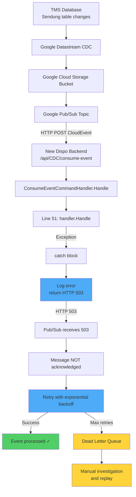
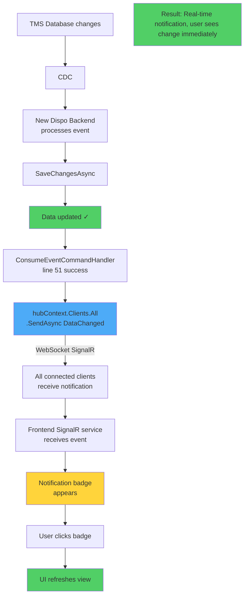

# Proposed Solutions - Workshop

## 1. CDC Error Handling - Proposed Fix

**Changes:**
1. Return HTTP 5xx on failure → Pub/Sub retries
2. Add idempotency check in handlers → Prevent duplicate processing
3. Configure DLQ → Preserve failed events

**Code Changes:**
- File: `ConsumeEventCommandHandler.cs:53-57`
- Change: Return `StatusCode(503)` instead of `Ok(result)` when `IsEventSuccess = false`
- Add: Idempotency check at start of each event handler
- Infra: Configure Pub/Sub DLQ topic

---

## 2. Change Notifications - SignalR Implementation

**Components Needed:**
- Backend: `NotificationHub.cs`
- Frontend: `SignalR service`
- Integration: Hub call after CDC success
- UI: Notification badge component

**Implementation Steps:**
1. Add SignalR hub to backend (Startup.cs + NotificationHub.cs)
2. Install @microsoft/signalr in frontend
3. Create SignalR service in Angular
4. Inject hub context in ConsumeEventCommandHandler
5. Call hub.SendAsync after successful CDC processing
6. Create notification badge component in UI

**Reference:** `02_Explorations/2026-01-28-signalr-foundation.md`

---

## Summary

| Proposal | Risk | Status |
|----------|------|--------|
| CDC Error Fix | Medium | Recommended |
| SignalR Notifications | Low | Recommended |
