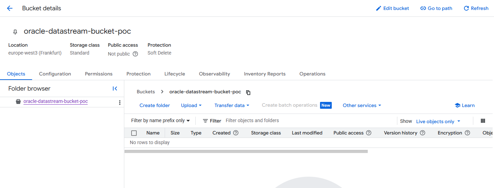
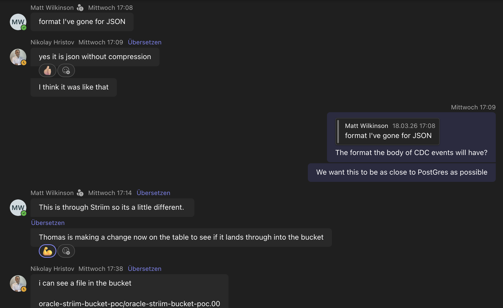
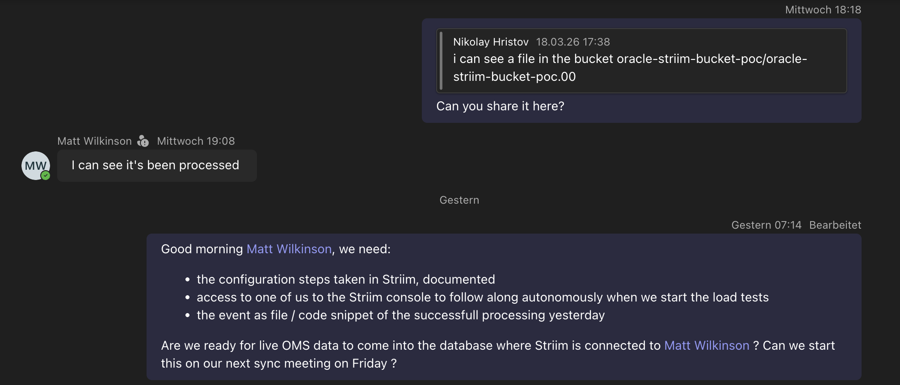
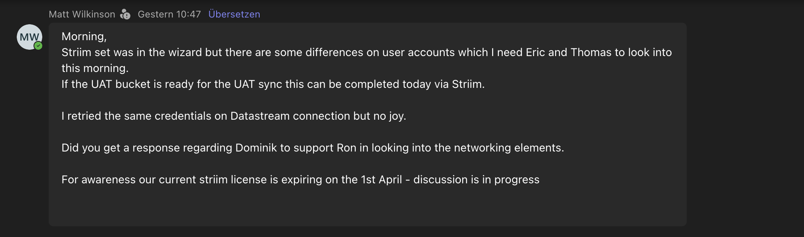

Matthias Max:
Good Morning Jeder, any update on the Oracle connectivity?
 
Matt Wilkinson:
Hi Matthias, still investigating. Did you get a clear steer/ decision on bringing Dominik in to support Ron?
 

Matthias Max:
On it.

Matt Wilkinson Vervenne, Ron What is the status of the STRIIM instance and connected database ? We planned to work on this in parallel.

Matt Wilkinson:
Hi Matthias planned for tomorrow.  
 
Can we have a service account to connect to the cloud bucket? 
 
Matthias Max:
Need to discuss with Nikolay Hristov tomorrrow.

Nikolay:
wl5-cloudrun@prj-cal-w-wl5-t-6c00-53ad.iam.gserviceaccount.com
 
service account

Matt Wilkinson:
We'll need some more than just the service account:
https://www.striim.com/docs/en/connecting-striim-cloud-on-google-cloud-platform-to-managed-data-services.html
 
Whats the Bucket name? 
 
 Matthias Max:
 See the pinned post => Project Status

Matt Wilkinson:
I dont have access

Matthias Max:
oracle-datastream-bucket-poc
oracle-striim-bucket-poc

Matt Wilkinson:
I need a object name...
 
and a format:

Matthias Max:
 Nikolay Hristov Can you provide this?

Nikolay:
let me check
 

 sorry but I am in a call with my new project

Nikolay:
I don't know why but I can't share a file here but the file uploaded to oracle-striim-bucket-poc yesterday looks like this:
 
02_Explorations/2026-03-11_Nagel_P3_Oracle_CDC_Kick_Off/2026-03-18_first_striim_cdc_event.json
 
Is that correct? 
 
Matt Wilkinson
Morning, Striim set was in the wizard but there are some differences on user accounts which I need Eric and Thomas to look into this morning. If the UAT bucket is ready for the UAT sync this can be completed…
Dominik Topic is raised with Christian Lang.

Striim Subscription: With no plan to prolong?

With UAT you mean to connect another DB? Or the load test scenario with prod data coming in? 

Once the final setup is done, please provide it (either screenshots or IaC-like exports), thanks.
 
Striim licensing: Request made to Google 
 
With UAT it is a new connection to a new database where the OMS orders will be striimed into. 
So new cloud bucket likely needed. This could be then connected to a UAT New DIspo (I don't think this exists) - Something Uschmann, Patrick is asking for. 
 
User connection details and connectivity all in DevOps PBI I've got. 
 
If we can't get Dominik what is the next steps here? 
 
 
Everyone Can you make me a STriim UAT bucket...
 
oracle-striim-bucket-poc-1060UAT
 
If someone can confirm when ready and I can get the duplication of the orders setup
 
Matt Wilkinson
oracle-striim-bucket-poc-1060UAT
Nikolay Hristov Would be the one.
 
Robert Zanter Does the 1060 have the constraint with the limited replication slot coverage of 1 hour? or is that another branch?
 
oracle-striim-bucket-poc-1060uat
just created it, it does not allow uppercase letters so uat is lowercase
 
Matthias Max
Robert Zanter Does the 1060 have the constraint with the limited replication slot coverage of 1 hour? or is that another branch?
No, 1060 has a window of 1day. PL64 has a window of 1hour for example.
 
Alle Hi all, please respond to the meeting invitation for this afternoon.
At the moment, I’ve only received confirmations from Christian, Pascal, and the P3 team.
It would be very helpful if everyone could join to align on the current activities.
Thanks.
 
Nikolay Hristov
oracle-striim-bucket-poc-1060uat  just created it, it does not allow uppercase letters so uat is lowercase
Morning,
Nikolay Hristov have you created an folder in the bucket? 
 
I can't see one
 
Do you want me to create one? 
 