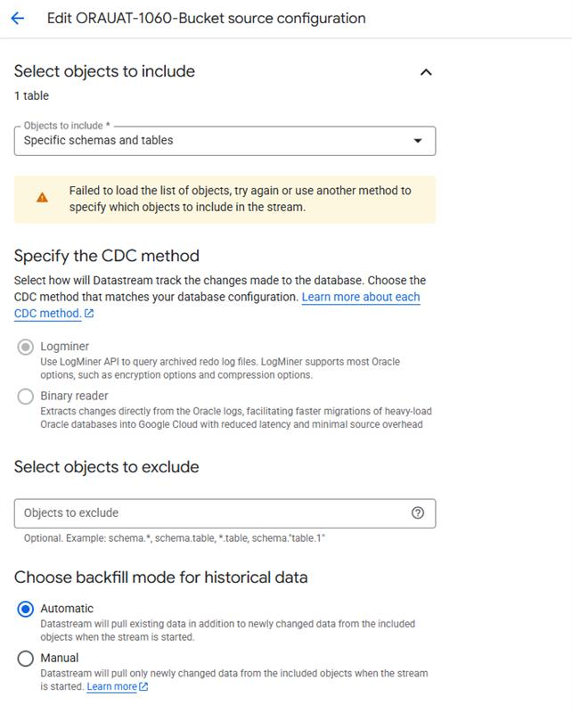

# Project: Oracle CDC Solution for TMS Branch Databases

**Status:** ✅ Completed — Striim selected for Oracle CDC (decided 2026-04-28)
**Author:** Matthias Max
**Last Updated:** 2026-05-11
**Outcome:** Striim confirmed as Oracle CDC solution for go-live. Datastream Binary Log Reader tracked as separate parallel exploration (post-go-live). ADR-006 closed.

**Note:** GoLive-related items that accumulated in this project have been migrated to the [GoLive 1060 Project](../2026-04-17_New_Dispo_GoLive_1060_Oracle/PROJECT-STATUS.md).

---

## Quick Overview

**Problem:** Nagel branches use Oracle TMS, but current CDC solution only supports Postgres. Need Oracle CDC to enable real-time data synchronization for New Dispo.

**Solution Approach:** Evaluate two CDC options in parallel POCs:
- **Striim** (already deployed at Nagel, character set mapping capability)
- **Datastream** (native GCP, consistent with existing Postgres CDC)

**POC Scope:** Intentionally kept minimal - CDC replication ends at Cloud Storage (Object Store). Downstream Cloud SQL updates and event format harmonization (Oracle ↔ Postgres) are considered post-POC as preparation for business logic integration.

**Decision:** Striim (decided 2026-04-28)

**Related Work Items:**
- [Feature 121925: TMS Pulse ORA Extension](https://dev.azure.com/p3ds/Nagel-CAL%20Disposition/_workitems/edit/121925)

---

## Current Status

### ✅ Completed (CW 11)
- [x] Workshop executed on March 16 (Technical walkthrough, POC kickoff)
- [x] Service account configured for Striim Cloud Storage access (wl5-cloudrun@prj-cal-w-wl5-t-6c00-53ad.iam.gserviceaccount.com)
- [x] UAT bucket created (oracle-striim-bucket-poc-1060uat) for order duplication testing
- [x] First CDC event successfully captured from Oracle TMS1034.SENDUNG table - [2026-03-18_first_striim_cdc_event.json]
- [x] Striim instance setup completed and configured
- [x] GCP storage buckets provisioned (oracle-striim-bucket-poc, oracle-datastream-bucket-poc)
- [x] Workshop scheduled for Monday, March 16, 14:30-15:00
- [x] Initial gap analysis completed - [Analysis](2026-03-13_meeting-coverage-analysis.md)
- [x] TMS1034 (ABN) Oracle connection ready for P3
- [x] UAT 1060 Oracle DB ready for order duplication
- [x] UAT 1034 Oracle DB ready for order duplication
- [x] Database selection confirmed (1034 ABN, 1060 UAT)

### ✅ Completed (CW 12)
- [x] Striim successfully streaming from Nuremberg test database to GCS bucket (confirmed March 20 meeting)
- [x] Order duplication into TMS1060 already in progress
- [x] Borrowed Google license for Striim confirmed by Matt Wilkinson (expiring end of March 2026)
- [x] U_TIME identified as latency measurement column (confirmed by Christian Lang)
- [x] P3 Oracle database access clarified: no direct access, Nagel-side only
- [x] GCS permission issue on UAT bucket identified and being resolved by Matt Wilkinson

### ✅ Completed (CW 13)
- [x] Striim load test executed against TMS1060 with production-like data (~60,978 events over 34h)
- [x] Datastream became active from March 30 (late start due to connectivity setup)
- [x] Both PoCs running in parallel against same Oracle source database

### ✅ Completed (CW 14-15)
- [x] PoC results data package received from Matt Wilkinson (2026-04-02)
- [x] Striim PoC: Sub-second latency (~100ms), 99.98% delivery (60,978 events), cross-workload WL3->WL5 confirmed
- [x] Datastream PoC: ~16-20s **system latency** reported initially (actual end-to-end latency corrected in CW 16)
- [x] Cost data received: Striim EUR 2,770.70/mo (shared WL3 platform), Datastream EUR 1.36/mo (inactive PoC)
- [x] Technical evaluation document drafted (Oracle_GCP_CDC_Technical_Evaluation.docx) - incomplete, many [TBC] entries
- [x] P3 comparison data package received (P3_CDC_Comparison_Data_Package.docx) - answers latency, completeness, cost questions
- [x] Patrick Uschmann confirmed ~10s latency acceptable; minutes would be problematic (April 8 meeting, verbal, not formally documented)
- [x] PoC execution stopped (confirmed safe to stop OMS order duplication, April 8)
- [x] Postgres Datastream baseline flagged: ABN 1034 Postgres also showing 10-15s latency (Matt Wilkinson, April 8)
- [x] ADR-006 drafted - [ADR-006: Oracle CDC Solution Selection](../../09_ADRs/ADR-006-oracle-cdc-solution-selection/ADR-006-oracle-cdc-solution-selection.md)

### ✅ Completed (CW 16)
- [x] Full GCP metrics extracted by Nikolay for PoC period (Mar 30 - Apr 9): latencies, throughput, freshness, event counts
- [x] Deep Datastream analysis completed - [Datastream CDC Analysis Report](../2026-04-15_Oracle-CDC-PoC-Analysis/consolidated_report.md)
- [x] **Latency correction:** Actual Datastream end-to-end latency is **~42-66 min** (P50 avg 66.5 min), not 16-20s. The 16-20s was system processing latency only; 99.4% of total latency is read lag waiting for Oracle's archived redo logs
- [x] Datastream delivery rate confirmed: **100% delivery (23,751 records), zero errors** — resolves prior "completeness TBD" blocker
- [x] Root cause identified: Oracle UAT1060 has 1 GB redo logs (4x GCP max recommendation of 256 MB) and `ARCHIVE_LAG_TARGET = 0` (no forced log switch — switches only when 1 GB is full)
- [x] GCP generated **130 `ORACLE_CDC_LOG_FILE_SIZE_TOO_BIG` warnings** during entire PoC period
- [x] DBA data received from Robert Zanter (2026-04-16): confirmed 5x 1 GB redo log groups, ARCHIVE_LAG_TARGET=0, log switch frequency varies with DB load (~30 min busy, 3-15 min overnight batches)
- [x] Wider-range log switch data received from Robert (Mar 26 - Apr 9) covering actual PoC period
- [x] Three latency improvement options documented with expected outcomes:
  - Option 1: Oracle Redo Log Tuning (ARCHIVE_LAG_TARGET=900 + 256MB logs) → 5-20 min, low effort
  - Option 2: Datastream Binary Log Reader (Preview, not GA) → 1-5 min — **Available in GCP console but Preview-only** (confirmed 2026-04-16). Next step: contact Google to clarify activation and GA timeline
  - Option 3: Striim → sub-second, license cost
- [x] Cost projection refined for 64 databases: Datastream EUR 344/mo vs. Striim EUR 11,671/mo (34x factor)
- [x] Management summary email drafted (DE + EN) with recommendation: second PoC with Oracle tuning before accepting Striim costs
- [x] Dual Datastream setup documented: two streams (WL3 + WL5) on same Oracle source — potential LogMiner contention flagged for PROD assessment
- [x] **Binary Log Reader (Preview) confirmed available** as Datastream config option in GCP — Nikolay verified via GCP console (2026-04-16). Option is selectable but remains **Preview (not GA)**, no production SLA. Matthias: "not really released publicly." — [Screenshot](../../00_Meetings/2026-04-16_DevOps_Oracle_Option/image.png)
  

### ✅ Completed (CW 17)
- [x] **Key decision: Datastream LogMiner ruled out** — "not an option at all... we need events in real time" (April 21 meeting). Datastream with archived redo logs (~42-66 min latency) is unacceptable for CDC use case
- [x] **Two remaining options identified** — Option A: Datastream Binary Log Reader (reads redo logs directly, like Striim — but currently in Preview, not available to Nagel). Option B: Striim (proven sub-second latency, currently free under borrowed Google license, expensive long-term). Matt Wilkinson escalating to Google account manager to request Binary Log Reader activation / trusted tester access
- [x] Weekly sync meeting established — Patrick Uschmann to send recurring invite, same attendee group (April 21)
- [x] Oracle migration tracker shared by Matt Wilkinson — [Live SharePoint tracker](https://nagelgroup-my.sharepoint.com/:x:/r/personal/x_matt_wilkinson_nagel-group_com/Documents/Anlagen/Dispo_POSTGRES_Oracle_Tracker%201.xlsx?d=weae5c4954eab449a8cff3bc20eee1b26&csf=1&web=1&e=v4o4Cx) for Postgres-to-Oracle conversion status (April 22)
- [x] Database user strategy decided — separate users for CDC (log mining) vs. application (bridge), per Eric Meijers' recommendation. TMS owner account (TMS 1060) should NOT be used by application. Branch-specific usernames required (Postgres cluster isolation)
- [x] Oracle DevOps branch created for New Dispo — Matt Wilkinson created dedicated branch off Oracle Master for converted code ("gold build")
- [x] ENT1 environment set up for Oracle conversion development
- [x] ABN 1060 Oracle DB confirmed ready and running
- [x] ADR created for using TEST environment as DEV (no DEV environment exists) — Matthias Max
- [x] Liquibase purchase expected imminently for automated database deployment pipelines

### ✅ Completed (CW 17, continued)
- [x] **Binary Log Reader set up** — Ron and Eric successfully configured Datastream Binary Log Reader. However, permissions required far exceed what GCP documentation states — call scheduled Monday 2026-04-28 to discuss (April 24 email)
- [x] **Striim license extended until October 2026** — Matt Wilkinson confirmed extension completed (April 24 email)
- [x] **Oracle 30-character view name limit discovered** — Some view names exceed Oracle's 30-char limit. New naming convention agreed and being implemented across New Dispo code (P3 Dev team), Postgres (Sonja), and Oracle (Andrej) (April 24 email)
- [x] **DevOps access for Matt Wilkinson** — Matthias got Matt access to P3 Azure DevOps (single source of truth for collaboration)

### ✅ Completed (CW 18 — Project Closure)
- [x] **Striim selected as Oracle CDC solution** — Decided in April 28 meeting. Striim for go-live; Binary Log Reader explored in parallel as post-go-live optimization
- [x] **ADR-006 closed** — Decision: Striim accepted
- [x] **Binary Log Reader set up** — Ron and Eric successfully configured it (CW 17). Permission issues identified but moot for go-live decision — Binary Log Reader is a separate parallel track
- [x] **Striim license extended until October 2026** — Matt Wilkinson confirmed (2026-04-24)
- [x] **CDC target bucket provisioned** — `wl5-cdc-bucket-abn1060` created by Nikolay (2026-05-07)

### Migrated to GoLive 1060 Project
The following items were tracked here but belong to go-live execution, not CDC technology evaluation. They have been migrated to the [GoLive 1060 Project](../2026-04-17_New_Dispo_GoLive_1060_Oracle/PROJECT-STATUS.md):
- DB user permissions spec (Yosif)
- Oracle view conversion and deployment (Andrej)
- Infrastructure skeleton check (Nikolay)
- VDI access for P3 developers
- Keycloak/auth technical drawing
- TMS testers access
- Test case design (Patrick)
- Striim event format mapping for TMS Pulse

---

## Timeline

| Phase          | Period       | Status        | Key Activities                            |
| -------------- | ------------ | ------------- | ----------------------------------------- |
| Kick-Off       | March 11     | ✅ Complete    | Initial alignment, option presentation    |
| Preparation    | March 11-15  | ✅ Complete    | GCP setup, Oracle prerequisites           |
| Workshop       | March 16     | ✅ Complete    | Technical walkthrough, POC kickoff        |
| POC Execution  | March 16 - April 2 | ✅ Complete | Striim + Datastream tested against TMS1060.SENDUNG |
| POC Results    | April 2      | ✅ Complete    | Data package received from Matt Wilkinson |
| Deep Analysis  | April 15-17  | ✅ Complete    | GCP metrics extraction, root cause analysis, DBA data, management summary |
| Stakeholder Alignment | April 21, 2026 | ✅ Complete | Datastream LogMiner ruled out; two remaining options: Binary Log Reader / Striim |
| Google Escalation | April 21-28, 2026 | ✅ Complete | Binary Log Reader set up; permission mismatch identified; moot for go-live — parallel track |
| Decision       | April 28, 2026 | ✅ Complete | Striim selected for go-live. ADR-006 closed. Binary Log Reader as post-go-live exploration |
| Project Closure | May 11, 2026 | ✅ Complete | GoLive items migrated to GoLive 1060 Project. CDC evaluation complete |

---

## Team & Stakeholders

### P3 Team
- **Matthias Max** - Enterprise Architect, Technical Lead, GCP Infrastructure, POC Coordination
- **Martin Dittmann** - Project Manager, Project Coordination, Workshop Facilitation
- **Maximilian Kehder** - Product Owner
- **Nikolay Hristov** - DevOps Engineer, GCP Infrastructure Setup
- **Yosif Mihaylov** - Lead Developer (Backend), Development Support
- **Boyan Valchev** - Lead Developer (Frontend), Development Support
- **Sonja Petkovic** - Postgres Developer, View Name Convention Implementation

### Nagel/CAL Team
- **Christian Lang** - CEO Nagel IT, Decision Authority
- **Patrick Uschmann** - Product Owner
- **Matt Wilkinson** - Infrastructure Lead, Striim Setup, Google Account Escalation
- **Ron Vervenne** - Cloud Engineer, Infrastructure Platform, VDI Access
- **Thomas Paulus** - TMS Database Developer, Oracle Configuration
- **Robert Zanter** - Oracle DBA, Redo Log Configuration
- **Eric Meijers** - Cloud Engineer, DBA Support, User Permissions Strategy
- **Andrej Chernov** - Oracle Developer, View/Package Conversion
- **Reinhard Lechner** - Oracle Developer, View/Package Conversion
- **Joachim Schreiner** - Oracle/Postgres Developer
- **Steve** - Additional Infrastructure Support

---

## Related Documentation

### Existing Architecture
- [Shipment Data Flow Architecture](../../../WIKI/Nagel-CAL-Disposition.wiki/Technical-Documentation/Process-Flows/Shipment-Data-Flow-Architecture.md) _(Shown in kick-off meeting)_
- [TMS Bridge Documentation](../../../WIKI/Nagel-CAL-Disposition.wiki/EBV-%2D-TMS-Bridge/TMS-Bridge-Overview.md)
- [Deployment Mapping](../../../WIKI/Nagel-CAL-Disposition.wiki/Technical-Documentation/Infrastructure/Deployment-Mapping.md) _(TEST environment, WL5 workload)_

### Technical References
- [Google Datastream: Configure Oracle Self-Managed Database](https://docs.cloud.google.com/datastream/docs/configure-self-managed-oracle) _(Official setup guide - confirmed by P3 on 2026-03-13)_

### Deliverables
- [ADR-006: Oracle CDC Solution Selection](../../09_ADRs/ADR-006-oracle-cdc-solution-selection/ADR-006-oracle-cdc-solution-selection.md) _(Proposed - outstanding items being updated with deep analysis)_
- [Datastream CDC Analysis Report](../2026-04-15_Oracle-CDC-PoC-Analysis/consolidated_report.md) _(Complete - full GCP metrics analysis, root cause, tuning options)_
- [PoC Results Data Package](../../00_Meetings/2026-04-13-Oracle%20POC%20Results%20from%20Matt%20Wilkinson/) _(Received 2026-04-02)_
- **Rollout Plan: Oracle CDC Production Deployment** _(Pending - post-ADR closure)_
- **Setup Guide: Oracle CDC Configuration** _(Partially documented in Technical Evaluation - needs [TBC] completion)_
- **Cost Analysis: Striim vs Datastream** _(Refined: Datastream EUR 344/mo vs. Striim EUR 11,671/mo at 64 DBs. Striim license costs still TBD)_
- **Oracle Migration Tracker** _(Live SharePoint sheet — [Dispo Postgres Oracle Tracker](https://nagelgroup-my.sharepoint.com/:x:/r/personal/x_matt_wilkinson_nagel-group_com/Documents/Anlagen/Dispo_POSTGRES_Oracle_Tracker%201.xlsx?d=weae5c4954eab449a8cff3bc20eee1b26&csf=1&web=1&e=v4o4Cx), shared by Matt Wilkinson 2026-04-22)_

---

## Communication

### Meeting History
- **2026-04-24:** Go-Live 1060 Status Email (Matt Wilkinson) - Binary Log Reader set up but permission issues, Oracle views near-complete, 30-char naming fix, Striim license extended to Oct 2026, deployment target ABN1060 Mon Apr 27
- **2026-04-21:** Follow-Up Oracle CDC (72 min) - Key decisions: Datastream LogMiner ruled out, Binary Log Reader escalation to Google, DB user strategy, weekly sync established
- **2026-03-11:** Kick-Off Meeting (56 min) - [Teams Link](https://teams.microsoft.com/meet/39050326979606?p=6txN2RVcQCVGEmqpuZ)
- **2026-03-16:** Follow-up Workshop (30 min) - _Completed_
- **2026-03-20:** Workshop (14:30) - _Completed_

### Discussion Channels
- **Teams Chat:** [Oracle CDC POC Discussion](https://teams.microsoft.com/l/chat/19:c11215f85805443396007013fbbbff97@thread.v2/conversations?context=%7B%22contextType%22%3A%22chat%22%7D)

**Have questions?** Contact Matthias or comment in the Teams chat.

---

## Success Criteria

| Criterion | Target | Striim Result | Datastream Result |
|-----------|--------|---------------|-------------------|
| **Latency** | < 2 min (target < 1 min) | ~100ms (flat, no variance) | ~42-66 min avg (P50) — **failed** |
| **Completeness** | 100% delivery | 99.98% (60,967/60,978) | 100% (23,751/23,751) |
| **Volume** | Production-like load | 60,978 events over 34h against TMS1060 | 23,751 records over PoC period |
| **Stability** | Continuous operation without intervention | Stable throughout 34h load test | Stable but latency unacceptable |

**Latency constraint:** Patrick Uschmann (PO) confirmed ~10s acceptable, minutes problematic (2026-04-08, verbal). Operationalized as < 2 min hard limit, < 1 min target.

**Outcome:** Striim met all criteria. Datastream failed the latency constraint due to Oracle archived redo log read lag (root cause: 1 GB redo logs, `ARCHIVE_LAG_TARGET=0`). Datastream delivery was flawless — the issue is purely latency.

---

## Context & Dependencies

### Business Context
- TMS Branches currently use Oracle TMS (strategic shift from Postgres)
- June 2026 Go-Live deadline for TMS branch support
- Feature parity requirement with existing Postgres CDC

### Technical Dependencies
- Oracle database versions and editions (11.2, 12c, 18+?)
- Network connectivity: GCP ↔ On-premise Oracle
- Character set compatibility (UTF-8 vs Oracle legacy)
- Infrastructure constraints (disk space for log retention)

### Risk Areas
- **Log File Cycling:** Potential data loss if CDC disconnects during rapid redo log cycling
- **Character Set Issues:** Poland experiencing real-world character corruption
- **Network Stability:** Connection interruptions can corrupt replication slots
- **Infrastructure Capacity:** Limited disk space affects log retention

---

## Change Log

| Date       | Update                                                                                                                                                             | Updated By             |
| ---------- | ------------------------------------------------------------------------------------------------------------------------------------------------------------------ | ---------------------- |
| 2026-05-11 | **Project closed.** Striim confirmed as Oracle CDC solution (decided Apr 28 meeting). ADR-006 accepted. GoLive-related items (DB users, view conversion, infrastructure, VDI, Keycloak, testing) migrated to new GoLive 1060 Project. Binary Log Reader tracked as separate parallel exploration, not blocking go-live | Matthias Max |
| 2026-04-24 | Update from Matt Wilkinson Go-Live 1060 email: Binary Log Reader successfully set up by Ron/Eric but permissions far exceed documentation — call Mon Apr 28. Oracle view conversion near-complete (Andrej), 30-char Oracle view name limit discovered, new naming convention agreed, changes across New Dispo (P3), Postgres (Sonja), Oracle (Andrej). Target deploy ABN1060 Mon Apr 27. Striim license extended to Oct 2026. VDI still in progress. Matt requesting keycloak/auth drawing, 2 TMS testers need app access, test case planning with Patrick. "5 weeks to GO." | Matthias Max |
| 2026-04-23 | Major update from April 21 meeting + April 22 tracker: Datastream LogMiner ruled out (too slow). Two options remain: Binary Log Reader (pending Google activation) and Striim. Matt Wilkinson escalating to Google. Weekly sync established. Oracle migration tracker shared. DB user strategy decided (separate users, least-privilege). Andrej/Reinhard/Joachim working on Oracle view conversion. Infrastructure skeleton check initiated. Names corrected: Andrej, Reinhard. | Matthias Max |
| 2026-04-21 | Binary Log Reader (Preview) confirmed available in GCP Datastream console (Nikolay screenshot, 2026-04-16); not GA — next step: contact Google for activation details and GA timeline. Screenshot added to project status. | Matthias Max |
| 2026-04-17 | Deep analysis findings integrated: Datastream end-to-end latency corrected to ~42-66 min (was 16-20s system latency only); root cause identified (1 GB redo logs, ARCHIVE_LAG_TARGET=0); DBA data from Robert Zanter received; three options documented; cost projection refined (34x factor); management summary drafted; second PoC with Oracle tuning recommended | Matthias Max |
| 2026-04-15 | ADR-006 drafted from PoC results; project status updated with findings; 8 outstanding items identified | Matthias Max |
| 2026-04-15 | PoC results received from Matt Wilkinson (2026-04-02): Striim ~100ms latency/99.98% delivery; Datastream ~16-20s latency/completeness TBD | Matthias Max |
| 2026-03-20 | Added item to completed: Workshop executed on March 16 (Technical walkthrough, POC kickoff) | Matthias |
| 2026-03-20 | Added item to in-progress: Request for Dominik support raised with Christian Lang | Matthias |
| 2026-03-20 | Added item to in-progress: Striim licensing extension request submitted to Google | Matthias |
| 2026-03-20 | Status updated to: In Progress - POC Active | Matthias |
| 2026-03-20 | Added item to completed: Service account configured for Striim Cloud Storage access (wl5-cloudrun@prj-cal-w-wl5-t-6c00-53ad.iam.gserviceaccount.com) | Matthias |
| 2026-03-20 | Added item to completed: UAT bucket created (oracle-striim-bucket-poc-1060uat) for order duplication testing | Matthias |
| 2026-03-20 | Added item to completed: First CDC event successfully captured from Oracle TMS1034.SENDUNG table | Matthias |
| 2026-03-20 | Added item to completed: Striim instance setup completed and configured | Matthias |
| 2026-03-13 | POC scope clarified - intentionally ends at Cloud Storage, Cloud SQL harmonization post-POC                                                                       | Virtual Architect      |
| 2026-03-13 | Project status synced to wiki, all updates from Matt's communication reflected                                                                                     | Virtual Architect      |
| 2026-03-13 | TMS1034 (ABN) Oracle connection ready, UAT databases (1034, 1060) ready for order duplication, Datastream setup assigned to WL5, Cloud SQL/Storage assigned to WL4 | Virtual Architect      |
| 2026-03-13 | Project page created, pending items documented                                                                                                                     | Virtual Architect      |
| 2026-03-13 | Workshop scheduled for March 16                                                                                                                                    | Virtual Architect      |
| 2026-03-13 | GCP infrastructure provisioning completed                                                                                                                          | Virtual Architect      |
| 2026-03-11 | Kick-off meeting conducted, 7 action items assigned                                                                                                                | Virtual Architect      |

---

  Created and maintained by <strong>Virtual Architect</strong> 
  Living document - updates automatically as project progresses

