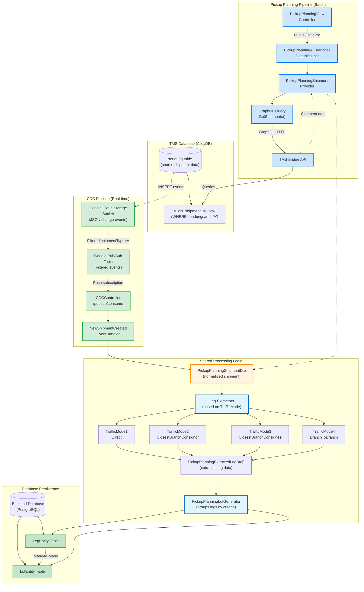
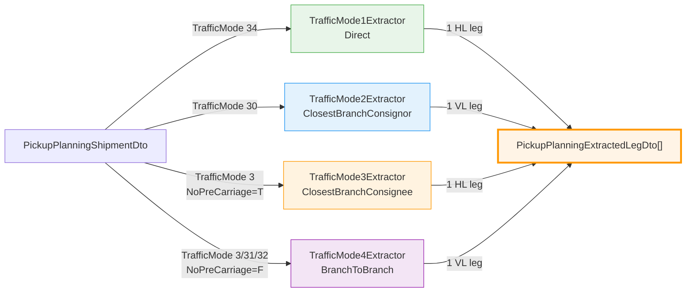
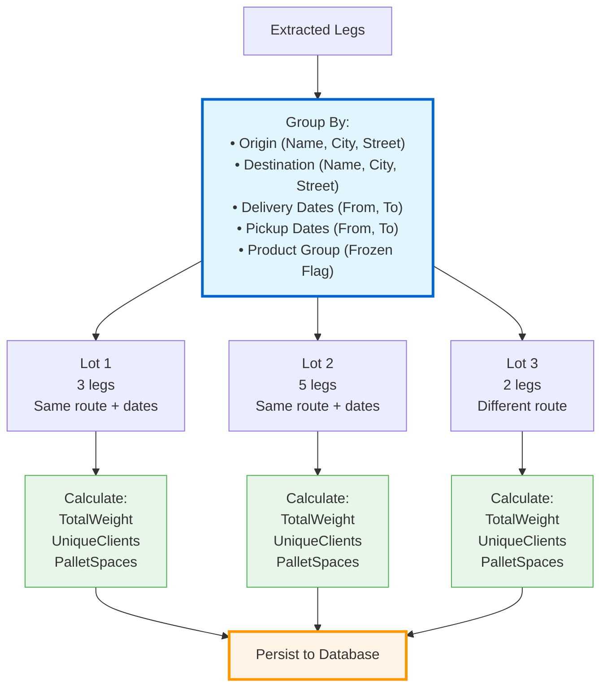
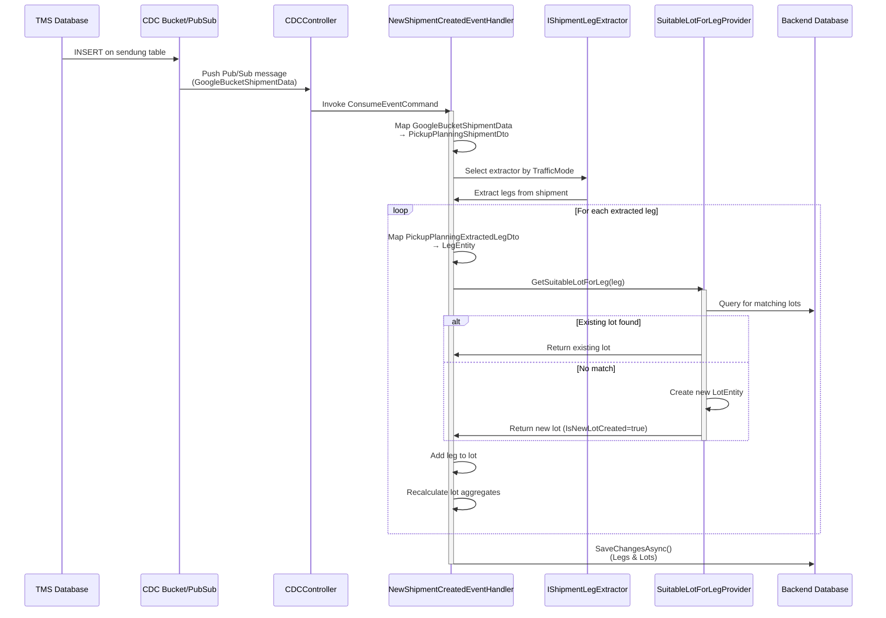
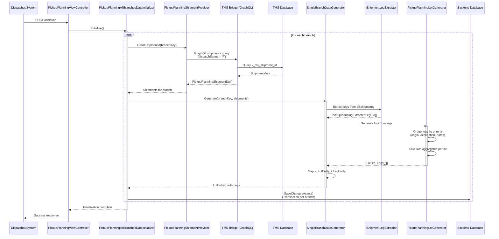
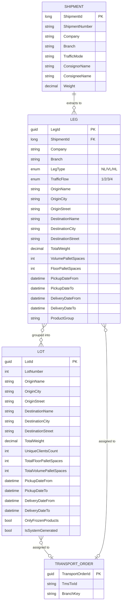
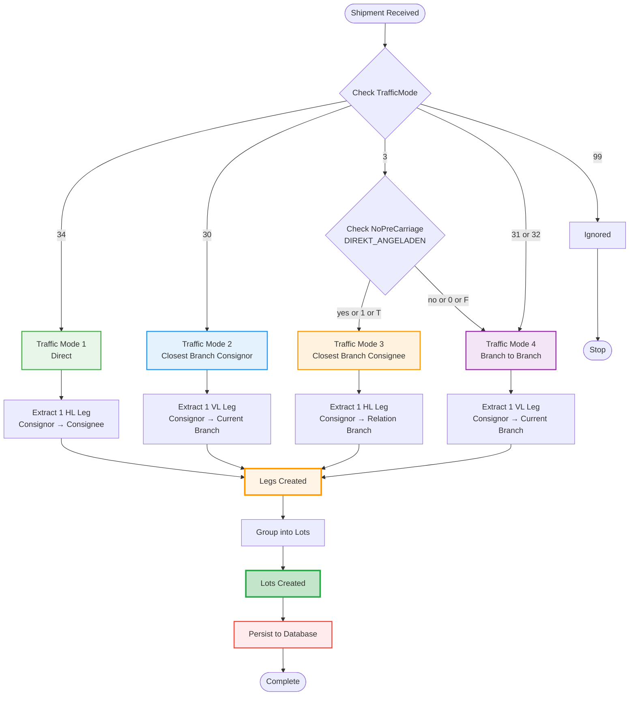

# Leg and Lot Creation Flow Architecture

**Date:** 2026-03-16
**Focus:** Complete end-to-end flow from Shipment data to Leg extraction to Lot generation
**Context:** This document maps the complete architecture for how shipments are transformed into legs and then grouped into lots in the New Dispo system.

---

## Original User Input

Document and visualize the flow of Creating and adding legs/lots end to end. Get inspiration about the way we usually do this from `08_Documentation/2026-02-26_leg-lot-creation-table-sendung/shipment-data-flow-architecture.md` and also check if there are any useful existing diagrams in `07_Diagrams`.

---

## Overview

The New Dispo system transforms shipment data into operational units through a three-stage pipeline:

**Shipment → Leg Extraction → Lot Generation**

There are **two independent pipelines** that both create legs and lots:

1. **CDC Pipeline (Real-time)** - Captures new shipments via Change Data Capture and creates legs/lots incrementally
2. **Batch Pickup Planning Pipeline** - Bulk initializes all unplanned shipments for pickup planning

Both pipelines follow the same fundamental logic but differ in their trigger mechanism and transaction handling.

---

## Complete Architecture Diagram



---

## Data Transformation Pipeline

### Stage 1: Shipment Data Input

**Two Independent Sources:**

#### CDC Path (Real-time) 🟢
- **Trigger:** INSERT event on `sendung` table
- **Data Format:** `GoogleBucketShipmentData` (JSON from Cloud Storage)
- **Handler:** `NewShipmentCreatedEventHandler`
- **Processing:** Single shipment per event

#### Batch Path (On-demand) 🔵
- **Trigger:** Manual POST to `/Initialize` endpoint
- **Data Format:** GraphQL response from TMS Bridge
- **Handler:** `PickupPlanningAllBranchesDataInitializer`
- **Processing:** Bulk processing of all unplanned shipments per branch

Both paths normalize shipment data into **`PickupPlanningShipmentDto`**

---

### Stage 2: Leg Extraction (Traffic Mode Analysis)



#### Traffic Mode Logic Details

**Traffic Mode 1: Direct (TrafficMode "34")**
- **Creates:** 1 HL (Pickup Run) leg
- **Route:** Consignor → Consignee (direct delivery)
- **Use Case:** Direct shipment without hub routing
- **File:** `TrafficMode1LegExtractor.cs`

```
Leg 1 (HL - Pickup Run):
  Origin: Consignor (ConsignorName, ConsignorCity, ConsignorStreet)
  Destination: Consignee (ConsigneeName, ConsigneeCity, ConsigneeStreet)
  LegType: HL
  TrafficFlow: Direct
```

**Traffic Mode 2: Closest Branch Consignor (TrafficMode "30")**
- **Creates:** 1 VL (Pickup) leg
- **Route:** Consignor → Current Branch
- **Use Case:** Pickup from consignor to local branch hub
- **File:** `TrafficMode2LegExtractor.cs`
- **Note:** Currently only generates VL; HL leg (branch → consignee) is commented out

```
Leg 1 (VL - Pickup):
  Origin: Consignor (ConsignorName, ConsignorCity, ConsignorStreet)
  Destination: Current Branch (from BranchAddressDto)
  LegType: VL
  TrafficFlow: ClosestBranchConsignor
```

**Traffic Mode 3: Closest Branch Consignee (TrafficMode "3" with NoPreCarriage = T/1/yes)**
- **Creates:** 1 HL (Pickup Run) leg
- **Route:** Consignor → Relation Branch (near consignee)
- **Use Case:** Direct to destination branch for local delivery
- **File:** `TrafficMode3LegExtractor.cs`

```
Leg 1 (HL - Pickup Run):
  Origin: Consignor (ConsignorName, ConsignorCity, ConsignorStreet)
  Destination: Relation Branch (from ConsigneeServiceArea)
  LegType: HL
  TrafficFlow: ClosestBranchConsignee
```

**Traffic Mode 4: Branch to Branch (TrafficMode "31"/"32" or "3" with NoPreCarriage = F/0/no)**
- **Creates:** 1 VL (Pickup) leg
- **Route:** Consignor → Current Branch
- **Use Case:** Multi-leg routing through branch network
- **File:** `TrafficMode4LegExtractor.cs`
- **Note:** Currently only generates VL; HL and NL legs are commented out

```
Leg 1 (VL - Pickup):
  Origin: Consignor (ConsignorName, ConsignorCity, ConsignorStreet)
  Destination: Current Branch (from BranchAddressDto)
  LegType: VL
  TrafficFlow: BranchToBranch
```

#### Leg Extraction Interface

```csharp
public interface IShipmentLegExtractor
{
    TrafficFlow TrafficFlow { get; }

    bool Supports(PickupPlanningShipmentDto shipment);

    IEnumerable<PickupPlanningExtractedLegDto> Extract(
        PickupPlanningShipmentDto shipment,
        Dictionary<string, BranchAddressDto> relationBranchToBranchAddressMap,
        string databaseIdentifier
    );
}
```

**Key Extraction Data:**
- ShipmentId, Company, Branch
- Origin/Destination addresses (Name, Country, Zipcode, City, Street)
- Consignee information
- Weight metrics (TotalWeight, VolumePalletSpaces, FloorPalletSpaces)
- Date ranges (PickupDateFrom/To, DeliveryDateFrom/To)
- ProductGroup (determines frozen product handling)
- LegType (NL/VL/HL)
- TrafficFlow enum value

---

### Stage 3: Lot Generation (Grouping Logic)

**File:** `PickupPlanningLotGenerator.cs`

#### Grouping Criteria

Legs are grouped into lots based on **identical values** for:

1. **Origin Location**
   - OriginName
   - OriginCity
   - OriginStreet

2. **Destination Location**
   - DestinationName
   - DestinationCity
   - DestinationStreet

3. **Delivery Time Window**
   - DeliveryDateFrom
   - DeliveryDateTo

4. **Pickup Time Window**
   - PickupDateFrom
   - PickupDateTo

5. **Product Type**
   - OnlyFrozenProducts flag (derived from ProductGroup "04")



#### Lot Aggregate Calculations

For each generated lot, the following metrics are computed:

```csharp
TotalWeight = legs.Sum(l => l.TotalWeight ?? 0)
UniqueClientsCount = legs.Select(l => l.ConsigneeName).Distinct().Count()
TotalFloorPalletSpaces = legs.Sum(l => l.FloorPalletSpaces ?? 0)
TotalVolumePalletSpaces = legs.Sum(l => l.VolumePalletSpaces ?? 0)
OnlyFrozenProducts = legs.All(l => l.ProductGroup == "04")
IsSystemGenerated = true
```

#### Lot Matching (CDC Path Only)

**File:** `PickupPlanningSuitableLotForLegProvider.cs`

In the CDC path (single shipment processing), legs are matched to **existing lots** before creating new ones:

**Matching Query:**
1. Database query filters by:
   - Origin (Name, City, Street)
   - Destination (Name, City, Street)
   - Branch Key
   - OnlyFrozenProducts flag
   - IsSystemGenerated = true

2. In-memory LINQ filter for exact date matches:
   - PickupDateFrom?.Date == leg.PickupDateFrom?.Date
   - PickupDateTo?.Date == leg.PickupDateTo?.Date
   - DeliveryDateFrom?.Date == leg.DeliveryDateFrom?.Date
   - DeliveryDateTo?.Date == leg.DeliveryDateTo?.Date

3. **If match found:**
   - Add leg to existing lot
   - Recalculate lot aggregates (weight, clients, pallet spaces)
   - Return lot with `IsNewLotCreated = false`

4. **If no match:**
   - Create new LotEntity
   - Set initial aggregates from leg data
   - Return lot with `IsNewLotCreated = true`

---

## Complete Data Flow Diagrams

### CDC Path (Real-time Single Shipment)



### Batch Path (Bulk Pickup Planning Initialization)



---

## Entity Relationship Diagram



---

## Code File Reference Map

### CDC Pipeline

| Component | File Path | Key Methods/Logic |
|-----------|-----------|-------------------|
| **CDC Entry Point** | `Application/Features/CDC/CDCController.cs` | `ConsumeAsync()` - Receives Pub/Sub messages |
| **Event Handler** | `Application/Features/CDC/EventHandlers/NewShipmentCreated/NewShipmentCreatedEventHandler.cs` | `Handle()` - Lines 50-89<br/>- Maps shipment DTO<br/>- Extracts legs<br/>- Finds/creates lots<br/>- Persists changes |
| **CDC DTOs** | `Infrastructure/GooglePubSub/Dtos/GoogleBucketShipmentData.cs` | Raw shipment data from CDC |

### Batch Pipeline

| Component | File Path | Key Methods/Logic |
|-----------|-----------|-------------------|
| **Controller** | `Application/Features/PickupPlanningView/PickupPlanningViewController.cs` | `Initialize()` - Line 59 |
| **Orchestrator** | `Application/_Shared/Services/InitializePickupPlanningService/PickupPlanningAllBranchesDataInitializer.cs` | `Initialize()` - Lines 41-142<br/>Loops through branches |
| **Branch Processor** | `InitializePickupPlanningService/Handlers/SingleBranchDataGenerator/PickupPlanningSingleBranchDataGenerator.cs` | `Generate()` - Lines 33-48<br/>Extracts legs & generates lots |
| **Shipment Provider** | `Application/_Shared/Services/ShipmentProvider/PickupPlanningShipmentProvider.cs` | `GetAllUnplanned()` - Lines 39-47<br/>GraphQL query builder |

### Leg Extraction (Shared)

| Traffic Mode | File Path | Creates | Route |
|--------------|-----------|---------|-------|
| **Mode 1 (34)** | `Application/_Shared/Services/LegExtractors/TrafficMode1LegExtractor.cs` | 1 HL leg | Consignor → Consignee |
| **Mode 2 (30)** | `Application/_Shared/Services/LegExtractors/TrafficMode2LegExtractor.cs` | 1 VL leg | Consignor → Current Branch |
| **Mode 3 (3+T)** | `Application/_Shared/Services/LegExtractors/TrafficMode3LegExtractor.cs` | 1 HL leg | Consignor → Relation Branch |
| **Mode 4 (31/32/3+F)** | `Application/_Shared/Services/LegExtractors/TrafficMode4LegExtractor.cs` | 1 VL leg | Consignor → Current Branch |

### Lot Generation (Shared)

| Component | File Path | Key Logic |
|-----------|-----------|-----------|
| **Lot Generator** | `Application/_Shared/Services/LotGenerator/PickupPlanningLotGenerator.cs` | `Generate()` - Lines 24-69<br/>Groups legs by criteria |
| **Lot Matcher (CDC)** | `Application/_Shared/Services/SuitableLotForLegProvider/PickupPlanningSuitableLotForLegProvider.cs` | `GetSuitableLotForLeg()` - Lines 16-82<br/>Finds or creates lot |

### Entities & DTOs

| Component | File Path | Purpose |
|-----------|-----------|---------|
| **Leg Entity** | `Domain/Entities/Leg/LegEntity.cs` | Database model for legs |
| **Lot Entity** | `Domain/Entities/Lot/LotEntity.cs` | Database model for lots |
| **Shipment DTO** | `Shared/GraphQL/Dtos/Queries/shipment/PickupPlanningShipmentDto.cs` | Normalized shipment data |
| **Extracted Leg DTO** | `Application/_Shared/Dtos/PickupPlanningExtractedLegDto.cs` | Intermediate leg data |
| **Generated Lot DTO** | `Application/_Shared/Dtos/PickupPlanningGeneratedLotDto.cs` | Intermediate lot data |

### AutoMapper Profiles

| Profile | File Path | Maps |
|---------|-----------|------|
| **Shipment Mapping** | `Application/Features/CDC/EventHandlers/NewShipmentCreated/GoogleBucketShipmentDataToPickupPlanningShipmentDtoProfile.cs` | GoogleBucketShipmentData → PickupPlanningShipmentDto |
| **Leg Extraction** | `Application/_Shared/Services/LegExtractors/Profiles/ExtractedLegDtoProfile.cs` | PickupPlanningShipmentDto → PickupPlanningExtractedLegDto |
| **Leg Entity** | `Application/_Shared/Profiles/PickupPlanningExtractedLegDtoProfile.cs` | PickupPlanningExtractedLegDto → LegEntity |
| **Lot Entity** | `Application/_Shared/Profiles/PickupPlanningGeneratedLotDtoProfile.cs` | PickupPlanningGeneratedLotDto → LotEntity |

**Base Path:** `/Users/matthiasmax/Documents/CAL Consult/Virtual Architect - New Dispo/Code/Disposition-Backend/CALConsult.Disposition.API/`

---

## Traffic Mode Decision Flow



---

## Key Implementation Patterns

### 1. Mapper Chain Pattern

The system uses a multi-stage mapping approach:

```
Raw Data (CDC or GraphQL)
  ↓ [AutoMapper]
PickupPlanningShipmentDto (normalized)
  ↓ [IShipmentLegExtractor]
PickupPlanningExtractedLegDto (intermediate)
  ↓ [AutoMapper]
LegEntity (database entity)
```

**Benefits:**
- Separation of concerns (extraction vs. persistence)
- Consistent data transformation
- Testable intermediate representations

### 2. Strategy Pattern (Leg Extraction)

Each traffic mode implements `IShipmentLegExtractor`:

```csharp
public interface IShipmentLegExtractor
{
    TrafficFlow TrafficFlow { get; }
    bool Supports(PickupPlanningShipmentDto shipment);
    IEnumerable<PickupPlanningExtractedLegDto> Extract(...);
}
```

**Selection Logic:**
```csharp
var extractor = _legExtractors.FirstOrDefault(e => e.Supports(shipment));
var legs = extractor.Extract(shipment, relationBranchMap, branchKey);
```

### 3. Transaction Handling

**CDC Path (Single Shipment):**
```csharp
// Implicit transaction via EF Core
await _dbContext.SaveChangesAsync();
```

**Batch Path (Per Branch):**
```csharp
using var transaction = await _dbContext.Database.BeginTransactionAsync();
try {
    // Process all legs & lots for branch
    await _dbContext.SaveChangesAsync();
    await transaction.CommitAsync();
} catch {
    await transaction.RollbackAsync();
}
```

### 4. Lot Matching Strategy (CDC Only)

**Query + In-Memory Filter:**
1. Database query filters "close enough" matches (location + branch + frozen flag)
2. LINQ applies exact date matching in-memory
3. Avoids complex SQL date comparison logic

**Trade-off:**
- Fetches slightly more data than needed
- Simple SQL query (better performance)
- Flexible date matching logic in C#

### 5. Aggregate Calculation

Lot aggregates are **derived data** calculated from legs:

```csharp
lot.TotalWeight = lot.Legs.Sum(l => l.TotalWeight ?? 0);
lot.UniqueClientsCount = lot.Legs.Select(l => l.ConsigneeName).Distinct().Count();
lot.TotalFloorPalletSpaces = lot.Legs.Sum(l => l.FloorPalletSpaces ?? 0);
lot.TotalVolumePalletSpaces = lot.Legs.Sum(l => l.VolumePalletSpaces ?? 0);
lot.OnlyFrozenProducts = lot.Legs.All(l => l.ProductGroup == "04");
```

**Recalculation Triggers:**
- Adding leg to lot (CDC path)
- Removing leg from lot
- Lot regeneration (batch path)

---

## Important Business Rules

### 1. Frozen Product Segregation

**Rule:** Legs with ProductGroup "04" (frozen) can ONLY be grouped with other frozen legs.

**Implementation:**
```csharp
// In lot matching/grouping
lot.OnlyFrozenProducts = legs.All(l => l.ProductGroup == "04")
```

**Prevents:**
- Mixing frozen and non-frozen products in same lot
- Violates cold chain requirements
- Affects routing and vehicle selection

### 2. Date Range Exact Matching

**Rule:** Lots must have EXACT date range matches (ignoring time component).

**Implementation:**
```csharp
existingLot.PickupDateFrom?.Date == leg.PickupDateFrom?.Date &&
existingLot.PickupDateTo?.Date == leg.PickupDateTo?.Date &&
existingLot.DeliveryDateFrom?.Date == leg.DeliveryDateFrom?.Date &&
existingLot.DeliveryDateTo?.Date == leg.DeliveryDateTo?.Date
```

**Reason:**
- Ensures time window compatibility
- Prevents mixing incompatible delivery schedules
- Critical for dispatcher planning

### 3. System-Generated Lot Flag

**Rule:** Only lots with `IsSystemGenerated = true` are matched for leg addition.

**Purpose:**
- Distinguishes auto-generated lots from manually created ones
- Prevents auto-addition to dispatcher-customized lots
- Preserves manual planning decisions

### 4. Address Exact Matching

**Rule:** Origin AND destination addresses must match exactly (Name, City, Street).

**Implementation:**
```csharp
OriginName == leg.OriginName &&
OriginCity == leg.OriginCity &&
OriginStreet == leg.OriginStreet &&
DestinationName == leg.DestinationName &&
DestinationCity == leg.DestinationCity &&
DestinationStreet == leg.DestinationStreet
```

**Prevents:**
- Grouping legs with different routes
- Routing inefficiencies
- Incorrect vehicle assignment

---

## Comparison: CDC vs Batch Path

| Aspect | CDC Path (Real-time) | Batch Path (Initialization) |
|--------|----------------------|----------------------------|
| **Trigger** | INSERT on sendung table | Manual POST /Initialize |
| **Data Source** | CDC Pub/Sub payload | GraphQL query to TMS Bridge |
| **Processing Unit** | Single shipment | All unplanned shipments per branch |
| **Leg Extraction** | One shipment → legs | Bulk: All shipments → legs |
| **Lot Strategy** | Find existing or create new | Always generate fresh lots |
| **Lot Matching** | Query + in-memory filter | Group-by aggregation |
| **Transaction Scope** | Single SaveChangesAsync | Per-branch transaction |
| **Aggregate Calculation** | Manual recalculation | Calculated during generation |
| **Performance** | Fast (single record) | Slower (bulk processing) |
| **Use Case** | Incremental updates | Initial load + full refresh |

---

## Performance Considerations

### CDC Path Optimizations

1. **Single Leg-at-a-Time Processing:**
   - Minimal database queries per event
   - Fast lot matching with indexed lookups

2. **In-Memory Date Filtering:**
   - Avoids complex SQL date functions
   - Reduces database load

3. **Lazy Lot Creation:**
   - Only creates new lot if no match exists
   - Reduces lot proliferation

### Batch Path Optimizations

1. **Bulk Processing Per Branch:**
   - Reduces round-trips to TMS Bridge
   - Single GraphQL query per branch

2. **In-Memory Grouping:**
   - All lot generation happens in-memory
   - Single database insert for all lots

3. **Parallel Branch Processing (Potential):**
   - Currently sequential
   - Could be parallelized for faster initialization

### Scalability Bottlenecks

1. **CDC Event Volume:**
   - High shipment insert rate → high Pub/Sub volume
   - Mitigated by fast single-record processing

2. **Batch Query Size:**
   - Large branches = large GraphQL responses
   - Potential timeout on very large datasets

3. **Lot Matching Query:**
   - Date filtering in-memory requires fetching candidates
   - Could become slow with many lots per branch

**Recommendations:**
- Add database indexes on lot matching columns
- Consider pagination for large branch queries
- Monitor lot table size per branch

---

## Future Enhancements

### 1. Multi-Leg Traffic Modes

**Current State:** Traffic Modes 2 and 4 only generate VL legs; HL and NL legs are commented out.

**Potential Enhancement:**
- Uncomment HL/NL generation
- Implement full multi-leg routing
- Support pre-carriage + main haul + delivery legs

**Impact:**
- More accurate representation of multi-leg routes
- Better dispatcher visibility
- More complex lot generation logic

### 2. Dynamic Lot Recalculation

**Current State:** Aggregates recalculated manually when legs added (CDC path).

**Potential Enhancement:**
- Computed columns in database
- Automatic recalculation via database triggers
- Cached aggregates with invalidation

**Impact:**
- Reduces application logic complexity
- Ensures aggregates always accurate
- Better query performance

### 3. Lot Optimization Algorithm

**Current State:** Simple grouping by exact matches.

**Potential Enhancement:**
- Fuzzy address matching (similar locations)
- Flexible date range tolerance (±1 day)
- Weight/volume optimization (max capacity constraints)
- Geographic clustering (combine nearby origins)

**Impact:**
- Better vehicle utilization
- Reduced number of transport orders
- More efficient routing

### 4. Parallel Batch Processing

**Current State:** Sequential branch processing.

**Potential Enhancement:**
- Process multiple branches in parallel
- Async/await task parallelism
- Configurable parallelism level

**Impact:**
- Faster initialization
- Better resource utilization
- Scales with branch count

---

## Next Step: Transport Order Creation

This document covers how shipments are transformed into legs and then grouped into lots. The next step in the dispatcher workflow - **creating transport orders from these lots via drag & drop** - is documented separately:

**See:** `02_Explorations/2026-03-16_Transport_Order_Creation_via_Drag_and_Drop/transport-order-creation-via-drag-and-drop.md`

---

## Related Files

- **Shipment Data Flow:** `08_Documentation/2026-02-26_leg-lot-creation-table-sendung/shipment-data-flow-architecture.md`
- **Existing Diagrams:**
  - `07_Diagrams/pickup-planning-leg-flow.wsd`
  - `07_Diagrams/pickup-planning-legs.flow.wsd`
  - `07_Diagrams/pickup-planning-create-transport-order-from-lot.wsd`
  - `07_Diagrams/ERM/pickup-planning.erm.wsd`
- **TMS Bridge GraphQL:** TMS Bridge API documentation
- **CDC Pipeline:** Google Cloud Pub/Sub + Datastream setup

---

## Summary

The New Dispo leg/lot creation system implements a **three-stage transformation pipeline**:

1. **Shipment Input:** CDC (real-time) or Batch (on-demand)
2. **Leg Extraction:** Traffic mode-based routing logic (4 variants)
3. **Lot Generation:** Intelligent grouping by route, dates, and product type

**Key Characteristics:**
- ✅ Two independent pipelines (CDC + Batch) using shared business logic
- ✅ Strategy pattern for traffic mode handling
- ✅ Intelligent lot matching (CDC) vs bulk generation (Batch)
- ✅ Frozen product segregation
- ✅ Exact address and date matching
- ✅ Aggregate calculation from leg data
- ✅ Transactional integrity per branch

**Architecture Strengths:**
- Separation of concerns (extraction vs generation vs persistence)
- Testable intermediate representations (DTOs)
- Flexible strategy selection (traffic modes)
- Consistent business rules across both pipelines

**Next Steps:**
- Consider multi-leg traffic mode completion
- Evaluate lot optimization algorithms
- Monitor performance with production data volumes
- Explore parallel batch processing for faster initialization
