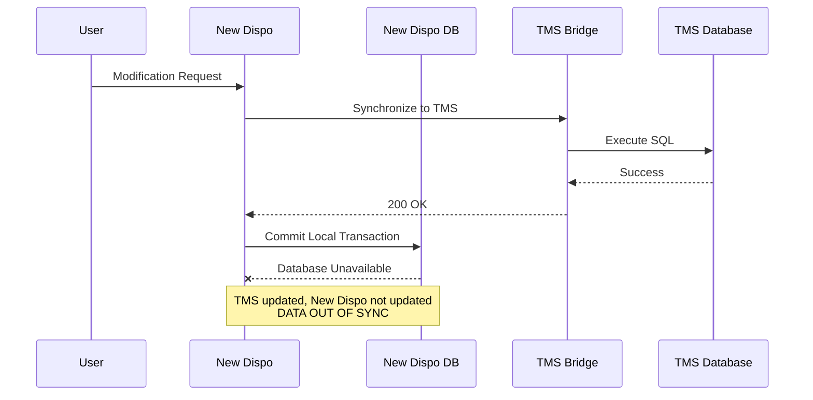
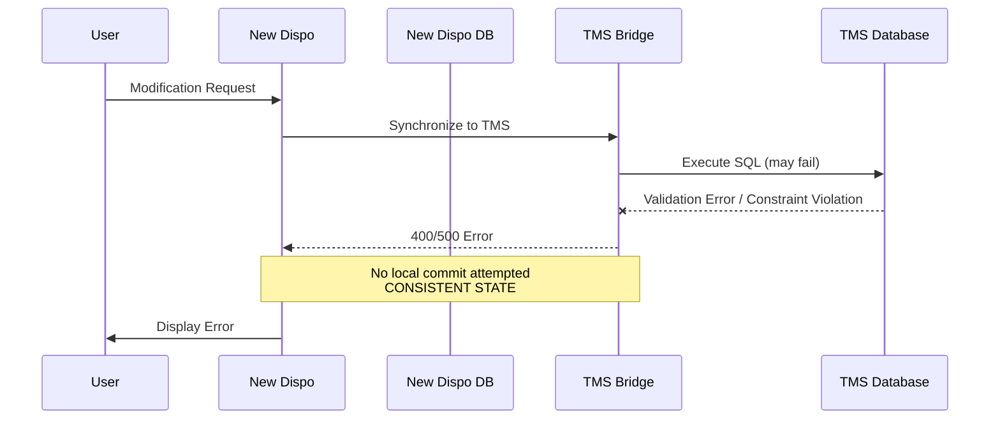
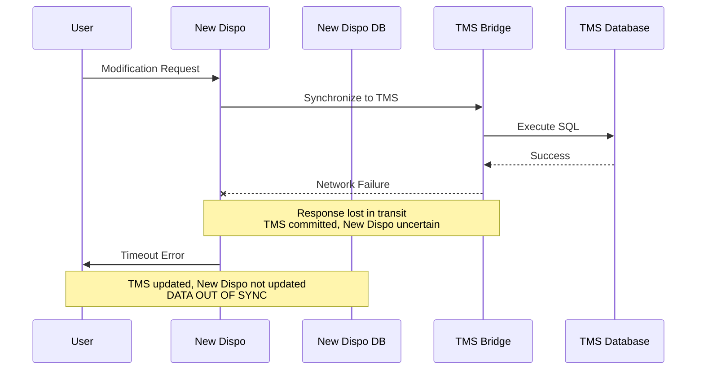

# TMS Synchronization Error Handling Strategy - Decision Paper for three failure scenarios and solution approaches

**Date:** 2026-03-16
**Status:** Exploration

---

## Original User Input

> Decision paper required for TMS synchronization error handling strategy. Three failure scenarios identified during 2026-03-12 refinement session. Need comparison of three architectural approaches: manual user-driven recovery, automated outbox pattern, and event-driven architecture. Decision required for June 2026 release timeline.

---

## Summary

Three failure scenarios threaten data consistency between New Dispo and TMS. Three architectural approaches exist. Decision impacts delivery timeline, operational complexity, user experience. Recommendation: manual recovery for June, migrate to outbox pattern post-release.

---

## Failure Scenarios

### Scenario 1: Local Database Failure Post-TMS Success

TMS Bridge and TMS Database execute successfully, but New Dispo database becomes unavailable before committing local transaction.

**Impact:** TMS reflects change, New Dispo does not. System state inconsistent. User sees error despite TMS success.

---

### Scenario 2: Early Failure from Bridge

TMS Bridge returns 4xx/5xx error before or during TMS Database execution. Local transaction not yet committed.

**Impact:** No inconsistency. Safe to abort. Clear error communication. Easiest scenario.

---

### Scenario 3: Network Interruption Post-TMS Execution

TMS Database executes successfully, but network failure prevents response from reaching New Dispo. Local transaction waits for response that never arrives.

**Impact:** TMS updated, New Dispo unknown state. Rare but critical. Requires reconciliation.

---

## Solution Approaches

### Option 1: Manual User-Driven Recovery

**Principle:** Shift retry responsibility to user. On failure, display error and provide manual retry mechanism.

**Implementation:**
- On sync failure (Scenarios 1, 3), rollback local transaction or mark as "pending"
- User sees error message with "Retry" option
- User manually triggers re-sync operation
- System attempts to reconcile by re-reading TMS state and aligning New Dispo

**Characteristics:**
- **Complexity:** Low. No background workers, no outbox infrastructure
- **Reliability:** Depends on user action. Failures remain visible until resolved
- **User Experience:** Degrades under failure. User must understand and act on errors
- **Development Effort:** Minimal. Can deliver within June timeline
- **Operational Overhead:** Manual intervention required for each failure
- **Data Consistency:** Eventually consistent only if user acts

**Risks:**
- User may ignore errors, leading to prolonged inconsistency
- Non-technical users may not understand retry semantics
- Failure notification fatigue

**Timeline:** Feasible for June release.

---

### Option 2: Outbox Pattern with Auto-Cure

**Principle:** Atomic local transaction stores change and outbox message. Background process ensures eventual TMS synchronization.

**Implementation:**
- Incoming request writes to New Dispo DB and Outbox table in single transaction
- Outbox handler polls for unprocessed messages
- Handler synchronizes to TMS Bridge asynchronously
- On success, mark outbox message processed
- On failure, retry with exponential backoff
- Only irreconcilable errors (e.g., data conflicts, constraint violations) escalate to user

**Characteristics:**
- **Complexity:** Medium. Requires outbox infrastructure, background workers, idempotency handling
- **Reliability:** High. Automated retries ensure eventual consistency without user intervention
- **User Experience:** Optimistic. User sees success immediately. Failures self-heal in background
- **Development Effort:** Moderate to high. Requires design, implementation, testing of outbox mechanism
- **Operational Overhead:** Low once implemented. Automated recovery
- **Data Consistency:** Guaranteed eventual consistency for recoverable errors

**Risks:**
- Implementation time may exceed June deadline
- Complexity in error classification (recoverable vs. non-recoverable)
- Requires monitoring for stuck outbox messages

**Timeline:** Tight for June release. May require scope reduction or timeline extension.

---

### Option 3: Event-Driven Architecture (Cloud Tasks / Pub/Sub)

**Principle:** Decouple New Dispo and TMS synchronization entirely via event queue. All operations asynchronous.

**Implementation:**
- User request commits to New Dispo DB immediately
- Publish event to Cloud Tasks or Pub/Sub
- Cloud Function or worker consumes event and synchronizes to TMS
- On failure, retry via queue mechanism
- User informed of completion via notification or polling

**Characteristics:**
- **Complexity:** High. Fundamental architectural shift. Requires queue infrastructure, event schema, consumer workers
- **Reliability:** Highest. Fully decoupled, resilient to transient failures
- **User Experience:** Async by nature. User may not see immediate TMS reflection. Requires notification mechanism
- **Development Effort:** Significant. Complete redesign of sync flow
- **Operational Overhead:** Low for transient failures. Higher for monitoring and debugging async flows
- **Data Consistency:** Eventual consistency. No atomic guarantees across New Dispo and TMS

**Risks:**
- Major architectural change incompatible with June timeline
- Requires rethinking of user expectations (immediate vs. eventual sync)
- Debugging async flows more complex than synchronous

**Timeline:** Not feasible for June release. Long-term refactoring candidate.

---

## Comparison Matrix

| Criterion | Manual Recovery | Outbox Pattern | Event-Driven |
|-----------|----------------|----------------|--------------|
| Development Effort | Low | Medium-High | Very High |
| Time to June Release | Feasible | Tight | Infeasible |
| Reliability | User-dependent | High | Highest |
| User Experience | Degraded on failure | Optimistic | Async-native |
| Operational Complexity | Manual | Automated | Fully decoupled |
| Data Consistency | Manual resolution | Eventual (auto) | Eventual (queue) |
| Scalability | Limited | Good | Excellent |

---

## Findings

**For June 2026 Release:** Implement **Option 1 (Manual User-Driven Recovery)** as interim solution.

**Rationale:**
- Timeline constraint mandates low-risk, low-complexity approach
- Failures are rare in stable infrastructure (Scenarios 1, 3)
- Scenario 2 (early fail) already handled gracefully
- Manual recovery provides safety net without overengineering

**Post-June Roadmap:** Migrate to **Option 2 (Outbox Pattern)** in subsequent release.

**Rationale:**
- Outbox pattern is industry standard for distributed consistency
- Provides automated recovery without full architectural overhaul
- Event-driven (Option 3) remains long-term vision but requires broader refactoring beyond sync flow

---

## Questions/Open Items

1. **Error messaging UX:** What specific error messages and retry button placement for manual recovery?
2. **Retry operation semantics:** How to handle idempotency and reconciliation logic in manual retry flow?
3. **Error classification:** Which errors are recoverable (transient) vs. non-recoverable (data violations)?
4. **Monitoring requirements:** What metrics needed to track failure frequency and validate approach?
5. **Support team training:** What documentation and runbooks required for manual error scenarios?

---

## Next Steps

### Immediate (this week)
- Finalize error messaging UX for manual retry flow
- Define retry operation semantics (idempotency, reconciliation logic)
- Estimate Option 2 (Outbox) for post-June planning

### Pre-June Release
- Implement manual retry mechanism
- Document known failure scenarios and recovery procedures
- Train support team on error handling

### Post-June
- Design outbox pattern implementation
- Evaluate event-driven architecture for broader system refactoring
- Monitor failure frequency to validate approach

---

## Error Classification Reference

| Error Type | Scenario | Recoverable? | Handling |
|-----------|----------|--------------|----------|
| TMS Bridge 4xx | 2 | No | Immediate user error |
| TMS Bridge 5xx | 2 | Yes (transient) | Retry or user-driven |
| New Dispo DB outage | 1 | Yes (transient) | Retry or user-driven |
| Network timeout | 3 | Uncertain | Reconciliation required |
| TMS constraint violation | 2 | No | User must fix data |

---

## Related Files

- `/00_Meetings/2026-03-12_Refinement-New-Dispo-TMS-Transactional-Behaviour.md` - Source refinement session notes
- `Code/Disposition-Backend/` - New Dispo Backend implementation
- `Code/Disposition-Abstraction-Layer/` - TMS Bridge implementation

---

## Related User Stories/Tasks

- Decision deadline: 2026-03-20 (to maintain June timeline)
- Stakeholders: Ivailo, Yosif, Boyan, Vesela, Matthias
