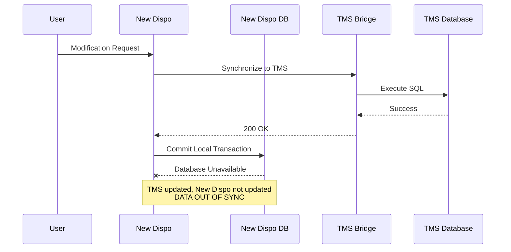
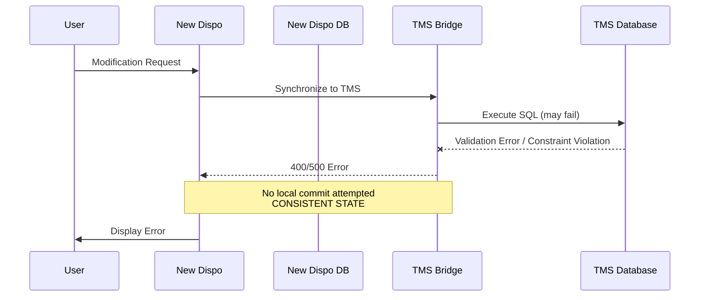
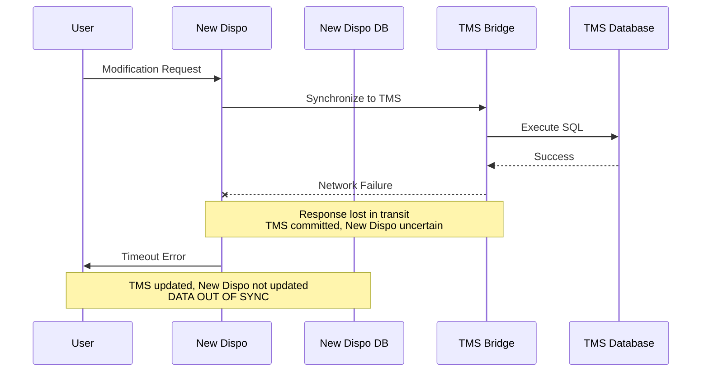

# TMS Synchronization Error Handling Strategy - Decision Paper for three failure scenarios and solution approaches

**Date:** 2026-03-16
**Status:** Exploration

---

## Original User Input

> Decision paper required for TMS synchronization error handling strategy. Three failure scenarios identified during 2026-03-12 refinement session. Need comparison of three architectural approaches: manual user-driven recovery, automated outbox pattern, and event-driven architecture. Decision required for June 2026 release timeline.

---

## Summary

Three failure scenarios threaten data consistency between New Dispo and TMS. Three architectural approaches exist. Decision impacts delivery timeline, operational complexity, user experience. June release targets single branch (not 64-branch Big Bang), reducing risk exposure. Recommendation: manual recovery for June, migrate to outbox pattern post-release.

---

## Failure Scenarios

### Scenario 1: Local Database Failure Post-TMS Success

TMS Bridge and TMS Database execute successfully, but New Dispo database becomes unavailable before committing local transaction.

**Impact:** TMS reflects change, New Dispo does not. System state inconsistent. User sees error despite TMS success.

---

### Scenario 2: Early Failure from Bridge

TMS Bridge returns 4xx/5xx error before or during TMS Database execution. Local transaction not yet committed.

**Impact:** No inconsistency. Safe to abort. Clear error communication. Easiest scenario.

---

### Scenario 3: Network Interruption Post-TMS Execution

TMS Database executes successfully, but network failure prevents response from reaching New Dispo. Local transaction waits for response that never arrives.

**Impact:** TMS updated, New Dispo unknown state. Rare but possible. Requires reconciliation. **Critical constraint:** Idempotency must be guaranteed for retry mechanism to work safely.

---

## Technical Analysis

### When is Outbox Pattern Required?

**Not required for Scenario 2:** If TMS Bridge returns error early (400/500), no state written anywhere. Safe to abort, no recovery mechanism needed.

**Required for Scenario 1:** If TMS succeeds but New Dispo DB unavailable, outbox ensures eventual alignment. This is primary use case justifying outbox pattern.

**Required for Scenario 3:** If TMS executes but response lost, system enters uncertain state. Outbox or manual retry mechanism needed to reconcile.

### Error Classification Strategy

**Recoverable (transient):**
- TMS Bridge 5xx errors (service temporarily unavailable)
- New Dispo DB connection failures
- Network timeouts
- Can be safely retried

**Non-recoverable (permanent):**
- TMS Bridge 4xx errors (validation failures, constraint violations)
- Data inconsistency errors
- Require user intervention to fix root cause before retry

**Uncertain:**
- Network failures after TMS execution (Scenario 3)
- TMS Bridge returns error but operation may have succeeded due to internal bug
- Requires state query to determine if operation completed
- If completed: reconcile; if not: retry

### Key Technical Constraints

1. **Idempotency is non-negotiable:** Without idempotent operations or state-checking capability, retry mechanisms are unsafe
2. **Outbox pattern is reusable:** Once implemented, applies to all future TMS synchronization scenarios
3. **Cloud Tasks/Pub/Sub insufficient:** Cannot provide atomic guarantees needed for reliable two-phase commit
4. **Current execution order matters:** TMS operation executes first, New Dispo second - this sequence justifies outbox over other patterns
5. **TMS is source of truth:** New Dispo currently slave to TMS databases. Event-driven architecture only viable long-term when New Dispo masters its own domains
6. **Single transaction requirement:** Outbox writes to both New Dispo DB and Outbox table in single atomic transaction, enabling reliable recovery

---

## Solution Approaches

### Option 1: Manual User-Driven Recovery

**Principle:** Shift retry responsibility to user. On failure, display error and provide manual retry mechanism.

**Implementation:**
- On sync failure (Scenarios 1, 3), rollback local transaction or mark as "pending"
- User sees error message with "Retry" option
- User manually triggers re-sync operation
- Before retry: Check if TMS operation already executed (query TMS state)
- If already present: Align New Dispo database to match TMS state (reconciliation)
- If not present: Execute full operation again
- **Prerequisite:** TMS operations must be idempotent or state-checkable to enable safe retries

**Characteristics:**
- **Complexity:** Low. No background workers, no outbox infrastructure
- **Reliability:** Depends on user action. Failures remain visible until resolved
- **User Experience:** Degrades under failure. User must understand and act on errors
- **Development Effort:** Minimal. ~10-20% of outbox pattern effort. Can deliver within June timeline
- **June Release Context:** Single branch deployment (not 64-branch Big Bang) reduces risk exposure
- **Operational Overhead:** Manual intervention required for each failure
- **Data Consistency:** Eventually consistent only if user acts

**Risks:**
- User may ignore errors, leading to prolonged inconsistency
- Non-technical users may not understand retry semantics
- Failure notification fatigue

**Timeline:** Feasible for June release.

---

### Option 2: Outbox Pattern with Auto-Cure

**Principle:** Atomic local transaction stores change and outbox message. Background process ensures eventual TMS synchronization.

**Implementation:**
- Incoming request writes to New Dispo DB and Outbox table in single transaction
- Outbox handler polls for unprocessed messages
- Handler synchronizes to TMS Bridge asynchronously
- On success, mark outbox message processed
- On failure, retry with exponential backoff
- Only irreconcilable errors (e.g., data conflicts, constraint violations) escalate to user

**Characteristics:**
- **Complexity:** Medium. Requires outbox infrastructure, background workers, idempotency handling
- **Reliability:** High. Automated retries ensure eventual consistency without user intervention
- **User Experience:** Optimistic. User sees success immediately. Failures self-heal in background
- **Development Effort:** Moderate to high. Requires design, implementation, testing of outbox mechanism
- **Operational Overhead:** Low once implemented. Automated recovery
- **Data Consistency:** Guaranteed eventual consistency for recoverable errors

**Risks:**
- Implementation time may exceed June deadline
- Complexity in error classification (recoverable vs. non-recoverable)
- Requires monitoring for stuck outbox messages

**Timeline:** Tight for June release. May require scope reduction or timeline extension.

---

### Option 3: Event-Driven Architecture (Cloud Tasks / Pub/Sub)

**Principle:** Decouple New Dispo and TMS synchronization entirely via event queue. All operations asynchronous.

**Implementation:**
- User request commits to New Dispo DB immediately
- Publish event to Cloud Tasks or Pub/Sub
- Cloud Function or worker consumes event and synchronizes to TMS
- On failure, retry via queue mechanism
- User informed of completion via notification or polling

**Characteristics:**
- **Complexity:** High. Fundamental architectural shift. Requires queue infrastructure, event schema, consumer workers
- **Reliability:** Highest. Fully decoupled, resilient to transient failures
- **User Experience:** Async by nature. User may not see immediate TMS reflection. Requires notification mechanism
- **Development Effort:** Significant. Complete redesign of sync flow
- **Operational Overhead:** Low for transient failures. Higher for monitoring and debugging async flows
- **Data Consistency:** Eventual consistency. **No atomic guarantees** - cannot reliably publish to Cloud Tasks/Pub/Sub and commit to database in single transaction. If publishing to queue first then database fails, message is lost. If committing to database first then queue publish fails, state misalignment occurs. Outbox pattern solves this; event queues alone do not.

**Risks:**
- Major architectural change incompatible with June timeline
- Requires rethinking of user expectations (immediate vs. eventual sync)
- Debugging async flows more complex than synchronous
- Only viable when New Dispo becomes master of data (long-term goal), not while TMS remains source of truth

**Timeline:** Not feasible for June release. Long-term refactoring candidate.

---

## Comparison Matrix

| Criterion | Manual Recovery | Outbox Pattern | Event-Driven |
|-----------|----------------|----------------|--------------|
| Development Effort | Low | Medium-High | Very High |
| Time to June Release | Feasible | Tight | Infeasible |
| Reliability | User-dependent | High | Highest |
| User Experience | Degraded on failure | Optimistic | Async-native |
| Operational Complexity | Manual | Automated | Fully decoupled |
| Data Consistency | Manual resolution | Eventual (auto) | Eventual (queue) |
| Scalability | Limited | Good | Excellent |

---

## Findings

**For June 2026 Release:** Implement **Option 1 (Manual User-Driven Recovery)** as interim solution.

**Rationale:**
- Timeline constraint mandates low-risk, low-complexity approach
- Single branch deployment in June (not 64-branch Big Bang) limits blast radius of potential failures
- Failures are rare in stable infrastructure (Scenarios 1, 3)
- Scenario 2 (early fail) already handled gracefully
- Manual recovery provides safety net without overengineering
- Effort is ~10-20% of outbox implementation, preserving budget for post-June improvements
- Outbox pattern is "relatively complex and requires very careful testing" - significant investment for tight timeline
- Business may tolerate manual resolution if failure frequency low on single branch

**Post-June Roadmap:** Migrate to **Option 2 (Outbox Pattern)** in subsequent release.

**Rationale:**
- Outbox pattern is industry standard for distributed consistency
- Provides automated recovery without full architectural overhaul
- Event-driven (Option 3) remains long-term vision but requires broader refactoring beyond sync flow

---

## Questions/Open Items

1. **Idempotency verification (CRITICAL):** Must verify TMS operations are idempotent or state-checkable before implementing any retry mechanism. "If not, we cannot do it. If it is, we can do it." Without idempotency guarantee, retry strategies are unsafe.
2. **Error messaging UX:** What specific error messages and retry button placement for manual recovery?
3. **Retry operation semantics:** Check TMS state before retry - if operation already succeeded, align New Dispo; if not, execute full operation. How to implement state-checking queries?
4. **Error classification:** Which errors are recoverable (transient) vs. non-recoverable (data violations)? How to distinguish at runtime?
5. **Monitoring requirements:** What metrics needed to track failure frequency and validate approach?
6. **Support team training:** What documentation and runbooks required for manual error scenarios?
7. **Client budget discussion:** Present effort estimates for Options 1 & 2 to align expectations and budget allocation

---

## Next Steps

### Immediate (this week)
- **Team:** Reflect on and document all error scenarios discussed (build backlog of failure cases)
- **Matthias:** Prepare effort estimates for Option 1 (manual) and Option 2 (outbox) for client discussion
- **Team:** Verify idempotency guarantees in TMS Bridge operations (blocking requirement)
- **Team:** Provide feedback/counterarguments on approach selection

### Pre-Decision (by 2026-03-20)
- Client discussion: Present options, effort estimates, trade-offs
- Finalize approach selection based on budget and timeline
- Define error messaging UX if Option 1 selected

### Pre-June Release (if Option 1 selected)
- Implement manual retry mechanism with state-checking logic
- Document known failure scenarios and recovery procedures
- Train support team on error handling and manual resolution process
- Monitor single-branch deployment for failure patterns

### Post-June
- Evaluate Option 2 (Outbox) implementation based on observed failure frequency
- If justified: Design outbox pattern for automated recovery
- Long-term: Event-driven architecture when New Dispo becomes data master

---

## Error Classification Reference

| Error Type | Scenario | Recoverable? | Handling |
|-----------|----------|--------------|----------|
| TMS Bridge 4xx | 2 | No | Immediate user error |
| TMS Bridge 5xx | 2 | Yes (transient) | Retry or user-driven |
| New Dispo DB outage | 1 | Yes (transient) | Retry or user-driven |
| Network timeout | 3 | Uncertain | Reconciliation required |
| TMS constraint violation | 2 | No | User must fix data |

---

## Related Files

- `/00_Meetings/2026-03-12_Refinement-New-Dispo-TMS-Transactional-Behaviour.md` - Source refinement session summary
- `/00_Meetings/2026-03-12/Weekly Refinement - NewDispo - 2026.03.12.docx` - Full meeting transcript
- `Code/Disposition-Backend/` - New Dispo Backend implementation
- `Code/Disposition-Abstraction-Layer/` - TMS Bridge implementation

---

## Related User Stories/Tasks

- Decision deadline: 2026-03-20 (to maintain June timeline)
- Stakeholders: Ivailo, Yosif, Boyan, Vesela, Matthias
