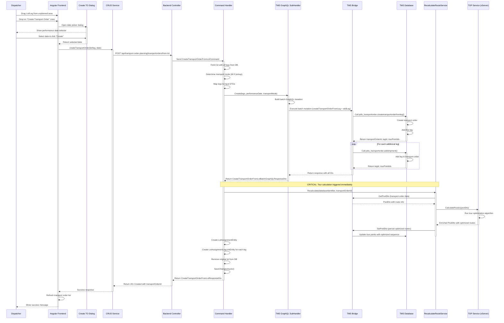
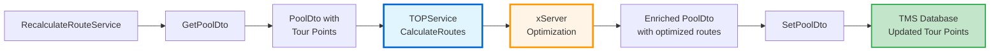
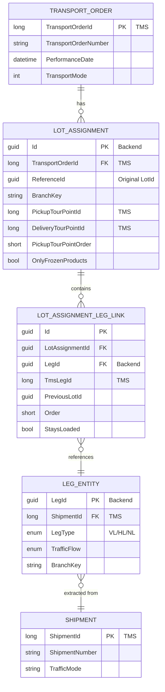

# Transport Order Creation via Drag and Drop

**Date:** 2026-03-16
**Focus:** Complete dispatcher planning flow from drag & drop to transport order creation with tour calculation
**Context:** This document maps how dispatchers create transport orders by dragging lots/legs from the unplanned area onto the planning area in the New Dispo Frontend.

---

## Original User Input

User drags and drops a leg or lot from the unplanned (left) area in the Frontend to the "create transport order" area resulting in:
1. A transport order to be created
2. The lot/legs assigned to that transport order
3. The tour calculation to be started

---

## Overview

The New Dispo system provides a drag-and-drop interface for dispatchers to create transport orders from unplanned lots or legs. This flow orchestrates:

**Frontend → Backend → TMS Bridge → TMS Database → Tour Calculation → Response**

Key characteristics:
- ✅ User-initiated via drag & drop (Angular CDK)
- ✅ Date picker dialog for performance date selection
- ✅ Batch GraphQL mutation to TMS
- ✅ Automatic tour calculation trigger (xServer)
- ✅ Transformation from LotEntity to LotAssignmentEntity
- ✅ Transactional integrity across the stack

---

## Complete Drag & Drop Flow Diagram



---

## Step-by-Step Flow

### 1. Frontend - Drag & Drop UI (Angular CDK)

**File:** `Code/Disposition-Frontend/apps/nagel-cal-disposition/src/app/components/planning-list/planning-list.component.ts`

#### HTML Template (Drop Zone)

**File:** `planning-list.component.html`

```html
<div
  class="drop-zone h-[100px] flex justify-center items-center mb-4"
  (cdkDropListDropped)="dropOnCreateTransportOrder($event)"
  cdkDropList
  [cdkDropListConnectedTo]="['shipments']"
  (cdkDropListEntered)="setIsHoveringOverCreateTransportOrder(true)"
  (cdkDropListExited)="setIsHoveringOverCreateTransportOrder(false)"
  id="icon-dropzone"
>
    <mat-icon [svgIcon]="getIconName()" [class]="getCreateTransportOrderAreaClassName()"></mat-icon>
</div>
```

**Key Features:**
- `cdkDropList` - Angular CDK directive for drop zone
- `[cdkDropListConnectedTo]="['shipments']"` - Connects to draggable items
- `(cdkDropListDropped)` - Event fired when item is dropped
- Hover state management for visual feedback

---

#### TypeScript Handler (Line 182)

```typescript
dropOnCreateTransportOrder(event: CdkDragDrop<LotCardConfig>) {
  const dialogRef = this.dialog.open(CreateTransportOrderDialogComponent, {
    data: CREATE_TRANSPORT_ORDER_DIALOG_TEXT,
    width: '340px',
    height: '260px',
    panelClass: 'create-to-panel-class',
    position: { top: '450px' }
  });

  dialogRef.afterClosed().subscribe((selectedDate: Date) => {
    selectedDate && this.pickupPlanningTransportOrdersActionsService.createTransportOrder(
      event.item.data,  // The dragged lot/leg
      () => { this.onRefreshData(); },  // Success callback
      selectedDate  // Selected performance date
    );
  });
}
```

**Flow:**
1. User drops lot/leg on zone
2. Material Dialog opens for date selection
3. User selects performance date
4. On confirmation, service method is called with:
   - Dragged item data (lot or leg)
   - Success callback (refresh UI)
   - Selected date

---

#### Dialog Component

**File:** `Code/Disposition-Frontend/apps/nagel-cal-disposition/src/app/components/create-transport-order-dialog/create-transport-order-dialog.component.ts`

```typescript
const CREATE_TRANSPORT_ORDER_DIALOG_TEXT = {
  title: $localize`Create a transport order`,
  message: $localize`Please select a start date and time for creating the transport order`,
  confirm: $localize`Create`,
  cancel: $localize`Cancel`
};
```

**Purpose:**
- Collects performance date from dispatcher
- Provides user-friendly date/time picker
- Validates input before proceeding

---

### 2. Frontend - API Service Layer

**File:** `Code/Disposition-Frontend/apps/nagel-cal-disposition/src/app/services/crud-pickup-planning-transport-orders.service.ts`

```typescript
createTransportOrder(
  draggedCard: LotCardConfig,
  onSuccess: Function,
  performanceDate: Date
) {
  protectSubscription(
    this.getCreateTransportOrderRequest(draggedCard, performanceDate),
    (response) => this.onCreateDataSuccessfulRetrieval(onSuccess, response),
    (error) => this.onCreateDataErrorRetrieval(error)
  );
}

getCreateTransportOrderRequest(
  draggedCard: LotCardConfig,
  performanceDate: Date
) {
  // Determine if it's a lot or leg
  const idType = this.isLotType(draggedCard) ? 'lotId' : 'legId';

  // Select appropriate endpoint
  const url = idType === 'lotId'
    ? `${environment.apiUrl}/api/transport-order-planning/transportorders/from-lot`
    : `${environment.apiUrl}/api/transport-order-planning/transportorders/from-leg`;

  // Build request payload
  const requestPayload = {
    [idType]: draggedCard.id,
    performanceDate: getTimezoneAdjustedDate(performanceDate)
  };

  return this.requestService.postRequest<
    CreateTransportOrderRequest,
    CreateTransportOrderResponse
  >(url, requestPayload);
}
```

**Endpoints:**
- `POST /api/transport-order-planning/transportorders/from-lot` - Create from lot
- `POST /api/transport-order-planning/transportorders/from-leg` - Create from single leg

**Request Payload:**
```typescript
{
  lotId: "123e4567-e89b-12d3-a456-426614174000",  // OR legId
  performanceDate: "2026-03-16T10:00:00.000Z"
}
```

---

### 3. Backend - Controller

**File:** `Code/Disposition-Backend/CALConsult.Disposition.API/Application/Features/TransportOrderPlanning/TransportOrderPlanningController.cs`

```csharp
[ApiController]
[Route("api/transport-order-planning")]
public class TransportOrderPlanningController(IMediator mediator) : ControllerBase
{
  private readonly IMediator _mediator = mediator;

  /// <summary>
  /// Creates a transport order from a lot
  /// </summary>
  [HttpPost]
  [Route("transportorders/from-lot")]
  public async Task<JsonResult> CreateTransportOrderFromLot(
      [FromBody] CreateTransportOrderFromLotRequestDto createTransportOrderFromLotRequestDto)
  {
    var databaseIdentifier = Request.GetDatabaseIdentifier();

    CreateTransportOrderFromLotResponseDto result = await _mediator.Send(
      new CreateTransportOrderFromLotCommand(
        createTransportOrderFromLotRequestDto,
        databaseIdentifier
      )
    );

    return new JsonResult(result) { StatusCode = StatusCodes.Status201Created };
  }

  /// <summary>
  /// Creates a transport order from a single leg
  /// </summary>
  [HttpPost]
  [Route("transportorders/from-leg")]
  public async Task<JsonResult> CreateTransportOrderFromLeg(
      [FromBody] CreateTransportOrderFromLegRequestDto createTransportOrderFromLegRequestDto)
  {
    var databaseIdentifier = Request.GetDatabaseIdentifier();

    CreateTransportOrderFromLegResponseDto result = await _mediator.Send(
      new CreateTransportOrderFromLegCommand(
        createTransportOrderFromLegRequestDto,
        databaseIdentifier
      )
    );

    return new JsonResult(result) { StatusCode = StatusCodes.Status201Created };
  }
}
```

**DTOs:**

**Request:**
```csharp
public class CreateTransportOrderFromLotRequestDto
{
  public Guid LotId { get; set; }
  public DateTime PerformanceDate { get; set; }
}
```

**Response:**
```csharp
public class CreateTransportOrderFromLotResponseDto
{
  public long TransportOrderId { get; set; }
}
```

---

### 4. Backend - Command Handler (CQRS)

**File:** `Code/Disposition-Backend/CALConsult.Disposition.API/Application/Features/TransportOrderPlanning/Requests/CreateTransportOrderFromLot/CreateTransportOrderFromLotCommandHandler.cs`

**Complete Handler Logic (Lines 32-100):**

```csharp
public class CreateTransportOrderFromLotCommandHandler(
    AppDbContext appDbContext,
    ICreateTransportOrderFromLotSubHandler createTransportOrderFromLotSubHandler,
    IMapper mapper,
    IRecalculateRouteService recalculateRouteService)
  : ICommandHandler<CreateTransportOrderFromLotCommand, CreateTransportOrderFromLotResponseDto>
{
  public async Task<CreateTransportOrderFromLotResponseDto> Handle(
      CreateTransportOrderFromLotCommand request,
      CancellationToken cancellationToken)
  {
    // 1. Extract parameters
    var databaseIdentifier = request.DatabaseIdentifier;
    Guid lotId = request.Request.LotId;
    DateTime performanceDate = request.Request.PerformanceDate;

    // 2. Fetch lot with all legs from database
    LotEntity? lot = await _appDbContext.Lots
      .Include(l => l.Legs)
      .Where(lot => lot.BranchKey.Equals(databaseIdentifier))
      .FirstOrDefaultAsync(l => l.LotId == lotId)
      ?? throw new NotFoundException($"Lot with id: {lotId} was not found!");

    var legs = lot.Legs.ToList();

    // 3. Determine transport mode (60 = pickup transport order)
    var isPickupLot = legs.Any(leg =>
      ((leg.TrafficFlow == TrafficFlow.Direct ||
        leg.TrafficFlow == TrafficFlow.ClosestBranchConsignee) &&
        leg.LegType == LegType.HL)
      ||
      ((leg.TrafficFlow == TrafficFlow.ClosestBranchConsignor ||
        leg.TrafficFlow == TrafficFlow.BranchToBranch) &&
        leg.LegType == LegType.VL)
    );

    int? transportOrderTransportMode = isPickupLot ? 60 : null;

    // 4. Map leg entities to input DTOs
    List<CraeteTransportOrderLegDataInputDto> mappedLegs =
      MapLegEntitiesToCreateTransportOrderInputs(legs);

    CraeteTransportOrderLegDataInputDto legToTransportOrder = mappedLegs.First();
    mappedLegs.RemoveAt(0);  // Remove first leg (used in initial creation)

    // 5. Call TMS Bridge to create transport order
    CreateTransportOrderFromLotBatchGraphQLResponseDto response =
      await createTransportOrderFromLotSubHandler.Create(
        legToTransportOrder,
        mappedLegs,
        performanceDate,
        transportOrderTransportMode,
        databaseIdentifier,
        cancellationToken);

    // 6. Extract TMS response IDs
    var tmsLegIds = new List<long>();

    CreatedTransportOrderGraphQLResponseDto createdTransportOrder =
      response.CreatedTransportOrderGraphQLResponse.FirstOrDefault()
      ?? throw new InvalidOperationException("CreatedTransportOrderGraphQLResponseDto response is null");

    tmsLegIds.Add(createdTransportOrder.TmsLegId);

    List<CreateAndAddLegTourPointsGraphQLResponse> createAndAddLegTourPoints =
      response.CreateAndAddLegTourPoints
      ?? throw new InvalidOperationException("CreateAndAddLegTourPoints response is null");

    tmsLegIds.AddRange(createAndAddLegTourPoints.Select(x => x.LegId));

    // 7. TRIGGER TOUR CALCULATION (CRITICAL STEP!)
    await recalculateRouteService.Recalculate(
      databaseIdentifier,
      createdTransportOrder.TransportOrderId,
      cancellationToken);

    // 8. Create LotAssignmentEntity linking legs to transport order
    LotAssignmentEntity lotAssignment = _mapper.Map<LotAssignmentEntity>(legToTransportOrder);
    var newLotAssignmentId = Guid.NewGuid();

    lotAssignment.Id = newLotAssignmentId;
    lotAssignment.OnlyFrozenProducts = legToTransportOrder.ProductGroup == "04";
    lotAssignment.BranchKey = lot.BranchKey;
    lotAssignment.PickupTourPointId = createdTransportOrder.PickupPointId;
    lotAssignment.DeliveryTourPointId = createdTransportOrder.DeliveryPointId;
    lotAssignment.PickupTourPointOrder = 1;
    lotAssignment.ReferenceId = lot.LotId;
    lotAssignment.TransportOrderId = createdTransportOrder.TransportOrderId;

    // 9. Create LotAssignmentLegLinkEntity for each leg
    lotAssignment.LegLinks = legs.Select((leg, index) => new LotAssignmentLegLinkEntity
    {
      Id = Guid.NewGuid(),
      LotAssignmentId = newLotAssignmentId,
      LegId = leg.LegId,
      PreviousLotId = lot.LotId,
      Order = (short)(index + 1),
      StaysLoaded = false,
      TmsLegId = tmsLegIds[index],
    }).ToList();

    // 10. Update database
    _appDbContext.LotAssignments.Add(lotAssignment);
    _appDbContext.Lots.Remove(lot);  // Remove original lot
    await _appDbContext.SaveChangesAsync(cancellationToken);

    return new CreateTransportOrderFromLotResponseDto
    {
      TransportOrderId = createdTransportOrder.TransportOrderId
    };
  }
}
```

**Key Operations:**
1. Fetch lot with legs
2. Determine transport mode based on leg types
3. Map to DTOs
4. Create transport order in TMS (via GraphQL)
5. **Trigger tour calculation** ⚡
6. Create assignment entities in Backend DB
7. Remove original lot
8. Return response

---

### 5. Backend - TMS Bridge GraphQL Builder

**File:** `Code/Disposition-Backend/CALConsult.Disposition.API/Application/Features/TransportOrderPlanning/Requests/CreateTransportOrderFromLot/SubHandlers/CreateTransportOrderFromLotSubHandler.cs`

**Purpose:** Builds a batch GraphQL mutation with multiple operations

#### Batch Mutation Structure

**Operation 1 - Create Transport Order with First Leg:**
```graphql
mutation CallCreateTransportOrderFromLeg {
  createTransportOrderFromLeg{shipmentId}: callCreateTransportOrderFromLeg(
    databaseIdentifier: "BRANCH_KEY"
    input: {
      company: 1
      branch: 101
      performanceDate: "2026-03-16T10:00:00"
      transportMode: 60
      shipmentId: 123456
      legType: "VL"
    }
  ) {
    transportOrderId @export(as: "transportOrderId")
    legId
    pickupPointId
    deliveryPointId
  }
}
```

**Key Feature:** `@export(as: "transportOrderId")` makes the ID available to subsequent mutations

---

**Operation 2+ - Add Remaining Legs (Loop):**
```graphql
mutation CallCreateAndAddLeg{shipmentId}($transportOrderId: Long!) {
  callCreateAndAddLeg{shipmentId}: callCreateAndAddLeg(
    databaseIdentifier: "BRANCH_KEY"
    input: {
      transportOrderId: $transportOrderId
      shipmentId: 789012
      legType: "VL"
    }
  ) {
    legId
    pickupPointId
    deliveryPointId
  }
}
```

**Benefits of Batch Mutation:**
- Single HTTP request for entire operation
- Transactional integrity
- Reuses transportOrderId from first mutation
- Efficient network usage

---

### 6. TMS Bridge - GraphQL Mutations

**Location:** `Code/Disposition-Abstraction-Layer/CALConsult.TMSBridge.API/GraphQL/Mutations/PdisTransportOrder/`

#### CreateTransportOrderFromLegMutation

**File:** `CreateTransportOrderFromLeg/CreateTransportOrderFromLegMutation.cs`

```csharp
public async Task<CreateTransportOrderFromLegResponse> CallCreateTransportOrderFromLeg(
    IRoutineExecutor executor,
    IDbContextProvider<BranchDbContext> dbContextProvider,
    string databaseIdentifier,
    CreateTransportOrderFromLegInput input)
{
  // Get database context for the branch
  BranchDbContext dbContext = await dbContextProvider.GetDbContext(databaseIdentifier);

  // Build routine call to TMS stored function
  var routine = new Routine
  {
    Schema = "pdis_transportorder",
    Name = "createtransportorderfromleg",
    Parameters = new Dictionary<string, object>
    {
      { "p_firma", input.Company },
      { "p_niederlassung", input.Branch },
      { "p_datum", input.PerformanceDate },
      { "p_modus", input.TransportMode },
      { "p_sendung_tix", input.ShipmentId },
      { "p_legtype", input.LegType },
      { "p_mode", "NEW_DISPO" }
    }
  };

  // Execute TMS stored function
  var result = await executor.ExecuteRoutineAsync(
    dbContext,
    OperationType.Function,
    routine
  );

  // Map result to response
  return new CreateTransportOrderFromLegResponse
  {
    TransportOrderId = result.GetValue<long>("transportOrderId"),
    LegId = result.GetValue<long>("legId"),
    PickupPointId = result.GetValue<long>("pickupPointId"),
    DeliveryPointId = result.GetValue<long>("deliveryPointId")
  };
}
```

**TMS Stored Function:** `pdis_transportorder.createtransportorderfromleg`

**Parameters:**
- `p_firma` - Company ID
- `p_niederlassung` - Branch ID
- `p_datum` - Performance date
- `p_modus` - Transport mode (60 = pickup)
- `p_sendung_tix` - Shipment TIX ID
- `p_legtype` - Leg type (VL, HL, NL)
- `p_mode` - Source system identifier

**Returns:**
- Transport Order ID (TMS primary key)
- Leg ID (TMS leg primary key)
- Pickup Tour Point ID
- Delivery Tour Point ID

---

#### CreateAndAddLegMutation

**File:** `CreateAndAddLeg/CreateAndAddLegMutation.cs`

```csharp
public async Task<CreateAndAddLegTourPointsGraphQLResponse> CallCreateAndAddLeg(
    IRoutineExecutor executor,
    IDbContextProvider<BranchDbContext> dbContextProvider,
    string databaseIdentifier,
    CreateAndAddLegInput input)
{
  // Calls TMS stored function: pdis_transportorder.addshipment
  // Adds additional leg to existing transport order

  var routine = new Routine
  {
    Schema = "pdis_transportorder",
    Name = "addshipment",
    Parameters = new Dictionary<string, object>
    {
      { "p_ta_tix", input.TransportOrderId },
      { "p_sendung_tix", input.ShipmentId },
      { "p_legtype", input.LegType }
    }
  };

  var result = await executor.ExecuteRoutineAsync(dbContext, OperationType.Function, routine);

  return new CreateAndAddLegTourPointsGraphQLResponse
  {
    LegId = result.GetValue<long>("legId"),
    PickupPointId = result.GetValue<long>("pickupPointId"),
    DeliveryPointId = result.GetValue<long>("deliveryPointId")
  };
}
```

**TMS Stored Function:** `pdis_transportorder.addshipment`

---

### 7. Tour Calculation Service (CRITICAL)

**File:** `Code/Disposition-Backend/CALConsult.Disposition.API/Application/_Shared/Services/RecalculateRouteService/RecalculateRouteService.cs`

**Triggered immediately after transport order creation (Line 72 in handler):**

```csharp
public class RecalculateRouteService(
    IPoolDtoProvider poolDtoProvider,
    ITOPService topService,
    ISetPoolDtoExecutor setPoolDtoExecutor,
    ILogger<RecalculateRouteService> logger)
  : IRecalculateRouteService
{
  public async Task Recalculate(
      string databaseIdentifier,
      long transportOrderId,
      CancellationToken cancellationToken)
  {
    try
    {
      // 1. Get transport order pool data from TMS Bridge
      PoolDto poolDto = await poolDtoProvider.Get(
        databaseIdentifier,
        transportOrderId);

      // 2. Call TOP Service (Tour Optimization Package) for route calculation
      PoolDto enrichedPoolDto = await topService.CalculateRoutes(
        poolDto,
        cancellationToken);

      // 3. Persist the optimized routes back to TMS
      await setPoolDtoExecutor.Execute(enrichedPoolDto, databaseIdentifier);
    }
    catch (Exception ex)
    {
      logger.LogError(ex, ex.Message);
      // Does NOT throw - fails silently to avoid blocking transport order creation
    }
  }
}
```

#### Tour Calculation Flow



**Services:**
1. **PoolDtoProvider** - Fetches transport order data (legs, tour points, routes)
2. **TOPService** - Calls xServer for route optimization
3. **SetPoolDtoExecutor** - Persists optimized routes back to TMS

**Key Characteristic:** Errors are logged but **do NOT block** transport order creation

---

### 8. Additional Operations

#### Assigning Legs/Lots to Existing Transport Orders

**Endpoints:**
- `PUT /api/transport-order-planning/transportorders/{transportOrderId}/legs/{legId}`
- `PUT /api/transport-order-planning/transportorders/{transportOrderId}/lots/{lotId}`

**Handlers:**
- `AssignLegToTransportOrderCommandHandler`
- `AssignLotToTransportOrderCommandHandler`

**Flow (Similar to Creation):**
1. Fetch leg/lot from database
2. Call TMS Bridge to add leg to transport order (`callCreateAndAddLeg`)
3. **Trigger tour recalculation** (same service)
4. Create `LotAssignmentEntity` and `LotAssignmentLegLinkEntity`
5. Update original lot:
   - If lot still has legs → Recalculate aggregates
   - If lot is empty → Remove lot
6. Save to database

---

## Data Model Transformation

### Before Transport Order Creation

```
LotEntity (system-generated, unplanned)
  ├── LotId: Guid
  ├── BranchKey: string
  ├── IsSystemGenerated: true
  ├── TotalWeight: decimal
  ├── UniqueClientsCount: int
  ├── OnlyFrozenProducts: bool
  └── Legs: Collection<LegEntity>
        ├── LegEntity 1
        │     ├── LegId: Guid
        │     ├── ShipmentId: long
        │     ├── LegType: enum (VL/HL/NL)
        │     └── TrafficFlow: enum
        ├── LegEntity 2
        └── LegEntity 3
```

### After Transport Order Creation

```
LotAssignmentEntity (planned, assigned to transport order)
  ├── Id: Guid (new)
  ├── TransportOrderId: long (from TMS) ← KEY LINK
  ├── ReferenceId: Guid (original LotId)
  ├── BranchKey: string
  ├── PickupTourPointId: long (from TMS)
  ├── DeliveryTourPointId: long (from TMS)
  ├── PickupTourPointOrder: short
  └── LegLinks: Collection<LotAssignmentLegLinkEntity>
        ├── LotAssignmentLegLinkEntity
        │     ├── Id: Guid
        │     ├── LotAssignmentId: Guid
        │     ├── LegId: Guid (Backend) ← Links to existing LegEntity
        │     ├── TmsLegId: long (TMS) ← Links to TMS leg
        │     ├── PreviousLotId: Guid
        │     ├── Order: short
        │     └── StaysLoaded: bool
        ├── LotAssignmentLegLinkEntity (leg 2)
        └── LotAssignmentLegLinkEntity (leg 3)

Original LotEntity → DELETED from database
LegEntity records → REMAIN (can be reused)
```

**Key Transformation:**
- `LotEntity` (temporary grouping) → `LotAssignmentEntity` (permanent assignment)
- Original lot is deleted
- Leg entities are preserved and linked via `LotAssignmentLegLinkEntity`
- Transport order exists in TMS, referenced by ID

---

## Entity Relationship Diagram



---

## Key Implementation Details

### 1. Transport Mode Logic

**Transport Mode 60 = Pickup Transport Order**

Determined by analyzing leg types and traffic flows:

```csharp
var isPickupLot = legs.Any(leg =>
  // Pickup Run legs (HL) with specific traffic flows
  ((leg.TrafficFlow == TrafficFlow.Direct ||
    leg.TrafficFlow == TrafficFlow.ClosestBranchConsignee) &&
    leg.LegType == LegType.HL)
  ||
  // Pickup legs (VL) with specific traffic flows
  ((leg.TrafficFlow == TrafficFlow.ClosestBranchConsignor ||
    leg.TrafficFlow == TrafficFlow.BranchToBranch) &&
    leg.LegType == LegType.VL)
);

int? transportOrderTransportMode = isPickupLot ? 60 : null;
```

**Logic:**
- HL legs (Pickup Run) for Direct or ClosestBranchConsignee → Pickup
- VL legs (Pickup) for ClosestBranchConsignor or BranchToBranch → Pickup
- Otherwise → null (standard transport order)

---

### 2. Batch GraphQL Mutation Pattern

**Why Use Batch Mutations?**

1. **Single HTTP Request**
   - Reduces network overhead
   - Faster overall execution

2. **Transactional Integrity**
   - All operations succeed or all fail
   - No partial transport orders

3. **Variable Export**
   - First mutation exports `transportOrderId` with `@export(as: "transportOrderId")`
   - Subsequent mutations use `$transportOrderId` variable
   - No need to make multiple round-trips

4. **Efficient TMS Communication**
   - Batch processing on TMS side
   - Maintains database transaction consistency

**Example:**
```graphql
# First operation creates and exports ID
mutation Op1 {
  createTransportOrderFromLeg: callCreateTransportOrderFromLeg(...) {
    transportOrderId @export(as: "transportOrderId")  # Export for reuse
  }
}

# Second operation uses the exported ID
mutation Op2($transportOrderId: Long!) {
  callCreateAndAddLeg(input: { transportOrderId: $transportOrderId, ... }) {
    legId
  }
}
```

---

### 3. Tour Calculation Timing & Error Handling

**When is Tour Calculation Triggered?**
- ✅ Automatically after transport order creation
- ✅ Automatically after assigning additional legs/lots
- ✅ Manually via frontend button (with debounce)
- ✅ Via explicit API call: `POST /api/transportorders/{id}/calculate-routes`

**Error Handling:**
```csharp
try {
  await recalculateRouteService.Recalculate(...);
} catch (Exception ex) {
  logger.LogError(ex, ex.Message);
  // Does NOT throw - transport order creation succeeds even if optimization fails
}
```

**Why Non-Blocking?**
- Tour calculation is an optimization enhancement
- Transport order creation is the primary operation
- Allows manual route adjustment if automation fails
- Prevents blocking dispatcher workflow

**Frontend Debounce:**
```typescript
triggerSilentCalculateRoutesObservable$
  .pipe(
    filter((id: number | null) => id !== null),
    debounceTime(3000),  // 3 second delay
  )
  .subscribe((transportOrderId: number) => {
    this.calculateRoutes(transportOrderId, true);
  });
```

---

### 4. Frozen Product Segregation

**Rule:** Lots with frozen products cannot be mixed with non-frozen products.

**Implementation:**
```csharp
lotAssignment.OnlyFrozenProducts = legToTransportOrder.ProductGroup == "04";
```

**Purpose:**
- Maintains cold chain requirements
- Affects vehicle selection (refrigerated vs. standard)
- Ensures compliance with food safety regulations

---

### 5. Leg Reusability

**Important:** `LegEntity` records are NOT deleted when assigned to transport orders.

**Why?**
- Legs can be reassigned to different transport orders
- Original shipment data preserved
- Supports "what-if" planning scenarios
- Enables easy reassignment if transport order is cancelled

**Link Tracking:**
- `LotAssignmentLegLinkEntity.PreviousLotId` tracks original lot
- `LotAssignmentLegLinkEntity.Order` maintains leg sequence
- `LotAssignmentLegLinkEntity.TmsLegId` links to TMS representation

---

## Complete File Reference

### Frontend

| Component | File Path | Lines | Purpose |
|-----------|-----------|-------|---------|
| **Planning List** | `Code/Disposition-Frontend/.../planning-list/planning-list.component.ts` | 182-198 | Drag & drop handler |
| **Planning List HTML** | `Code/Disposition-Frontend/.../planning-list/planning-list.component.html` | 12-22 | Drop zone markup |
| **Create TO Dialog** | `Code/Disposition-Frontend/.../create-transport-order-dialog/create-transport-order-dialog.component.ts` | - | Date picker dialog |
| **CRUD Service** | `Code/Disposition-Frontend/.../crud-pickup-planning-transport-orders.service.ts` | - | API integration |
| **Calculate Routes** | `Code/Disposition-Frontend/.../calculate-routes.service.ts` | - | Tour calc trigger |

### Backend - API Layer

| Component | File Path | Lines | Purpose |
|-----------|-----------|-------|---------|
| **Controller** | `Code/Disposition-Backend/.../TransportOrderPlanning/TransportOrderPlanningController.cs` | 33-57 | HTTP endpoints |
| **Create from Lot Handler** | `Code/Disposition-Backend/.../CreateTransportOrderFromLot/CreateTransportOrderFromLotCommandHandler.cs` | 32-100 | Main business logic |
| **Create from Leg Handler** | `Code/Disposition-Backend/.../CreateTransportOrderFromLeg/CreateTransportOrderFromLegCommandHandler.cs` | - | Single leg creation |
| **Assign Leg Handler** | `Code/Disposition-Backend/.../AssignLegToTransportOrder/AssignLegToTransportOrderCommandHandler.cs` | - | Add leg to existing TO |
| **Assign Lot Handler** | `Code/Disposition-Backend/.../AssignLotToTransportOrder/AssignLotToTransportOrderCommandHandler.cs` | - | Add lot to existing TO |

### Backend - Services

| Component | File Path | Lines | Purpose |
|-----------|-----------|-------|---------|
| **GraphQL SubHandler** | `Code/Disposition-Backend/.../CreateTransportOrderFromLot/SubHandlers/CreateTransportOrderFromLotSubHandler.cs` | - | Batch mutation builder |
| **Recalculate Route** | `Code/Disposition-Backend/.../RecalculateRouteService/RecalculateRouteService.cs` | 17-34 | Tour optimization |
| **Pool DTO Provider** | `Code/Disposition-Backend/.../GetPoolDto/PoolDtoProvider.cs` | - | Fetch TO data |
| **TOP Service** | `Code/Disposition-Backend/.../TOP/TOPService.cs` | - | xServer integration |
| **Set Pool DTO** | `Code/Disposition-Backend/.../SetPoolDto/SetPoolDtoExecutor.cs` | - | Persist routes |

### TMS Bridge

| Component | File Path | Purpose |
|-----------|-----------|---------|
| **Create TO Mutation** | `Code/Disposition-Abstraction-Layer/.../CreateTransportOrderFromLeg/CreateTransportOrderFromLegMutation.cs` | TMS function: createtransportorderfromleg |
| **Add Leg Mutation** | `Code/Disposition-Abstraction-Layer/.../CreateAndAddLeg/CreateAndAddLegMutation.cs` | TMS function: addshipment |

### Domain Entities

| Component | File Path | Purpose |
|-----------|-----------|---------|
| **Lot Assignment** | `Code/Disposition-Backend/.../Domain/Entities/LotAssignment/LotAssignmentEntity.cs` | Planned lot assignment |
| **Lot Assignment Link** | `Code/Disposition-Backend/.../Domain/Entities/LotAssignmentLegLink/LotAssignmentLegLinkEntity.cs` | Leg-to-assignment link |
| **Leg Entity** | `Code/Disposition-Backend/.../Domain/Entities/Leg/LegEntity.cs` | Leg representation |
| **Lot Entity** | `Code/Disposition-Backend/.../Domain/Entities/Lot/LotEntity.cs` | System-generated lot |

---

## Summary Flow

```
USER ACTION: Drag & Drop
    ↓
[FRONTEND] Angular CDK Drag & Drop
    ├─ planning-list.component: dropOnCreateTransportOrder()
    └─ create-transport-order-dialog: Select performance date
    ↓
[FRONTEND] CRUD Service
    ├─ Determine lot vs leg
    └─ POST /api/transport-order-planning/transportorders/from-lot
    ↓
[BACKEND] Controller
    └─ TransportOrderPlanningController.CreateTransportOrderFromLot()
    ↓
[BACKEND] Command Handler
    ├─ CreateTransportOrderFromLotCommandHandler.Handle()
    ├─ Fetch lot with legs from DB
    ├─ Determine transport mode (60 if pickup)
    ├─ Map legs to input DTOs
    └─ Call CreateTransportOrderFromLotSubHandler
    ↓
[BACKEND] SubHandler
    ├─ Build batch GraphQL mutation
    │   ├─ Operation 1: createTransportOrderFromLeg (first leg)
    │   └─ Operation 2+: callCreateAndAddLeg (remaining legs)
    └─ Execute batch mutation
    ↓
[TMS BRIDGE] GraphQL Mutations
    ├─ CreateTransportOrderFromLegMutation
    │   └─ Call pdis_transportorder.createtransportorderfromleg
    └─ CreateAndAddLegMutation (loop)
        └─ Call pdis_transportorder.addshipment
    ↓
[TMS DATABASE] Execute stored functions
    ├─ Create transport order record
    ├─ Add all legs to transport order
    └─ Return: transportOrderId, legIds, tourPointIds
    ↓
[BACKEND] Handler continues
    ├─ Extract response IDs
    ├─ ⚡ TRIGGER TOUR CALCULATION ⚡
    │   ├─ RecalculateRouteService.Recalculate()
    │   ├─ GetPoolDto (fetch TO data)
    │   ├─ TOPService.CalculateRoutes (xServer optimization)
    │   └─ SetPoolDto (persist optimized routes to TMS)
    ├─ Create LotAssignmentEntity
    │   ├─ Link to transportOrderId
    │   ├─ Store tour point IDs
    │   └─ Create LotAssignmentLegLinkEntity for each leg
    ├─ Remove original LotEntity
    └─ SaveChangesAsync()
    ↓
[BACKEND] Return response
    └─ CreateTransportOrderFromLotResponseDto { TransportOrderId }
    ↓
[FRONTEND] Success handling
    ├─ Refresh transport order list
    ├─ Show success message
    └─ (Optional) Trigger silent route recalculation after 3s
```

---

## Key Takeaways

### 1. Complete Stack Integration ✅
- Frontend (Angular CDK drag & drop)
- Backend (CQRS pattern with MediatR)
- TMS Bridge (GraphQL mutations)
- TMS Database (stored functions)
- External Services (xServer tour optimization)

### 2. Automatic Tour Calculation ⚡
- Triggered immediately after transport order creation
- Non-blocking (errors logged but don't fail creation)
- Can be manually retriggered from frontend
- Uses xServer for route optimization

### 3. Data Transformation Pattern 🔄
- `LotEntity` (unplanned) → `LotAssignmentEntity` (planned)
- Original lot deleted, legs preserved
- Links maintained via `LotAssignmentLegLinkEntity`
- Full traceability with `PreviousLotId`

### 4. Batch Processing Strategy 📦
- Single GraphQL mutation with multiple operations
- Transactional integrity across all leg additions
- Efficient network usage
- Variable export/import between operations

### 5. Flexible Assignment Model 🔗
- Legs can be reassigned to different transport orders
- Lots can be split across multiple transport orders
- Individual legs can be added to existing transport orders
- Original shipment data always preserved

---

## Related Documentation

### Pre-Existing Diagrams

This exploration builds upon an existing PlantUML diagram:

**`07_Diagrams/pickup-planning-create-transport-order-from-lot.wsd`**
- Shows high-level sequence diagram for transport order creation from lot
- Illustrates Frontend → Backend → TMS Bridge → TMS Database flow
- Documents transactional behavior and rollback scenarios
- Covers the batch addition of legs to transport order

The diagram in this document expands on that with:
- Complete tour calculation flow
- Detailed code references with line numbers
- Entity transformation (LotEntity → LotAssignmentEntity)
- Frontend drag & drop implementation details

### Related Explorations

- **Leg/Lot Creation Flow:** `02_Explorations/2026-03-16_Document_and_visualize_the_flow_of_Creating_and_adding_legslots_end_to_end/document-and-visualize-the-flow-of-creating-and-adding-legslots-end-to-end.md`
  - Covers the prerequisite flow: how shipments become legs and get grouped into lots
  - Documents CDC and batch pipelines
  - Explains traffic mode logic

- **Shipment Data Flow:** `08_Documentation/2026-02-26_leg-lot-creation-table-sendung/shipment-data-flow-architecture.md`
  - Complete architecture for shipment data flows
  - CDC pipeline details
  - Batch pickup planning pipeline
