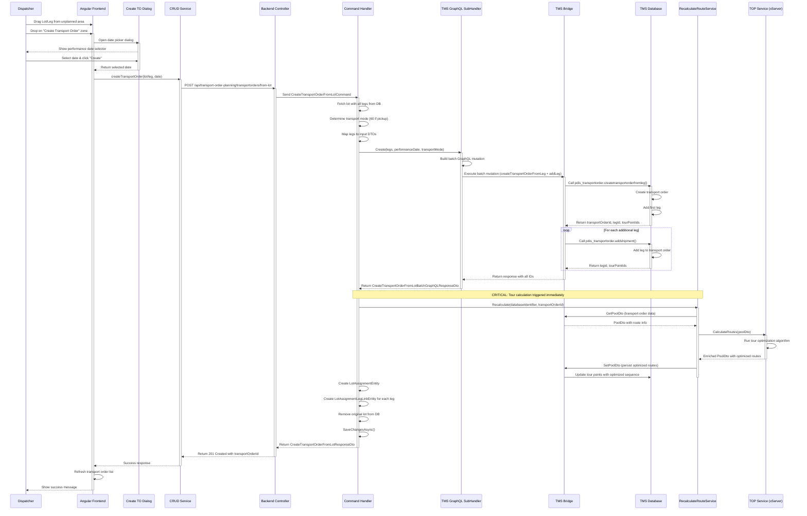

# Transport Order Creation via Drag and Drop - Overview and Flow

**Date:** 2026-03-16
**Focus:** High-level overview of the dispatcher planning flow from drag & drop to transport order creation
**Document Series:** Part 1 of 6

---

## Original User Input

User drags and drops a leg or lot from the unplanned (left) area in the Frontend to the "create transport order" area resulting in:
1. A transport order to be created
2. The lot/legs assigned to that transport order
3. The tour calculation to be started

---

## Overview

The New Dispo system provides a drag-and-drop interface for dispatchers to create transport orders from unplanned lots or legs. This flow orchestrates:

**Frontend → Backend → TMS Bridge → TMS Database → Tour Calculation → Response**

Key characteristics:
- ✅ User-initiated via drag & drop (Angular CDK)
- ✅ Date picker dialog for performance date selection
- ✅ Batch GraphQL mutation to TMS
- ✅ Automatic tour calculation trigger (xServer)
- ✅ Transformation from LotEntity to LotAssignmentEntity
- ✅ Transactional integrity across the stack

---

## Complete Drag & Drop Flow Diagram



---

## Summary Flow

```
USER ACTION: Drag & Drop
    ↓
[FRONTEND] Angular CDK Drag & Drop
    ├─ planning-list.component: dropOnCreateTransportOrder()
    └─ create-transport-order-dialog: Select performance date
    ↓
[FRONTEND] CRUD Service
    ├─ Determine lot vs leg
    └─ POST /api/transport-order-planning/transportorders/from-lot
    ↓
[BACKEND] Controller
    └─ TransportOrderPlanningController.CreateTransportOrderFromLot()
    ↓
[BACKEND] Command Handler
    ├─ CreateTransportOrderFromLotCommandHandler.Handle()
    ├─ Fetch lot with legs from DB
    ├─ Determine transport mode (60 if pickup)
    ├─ Map legs to input DTOs
    └─ Call CreateTransportOrderFromLotSubHandler
    ↓
[BACKEND] SubHandler
    ├─ Build batch GraphQL mutation
    │   ├─ Operation 1: createTransportOrderFromLeg (first leg)
    │   └─ Operation 2+: callCreateAndAddLeg (remaining legs)
    └─ Execute batch mutation
    ↓
[TMS BRIDGE] GraphQL Mutations
    ├─ CreateTransportOrderFromLegMutation
    │   └─ Call pdis_transportorder.createtransportorderfromleg
    └─ CreateAndAddLegMutation (loop)
        └─ Call pdis_transportorder.addshipment
    ↓
[TMS DATABASE] Execute stored functions
    ├─ Create transport order record
    ├─ Add all legs to transport order
    └─ Return: transportOrderId, legIds, tourPointIds
    ↓
[BACKEND] Handler continues
    ├─ Extract response IDs
    ├─ ⚡ TRIGGER TOUR CALCULATION ⚡
    │   ├─ RecalculateRouteService.Recalculate()
    │   ├─ GetPoolDto (fetch TO data)
    │   ├─ TOPService.CalculateRoutes (xServer optimization)
    │   └─ SetPoolDto (persist optimized routes to TMS)
    ├─ Create LotAssignmentEntity
    │   ├─ Link to transportOrderId
    │   ├─ Store tour point IDs
    │   └─ Create LotAssignmentLegLinkEntity for each leg
    ├─ Remove original LotEntity
    └─ SaveChangesAsync()
    ↓
[BACKEND] Return response
    └─ CreateTransportOrderFromLotResponseDto { TransportOrderId }
    ↓
[FRONTEND] Success handling
    ├─ Refresh transport order list
    ├─ Show success message
    └─ (Optional) Trigger silent route recalculation after 3s
```

---

## Key Takeaways

### 1. Complete Stack Integration ✅
- Frontend (Angular CDK drag & drop)
- Backend (CQRS pattern with MediatR)
- TMS Bridge (GraphQL mutations)
- TMS Database (stored functions)
- External Services (xServer tour optimization)

### 2. Automatic Tour Calculation ⚡
- Triggered immediately after transport order creation
- Non-blocking (errors logged but don't fail creation)
- Can be manually retriggered from frontend
- Uses xServer for route optimization

### 3. Data Transformation Pattern 🔄
- `LotEntity` (unplanned) → `LotAssignmentEntity` (planned)
- Original lot deleted, legs preserved
- Links maintained via `LotAssignmentLegLinkEntity`
- Full traceability with `PreviousLotId`

### 4. Batch Processing Strategy 📦
- Single GraphQL mutation with multiple operations
- Transactional integrity across all leg additions
- Efficient network usage
- Variable export/import between operations

### 5. Flexible Assignment Model 🔗
- Legs can be reassigned to different transport orders
- Lots can be split across multiple transport orders
- Individual legs can be added to existing transport orders
- Original shipment data always preserved

---

## See Also

- **[Frontend Implementation](./02-frontend-implementation.md)** - Detailed Angular drag & drop implementation
- **[Backend Implementation](./03-backend-implementation.md)** - Command handlers and business logic
- **[TMS Integration](./04-tms-integration.md)** - GraphQL mutations and TMS stored functions
- **[Data Model Transformations](./05-data-model-transformations.md)** - Entity relationships and state transitions
- **[API Reference](./06-api-reference.md)** - HTTP endpoints and request/response formats

---

## Related Documentation

### Pre-Existing Diagrams

This exploration builds upon an existing PlantUML diagram:

**`07_Diagrams/pickup-planning-create-transport-order-from-lot.wsd`**
- Shows high-level sequence diagram for transport order creation from lot
- Illustrates Frontend → Backend → TMS Bridge → TMS Database flow
- Documents transactional behavior and rollback scenarios
- Covers the batch addition of legs to transport order

The diagram in this document expands on that with:
- Complete tour calculation flow
- Detailed code references with line numbers
- Entity transformation (LotEntity → LotAssignmentEntity)
- Frontend drag & drop implementation details

### Related Explorations

- **Leg/Lot Creation Flow:** `02_Explorations/2026-03-16_Document_and_visualize_the_flow_of_Creating_and_adding_legslots_end_to_end/document-and-visualize-the-flow-of-creating-and-adding-legslots-end-to-end.md`
  - Covers the prerequisite flow: how shipments become legs and get grouped into lots
  - Documents CDC and batch pipelines
  - Explains traffic mode logic

- **Shipment Data Flow:** `08_Documentation/2026-02-26_leg-lot-creation-table-sendung/shipment-data-flow-architecture.md`
  - Complete architecture for shipment data flows
  - CDC pipeline details
  - Batch pickup planning pipeline
