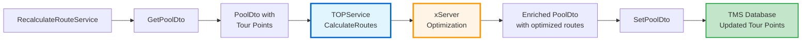

# Transport Order Creation - Backend Implementation

**Date:** 2026-03-16
**Focus:** Controller, Command Handlers, Tour Calculation Service, and Business Logic
**Document Series:** Part 3 of 6

---

## Overview

The backend implements a CQRS pattern using MediatR for handling transport order creation commands. Key responsibilities include:

1. Receiving HTTP requests via controllers
2. Processing commands through dedicated handlers
3. Orchestrating TMS Bridge calls for data persistence
4. Triggering automatic tour calculation
5. Managing entity transformations and database operations

---

## 1. Backend Controller

**File:** `Code/Disposition-Backend/CALConsult.Disposition.API/Application/Features/TransportOrderPlanning/TransportOrderPlanningController.cs`

```csharp
[ApiController]
[Route("api/transport-order-planning")]
public class TransportOrderPlanningController(IMediator mediator) : ControllerBase
{
  private readonly IMediator _mediator = mediator;

  /// <summary>
  /// Creates a transport order from a lot
  /// </summary>
  [HttpPost]
  [Route("transportorders/from-lot")]
  public async Task<JsonResult> CreateTransportOrderFromLot(
      [FromBody] CreateTransportOrderFromLotRequestDto createTransportOrderFromLotRequestDto)
  {
    var databaseIdentifier = Request.GetDatabaseIdentifier();

    CreateTransportOrderFromLotResponseDto result = await _mediator.Send(
      new CreateTransportOrderFromLotCommand(
        createTransportOrderFromLotRequestDto,
        databaseIdentifier
      )
    );

    return new JsonResult(result) { StatusCode = StatusCodes.Status201Created };
  }

  /// <summary>
  /// Creates a transport order from a single leg
  /// </summary>
  [HttpPost]
  [Route("transportorders/from-leg")]
  public async Task<JsonResult> CreateTransportOrderFromLeg(
      [FromBody] CreateTransportOrderFromLegRequestDto createTransportOrderFromLegRequestDto)
  {
    var databaseIdentifier = Request.GetDatabaseIdentifier();

    CreateTransportOrderFromLegResponseDto result = await _mediator.Send(
      new CreateTransportOrderFromLegCommand(
        createTransportOrderFromLegRequestDto,
        databaseIdentifier
      )
    );

    return new JsonResult(result) { StatusCode = StatusCodes.Status201Created };
  }
}
```

### DTOs

**Request:**
```csharp
public class CreateTransportOrderFromLotRequestDto
{
  public Guid LotId { get; set; }
  public DateTime PerformanceDate { get; set; }
}
```

**Response:**
```csharp
public class CreateTransportOrderFromLotResponseDto
{
  public long TransportOrderId { get; set; }
}
```

---

## 2. Command Handler (CQRS)

**File:** `Code/Disposition-Backend/CALConsult.Disposition.API/Application/Features/TransportOrderPlanning/Requests/CreateTransportOrderFromLot/CreateTransportOrderFromLotCommandHandler.cs`

### Complete Handler Logic (Lines 32-100)

```csharp
public class CreateTransportOrderFromLotCommandHandler(
    AppDbContext appDbContext,
    ICreateTransportOrderFromLotSubHandler createTransportOrderFromLotSubHandler,
    IMapper mapper,
    IRecalculateRouteService recalculateRouteService)
  : ICommandHandler<CreateTransportOrderFromLotCommand, CreateTransportOrderFromLotResponseDto>
{
  public async Task<CreateTransportOrderFromLotResponseDto> Handle(
      CreateTransportOrderFromLotCommand request,
      CancellationToken cancellationToken)
  {
    // 1. Extract parameters
    var databaseIdentifier = request.DatabaseIdentifier;
    Guid lotId = request.Request.LotId;
    DateTime performanceDate = request.Request.PerformanceDate;

    // 2. Fetch lot with all legs from database
    LotEntity? lot = await _appDbContext.Lots
      .Include(l => l.Legs)
      .Where(lot => lot.BranchKey.Equals(databaseIdentifier))
      .FirstOrDefaultAsync(l => l.LotId == lotId)
      ?? throw new NotFoundException($"Lot with id: {lotId} was not found!");

    var legs = lot.Legs.ToList();

    // 3. Determine transport mode (60 = pickup transport order)
    var isPickupLot = legs.Any(leg =>
      ((leg.TrafficFlow == TrafficFlow.Direct ||
        leg.TrafficFlow == TrafficFlow.ClosestBranchConsignee) &&
        leg.LegType == LegType.HL)
      ||
      ((leg.TrafficFlow == TrafficFlow.ClosestBranchConsignor ||
        leg.TrafficFlow == TrafficFlow.BranchToBranch) &&
        leg.LegType == LegType.VL)
    );

    int? transportOrderTransportMode = isPickupLot ? 60 : null;

    // 4. Map leg entities to input DTOs
    List<CraeteTransportOrderLegDataInputDto> mappedLegs =
      MapLegEntitiesToCreateTransportOrderInputs(legs);

    CraeteTransportOrderLegDataInputDto legToTransportOrder = mappedLegs.First();
    mappedLegs.RemoveAt(0);  // Remove first leg (used in initial creation)

    // 5. Call TMS Bridge to create transport order
    CreateTransportOrderFromLotBatchGraphQLResponseDto response =
      await createTransportOrderFromLotSubHandler.Create(
        legToTransportOrder,
        mappedLegs,
        performanceDate,
        transportOrderTransportMode,
        databaseIdentifier,
        cancellationToken);

    // 6. Extract TMS response IDs
    var tmsLegIds = new List<long>();

    CreatedTransportOrderGraphQLResponseDto createdTransportOrder =
      response.CreatedTransportOrderGraphQLResponse.FirstOrDefault()
      ?? throw new InvalidOperationException("CreatedTransportOrderGraphQLResponseDto response is null");

    tmsLegIds.Add(createdTransportOrder.TmsLegId);

    List<CreateAndAddLegTourPointsGraphQLResponse> createAndAddLegTourPoints =
      response.CreateAndAddLegTourPoints
      ?? throw new InvalidOperationException("CreateAndAddLegTourPoints response is null");

    tmsLegIds.AddRange(createAndAddLegTourPoints.Select(x => x.LegId));

    // 7. TRIGGER TOUR CALCULATION (CRITICAL STEP!)
    await recalculateRouteService.Recalculate(
      databaseIdentifier,
      createdTransportOrder.TransportOrderId,
      cancellationToken);

    // 8. Create LotAssignmentEntity linking legs to transport order
    LotAssignmentEntity lotAssignment = _mapper.Map<LotAssignmentEntity>(legToTransportOrder);
    var newLotAssignmentId = Guid.NewGuid();

    lotAssignment.Id = newLotAssignmentId;
    lotAssignment.OnlyFrozenProducts = legToTransportOrder.ProductGroup == "04";
    lotAssignment.BranchKey = lot.BranchKey;
    lotAssignment.PickupTourPointId = createdTransportOrder.PickupPointId;
    lotAssignment.DeliveryTourPointId = createdTransportOrder.DeliveryPointId;
    lotAssignment.PickupTourPointOrder = 1;
    lotAssignment.ReferenceId = lot.LotId;
    lotAssignment.TransportOrderId = createdTransportOrder.TransportOrderId;

    // 9. Create LotAssignmentLegLinkEntity for each leg
    lotAssignment.LegLinks = legs.Select((leg, index) => new LotAssignmentLegLinkEntity
    {
      Id = Guid.NewGuid(),
      LotAssignmentId = newLotAssignmentId,
      LegId = leg.LegId,
      PreviousLotId = lot.LotId,
      Order = (short)(index + 1),
      StaysLoaded = false,
      TmsLegId = tmsLegIds[index],
    }).ToList();

    // 10. Update database
    _appDbContext.LotAssignments.Add(lotAssignment);
    _appDbContext.Lots.Remove(lot);  // Remove original lot
    await _appDbContext.SaveChangesAsync(cancellationToken);

    return new CreateTransportOrderFromLotResponseDto
    {
      TransportOrderId = createdTransportOrder.TransportOrderId
    };
  }
}
```

### Key Operations

1. **Fetch lot with legs** - Eager loading with `Include()`
2. **Determine transport mode** - Based on leg types and traffic flows
3. **Map to DTOs** - Convert entities to TMS input format
4. **Create transport order in TMS** - Via GraphQL batch mutation
5. **Trigger tour calculation** ⚡ - Automatic route optimization
6. **Create assignment entities** - Link legs to transport order in backend DB
7. **Remove original lot** - Transform from unplanned to planned state
8. **Return response** - Transport order ID for frontend

---

## 3. Transport Mode Logic

### Transport Mode 60 = Pickup Transport Order

**Determined by analyzing leg types and traffic flows:**

```csharp
var isPickupLot = legs.Any(leg =>
  // Pickup Run legs (HL) with specific traffic flows
  ((leg.TrafficFlow == TrafficFlow.Direct ||
    leg.TrafficFlow == TrafficFlow.ClosestBranchConsignee) &&
    leg.LegType == LegType.HL)
  ||
  // Pickup legs (VL) with specific traffic flows
  ((leg.TrafficFlow == TrafficFlow.ClosestBranchConsignor ||
    leg.TrafficFlow == TrafficFlow.BranchToBranch) &&
    leg.LegType == LegType.VL)
);

int? transportOrderTransportMode = isPickupLot ? 60 : null;
```

**Logic:**
- HL legs (Pickup Run) for Direct or ClosestBranchConsignee → Pickup
- VL legs (Pickup) for ClosestBranchConsignor or BranchToBranch → Pickup
- Otherwise → null (standard transport order)

---

## 4. Tour Calculation Service (CRITICAL)

**File:** `Code/Disposition-Backend/CALConsult.Disposition.API/Application/_Shared/Services/RecalculateRouteService/RecalculateRouteService.cs`

### Implementation

Triggered immediately after transport order creation (Line 72 in handler):

```csharp
public class RecalculateRouteService(
    IPoolDtoProvider poolDtoProvider,
    ITOPService topService,
    ISetPoolDtoExecutor setPoolDtoExecutor,
    ILogger<RecalculateRouteService> logger)
  : IRecalculateRouteService
{
  public async Task Recalculate(
      string databaseIdentifier,
      long transportOrderId,
      CancellationToken cancellationToken)
  {
    try
    {
      // 1. Get transport order pool data from TMS Bridge
      PoolDto poolDto = await poolDtoProvider.Get(
        databaseIdentifier,
        transportOrderId);

      // 2. Call TOP Service (Tour Optimization Package) for route calculation
      PoolDto enrichedPoolDto = await topService.CalculateRoutes(
        poolDto,
        cancellationToken);

      // 3. Persist the optimized routes back to TMS
      await setPoolDtoExecutor.Execute(enrichedPoolDto, databaseIdentifier);
    }
    catch (Exception ex)
    {
      logger.LogError(ex, ex.Message);
      // Does NOT throw - fails silently to avoid blocking transport order creation
    }
  }
}
```

### Tour Calculation Flow



### Services Involved

1. **PoolDtoProvider** - Fetches transport order data (legs, tour points, routes)
2. **TOPService** - Calls xServer for route optimization
3. **SetPoolDtoExecutor** - Persists optimized routes back to TMS

**Key Characteristic:** Errors are logged but **do NOT block** transport order creation

---

## 5. Error Handling & Tour Calculation

### Tour Calculation Timing

**When is Tour Calculation Triggered?**
- ✅ Automatically after transport order creation
- ✅ Automatically after assigning additional legs/lots
- ✅ Manually via frontend button (with debounce)
- ✅ Via explicit API call: `POST /api/transportorders/{id}/calculate-routes`

### Non-Blocking Strategy

```csharp
try {
  await recalculateRouteService.Recalculate(...);
} catch (Exception ex) {
  logger.LogError(ex, ex.Message);
  // Does NOT throw - transport order creation succeeds even if optimization fails
}
```

**Why Non-Blocking?**
- Tour calculation is an optimization enhancement
- Transport order creation is the primary operation
- Allows manual route adjustment if automation fails
- Prevents blocking dispatcher workflow

---

## 6. Additional Operations

### Assigning Legs/Lots to Existing Transport Orders

**Endpoints:**
- `PUT /api/transport-order-planning/transportorders/{transportOrderId}/legs/{legId}`
- `PUT /api/transport-order-planning/transportorders/{transportOrderId}/lots/{lotId}`

**Handlers:**
- `AssignLegToTransportOrderCommandHandler`
- `AssignLotToTransportOrderCommandHandler`

**Flow (Similar to Creation):**
1. Fetch leg/lot from database
2. Call TMS Bridge to add leg to transport order (`callCreateAndAddLeg`)
3. **Trigger tour recalculation** (same service)
4. Create `LotAssignmentEntity` and `LotAssignmentLegLinkEntity`
5. Update original lot:
   - If lot still has legs → Recalculate aggregates
   - If lot is empty → Remove lot
6. Save to database

---

## 7. Frozen Product Segregation

**Rule:** Lots with frozen products cannot be mixed with non-frozen products.

**Implementation:**
```csharp
lotAssignment.OnlyFrozenProducts = legToTransportOrder.ProductGroup == "04";
```

**Purpose:**
- Maintains cold chain requirements
- Affects vehicle selection (refrigerated vs. standard)
- Ensures compliance with food safety regulations

---

## File Reference

### Backend - API Layer

| Component | File Path | Lines | Purpose |
|-----------|-----------|-------|---------|
| **Controller** | `Code/Disposition-Backend/CALConsult.Disposition.API/Application/Features/TransportOrderPlanning/TransportOrderPlanningController.cs` | 33-57 | HTTP endpoints |
| **Create from Lot Handler** | `Code/Disposition-Backend/CALConsult.Disposition.API/Application/Features/TransportOrderPlanning/Requests/CreateTransportOrderFromLot/CreateTransportOrderFromLotCommandHandler.cs` | 32-100 | Main business logic |
| **Create from Leg Handler** | `Code/Disposition-Backend/CALConsult.Disposition.API/Application/Features/TransportOrderPlanning/Requests/CreateTransportOrderFromLeg/CreateTransportOrderFromLegCommandHandler.cs` | - | Single leg creation |
| **Assign Leg Handler** | `Code/Disposition-Backend/CALConsult.Disposition.API/Application/Features/TransportOrderPlanning/Requests/AssignLegToTransportOrder/AssignLegToTransportOrderCommandHandler.cs` | - | Add leg to existing TO |
| **Assign Lot Handler** | `Code/Disposition-Backend/CALConsult.Disposition.API/Application/Features/TransportOrderPlanning/Requests/AssignLotToTransportOrder/AssignLotToTransportOrderCommandHandler.cs` | - | Add lot to existing TO |

### Backend - Services

| Component | File Path | Lines | Purpose |
|-----------|-----------|-------|---------|
| **GraphQL SubHandler** | `Code/Disposition-Backend/CALConsult.Disposition.API/Application/Features/TransportOrderPlanning/Requests/CreateTransportOrderFromLot/SubHandlers/CreateTransportOrderFromLotSubHandler.cs` | - | Batch mutation builder |
| **Recalculate Route** | `Code/Disposition-Backend/CALConsult.Disposition.API/Application/_Shared/Services/RecalculateRouteService/RecalculateRouteService.cs` | 17-34 | Tour optimization |
| **Pool DTO Provider** | `Code/Disposition-Backend/CALConsult.Disposition.API/Application/_Shared/Services/GetPoolDto/PoolDtoProvider.cs` | - | Fetch TO data |
| **TOP Service** | `Code/Disposition-Backend/CALConsult.Disposition.API/Application/_Shared/Services/TOP/TOPService.cs` | - | xServer integration |
| **Set Pool DTO** | `Code/Disposition-Backend/CALConsult.Disposition.API/Application/_Shared/Services/SetPoolDto/SetPoolDtoExecutor.cs` | - | Persist routes |

---

## See Also

- **[Overview and Flow](./01-overview-and-flow.md)** - High-level sequence diagram
- **[Frontend Implementation](./02-frontend-implementation.md)** - Angular drag & drop UI
- **[TMS Integration](./04-tms-integration.md)** - GraphQL mutations and stored functions
- **[Data Model Transformations](./05-data-model-transformations.md)** - Entity relationships
- **[API Reference](./06-api-reference.md)** - HTTP endpoint documentation
