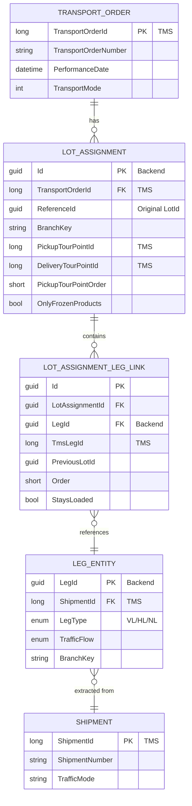
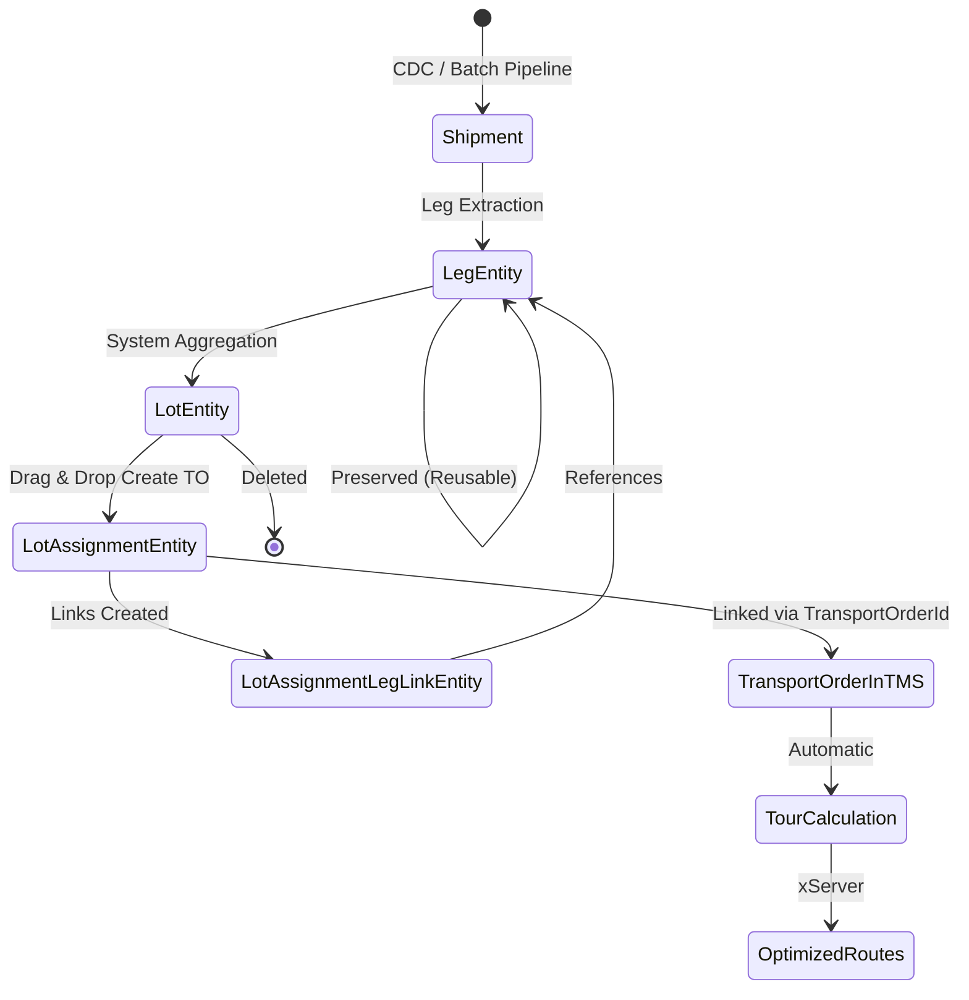

# Transport Order Creation - Data Model Transformations

**Date:** 2026-03-16
**Focus:** Entity relationships, state transitions, and data model transformations
**Document Series:** Part 5 of 6

---

## Overview

When a transport order is created from a lot, the data model undergoes a significant transformation:

**LotEntity (unplanned) → LotAssignmentEntity (planned)**

This transformation represents the shift from a temporary grouping to a permanent assignment with full TMS integration.

---

## Before Transport Order Creation

### LotEntity Structure

```
LotEntity (system-generated, unplanned)
  ├── LotId: Guid
  ├── BranchKey: string
  ├── IsSystemGenerated: true
  ├── TotalWeight: decimal
  ├── UniqueClientsCount: int
  ├── OnlyFrozenProducts: bool
  └── Legs: Collection<LegEntity>
        ├── LegEntity 1
        │     ├── LegId: Guid
        │     ├── ShipmentId: long
        │     ├── LegType: enum (VL/HL/NL)
        │     └── TrafficFlow: enum
        ├── LegEntity 2
        └── LegEntity 3
```

**Characteristics:**
- Temporary grouping of unplanned legs
- System-generated based on aggregation rules
- Not yet assigned to a transport order
- No TMS representation
- Displayed in "unplanned area" in frontend

---

## After Transport Order Creation

### LotAssignmentEntity Structure

```
LotAssignmentEntity (planned, assigned to transport order)
  ├── Id: Guid (new)
  ├── TransportOrderId: long (from TMS) ← KEY LINK
  ├── ReferenceId: Guid (original LotId)
  ├── BranchKey: string
  ├── PickupTourPointId: long (from TMS)
  ├── DeliveryTourPointId: long (from TMS)
  ├── PickupTourPointOrder: short
  └── LegLinks: Collection<LotAssignmentLegLinkEntity>
        ├── LotAssignmentLegLinkEntity
        │     ├── Id: Guid
        │     ├── LotAssignmentId: Guid
        │     ├── LegId: Guid (Backend) ← Links to existing LegEntity
        │     ├── TmsLegId: long (TMS) ← Links to TMS leg
        │     ├── PreviousLotId: Guid
        │     ├── Order: short
        │     └── StaysLoaded: bool
        ├── LotAssignmentLegLinkEntity (leg 2)
        └── LotAssignmentLegLinkEntity (leg 3)

Original LotEntity → DELETED from database
LegEntity records → REMAIN (can be reused)
```

**Characteristics:**
- Permanent assignment to a transport order
- Fully integrated with TMS
- Has tour point information
- Tracks original lot via ReferenceId
- Displayed in "planned area" / transport order view in frontend

---

## Key Transformation

| Aspect | Before (LotEntity) | After (LotAssignmentEntity) |
|--------|-------------------|----------------------------|
| **Purpose** | Temporary grouping | Permanent assignment |
| **TMS Integration** | None | Full (TransportOrderId, TourPointIds, TmsLegIds) |
| **State** | Unplanned | Planned |
| **Lifetime** | Deleted after assignment | Persists until transport order completion |
| **Leg Relationship** | Direct collection | Link table (LotAssignmentLegLinkEntity) |
| **Reusability** | Single use | Legs can be reassigned |

---

## Entity Relationship Diagram



---

## Entity Relationships

### 1. Transport Order → Lot Assignment (1:N)

- A transport order can have multiple lot assignments
- Each lot assignment belongs to exactly one transport order
- Link: `LotAssignmentEntity.TransportOrderId`

---

### 2. Lot Assignment → Lot Assignment Leg Link (1:N)

- A lot assignment contains multiple leg links
- Each leg link belongs to exactly one lot assignment
- Link: `LotAssignmentLegLinkEntity.LotAssignmentId`

---

### 3. Lot Assignment Leg Link → Leg Entity (N:1)

- Multiple leg links can reference the same leg (if reassigned)
- Each leg link references exactly one leg
- Link: `LotAssignmentLegLinkEntity.LegId`

---

### 4. Leg Entity → Shipment (N:1)

- Multiple legs can reference the same shipment (VL, HL, NL legs of same shipment)
- Each leg references exactly one shipment
- Link: `LegEntity.ShipmentId`

---

## Key Implementation Details

### 1. Leg Reusability

**Important:** `LegEntity` records are NOT deleted when assigned to transport orders.

**Why?**
- Legs can be reassigned to different transport orders
- Original shipment data preserved
- Supports "what-if" planning scenarios
- Enables easy reassignment if transport order is cancelled

**Link Tracking:**
- `LotAssignmentLegLinkEntity.PreviousLotId` tracks original lot
- `LotAssignmentLegLinkEntity.Order` maintains leg sequence
- `LotAssignmentLegLinkEntity.TmsLegId` links to TMS representation

---

### 2. Dual ID System (Backend + TMS)

The system maintains IDs in both backend and TMS databases:

| Entity | Backend ID | TMS ID | Purpose |
|--------|-----------|--------|---------|
| **Transport Order** | - | TransportOrderId (long) | Primary reference |
| **Lot Assignment** | Id (Guid) | - | Backend tracking |
| **Leg Link** | Id (Guid) | TmsLegId (long) | Both systems |
| **Leg** | LegId (Guid) | - | Backend tracking |
| **Shipment** | - | ShipmentId (long) | TMS primary |
| **Tour Point** | - | PickupTourPointId, DeliveryTourPointId (long) | TMS sequencing |

**Benefits:**
- Backend can operate independently for planning
- TMS maintains operational data
- Clear separation of concerns
- Easy synchronization and reconciliation

---

### 3. LotAssignmentEntity Creation Logic

From the command handler:

```csharp
// Create LotAssignmentEntity linking legs to transport order
LotAssignmentEntity lotAssignment = _mapper.Map<LotAssignmentEntity>(legToTransportOrder);
var newLotAssignmentId = Guid.NewGuid();

lotAssignment.Id = newLotAssignmentId;
lotAssignment.OnlyFrozenProducts = legToTransportOrder.ProductGroup == "04";
lotAssignment.BranchKey = lot.BranchKey;
lotAssignment.PickupTourPointId = createdTransportOrder.PickupPointId;
lotAssignment.DeliveryTourPointId = createdTransportOrder.DeliveryPointId;
lotAssignment.PickupTourPointOrder = 1;
lotAssignment.ReferenceId = lot.LotId;  // Preserve original lot ID
lotAssignment.TransportOrderId = createdTransportOrder.TransportOrderId;  // Link to TMS

// Create LotAssignmentLegLinkEntity for each leg
lotAssignment.LegLinks = legs.Select((leg, index) => new LotAssignmentLegLinkEntity
{
  Id = Guid.NewGuid(),
  LotAssignmentId = newLotAssignmentId,
  LegId = leg.LegId,  // Backend leg ID
  PreviousLotId = lot.LotId,  // Track original lot
  Order = (short)(index + 1),  // Maintain sequence
  StaysLoaded = false,
  TmsLegId = tmsLegIds[index],  // TMS leg ID from response
}).ToList();

// Update database
_appDbContext.LotAssignments.Add(lotAssignment);
_appDbContext.Lots.Remove(lot);  // Remove original lot
await _appDbContext.SaveChangesAsync(cancellationToken);
```

---

### 4. Tour Point Integration

Tour points represent physical stops in the transport order route:

- **PickupTourPointId** - Where the shipment is picked up
- **DeliveryTourPointId** - Where the shipment is delivered
- **PickupTourPointOrder** - Sequence number in the route

These are:
- Generated by TMS during transport order creation
- Returned in the GraphQL response
- Stored in LotAssignmentEntity for quick access
- Used by tour calculation service (xServer) for optimization

---

### 5. Frozen Product Segregation

```csharp
lotAssignment.OnlyFrozenProducts = legToTransportOrder.ProductGroup == "04";
```

**Product Group "04" = Frozen Products**

**Purpose:**
- Maintains cold chain requirements
- Affects vehicle selection (refrigerated vs. standard)
- Ensures compliance with food safety regulations
- Prevents mixing frozen and non-frozen shipments

---

## State Transition Diagram



---

## Domain Entities File Reference

| Component | File Path | Purpose |
|-----------|-----------|---------|
| **Lot Assignment** | `Code/Disposition-Backend/CALConsult.Disposition.API/Domain/Entities/LotAssignment/LotAssignmentEntity.cs` | Planned lot assignment |
| **Lot Assignment Link** | `Code/Disposition-Backend/CALConsult.Disposition.API/Domain/Entities/LotAssignmentLegLink/LotAssignmentLegLinkEntity.cs` | Leg-to-assignment link |
| **Leg Entity** | `Code/Disposition-Backend/CALConsult.Disposition.API/Domain/Entities/Leg/LegEntity.cs` | Leg representation |
| **Lot Entity** | `Code/Disposition-Backend/CALConsult.Disposition.API/Domain/Entities/Lot/LotEntity.cs` | System-generated lot |

---

## See Also

- **[Overview and Flow](./01-overview-and-flow.md)** - High-level sequence diagram
- **[Backend Implementation](./03-backend-implementation.md)** - Command handler logic
- **[TMS Integration](./04-tms-integration.md)** - GraphQL mutations and TMS functions
- **[API Reference](./06-api-reference.md)** - HTTP endpoint documentation
