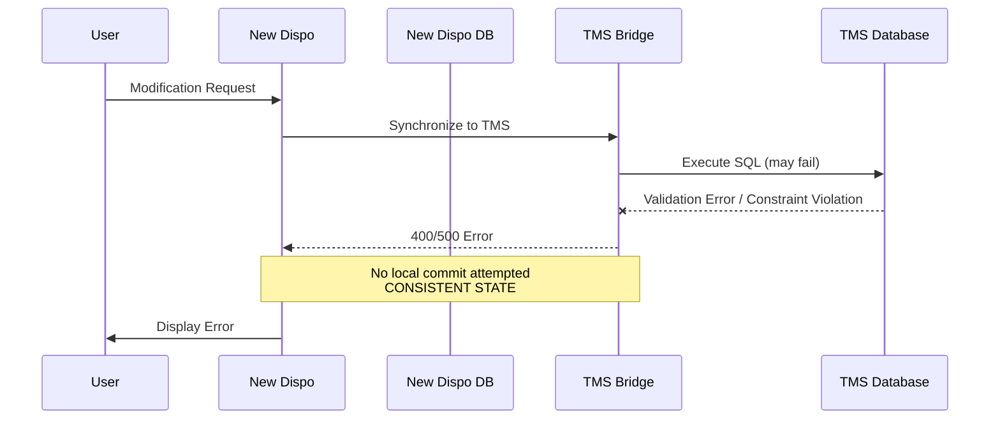
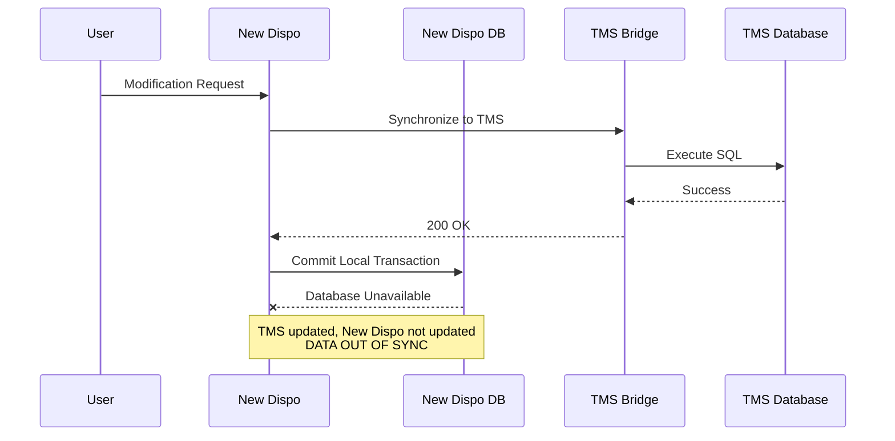
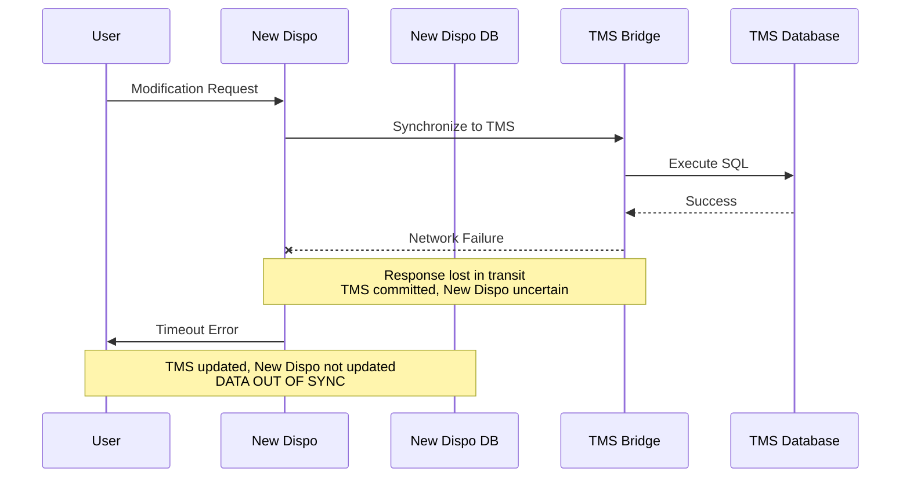

# TMS Synchronization Failure Scenarios

**Date:** 2026-03-16
**Status:** Reference Documentation
**Context:** Transport Order Creation Flow - Error Handling

---

## Overview

This document catalogs the three primary failure scenarios that can occur during TMS synchronization in the transport order creation flow. These scenarios threaten data consistency between New Dispo and TMS and inform the error handling strategy.

---

## Scenario 1: Early Failure from Bridge

**Type:** Consistent State - No Recovery Needed

TMS Bridge returns 4xx/5xx error before or during TMS Database execution. Local transaction not yet committed.

### Sequence Diagram

### Characteristics

- **Timing:** Error occurs before TMS commits any state
- **State Consistency:** Both systems remain consistent (no changes written)
- **User Impact:** Clear error message, operation failed cleanly
- **Recovery Requirement:** None - no data inconsistency exists

### Impact

No data inconsistency. Safe to abort. Clear error communication. Easiest scenario to handle.

### Examples

- TMS validation errors (invalid data format, constraint violations)
- TMS Bridge service unavailable (5xx errors)
- Authentication/authorization failures
- Network connectivity issues before TMS execution

---

## Scenario 2: Local Database Failure Post-TMS Success

**Type:** Data Out of Sync - Recovery Required

TMS Bridge and TMS Database execute successfully, but New Dispo database becomes unavailable before committing local transaction.

### Sequence Diagram

### Characteristics

- **Timing:** Error occurs after TMS successfully commits
- **State Consistency:** TMS has changes, New Dispo does not
- **User Impact:** Sees error despite TMS success
- **Recovery Requirement:** Reconciliation mandatory - must sync New Dispo with TMS state

### Impact

TMS reflects change, New Dispo does not. System state inconsistent. Data out of sync.

### Examples

- New Dispo database connection lost
- New Dispo database server crash
- Transaction timeout on New Dispo side
- Deadlock or lock timeout in New Dispo DB

---

## Scenario 3: Network Interruption Post-TMS Execution

**Type:** Uncertain State - Reconciliation Required

TMS Database executes successfully, but network failure prevents response from reaching New Dispo. Local transaction waits for response that never arrives.

### Sequence Diagram

### Characteristics

- **Timing:** Network failure after TMS commits but before response received
- **State Consistency:** TMS has changes, New Dispo doesn't know if operation succeeded
- **User Impact:** Timeout error, uncertain about operation status
- **Recovery Requirement:** State query mandatory before any retry - must determine if TMS operation succeeded

### Impact

TMS updated, New Dispo in unknown state. Rare but possible. **Critical constraint:** Cannot retry without first querying TMS state - blind retry would create duplicates.

### Examples

- Network partition between New Dispo and TMS Bridge
- Load balancer timeout
- TMS Bridge crashes after database commit but before response sent
- Network interface failure

---

## Error Classification Summary

| Error Type | Scenario | Data Consistency Impact | Recovery Complexity |
|-----------|----------|------------------------|---------------------|
| TMS Bridge 4xx | 1 | Consistent (no change) | None required |
| TMS Bridge 5xx | 1 | Consistent (no change) | None required |
| New Dispo DB outage | 2 | Out of sync | High - reconciliation needed |
| Network timeout | 3 | Unknown state | Very high - state query + reconciliation |
| TMS constraint violation | 1 | Consistent (no change) | None required |

---

## Key Observations

### Scenario Frequency (Expected)

- **Scenario 1:** Most common - validation errors, transient service issues
- **Scenario 2:** Rare - requires New Dispo DB failure at precise moment
- **Scenario 3:** Very rare - network failures uncommon in stable infrastructure

### Recovery Requirements

- **Scenario 1:** None - clean failure
- **Scenario 2 & 3:** State checking + reconciliation mandatory

### Idempotency Implications

- **Scenario 1:** Not critical - operation never executed
- **Scenario 2 & 3:** Critical - retry without state checking creates duplicates

---

## Related Documentation

- **[TMS Sync Error Handling Decision](./tms-sync-error-handling-decision.md)** - Decision paper comparing recovery approaches
- **[Idempotency Analysis](./idempotency-analysis.md)** - Detailed analysis of TMS operation idempotency guarantees
- **[Backend Implementation](./03-backend-implementation.md)** - Current error handling in command handlers

---

## References

- Source refinement session: `/00_Meetings/2026-03-12_Refinement-New-Dispo-TMS-Transactional-Behaviour.md`
- TMS stored procedures: `Code/tms-alloydb-schema/src/sql/package/PDIS_TRANSPORTORDER.sql`
- TMS idempotency logic: `Code/tms-alloydb-schema/src/sql/package/PTA.sql`
