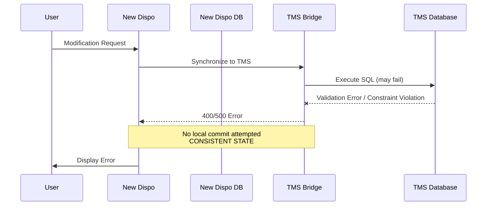
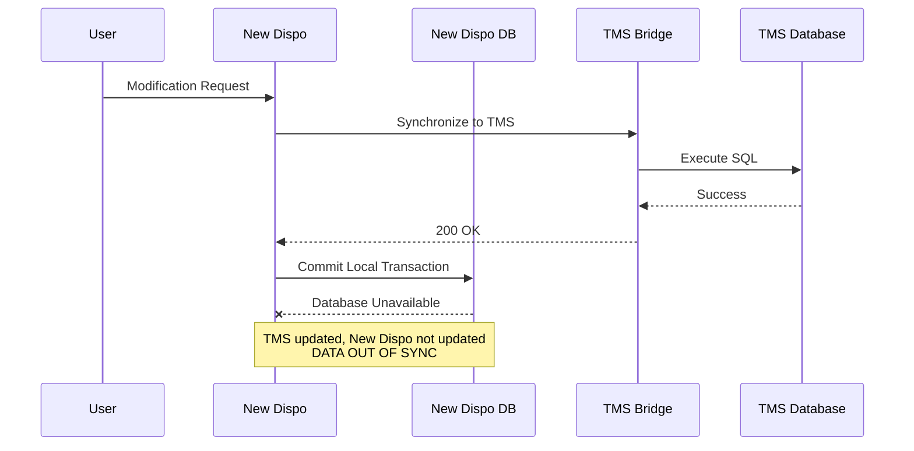
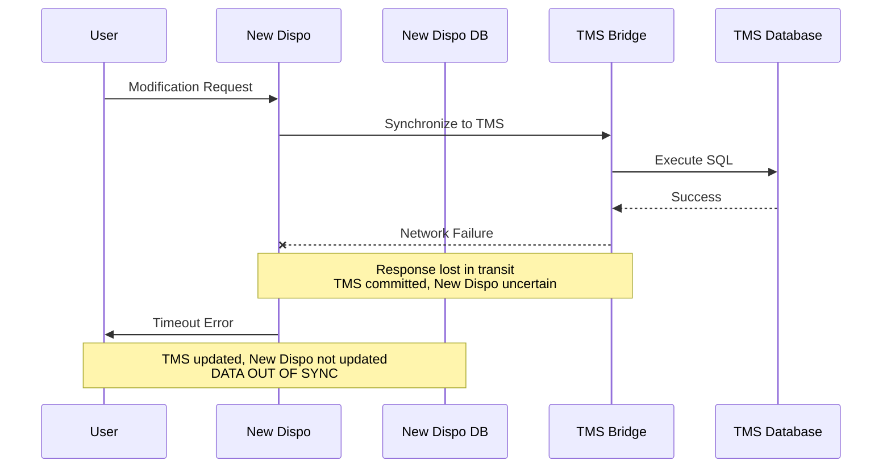

# Transactional Behaviour New Dispo <> TMS

---

## Business Context

**Critical workflows:**
1. Creating transport orders
2. Adding/Removing Legs (and Lots in New Dispo)
3. Edit/Add Tourpoints

→ Any interaction between New Dispo and TMS where data is synced and that can fail due to distributed nature of the system

---

## Error Scenarios - The Problem (Example: Creating Transport order from legs)

### Scenario 1: Early Failure from Bridge

**Impact:** Clean failure, no data loss, clear error message

### Scenario 2: Local DB Failure After TMS Success

**Impact:** Data inconsistency - TMS has order, New Dispo doesn't

### Scenario 3: Network Failure After TMS Commit

**Impact:** TMS updated, New Dispo uncertain - cannot retry blindly (would create duplicates)

---

## Error Classification

| Scenario | Recovery Needed | Complexity |
|----------|-----------------|------------|
| 1: Early failure | None | Low |
| 2: Local DB failure | Reconciliation | High |
| 3: Network timeout | State query + reconciliation | Very high |

---

## Implementation Options

1. **Manual Recovery** (Approved by Patrick, pending technical evaluation e.g. idempotency, UX, ...) - ops team fixes inconsistencies
2. **Outbox Pattern** (Ivailo's concept) - reliable retry with deduplication
3. **Event-Driven Architecture** - eventual consistency, more complex

---

## Challenges

- **Idempotency:** Critical for safe retry operations
- **Timeline Pressure:** June 2026 release constrains error handling approach

---

## Solution Exploration

### Technical Constraints

**Idempotency requirements:**
- Leg assignment operations: IDEMPOTENT via `PTA.HASSEN()` duplicate check
- Transport order creation: NOT IDEMPOTENT (always creates new record)
- State-checking mandatory before retry to avoid duplicates

**Architectural realities:**
- TMS executes first, New Dispo second - justifies outbox over other patterns
- TMS is source of truth - New Dispo currently slave to TMS databases
- Single transaction requirement: Outbox writes to both DB and outbox table atomically
- Cloud Tasks/Pub/Sub insufficient: No atomic guarantees for two-phase commit

### Option 1: Manual User-Driven Recovery

**Implementation:**
- On sync failure (Scenarios 2, 3), rollback local transaction or mark "pending"
- User sees error with "Retry" button
- State-checking logic before retry:
  1. Get legs from failed lot
  2. Query TMS Bridge: `GetTransportOrderByLeg(legId)` (TMS has no "lot" concept)
  3. If leg found on transport order (operation succeeded):
     - Retrieve transport order ID + tour point IDs from TMS
     - Verify all lot legs on same transport order
     - Create LotAssignmentEntity with LegLinks in New Dispo
     - Remove original LotEntity
     - Skip transport order creation
  4. If leg not found (operation failed):
     - Execute full CreateTransportOrderFromLot operation

**Characteristics:**
- Development effort: 10-20% of outbox implementation
- Reliability: User-dependent - failures visible until resolved
- UX: Degraded on failure - user must understand retry semantics
- Data consistency: Eventually consistent only if user acts
- Timeline: Feasible for June release (single branch, not 64-branch Big Bang)

**Risks:**
- User may ignore errors → prolonged inconsistency
- Non-technical users may not understand retry
- Notification fatigue

### Option 2: Outbox Pattern with Auto-Cure

**Implementation:**
- Incoming request writes to New Dispo DB + Outbox table in single transaction
- Background process polls unprocessed messages
- Synchronizes to TMS Bridge asynchronously
- On success: mark processed
- On failure: retry with exponential backoff
- Escalate only irreconcilable errors (data conflicts, constraint violations)

**Characteristics:**
- Development effort: Medium-High
- Reliability: High - automated retries ensure eventual consistency
- UX: Optimistic - user sees success immediately, failures self-heal
- Data consistency: Guaranteed eventual consistency for recoverable errors
- Timeline: Tight for June release - may require scope reduction

**Risks:**
- Implementation time may exceed June deadline
- Complexity in error classification (recoverable vs non-recoverable)
- Requires monitoring for stuck messages

### Option 3: Event-Driven Architecture

**Implementation:**
- User request commits to New Dispo DB immediately
- Publish event to Cloud Tasks/Pub/Sub
- Worker consumes event, synchronizes to TMS
- User informed via notification or polling

**Characteristics:**
- Development effort: Very High - fundamental architectural shift
- Reliability: Highest - fully decoupled, resilient to transient failures
- UX: Async-native - no immediate TMS reflection, requires notifications
- Data consistency: Eventual, but NO ATOMIC GUARANTEES - cannot reliably publish to queue + commit to DB in single transaction
- Timeline: Infeasible for June release

**Critical limitation:**
- If queue publish first, then DB fails → message lost
- If DB commit first, then queue publish fails → state misalignment
- Outbox pattern solves this; event queues alone do not

**Risks:**
- Only viable when New Dispo becomes data master (long-term goal)
- Currently TMS is source of truth - event-driven premature

### Comparison Matrix

| Criterion | Manual Recovery | Outbox Pattern | Event-Driven |
|-----------|-----------------|----------------|--------------|
| Development Effort | Low | Medium-High | Very High |
| Time to June Release | Feasible | Tight | Infeasible |
| Reliability | User-dependent | High | Highest |
| User Experience | Degraded on failure | Optimistic | Async-native |
| Operational Complexity | Manual | Automated | Fully decoupled |
| Data Consistency | Manual resolution | Eventual (auto) | Eventual (queue) |
| Scalability | Limited | Good | Excellent |

### Recommendation

**For June 2026:** Manual Recovery (Option 1)

**Rationale:**
- Timeline constraint mandates low-risk, low-complexity approach
- Single branch deployment limits blast radius
- Failures are rare in stable infrastructure (Scenarios 2, 3 uncommon)
- Scenario 1 already handled gracefully
- Effort is 10-20% of outbox, preserves budget for post-June improvements
- Idempotency verified: state-checking enables safe retry
- Business may tolerate manual resolution if failure frequency low

**Post-June:** Migrate to Outbox Pattern (Option 2)
- Industry standard for distributed consistency
- Automated recovery without full architectural overhaul
- Event-driven (Option 3) remains long-term vision but requires broader refactoring

---

## Action Required

**IMPORTANT:** These error patterns apply to **ALL** New Dispo → TMS synchronization points, not just transport order creation.

**We must audit and verify:**
- All endpoints that call TMS Bridge
- All GraphQL mutations to TMS
- All CQRS handlers with TMS integration
- Error handling consistency across all sync points

**Each sync point needs:** Failure scenario analysis, idempotency verification, retry strategy, reconciliation logic.
