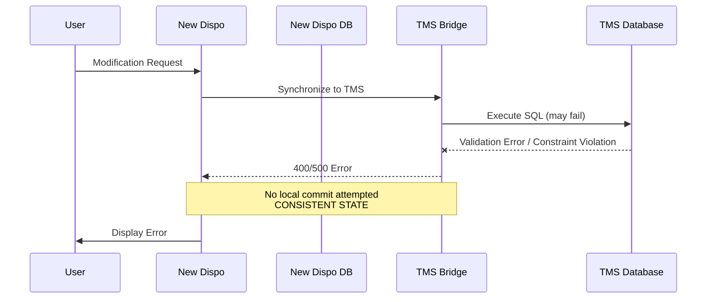
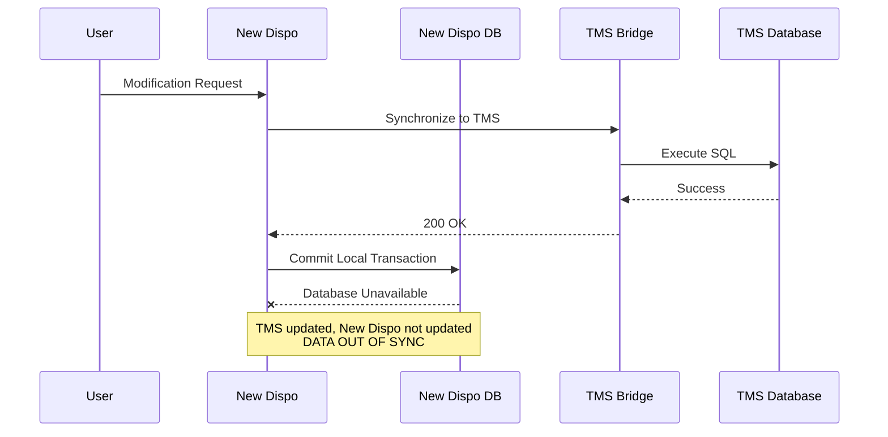
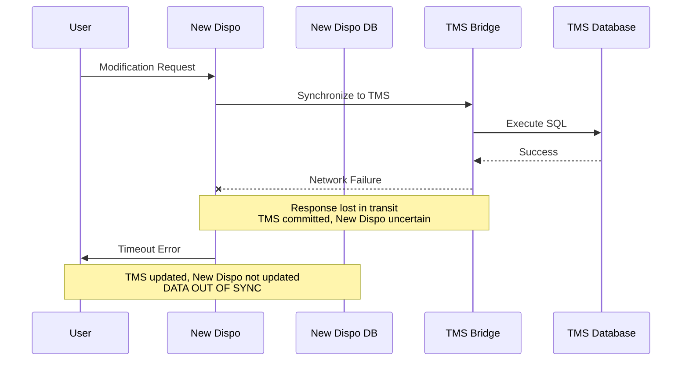

# Transactional Behaviour New Dispo <> TMS

---

## Business Context

**Critical workflows:**
1. Creating transport orders
2. Adding/Removing Legs (and Lots in New Dispo)
3. Edit/Add Tourpoints

→ Any interaction between New Dispo and TMS where data is synced and that can fail due to distributed nature of the system

---

## Error Scenarios - The Problem (Example: Creating Transport order from legs)

### Scenario 1: Early Failure from Bridge

**Impact:** Clean failure, no data loss, clear error message

### Scenario 2: Local DB Failure After TMS Success

**Impact:** Data inconsistency - TMS has order, New Dispo doesn't

### Scenario 3: Network Failure After TMS Commit

**Impact:** TMS updated, New Dispo uncertain - cannot retry blindly (would create duplicates)

---

## Error Classification

| Scenario | Recovery Needed | Complexity |
|----------|-----------------|------------|
| 1: Early failure | None | Low |
| 2: Local DB failure | Reconciliation | High |
| 3: Network timeout | State query + reconciliation | Very high |

---

## Implementation Options

1. **Manual Recovery** (Approved by Patrick, pending technical evaluation e.g. idempotency, UX, ...) - ops team fixes inconsistencies
2. **Outbox Pattern** (Ivailo's concept) - reliable retry with deduplication
3. **Event-Driven Architecture** - eventual consistency, more complex

---

## Challenges

- **Idempotency:** Critical for safe retry operations
- **Timeline Pressure:** June 2026 release constrains error handling approach

---

## Action Required

**IMPORTANT:** These error patterns apply to **ALL** New Dispo → TMS synchronization points, not just transport order creation.

**We must audit and verify:**
- All endpoints that call TMS Bridge
- All GraphQL mutations to TMS
- All CQRS handlers with TMS integration
- Error handling consistency across all sync points

**Each sync point needs:** Failure scenario analysis, idempotency verification, retry strategy, reconciliation logic.
