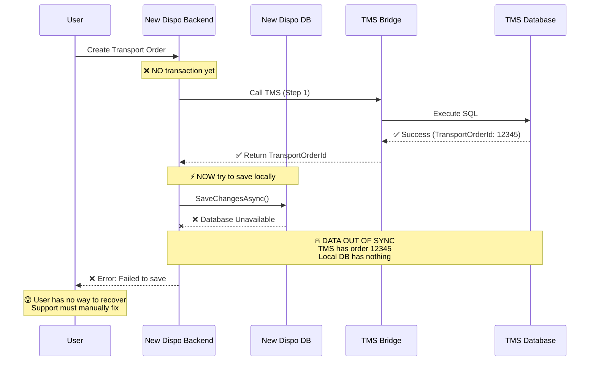
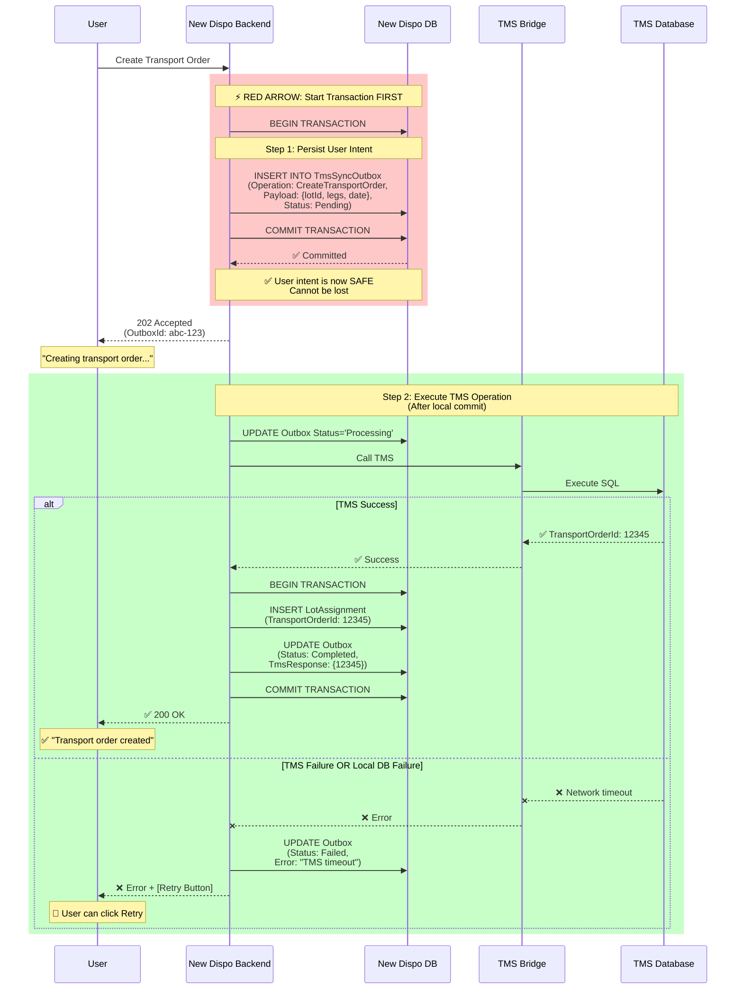
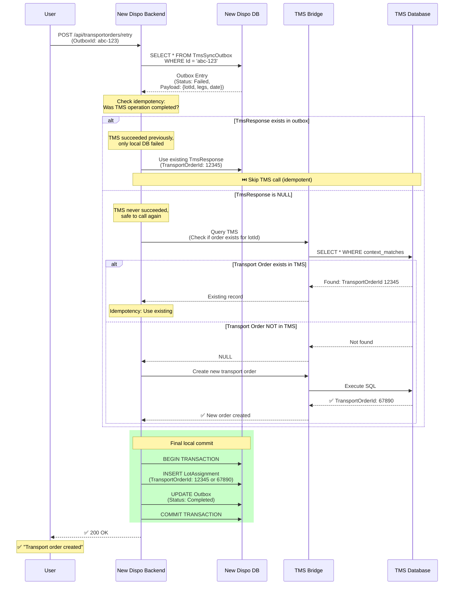

# Minimal Outbox Solution: Visual Flow Diagram

**Date:** 2026-03-25
**Purpose:** Visual explanation of the "red arrow" approach from workshop

---

## Current Problem (Scenario 2)

---

## Minimal Outbox Solution

---

## Retry Flow (Idempotent)

---

## Key Differences: Before vs After

### Before (Current Code)

| Step | Action | Risk |
|------|--------|------|
| 1 | Call TMS | If succeeds → go to step 2 |
| 2 | Save local DB | ❌ **If fails → DATA OUT OF SYNC** |
| 3 | Return to user | User has no recovery option |

**Problem:** No persistent record of user intent if step 2 fails.

### After (Minimal Outbox Solution)

| Step | Action | Risk |
|------|--------|------|
| 1 | **Save outbox entry** | ✅ **If fails → fail fast, user retries** |
| 2 | Call TMS | If fails → outbox has record, can retry |
| 3 | Update local DB | If fails → outbox has TMS response, can retry |
| 4 | Return to user | User can retry from persistent state |

**Solution:** User intent persisted FIRST (red arrow), all subsequent steps are retryable.

---

## Red Arrow Principle

> **"Commit local state BEFORE calling external systems"**

This is a fundamental principle of distributed systems:

1. **Local First:** Persist to your own database with ACID guarantees
2. **External Later:** Call external systems (which may fail) with retry capability
3. **Eventual Consistency:** External systems will catch up via retry mechanism

This inverts the risk model:
- **Old:** External success + Local failure = **Out of sync**
- **New:** Local success + External failure = **Recoverable**

---

## Workshop Image Reference

This design directly implements the concepts from your workshop Miro board:

**Red Arrow (Start Transaction):**
- Visualization: Red arrow from "New Dispo" to "New Dispo DB"
- Meaning: Local transaction starts BEFORE calling TMS
- Implementation: Outbox entry creation in local transaction

**Synchronize to TMS:**
- Visualization: Arrow from "New Dispo" to "TMS Bridge" AFTER local commit
- Meaning: TMS call happens after local state is safe
- Implementation: Outbox processor executing TMS operation

**Yellow Boxes (Solution Progression):**
- Box 3: "User-retry based, on locally pending changes, resolving"
- Our solution: Outbox = "locally pending changes"
- User can retry from outbox entries

**Scenario 2 Diagram:**
- Shows: "TMS updated, New Dispo not updated" → DATA OUT OF SYNC
- Our fix: Outbox ensures "New Dispo updated FIRST" → TMS is secondary
- If TMS fails: Retry from outbox (no data loss)

---

## Summary

The **red arrow** is not just a theoretical concept - it's a concrete architectural principle:

✅ **Commit local intent atomically**
✅ **Call external systems asynchronously**
✅ **Retry from persistent local state**

This is exactly what the **Transactional Outbox Pattern** provides, and our simplified version makes it achievable for the June go-live.
