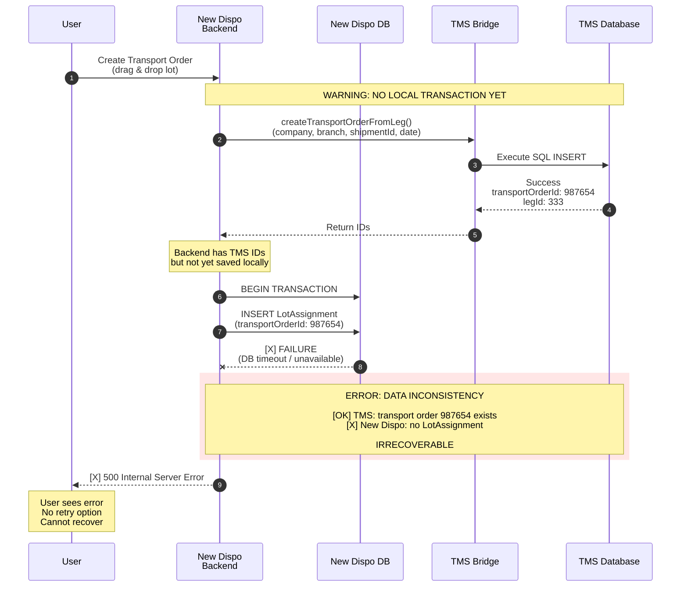
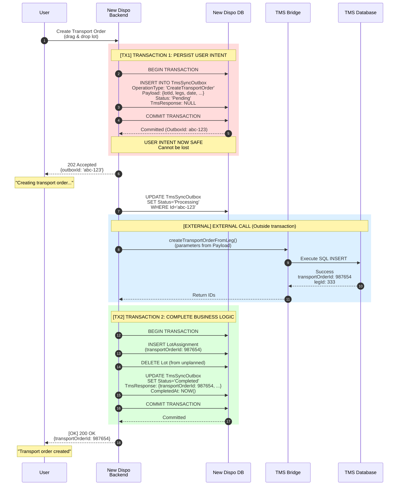
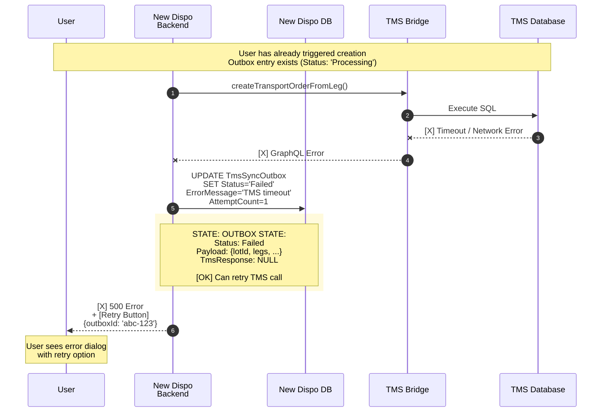
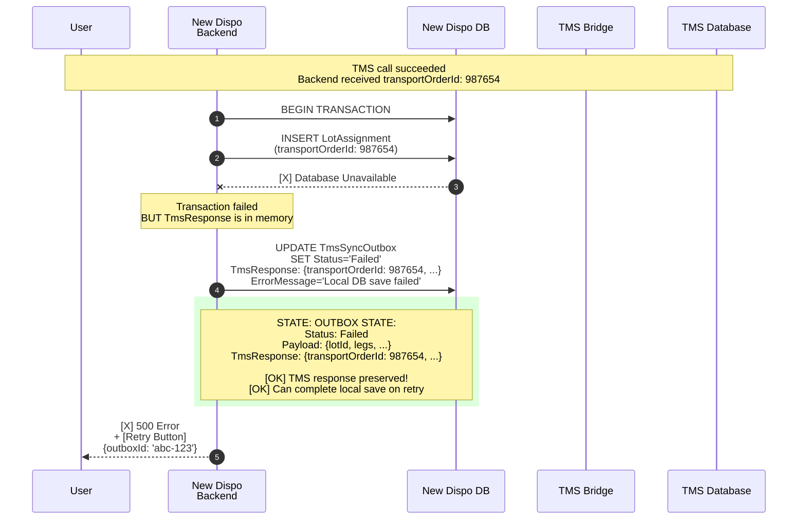
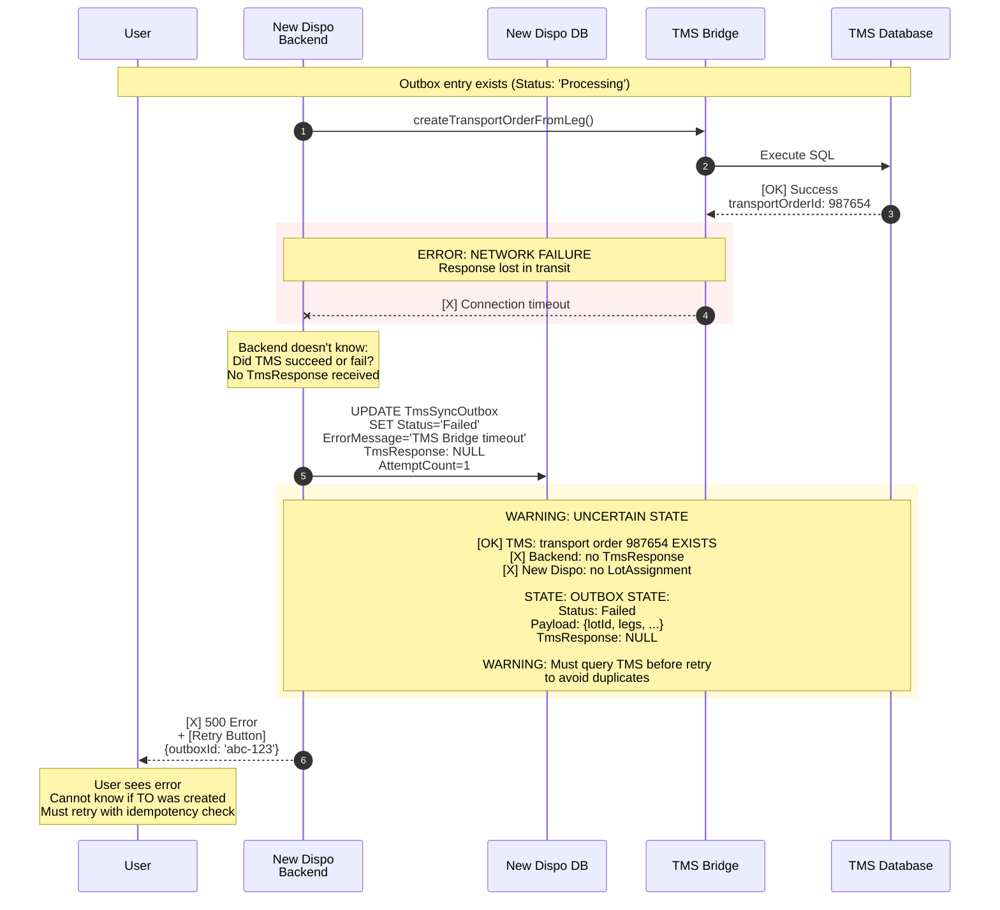
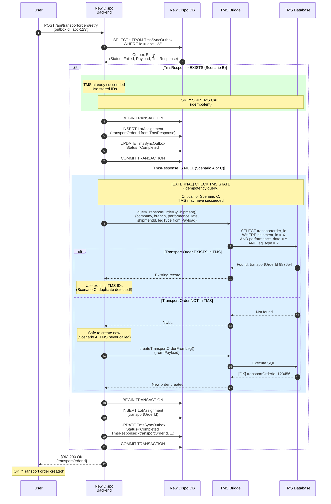
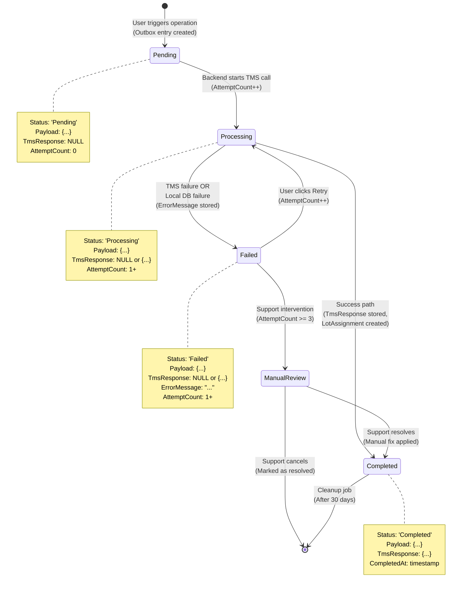
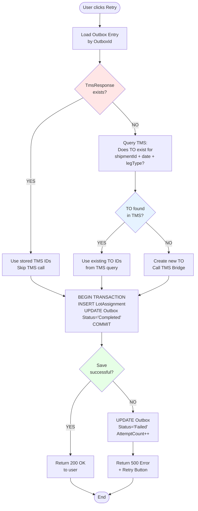
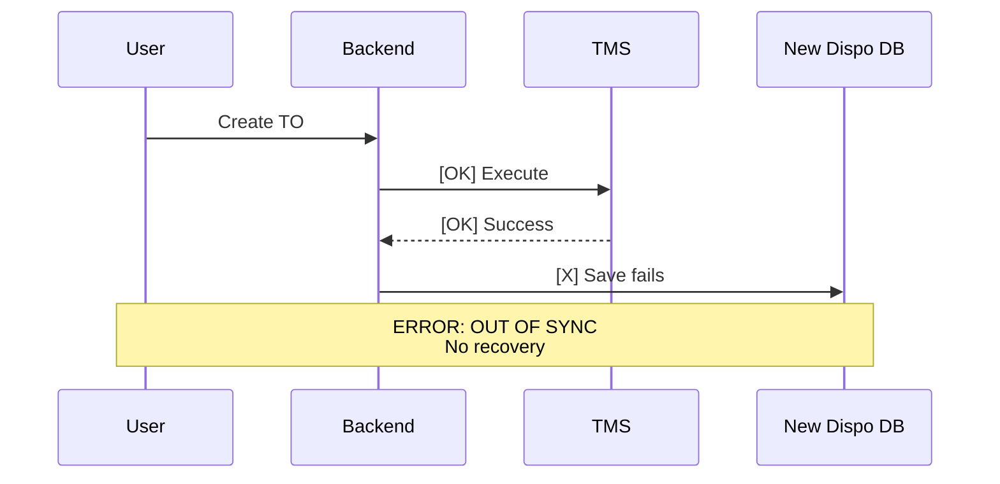
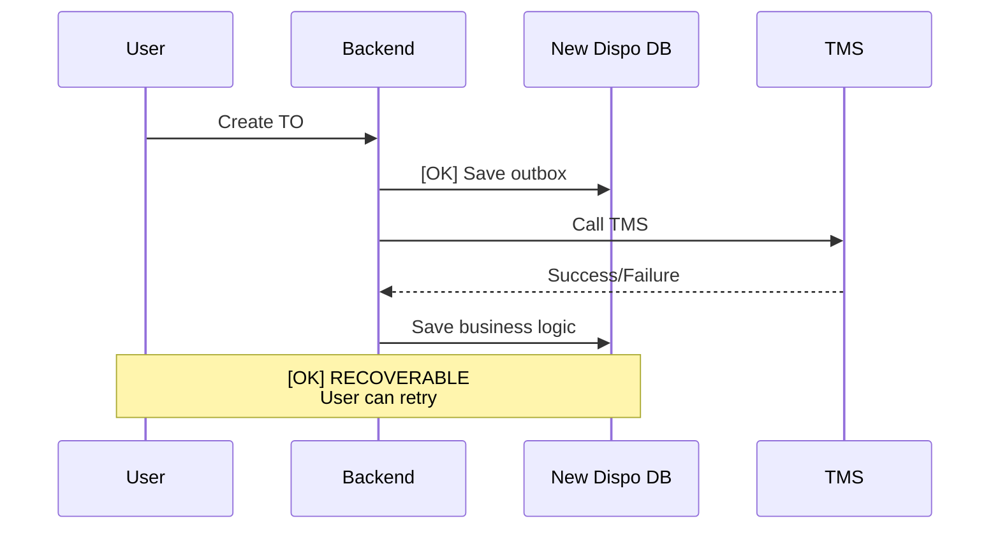

# Transactional Resilience: Solution Flow Diagrams

**Date:** 2026-03-25
**Status:** Technical Documentation
**Related:** `concept-transactional-resilience.md`

---

## 1. Current Problem: Scenario 2 (TMS Success, Local DB Failure)

**Root Cause:** External system (TMS) called BEFORE local transaction committed. If local save fails, TMS changes cannot be rolled back.

---

## 2. Minimal Outbox Solution: Happy Path

**Key Innovation:** User intent persisted in Transaction 1 BEFORE calling TMS. All subsequent failures are recoverable.

---

## 3. Failure Scenario A: TMS Call Fails

**Recovery Path:** User clicks retry → Backend reads Payload from outbox → Retries TMS call with same parameters.

---

## 4. Failure Scenario B: Local DB Save Fails After TMS Success

**Critical Feature:** TmsResponse stored in outbox BEFORE failing. Retry will NOT call TMS again (idempotent).

---

## 5. Failure Scenario C: Network Interruption (Response Lost)

**Critical Challenge:** TMS operation may have succeeded, but backend has no proof. Retry MUST query TMS first to detect existing transport order.

**Recovery Path:** User clicks retry → Backend reads Payload → Queries TMS for existing TO → Uses existing or creates new.

---

## 6. Retry Flow: Idempotent Recovery

**Idempotency Guarantee:** System checks TmsResponse first, queries TMS if needed (critical for Scenario C), ensures no duplicate transport orders.

---

## 7. Outbox State Machine

---

## 8. Decision Tree: Retry Logic

---

## 9. Comparison: Before vs After

### Before (Current Implementation)

### After (Minimal Outbox)

---

## 10. Key Architectural Decisions

| Decision | Rationale | Trade-off |
|----------|-----------|-----------|
| **Table-based outbox** | Workshop decision: "need to store this information anyway somewhere" (transcript line 2398). Provides audit trail, query capability, support dashboard. | More complex than log files, but enables retry and reconciliation. |
| **User-initiated retry** | Patrick approval (Workshop 2026-03-19): "manual step for the user... could be feasible" (transcript lines 1141-1177). | Simpler implementation, fits June timeline. Users must manually trigger recovery. |
| **TmsResponse storage** | Enables idempotency when TMS succeeds but local DB fails. Critical for Scenario B. | Requires JSONB field, adds storage overhead. |
| **Application-level idempotency** | TMS Bridge doesn't support idempotency keys yet. Use TMS query as fallback. | Requires TMS query endpoint, more complex retry logic. |
| **Status state machine** | Clear visibility for support team, enables monitoring and alerting. | Requires state transitions to be carefully managed. |

---

## 11. Summary

The **Minimal Outbox Solution** inverts the risk model:

| Aspect | Old Approach | Minimal Outbox |
|--------|-------------|----------------|
| **Transaction Start** | No local persistence | [OK] Outbox entry created first |
| **External Call** | Before local save | [OK] After outbox committed |
| **Failure Recovery** | [X] Manual SQL fixes | [OK] User retry button |
| **Data Consistency** | [X] Can desync | [OK] Eventually consistent |
| **Support Burden** | [X] High (manual fixes) | [OK] Low (automated retry) |
| **Audit Trail** | [X] None | [OK] Full history in outbox |

**Core Principle:** Commit local intent atomically BEFORE calling external systems.
