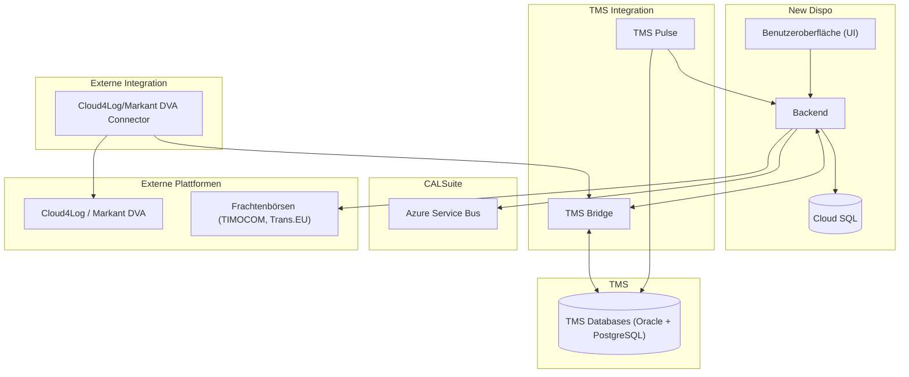

```mermaid
flowchart TB
    subgraph newdispo["New Dispo"]
        direction TB
        UI["Benutzeroberfläche (UI)"]
        MS["Backend"]
        PG[("Cloud SQL")]
        UI --> MS
        MS --> PG
    end

    subgraph integration["TMS Integration"]
        direction LR
        MB["TMS Bridge"]
        PULSE["TMS Pulse"]
    end

    subgraph extintegration["Externe Integration"]
        CONNECTOR["Cloud4Log/Markant DVA Connector"]
    end

    subgraph tmsdata["TMS"]
        TMSDB[("TMS Databases (Oracle + PostgreSQL)")]
    end

    subgraph calsuite["CALSuite"]
        ASB["Azure Service Bus"]
    end

    subgraph external["Externe Plattformen"]
        direction LR
        C4LDVA["Cloud4Log / Markant DVA"]
        FE["Frachtenbörsen (TIMOCOM, Trans.EU)"]
    end

    MS <--> MB
    PULSE --> MS
    MB <--> TMSDB
    PULSE --> TMSDB
    MS --> ASB
    MS --> FE
    CONNECTOR --> C4LDVA
    CONNECTOR --> MB
```
