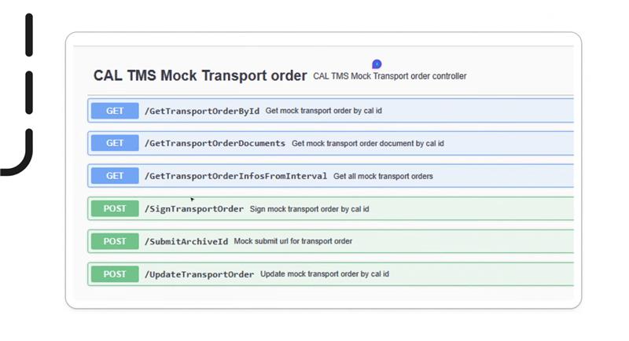

# Driver Terminal: TMS Proxy Endpoints & TMS Bridge Coverage Analysis

**Date:** 2026-04-29
**Version:** 1.0
**Status:** Exploration

---

## Summary

The Driver Terminal Backend uses a **two-tier Feign client architecture** to call the TMS Proxy. Internal services (`svc-pp-core-service`, `svc-worker-service`) call into `svc-tms-service`, which then calls the **real CAL TMS Proxy** via the `CalClient` Feign interface. The `svc-tms-cal-mock` module provides a local mock implementation of the same 6 endpoints for development/testing.

**Key finding:** Only **1 of 6** TMS database interfaces used by the Driver Terminal is available in the TMS Bridge (`PDIS_TRANSPORTORDERDTO.get`). The remaining 5 are grouped in a single database package (`PDRIVERTERMINAL`) and are not connected to the TMS Bridge.

## Architecture

```
svc-pp-core-service / svc-worker-service
    |
    | OutboundTmsApiServiceClient (Feign)
    v
svc-tms-service (OutboundTransportOrderController)
    |
    | OutboundTransportOrderService
    v
CalClient (Feign -> ${CAL_SERVICE_BASE_URL})
    |
    v
Real CAL TMS Proxy
```

## Mock Controller (Entry Point)

**File:** `Code/Driver-Terminal/Self-Service-Terminal-Backend/svc-tms-cal-mock/src/main/java/com/p3ds/sst/tms/cal/mock/service/controller/TransportOrderController.java`

Implements the same 6 endpoints with simulated delays for local development:

| Endpoint | Method | Line |
|---|---|---|
| `GET /GetTransportOrderById` | `getTransportOrderByCalId()` | 57 |
| `GET /GetTransportOrderDocuments` | `getTransportOrderDocuments()` | 113 |
| `GET /GetTransportOrderInfosFromInterval` | `getTransportOrders()` | 37 |
| `POST /SignTransportOrder` | `signTransportOrder()` | 97 |
| `POST /SubmitArchiveId` | `submitArchiveId()` | 135 |
| `POST /UpdateTransportOrder` | `updateTransportOrderByCalId()` | 79 |

## Real TMS Proxy Client (CalClient)

**File:** `Code/Driver-Terminal/Self-Service-Terminal-Backend/svc-tms-service/src/main/java/com/p3ds/sst/tms/service/client/CalClient.java`

Feign client targeting `${CAL_SERVICE_BASE_URL}` with `CalClientConfiguration` for auth/timeout handling.

| TMS Proxy Endpoint | CalClient Method | Line | Auth | Notes |
|---|---|---|---|---|
| `GET /GetTransportOrderById` | `getTransportOrderById()` | 18 | Authorization header | Query: ID, terminalId |
| `POST /UpdateTransportOrder` | `updateTransportOrder()` | 27 | Authorization header | Body: UpdateActionDto |
| `POST /SignTransportOrder` | `signTransportOrderDocument()` | 35 | Authorization header | Body: CalTmsSignActionDto |
| `GET /GetTransportOrderDocuments` | `getDocument()` | 43 | Authorization header | Query: ID, terminalId |
| `GET /GetTransportOrderInfosFromInterval` | `getTransportOrdersForDateInterval()` | 51 | Authorization header | Query: intervalStart, intervalEnd, terminalId |
| `POST /SubmitArchiveId` | `submitArchiveId()` | 61 | Authorization header | Body: SubmitArchiveIdActionDto |

All CalClient methods support custom timeout options via `CalTimeoutProperties`.

## Tier 1: Internal API (OutboundTmsApiServiceClient)

**File:** `Code/Driver-Terminal/Self-Service-Terminal-Backend/common-tms-service-api/src/main/java/com/p3ds/sst/tms/service/common/client/OutboundTmsApiServiceClient.java`

Feign client targeting `${TMS_API_SERVICE_BASE_URL}` — used by internal services to reach `svc-tms-service`.

| Internal Endpoint | Maps to CalClient Call | Line |
|---|---|---|
| `POST /outbound/transport-orders` | `updateTransportOrder()` | 18 |
| `POST /outbound/transport-orders/{id}/documents/sign` | `signTransportOrderDocument()` | 26 |
| `GET /outbound/transport-orders/{id}/documents` | `getDocument()` | 35 |
| `GET /outbound/transport-orders/{id}` | `getTransportOrderById()` | 45 |
| `GET /outbound/transport-orders` | `getTransportOrdersForDateInterval()` | 52 |
| `POST /outbound/transport-orders/qr-code` | `submitArchiveId()` | 58 |
| `GET /test/transport-orders` | (test endpoint) | 66 |

## Integration Service (svc-tms-service)

**Controller:** `Code/Driver-Terminal/Self-Service-Terminal-Backend/svc-tms-service/src/main/java/com/p3ds/sst/tms/service/controller/outbound/OutboundTransportOrderController.java`

**Service:** `Code/Driver-Terminal/Self-Service-Terminal-Backend/svc-tms-service/src/main/java/com/p3ds/sst/tms/service/service/outbound/OutboundTransportOrderService.java`

Bridges Tier 1 to CalClient with request/response mapping and authorization token injection via `CalAccessTokenService`.

## Consumers

### svc-pp-core-service
**File:** `Code/Driver-Terminal/Self-Service-Terminal-Backend/svc-pp-core-service/src/main/java/com/p3ds/sst/pp/core/service/service/outbound/OutboundTransportOrderService.java`

Calls: `updateTransportOrder`, `signTransportOrderDocument`, `getTransportOrderSignedDocument`, `getTransportOrderFromCal`, `fetchTransportOrders`, `sendQrCode`, `fetchTestTransportOrders`

### svc-worker-service
**File:** `Code/Driver-Terminal/Self-Service-Terminal-Backend/svc-worker-service/src/main/java/com/p3ds/sst/worker/service/services/DocumentWorkerService.java`

Calls: `getTransportOrderSignedDocument` (polling for signed documents)

## Configuration

| Service | Property | Env Variable |
|---|---|---|
| svc-tms-service | `cal.service.base.url` | `CAL_SERVICE_BASE_URL` |
| svc-pp-core-service | `tms.api.service.base.url` | `TMS_API_SERVICE_BASE_URL` |
| svc-worker-service | `tms.api.service.base.url` | `TMS_API_SERVICE_BASE_URL` |

## Exact TMS Proxy Routes

All routes are top-level (no path prefix), PascalCase. The mock and the real CalClient use identical routes — a 1:1 match.

All 6 endpoints exist in the TMS Proxy at `DriverTerminalController.cs` under route prefix `/api/DriverTerminal/`.

| Method | Route | Query Params | Headers | Exists in TMS Proxy |
|---|---|---|---|---|
| `GET` | `/GetTransportOrderById` | `ID`, `terminalId` | `x-action-name`, `Authorization` | YES (line 390) |
| `GET` | `/GetTransportOrderDocuments` | `ID`, `terminalId` | `x-action-name`, `Authorization` | YES (line 473) |
| `GET` | `/GetTransportOrderInfosFromInterval` | `intervalStart`, `intervalEnd`, `terminalId` | `x-action-name`, `Authorization` | YES (line 269) |
| `POST` | `/UpdateTransportOrder` | — | `x-action-name`, `terminalId`, `Authorization` | YES (line 589) |
| `POST` | `/SignTransportOrder` | — | `x-action-name`, `terminalId`, `Authorization` | YES (line 629) |
| `POST` | `/SubmitArchiveId` | — | `terminalId`, `Authorization` | YES (line 771) |

**TMS Proxy source:** `Code/CALConsult.TmsProxy/src/Presentation/CALConsult.CALtms.TmsProxy.Api/Api/DriverTerminalController.cs`

Note: GET endpoints pass `terminalId` as a query param, POST endpoints pass it as a header. `SubmitArchiveId` is the only endpoint without an `x-action-name` header.

## TMS Proxy to Database Mapping

All 6 endpoints are implemented in `DriverTerminalController.cs` → `DriverTerminalService.cs` and resolve to **database packages/functions/procedures**. The database connection is determined per-request by looking up the `terminalId` in the `DRIVER_TERMINAL` table, yielding a company/branch pair that maps to `tms.{company:000}{branch:00}`.

**TMS Proxy service:** `Code/CALConsult.TmsProxy/src/Services/CALConsult.CALtms.TmsProxy.Services/DriverTerminalService.cs`

| Route | DB Package | Function/Procedure | Type | Operation | In TMS Bridge |
|---|---|---|---|---|---|
| `GET /GetTransportOrderById` | `PDIS_TRANSPORTORDERDTO` | `get(sId)` | Function | SELECT (returns CLOB/JSON) | YES |
| `GET /GetTransportOrderDocuments` | `PDRIVERTERMINAL` | `showTransportOrderDocuments(sTerminalId, sTransportOrderId, sLanguage)` | Procedure | SELECT (returns PDF as LOB) | NO |
| `GET /GetTransportOrderInfosFromInterval` | `PDRIVERTERMINAL` | `getTransportOrderInfoListDTO(sTerminalId, dLstDStart, dLstDEnd)` | Function | SELECT (returns CLOB/JSON) | NO |
| `POST /UpdateTransportOrder` | `PDRIVERTERMINAL` | `setTransportOrderFields(sTerminalId, sTransportOrderId, sTruckLicensePlate, sTrailerLicensePlate, sDriverName, sCodriverName, sDriverPhone)` | Procedure | UPDATE | NO |
| `POST /SignTransportOrder` | `PDRIVERTERMINAL` | `putSignature(sTerminalId, sTransportOrderId, nMeasuringPoint, sType, oSignature)` | Procedure | INSERT/UPDATE (signature as LOB) | NO |
| `POST /SubmitArchiveId` | `PDRIVERTERMINAL` | `putQRCodeContent(sTerminalId, sTransportOrderId, sContent)` | Procedure | INSERT/UPDATE | NO |

**Connection resolution:** `BranchService.ConnectionIdFromTerminalId()` → queries `DRIVER_TERMINAL` table (in "zv" database) → extracts company/branch → connects to `tms.{company:000}{branch:00}`

## Questions/Open Items

- What is the actual value of `CAL_SERVICE_BASE_URL` in production? Does it point to the TMS Proxy or directly to the CAL TMS?
- The `POST /outbound/transport-orders/qr-code` endpoint internally maps to `CalClient.submitArchiveId()` — is this the intended semantic?

---

## Original User Input

> **Mission:** Clarify the used endpoints of the TMS Proxy by the Driver Terminal Backend.
>
> **Entry point:** Swagger UI screenshot showing "CAL TMS Mock Transport order" controller with 6 endpoints:



---

## Other Info

### TMS Proxy Client Usage

**Does the Driver Terminal use the official `CALConsult.TmsProxyClient`?** No.

The official TMS Proxy Client (`Code/CALConsult.TmsProxyClient`) is a **.NET/C# library** with matching client methods in `DriverTerminalClient.cs`. The Driver Terminal Backend is a **Java/Spring Boot** application — it cannot reference a .NET NuGet package.

Instead, the Driver Terminal implements its own HTTP client via a **Spring Cloud OpenFeign** interface (`CalClient.java`), which calls the same TMS Proxy endpoints directly over HTTP. This is functionally equivalent but independently maintained — any contract changes in the TMS Proxy must be reflected manually in the Feign client.

| Aspect | Official TmsProxyClient (.NET) | Driver Terminal CalClient (Java) |
|---|---|---|
| Tech stack | C# / .NET | Java / Spring Boot |
| Client type | Typed HTTP client class | Feign declarative interface |
| Source of truth | `DriverTerminalClient.cs` | `CalClient.java` |
| Sync mechanism | NuGet package update | Manual alignment |

### TMS Proxy Database Support

The TMS Proxy database layer (`CALConsult.DB.Database`) is **not Oracle-only** — it supports multiple providers via connection string prefixes:

| Prefix | DbType | Provider Class |
|---|---|---|
| `ora:` | Oracle | `OracleDatabaseRegisteredConnection` |
| `pg:` | Postgres | `PostgresDatabaseRegisteredConnection` |
| `mysql:` | MySQL | `MySqlDatabaseRegisteredConnection` |
| `odbc:` | ODBC | `OdbcDatabaseRegisteredConnection` |

Oracle is the default fallback when no prefix is detected. Which database is actually used depends on the connection strings configured at runtime. Postgres has full support including dedicated `PostgresDatabaseConnection`, `PostgresDatabaseCommand`, `PostgresDatabaseFunction`, and `PostgresDatabaseProcedure` classes.

---

## Version History

| Version | Date | Author | Description |
|---|---|---|---|
| 1.0 | 2026-04-29 | Matthias Max | Initial exploration: endpoint mapping, TMS Proxy verification, database mapping, TMS Bridge cross-check |

---

<div align="center">
  <sub>Created by <strong>Virtual Architect</strong></sub>
</div>
