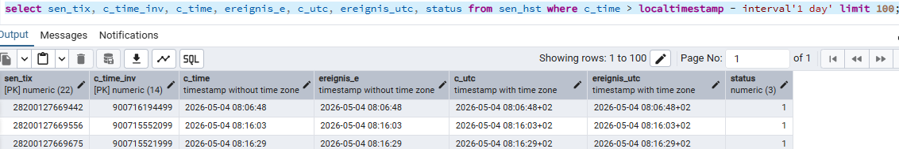

# Handling of Timezones in TMS and What It Means for New Dispo

**Date:** 2026-05-05
<internal>
**Status:** Exploration
</internal>

---

<internal>

## Original User Input

> Based on meeting transcript 00_Meetings/2026-04-30_Dispo Blocker_Timezones.vtt and email thread 00_Meetings/2026-04-30_timezones/ — a discussion triggered by timezone discrepancies observed during testing: Bulgarian developers entered 12:00, but 11:00 was stored in the database.
>
> Updated with 00_Meetings/2026-05-05_Dispo-Blocker/ — follow-up meeting (Joachim Schreiner, Patrick Uschmann, Matthias Max, Maximilian Kehder) with timezone deep-dive confirming the "time in context of geocoordinate" approach and xServer timezone delegation.

</internal>

---

## Summary

The TMS database stores all timestamps **without timezone information** — both in Oracle (historically) and in the replicated AlloyDB/Postgres. This is not a migration artifact but a **conscious design decision**: timestamps are strongly bound to the address context they belong to, and the local time is considered authoritative. The only exceptions are 4 UTC event fields which carry `TIMESTAMP WITH TIME ZONE` in both Oracle and Postgres.

This creates a new challenge for New Dispo, which is **a single application instance serving all 64 branches** across potentially different timezones — unlike the legacy Uniface system where each client ran on-premise next to its local database, always in sync with the local timezone.

**Key insight (2026-05-05):** The correct mental model is **"time in the context of a geocoordinate"** — the infrastructure chain (browser → server → DB) is irrelevant from a business perspective. Each timestamp is bound to a business entity (Shipment, Leg, Tourpoint) which has an address. The timezone can be derived from that address when needed (e.g., for route calculation). All layers must be technically controlled to prevent automatic timezone conversions, but the timestamps themselves must flow through as naive/timezone-less values.

---

<internal>

## How Timestamps Are Stored in TMS

- Most fields: `TIMESTAMP WITHOUT TIMEZONE` in both Oracle and Postgres — storing **local time** of the context (branch, destination, etc.)
- 4 explicit UTC fields exist in **both Oracle and Postgres** as `TIMESTAMP WITH TIME ZONE`:
  - `SEN_HST.C_UTC`
  - `SEN_HST.EREIGNIS_UTC`
  - `PST_HST.C_UTC`
  - `PST_HST.EREIGNIS_UTC`
- These UTC fields were added because events almost always arise in the context of a Niederlassung, making the timezone easy to determine.
- The timezone is currently pulled from the **database server's settings**.

The following query on `sen_hst` illustrates both types side by side:


*Source: [Joachim Schreiner, 2026-05-04](feedback_from_joachim.md)*

`c_time` and `ereignis_e` are `timestamp without time zone` (local time), while `c_utc` and `ereignis_utc` are `timestamp with time zone` (showing the `+02` offset for Europe/Berlin in summer).

## Two Categories of Timestamps

| Category | Description | Example | Timezone Relevance |
|---|---|---|---|
| **Action tracking timestamps** | System-generated, recording when something happened | Status change timestamp, record creation timestamp (`COTC`) | Stored in local time of the database server |
| **User-set timestamps / Target times** | Explicitly entered by users or derived from business rules | Pickup time "06:00", delivery time window | Always in **local time of the destination** — must be passed through 1:1 without conversion |

## Why This Matters for New Dispo

| Aspect | Legacy (Uniface) | New Dispo |
|---|---|---|
| Architecture | One client per branch, installed on-premise | One server instance for all 64 branches |
| Timezone sync | Client and database always in same timezone | Server is in cloud timezone, branches may differ |
| Impact | None — always implicitly correct | Timezone mismatch risk when server timezone != branch timezone |

In the legacy world, timezone handling was never an issue because the Uniface client and the Oracle database always ran in the same location. New Dispo breaks this assumption: a single cloud-hosted backend serves branches in Germany, Bulgaria, and potentially other countries — each with its own implicit timezone in the data.

### Observed Behavior

A user in Bulgaria (UTC+3 in summer) entered 12:00. The database stored 11:00 (UTC+2, German summer time). Somewhere in the stack, a timezone conversion occurred — exactly the kind of conversion that **must not happen** for user-set values.

</internal>

## The Fundamental Rule

> **User-set timestamps must pass through the entire stack (UI -> Backend -> TMS Bridge -> Database) without any timezone conversion.** "What you see is what you get."

<internal>

## Where Timezone Handling Matters

### Infrastructure View (Secondary)

```
┌─────────────┐     ┌──────────────┐     ┌────────────┐     ┌──────────────┐
│   Browser   │────>│  Dispo       │────>│ TMS Bridge │────>│  AlloyDB /   │
│  (User TZ)  │     │  Backend     │     │            │     │  Oracle      │
│             │     │  (Cloud TZ)  │     │            │     │  (Branch TZ) │
└─────────────┘     └──────────────┘     └────────────┘     └──────────────┘
     ^                    ^                    ^                    ^
     │                    │                    │                    │
  OS timezone        GCP region TZ        passthrough          DB server TZ
  (Kontrolle!)       (Hosting/DC)                              (set on login)
```

Three distinct timezone contexts exist at the infrastructure level:
1. **Browser/Client** — inherits from the OS; physically at the Niederlassung
2. **Server (Backend)** — the cloud instance timezone (Hosting/Data Center)
3. **Database** — timezone set on database login (currently from DB server OS)

**However, per the 2026-05-05 discussion, this infrastructure chain is secondary.** Joachim Schreiner's key insight: *"This chain is not relevant — we capture a time in the context of a geocoordinate, an address."* Where the system is hosted or where the user is located is irrelevant for the business logic. Only the business entity context matters.

### Business View (Primary)

The correct mental model is not "which servers touch the timestamp" but "which business entity provides the geocoordinate context":

```
┌──────────────────────────────────────────────────────────┐
│  User enters a time (e.g. 07:00)                         │
│  in the context of a business entity:                    │
│  Shipment, Leg, Tourpoint, Lot, ...                     │
│                                                          │
│  Each entity is bound to an address → geocoordinate      │
│  → that geocoordinate determines the timezone             │
└──────────────────────────────────────────────────────────┘
```

The time is always **local time at the entity's address**. When a user enters 07:00 as a pickup time, it means 07:00 at the sender's location. When they enter a delivery window, it means local time at the receiver's location.

**Consequence:** Every layer in the infrastructure chain must be *explicitly controlled* to pass timestamps through without conversion. JavaScript Date objects, .NET DateTime, and GraphQL serialization can all apply automatic timezone conversions during formatting or parsing — this must be prevented.

### Scenarios to Investigate

1. **User-entered times** (e.g., planning pickup at 06:00): Must arrive in DB as-is. No conversion at any layer.
2. **System-generated timestamps** (e.g., "when was this status change recorded"): Currently stored in the database server's timezone. With a centralized New Dispo server, these would be in the cloud server's timezone unless explicitly handled.
3. **Event ordering / time comparisons**: If events from different branches are compared, the lack of timezone info makes ordering ambiguous.
4. **Daylight saving time transitions**: Germany (CET/CEST) and other countries switch at different dates — a pure offset approach won't suffice.

## Route Calculation Across Timezone Boundaries

Joachim Schreiner identified a concrete impact: **once a transport crosses a timezone boundary, route calculation has a bug.** Target times (e.g., agreed delivery windows) are always given in local time. When calculating travel durations and arrival times, the timezone of the destination must be known.

### Current Approach (confirmed 2026-05-05)

When building the DTO structure for the PTV XServer, TMS currently:
1. Queries the **database server's current timezone** on login
2. Passes this timezone as the offset in the DTO to the xServer

This works only because Nagel's delivery areas currently fall within a single timezone (MESZ/CET), and no route calculation is done for long-distance (Fernverkehr) transports.

### Proposed Approach (agreed 2026-05-05)

**Stop passing timezone in the DTO from TMS.** Instead, send only:
- The local time (as stored — without timezone)
- The geocoordinates of the tour point

**Let the PTV XServer determine the timezone** from geocoordinates + reference date. The xServer already has this capability as a built-in function. This:
- Eliminates the risk of passing an incorrect offset
- Handles DST transitions correctly
- Works for cross-timezone transports without changes in TMS

### Why Not Add Timezone Throughout TMS?

Joachim explained why adding `TIMESTAMP WITH TIME ZONE` broadly in TMS was rejected: for every time field, TMS would need to determine the geographic context (sender? receiver? branch? carrier's departure point? last tour point?) and call a timezone resolution tool. The effort is prohibitive, and an incorrect timezone is worse than no timezone. The deliberate choice: **store local time only, determine timezone on-demand where needed (i.e., route calculation).**

### Scope

A timezone-per-branch setting alone won't solve this. Bulgaria, for example, has no Niederlassung, but customers can be delivered there or transport handed to partner carriers there. The timezone is bound to the **destination address**, not to the branch.

Countries outside MESZ where this becomes relevant: Romania, Bulgaria, Greece, Turkey (east), Portugal, UK/Ireland (west).

## Branch and Destination Timezone Data

- **Branch databases** run in the **local timezone of their location** (not all in German timezone). For German locations: Europe/Berlin.
- Table `ADMIN_NL` contains all branches (Niederlassungen) — replicated as a materialized view via DB Link/FDW on "zentrale". No timezone field exists currently. City/location (`Ort`) is available.
- **Destination timezones** cannot be derived from branch data alone — they depend on the delivery address.
- In Europe, no country has more than one timezone, so timezone could in theory be derived from country code — **except for DST transitions**, which differ by country and date.

</internal>

---

## Confirmed Answers

| Question | Answer | Source |
|---|---|---|
| Are all branch DBs in German timezone? | **No.** In the local timezone of the location. German locations = Europe/Berlin. | Andrej (meeting 04-30), Matthias (email) |
| Is `timestamp without time zone` in Postgres a conscious decision? | **Yes.** Due to strong binding to address context. Decided to continue like Oracle, storing only local time. | Joachim (email 05-04) |
| Was timezone info lost during Oracle→Postgres migration? | **No.** It was never there for most fields. The 4 UTC fields are `TIMESTAMP WITH TIME ZONE` in both Oracle and Postgres. | Joachim (email 05-04) |
| Is this a Go-Live blocker for branch 1060? | **No.** Branch 1060 operates within MESZ. Even cross-timezone transports would only cause ~1h error in route duration. | Patrick (meeting 04-30), Joachim (meeting 05-05) |
| Where does the timezone come from currently? | **From the database server's settings**, set on database login. Thomas handles this in Postgres. | Joachim (email 05-04, meeting 05-05) |
| Is the infrastructure chain (browser→server→DB) relevant? | **No, from a business perspective.** Time is always in context of a geocoordinate (address). But every layer must be technically controlled to prevent automatic conversions. | Joachim, Matthias (meeting 05-05) |
| Why not add timezone throughout TMS? | **Too costly and risky.** Every time field would need geographic context resolution. Incorrect timezone is worse than no timezone. | Joachim (meeting 05-05) |
| How should xServer handle timezones? | **Let xServer determine timezone** from geocoordinates + reference date instead of passing offset in DTO. XServer already has this capability. **Out of scope for Go-Live June 2026.** | Joachim (email 05-04, meeting 05-05) |
| Is the xServer change needed for Go-Live? | **No.** Not feasible in 4 weeks and not needed — 1060 operates within MESZ. To be planned post-Go-Live. | Matthias, Joachim (meeting 05-05) |
| Does Sweden already have this issue? | **Partially.** Sweden has a different location but same timezone (CET/CEST). UTC time and offset are already set on database login there. | Joachim (meeting 05-05) |

---

## Open Items for Go-Live (June 2026)

1. **What timezone does the GCP Cloud Run instance use?** (likely UTC — needs verification)
2. **Which specific flows/fields are affected?** — Needs systematic investigation through the actual interface chain.
3. **Where in the New Dispo stack does the observed conversion happen?** — Is it the .NET backend (DateTime vs DateTimeOffset), the GraphQL serialization, or the frontend JavaScript Date handling?

## Open Items Post-Go-Live

1. **How should route calculation handle cross-timezone transports?** — Proposal: let PTV XServer determine timezone from geocoordinates + reference date instead of passing offset in DTO (discussed 2026-05-05). Not yet implemented.

---

## Recommended Next Steps

### For Go-Live 1060 (June 2026)

1. **Trace the timezone handling** through the full stack (Frontend Angular -> Backend .NET -> TMS Bridge GraphQL -> AlloyDB) to find where the observed Bulgarian conversion happened
2. **Ensure all layers treat timestamps as "naive"** (timezone-less) — explicitly control JavaScript Date, .NET DateTime, and GraphQL serialization to prevent automatic conversions
3. **Verify**: confirm the Cloud Run instance timezone and that it doesn't interfere when timestamps are correctly treated as naive

### Post-Go-Live

4. **Implement xServer timezone change**: stop passing timezone offset in DTO, let xServer determine timezone from geocoordinates + reference date
5. **Classify all timestamp fields** in relevant TMS tables into "user-set / target times" vs "system-generated" categories
6. **Address Cloud DB timezone**: when all 64 branches move to AlloyDB, the current approach of reading timezone from DB server OS won't work (all would get the same GCP timezone)

---

## Related PBIs

- [#123353](https://dev.azure.com/p3ds/Nagel-CAL%20Disposition/_workitems/edit/123353/)
- [#123588](https://dev.azure.com/p3ds/Nagel-CAL%20Disposition/_workitems/edit/123588/)

---

<internal>

## Related Files

- `Code/tms-alloydb-schema` — AlloyDB schema (timestamp field definitions)
- `Code/Disposition-Abstraction-Layer` — TMS Bridge (GraphQL layer, potential conversion point)
- `Code/Disposition-Backend` — .NET Backend (DateTime handling)
- `Code/Disposition-Frontend` — Angular Frontend (JavaScript Date handling)

## Sources

- 00_Meetings/2026-04-30_Dispo Blocker_Timezones.vtt — initial meeting where issue was identified
- 00_Meetings/2026-04-30_timezones/ — email thread with Joachim's response
- 00_Meetings/2026-05-05_Dispo-Blocker/ — follow-up meeting with timezone deep-dive (Joachim, Matthias, Patrick, Max)
- [Miro Board: Timezone Discussion](https://miro.com/app/board/uXjVKWcuF50=/?moveToWidget=3458764670527692471&cot=14)

</internal>
