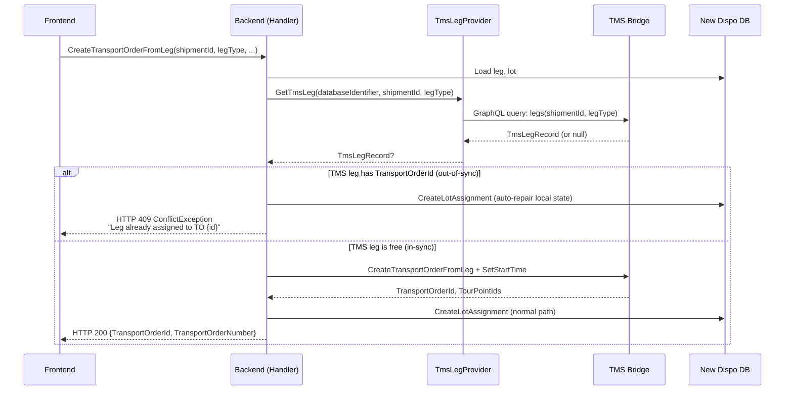

# Flow #1: Create Transport Order from Leg

**Date:** 2026-05-18
**Status:** Implemented (branch: `feature/assign-leg-create-transport-order-from-leg-indempotent`, PR #32792)
**Concept Source:** [01-CreateTransportOrderFromLeg.md](../2026-04-08_Transactional_State_Verification_-_CreateTransportOrderFromLeg/01-CreateTransportOrderFromLeg.md)
**User Story:** #123303

---

## 1. Sync Detection

### Planned (Concept)

1. Before calling `pDIS_TransportOrder.CreateTransportOrderFromLeg`, query TMS via `V_DIS_Leg`
2. Check if any leg with matching `ShipmentId` + `LegType` already has a `TransportOrderId` assigned
3. If assigned: operation was already executed → return existing TO (idempotent path) or conflict
4. If not assigned: safe to proceed

### Implemented (Code)

1. Load leg from New Dispo DB
2. Call `TmsLegProvider.GetTmsLeg(databaseIdentifier, shipmentId, legType)` → queries TMS Bridge GraphQL `legs` query
3. If `tmsLeg` is not null: `ShouldSync(tmsLeg)` checks `tmsLeg.TransportOrderId is not null`
4. If out-of-sync:
   a. Build `CreateLotAssignmentSyncDto` from `tmsLeg` data (pickup/delivery addresses, dates, product group)
   b. Call `createLotAssignmentSubHandler.CreateLotAssignment(syncData, lot, leg)` → auto-repairs New Dispo local state by creating a `LotAssignmentEntity` matching the TMS state
   c. Throw `ConflictException("Leg has already been assigned to transportorder with ID {syncResult.TransportOrderId}.")`
5. If in-sync: proceed with normal `CreateTransportOrderFromLegAndSetStartTime` + `RecalculateRoute` + `CreateLotAssignment`



---

## 2. Concept vs. Implementation

**Concept:** Query `V_DIS_Leg` for `ShipmentId + LegType` with `TransportOrderId IS NOT NULL`. If row exists, the leg is already assigned — this is either an idempotent repeat (same TO) or a conflict (different TO). Report the finding and let the user decide.

**Implementation:** Queries TMS Bridge via GraphQL `legs` query (which reads the same underlying `V_DIS_Leg` view). If the leg is already assigned in TMS, the handler **automatically repairs** the New Dispo local state by creating a matching `LotAssignmentEntity`, then throws `ConflictException` to force a page refresh.

**vs. Option 1:** Overdelivered

**Difference:** Option 1 specified "state-checking query → display error → user manually retries." The implementation goes further by auto-repairing New Dispo local state before throwing the error. The user still sees an error and must re-evaluate, but the local data is already correct. The concept also did not distinguish idempotent (same TO) from conflict (different TO) — the implementation doesn't distinguish either for this flow (always throws conflict with the TO ID).

---

## 3. Option 1 Requirements

| Requirement | Status | Notes |
|-------------|--------|-------|
| State-checking query before TMS action | Done | `TmsLegProvider.GetTmsLeg()` before `CreateTransportOrderFromLeg` |
| Display error to user | Partial | HTTP 409 ProblemDetails returned, but bare string message with no structured payload |
| User manually retries | Replaced | Auto-repair + ConflictException forces page refresh; user must repeat action consciously |
| Incident ID in error response | Not done | No incident/tracking ID in ProblemDetails |
| Structured error payload for Frontend | Not done | Error is a bare string, no machine-readable conflict type |
| Support team can investigate | Not done | Generic `LogError(ex, ex.Message)` only — no structured sync conflict logging |
| Monitoring for failure frequency | Not done | No metrics or dashboards for sync conflicts |

---

## 4. Retry Effect

**Polly retry has no effect on sync conflicts.** `ConflictException` is not in the Polly retry predicate — it is thrown as a business-level error, not a transient infrastructure failure. The retry mechanism (3x, 200ms exponential backoff, jitter) only catches `HttpRequestException`, `TimeoutException`, `TaskCanceledException`, `GraphQLHttpRequestException` (502/503/504), and `TmsBridgeTransientErrorException`.

The sync check itself is not retried — it fires once, repairs state, throws, done. The user must re-trigger the action by interacting with the refreshed UI.

---

## 5. Error Information & Data Reaching Frontend

### Implemented

```json
{
  "status": 409,
  "title": "Conflict with the current state of the target resource.",
  "detail": "Leg has already been assigned to transportorder with ID 1234.",
  "type": "https://datatracker.ietf.org/doc/html/rfc7231#section-6.5.8",
  "errors": []
}
```

- HTTP 409 via `ConflictExceptionHandler` → `BaseExceptionHandler`
- `detail` contains the existing TransportOrderId — enough to know which TO "won"
- No incident ID, no conflict type, no entity details, no TMS state snapshot

### Desired / Possible (VA suggestion)

Data available at the sync check point (from `TmsLegRecord`):

| Field | Available | Surfaced | Could Be Useful For |
|-------|-----------|----------|---------------------|
| `TransportOrderId` | Yes | Yes (in message string) | "This leg is on TO X" |
| `ShipmentId` | Yes | No | Identifying the affected shipment |
| `LegType` (V/H/N) | Yes | No | Distinguishing pickup/delivery legs |
| `PickUpName1`, `PickUpCity` | Yes | No | Showing where the leg's pickup is |
| `DeliveryName1`, `DeliveryCity` | Yes | No | Showing destination |
| `DeliveryDateFrom/To` | Yes | No | Delivery window context |
| `ProductGroup` | Yes | No | Product context |
| `PickUpTourpointId`, `DeliveryTourpointId` | Yes | No | Tour point references |

**VA suggestion:** A structured error response could include `conflictType: "AlreadyAssigned"`, `affectedEntity: {type: "Leg", shipmentId}`, `tmsState: {transportOrderId, origin, destination}`, and `wasAutoRepaired: true`. This would let the frontend render a meaningful message without parsing the detail string.

**AC check (#123326):**
- AC1 "Snackbar appears once, disappears after dismiss, info no longer available" — possible with current 409, but no incident ID to persist
- AC2 "Page auto-refreshes after snackbar" — not implemented in backend (frontend concern), but backend auto-repair means data is ready on refresh
- AC3 "Error messaging for edge cases" — bare string only, not structured
- AC4 "No auto-retry of user action" — correct, ConflictException is not retried

---

## 6. UX Scenarios

### Scenario A: Leg already assigned to some TO in TMS

| Step | What Happens |
|------|-------------|
| User drags leg to "new TO" area | Frontend calls `POST /transportorders` with leg data |
| Backend detects: leg has `TransportOrderId = 5678` in TMS but is "free" in New Dispo | Sync check fires |
| Backend auto-repairs: creates LotAssignment pointing to TO 5678 | Local state now matches TMS |
| Backend throws ConflictException | HTTP 409 returned |
| Frontend shows snackbar | "This leg is already assigned to Transport Order 5678. The page has been refreshed." |
| User decides | Navigate to TO 5678, or pick a different leg |

### Scenario B: TMS and New Dispo are in sync (happy path)

No sync conflict — normal flow executes, new TO is created.

---

## 7. Open Questions

1. **No same-TO vs. different-TO distinction in error message.** Unlike Flow #3 (AssignLeg), this flow always uses the message "already assigned to TO with ID {x}". Should it also distinguish "this TO" from "different TO"? (Unlikely for CreateTO, since the TO doesn't exist yet — but conceptually the leg could be on a TO with the same parameters.)

2. **CreateTransportOrderFromLeg is NOT idempotent at TMS level** — calling it twice creates two TOs. The sync check correctly prevents this. But: what if the TMS call succeeds and the local DB save fails? The next attempt will detect the TO exists (good), repair local state (good), throw conflict (good). The user sees an error but is actually in a recovered state. Is the UX clear enough?

3. **TmsLegRecord data not surfaced.** The sync check fetches rich TMS data (`PickUpName1`, `DeliveryCity`, etc.) but only uses `TransportOrderId` in the error message. Surfacing more data would improve the snackbar content.

---

*Analysis by Virtual Architect*
