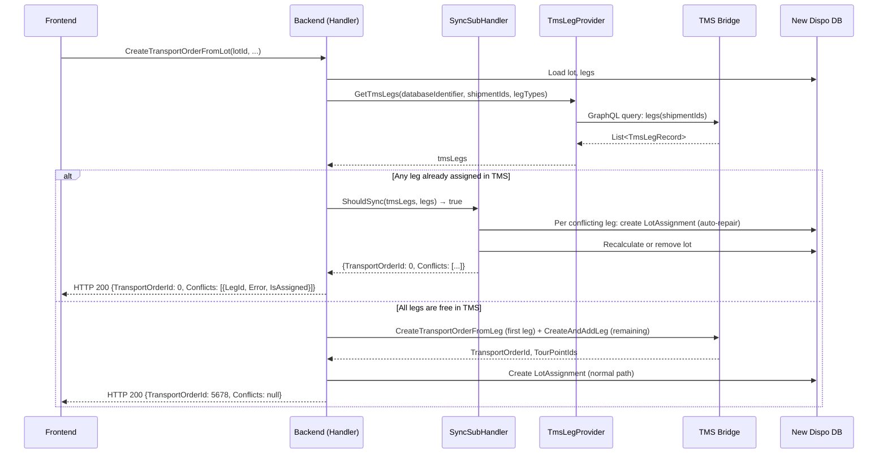

# Flow #2: Create Transport Order from Lot

**Date:** 2026-05-18
**Status:** Implemented (branch: `feature/assing-lot-create-transport-order-from-lot-indempotent`, not yet merged — merge conflicts)
**Concept Source:** [02-CreateTransportOrderFromLot.md](../2026-04-08_Transactional_State_Verification_-_CreateTransportOrderFromLeg/02-CreateTransportOrderFromLot.md)
**User Story:** Part of #123303

---

## 1. Sync Detection

### Planned (Concept)

1. For each leg in the Lot, query `V_DIS_Leg` with `ShipmentId IN (:ShipmentIds)` and `LegType`
2. Count how many legs already have a `TransportOrderId` assigned
3. If all legs assigned to same TO → idempotent (return existing TO)
4. If partial assignment → partial failure recovery needed
5. If no legs assigned → safe to proceed

### Implemented (Code)

1. Load lot and legs from New Dispo DB
2. For each leg: `TmsLegProvider.GetTmsLeg()` → queries TMS Bridge GraphQL
3. `CreateTransportOrderFromLotSyncSubHandler.ShouldSync(tmsLegs, legs)`: returns true if ANY leg has a matching `TmsLegRecord` with `TransportOrderId is not null`
4. If `ShouldSync` is true → `Sync()`:
   a. Iterate all legs
   b. For each leg with a TMS match (`MatchTmsLegWithDispoLeg`): create a `LotAssignmentEntity` from TMS data, add `ConflictDto { LegId, Error, IsAssigned = true }`, remove leg from lot
   c. For each leg without TMS match: add `ConflictDto { LegId, IsAssigned = false }` (no conflict)
   d. If lot still has remaining legs: recalculate lot aggregates. If empty: remove lot.
   e. `SaveChangesAsync()`
   f. Return `CreateTransportOrderFromLotResponseDto { TransportOrderId = 0, TransportOrderNumber = 0, Conflicts = [...] }`
5. If `ShouldSync` is false: proceed with normal TMS lot creation



---

## 2. Concept vs. Implementation

**Concept:** Count-based check — query all legs from the lot against `V_DIS_Leg`, count how many are already assigned. Distinguish: all assigned to same TO (idempotent), partial assignment (recovery), no assignment (proceed). The concept identified partial failure as the primary risk since N separate TMS mutations are involved.

**Implementation:** Per-leg matching via `MatchTmsLegWithDispoLeg(ShipmentId + LegType + TransportOrderId != null)`. Each conflicting leg gets its own `ConflictDto`. Auto-repair creates `LotAssignmentEntity` per conflicting leg, adjusts or removes the lot. Returns per-leg conflict information in the response body (HTTP 200 with `Conflicts` list), NOT via ConflictException.

**vs. Option 1:** Overdelivered

**Difference:** Option 1 specified "show error, user manually retries." The implementation goes further by:
- Auto-repairing per leg (creating LotAssignment for each conflicting leg)
- Returning per-leg conflict details (not just a single error message)
- Handling partial conflicts: some legs conflicting, others not
- Using HTTP 200 with `Conflicts` array instead of HTTP 409 — this is a different error contract than flows 1 and 3

**Important difference from flows 1/3:** This flow does NOT throw `ConflictException`. It returns HTTP 200 with `TransportOrderId = 0` and a `Conflicts` list. The frontend must check `TransportOrderId == 0` or the `Conflicts` array to detect the conflict.

---

## 3. Option 1 Requirements

| Requirement | Status | Notes |
|-------------|--------|-------|
| State-checking query before TMS action | Done | `TmsLegProvider.GetTmsLegs()` → `ShouldSync()` before any TMS call |
| Display error to user | Partial | Per-leg `ConflictDto` with `Error` string returned in 200 body, but no structured conflict type |
| User manually retries | Replaced | Auto-repair + per-leg conflict info; user must refresh and re-evaluate |
| Incident ID in error response | Not done | No incident/tracking ID |
| Structured error payload for Frontend | Partial | `ConflictDto { LegId, Error, IsAssigned }` — more structured than bare string, but Error is still a plain string |
| Support team can investigate | Not done | No structured logging of sync conflicts |
| Monitoring for failure frequency | Not done | No metrics or dashboards |

---

## 4. Retry Effect

**Polly retry has no effect on sync conflicts.** The sync check runs before the TMS operation. If `ShouldSync()` returns true, the handler takes the sync path and returns immediately — no TMS mutation is ever called, so no transient failure can occur. The response is HTTP 200 (not an exception), so Polly is never involved.

---

## 5. Error Information & Data Reaching Frontend

### Implemented

```json
{
  "transportOrderId": 0,
  "transportOrderNumber": 0,
  "conflicts": [
    { "legId": "aaa-bbb-ccc", "error": "Leg is already part of a transport order", "isAssigned": true },
    { "legId": "ddd-eee-fff", "error": null, "isAssigned": false }
  ]
}
```

- HTTP 200 (not 409) — different contract from flows 1/3
- `TransportOrderId = 0` signals that no TO was created
- Per-leg `ConflictDto` with `LegId`, `Error` string, `IsAssigned` boolean
- `IsAssigned = true` means this leg was already assigned in TMS and was auto-repaired
- `IsAssigned = false` means this leg had no TMS conflict

### Desired / Possible (VA suggestion)

The sync handler already fetches full `TmsLegRecord` per leg. Data available but not surfaced:

| Field | Available | Surfaced | Could Be Useful For |
|-------|-----------|----------|---------------------|
| `TransportOrderId` | Yes | No (only "already part of a transport order") | "Leg X is on TO Y" |
| `ShipmentId` | Yes | No | Correlation with leg |
| Address fields | Yes | No | Context for the conflict |
| `DeliveryDateFrom/To` | Yes | No | Time window context |

**VA suggestion:** The `ConflictDto.Error` could include the `TransportOrderId` (like flows 1/3 do). Currently it just says "Leg is already part of a transport order" without naming which one. The `TmsLegRecord` has the data — it's just not put into the error string.

**VA suggestion:** Consider aligning the error contract with flows 1/3. Currently: flows 1/3 use HTTP 409 + `ConflictException`, flows 2/4 use HTTP 200 + `Conflicts` array. A unified approach would simplify frontend handling.

**AC check (#123326):**
- AC1 "Snackbar appears once" — possible, but frontend must parse the `Conflicts` array from a 200 response (not a 409)
- AC2 "Page auto-refreshes" — backend auto-repair means data is ready on refresh
- AC3 "Error messaging for edge cases" — per-leg granularity is good, but error strings are generic
- AC4 "No auto-retry" — correct, no exception is thrown, no Polly involvement

---

## 6. UX Scenarios

### Scenario A: All legs in lot already assigned in TMS

| Step | What Happens |
|------|-------------|
| User drags lot to "new TO" area | Frontend calls `POST /transportorders` with lot data |
| Backend detects: all 3 legs have `TransportOrderId` in TMS | `ShouldSync` → true |
| Backend auto-repairs: creates LotAssignment per leg, removes lot | Local state matches TMS |
| Backend returns HTTP 200 | `{TransportOrderId: 0, Conflicts: [{leg1, assigned}, {leg2, assigned}, {leg3, assigned}]}` |
| Frontend detects `TransportOrderId == 0` | Shows snackbar: "Could not create TO — 3 legs are already assigned. Page refreshed." |

### Scenario B: Some legs in lot assigned, others free

| Step | What Happens |
|------|-------------|
| Backend detects: 1 of 3 legs is assigned in TMS | `ShouldSync` → true (at least one match) |
| Backend auto-repairs: conflicting leg gets LotAssignment, lot reduced to 2 legs | Lot aggregates recalculated |
| Backend returns HTTP 200 | `{TransportOrderId: 0, Conflicts: [{leg1, assigned}, {leg2, not assigned}, {leg3, not assigned}]}` |
| Frontend shows | "1 leg already assigned. Lot updated. Please review and retry with remaining legs." |

### Scenario C: No conflicts (happy path)

Normal flow executes — new TO created, all legs assigned.

---

## 7. Open Questions

1. **Inconsistent error contract.** Flows 1/3 throw `ConflictException` → HTTP 409. Flows 2/4 return HTTP 200 with `Conflicts` array. Should the frontend handle both patterns, or should this be unified?

2. **`TransportOrderId: 0` as conflict signal.** Returning 0 as a sentinel value is fragile. A dedicated boolean (`isConflict`) or HTTP status code would be clearer.

3. **Partial conflict handling.** When only some legs are conflicting, the implementation repairs those legs and returns. But the non-conflicting legs are NOT assigned to any TO. The user must re-trigger the action for the remaining legs with a reduced lot. Is this UX clear?

4. **Error message lacks TO ID.** Unlike flows 1/3, the error string is just "Leg is already part of a transport order" — doesn't say which one. The `TmsLegRecord` has the data.

5. **PR has merge conflicts.** Branch `feature/assing-lot-create-transport-order-from-lot-indempotent` has unresolved merge conflicts. Implementation cannot be verified against current master.

---

*Analysis by Virtual Architect*
