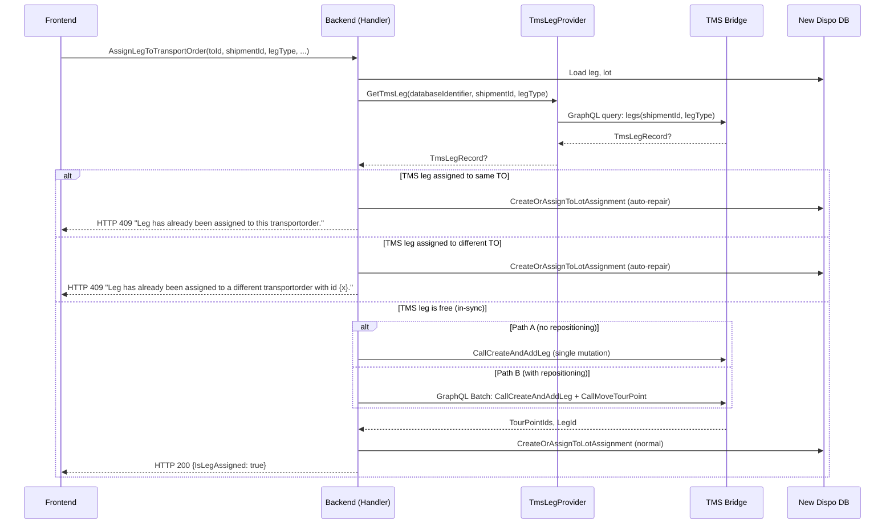

# Flow #3: Assign Leg to Transport Order

**Date:** 2026-05-18
**Status:** Implemented (branch: `feature/assign-leg-create-transport-order-from-leg-indempotent`, PR #32792)
**Concept Source:** [03-AssignLegToTransportOrder.md](../2026-04-08_Transactional_State_Verification_-_CreateTransportOrderFromLeg/03-AssignLegToTransportOrder.md)
**User Story:** #123303

---

## 1. Sync Detection

### Planned (Concept)

1. Query `V_DIS_Leg` for `ShipmentId + LegType` with `TransportOrderId IS NOT NULL`
2. If leg assigned to target TO → idempotent (already done)
3. If leg assigned to different TO → conflict
4. If leg unassigned → safe to proceed
5. For Path B (with repositioning): also check `V_DIS_TO_Tourpoint` for pickup sequence

### Implemented (Code)

1. Load leg from New Dispo DB
2. Call `TmsLegProvider.GetTmsLeg(databaseIdentifier, shipmentId, legType)` → queries TMS Bridge GraphQL
3. If `tmsLeg` is not null: `ShouldSync(tmsLeg)` checks `tmsLeg.TransportOrderId is not null`
4. If out-of-sync:
   a. Distinguish same-TO vs. different-TO: `tmsLeg.TransportOrderId == transportOrderId`
   b. Build `CreateLotAssignmentSyncDto` from TMS leg data
   c. Call `assignToLotAssignmentSubHandler.CreateOrAssignToLotAssignment(syncData, leg, lot, null, databaseIdentifier, transportOrderId)` → auto-repairs New Dispo local state
   d. Throw `ConflictException` with distinguishing message
5. If in-sync: proceed with `AssignLeg` (Path A) or `AssignLegAndMoveTourPoint` (Path B)



---

## 2. Concept vs. Implementation

**Concept:** Query `V_DIS_Leg` for `ShipmentId + LegType`. Three cases: (1) assigned to target TO = idempotent, (2) assigned to different TO = conflict, (3) unassigned = proceed. The concept noted that `AddLeg` has TMS-level idempotency via `HasSen` — calling it for an already-assigned leg is a silent no-op. However, the OUT parameters are NULL on the `HasSen` early-return, so the application-level check is needed to recover IDs.

**Implementation:** Queries TMS Bridge via GraphQL. Same three-case logic, but with auto-repair: New Dispo local state is updated to match TMS before throwing `ConflictException`. The error message distinguishes same-TO from different-TO. The implementation removed the separate `IAssignLegToTransportOrderSubHandler` and inlined the TMS call, using a shared `CreateOrAssignToLotAssignment` for both sync-repair and normal-path DB writes.

**vs. Option 1:** Overdelivered

**Difference:** Option 1 specified "display error, user retries." The implementation auto-repairs and provides richer error information (same-TO vs. different-TO). The concept's `HasSen` idempotency insight is superseded — the pre-check prevents the TMS call entirely, so `HasSen` never fires.

---

## 3. Option 1 Requirements

| Requirement | Status | Notes |
|-------------|--------|-------|
| State-checking query before TMS action | Done | `TmsLegProvider.GetTmsLeg()` before `CreateAndAddLeg` |
| Display error to user | Partial | HTTP 409 with same-TO/different-TO distinction, but bare string, no structured payload |
| User manually retries | Replaced | Auto-repair + ConflictException; user must refresh and re-evaluate |
| Incident ID in error response | Not done | No incident/tracking ID |
| Structured error payload for Frontend | Not done | Error is a bare string (but with useful same/different-TO distinction) |
| Support team can investigate | Not done | Generic `LogError` only |
| Monitoring for failure frequency | Not done | No metrics |

---

## 4. Retry Effect

**Polly retry has no effect on sync conflicts.** `ConflictException` is not in the Polly retry predicate. The sync check fires before the TMS call, so no TMS mutation is attempted when a conflict is detected. Polly only protects the `TmsLegProvider.GetTmsLeg()` call itself (if the TMS Bridge is transiently unavailable during the pre-check).

---

## 5. Error Information & Data Reaching Frontend

### Implemented

```json
{
  "status": 409,
  "title": "Conflict with the current state of the target resource.",
  "detail": "Leg has already been assigned to this transportorder.",
  "type": "https://datatracker.ietf.org/doc/html/rfc7231#section-6.5.8",
  "errors": []
}
```

Two variants:
- Same TO: `"Leg has already been assigned to this transportorder."`
- Different TO: `"Leg has already been assigned to a different transportorder with id {tmsLeg.TransportOrderId}."`

### Desired / Possible (VA suggestion)

Same-TO case is benign — the operation is effectively done. The frontend could show a lighter notification ("Already assigned — page refreshed") vs. the different-TO case ("Conflict: leg is on TO Y instead").

Data available at sync check point (from `TmsLegRecord`) but not surfaced:

| Field | Available | Surfaced | Could Be Useful For |
|-------|-----------|----------|---------------------|
| `TransportOrderId` | Yes | Yes (in different-TO message) | "This leg is on TO Y" |
| `PickUpName1`, `PickUpCity` | Yes | No | Origin context |
| `DeliveryName1`, `DeliveryCity` | Yes | No | Destination context |
| `PickUpTourpointId`, `DeliveryTourpointId` | Yes | No | Tour point references |

**VA suggestion:** The same-TO case could use a different severity level. "Already on this TO" is a no-op; "on a different TO" requires user decision-making. A `conflictType` field (`AlreadyOnTargetTO` vs `AssignedToOtherTO`) would enable the frontend to differentiate.

**AC check (#123326):**
- AC1 "Snackbar" — possible with current 409
- AC2 "Auto-refresh" — backend auto-repair means data is ready
- AC3 "Edge cases" — same-TO vs. different-TO is a good edge case distinction
- AC4 "No auto-retry" — correct, ConflictException stops execution

---

## 6. UX Scenarios

### Scenario A: Leg already on the target TO

| Step | What Happens |
|------|-------------|
| User assigns leg to TO X | Frontend calls `PUT /transportorders/{toId}/legs` |
| Backend detects: leg already on TO X in TMS | Same-TO path |
| Backend auto-repairs local state | LotAssignment created/updated |
| Backend throws ConflictException | HTTP 409 |
| Frontend shows light snackbar | "Already assigned to this Transport Order. Page refreshed." |
| User does nothing | Action was effectively a no-op |

### Scenario B: Leg on a different TO

| Step | What Happens |
|------|-------------|
| User assigns leg to TO X | Frontend calls `PUT /transportorders/{toId}/legs` |
| Backend detects: leg on TO Y in TMS | Different-TO path |
| Backend auto-repairs: creates LotAssignment pointing to TO Y | Local state now reflects reality |
| Backend throws ConflictException | HTTP 409: "assigned to different TO with id Y" |
| Frontend shows warning snackbar | "Conflict: leg is on Transport Order Y. Review and decide." |
| User decides | Navigate to TO Y, or unassign from Y first |

### Scenario C: Path B — MoveTourpoint silent failure

| Step | What Happens |
|------|-------------|
| User assigns leg with tour point repositioning | Path B: batch of AddLeg + MoveTourpoint |
| AddLeg succeeds, MoveTourpoint fails silently | TMS catches exception, returns `isTourpointMoved = false` |
| Backend does not check `isTourpointMoved` | Leg is assigned but not repositioned |
| User sees success | But pickup stop may be in wrong order |

This is a concept-documented risk (Q2 in concept doc) that the implementation does not address.

---

## 7. Open Questions

1. **Same-TO is benign but throws the same ConflictException.** Should the frontend treat this differently from a real conflict? Could use a `conflictType` field to distinguish.

2. **Path B MoveTourpoint failure is undetectable.** The TMS procedure swallows all exceptions. The Backend does not check `isTourpointMoved`. This means the leg can be assigned but the pickup tour point is in the wrong position — a silent data quality issue.

3. **LotAssignmentId handling on sync path.** The sync handler is called with `lotAssignmentId = null` (from the original code path), but the normal path handles both null and non-null. Does the sync repair always create a new LotAssignment, even if one already exists?

---

*Analysis by Virtual Architect*
