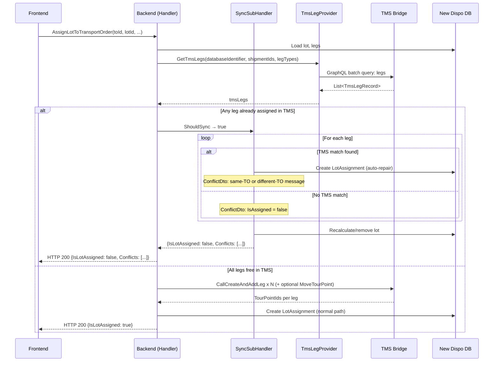

# Flow #4: Assign Lot to Transport Order

**Date:** 2026-05-18
**Status:** Implemented (branch: `feature/assing-lot-create-transport-order-from-lot-indempotent`, not yet merged — merge conflicts)
**Concept Source:** [04-AssignLotToTransportOrder.md](../2026-04-08_Transactional_State_Verification_-_CreateTransportOrderFromLeg/04-AssignLotToTransportOrder.md)
**User Story:** Part of #123303

---

## 1. Sync Detection

### Planned (Concept)

1. Query `V_DIS_Leg` for all `ShipmentIds` from the lot with `TransportOrderId = :TargetTO`
2. Count assigned legs vs. expected leg count
3. If all assigned to target TO → idempotent
4. If partial → partial failure (K of N legs assigned)
5. If some on different TOs → conflict
6. If none assigned → safe to proceed
7. For Path B: also check tour point order via `V_DIS_TO_Tourpoint`

### Implemented (Code)

1. Load lot and legs from New Dispo DB
2. Call `tmsLegProvider.GetTmsLegs(databaseIdentifier, shipmentIds, legTypes)` → batch query for all legs
3. `AssignLotToTransportOrderSyncSubHandler.ShouldSync(tmsLegs, legs)`: returns true if ANY leg matches `MatchTmsLegWithDispoLeg(ShipmentId + LegType + TransportOrderId != null)`
4. If `ShouldSync` is true → `Sync()`:
   a. Iterate all legs
   b. For each leg with TMS match: create `LotAssignmentEntity` from TMS data, add `ConflictDto` with same-TO/different-TO error message, remove leg from lot
   c. For each leg without match: add `ConflictDto { IsAssigned = false }`
   d. Recalculate or remove lot
   e. Return `AssignLotToTransportOrderResponse { IsLotAssigned = false, Conflicts = [...] }`
5. If `ShouldSync` is false: delegate to `assingLotSubHandler.AssignLotToTransportOrder(request, lot, legs)` (normal TMS path)



---

## 2. Concept vs. Implementation

**Concept:** Count-based verification — compare assigned leg count against expected. Detect partial failure (K of N legs assigned). Check for cross-TO conflicts. The concept highlighted this flow as having the **highest partial failure risk** due to up to 2N TMS mutations (N AddLeg + N MoveTourpoint).

**Implementation:** Per-leg matching via `MatchTmsLegWithDispoLeg()`. Each conflicting leg gets its own `ConflictDto` with a same-TO vs. different-TO error message. Auto-repair creates `LotAssignmentEntity` per conflicting leg. Non-conflicting legs are reported as `{ IsAssigned = false }`. The lot is reduced or removed. Returns HTTP 200 with per-leg `Conflicts` array.

**vs. Option 1:** Overdelivered

**Difference:** Option 1 specified "show error, user retries." The implementation provides per-leg granularity with auto-repair and conflict details. The concept's count-based approach is replaced with per-leg matching — more precise but follows the same underlying logic. The same-TO/different-TO distinction in error messages exceeds Option 1 requirements.

**Key difference from flows 1/3:** Same as Flow 2 — uses HTTP 200 + `Conflicts` array, NOT `ConflictException` + HTTP 409.

---

## 3. Option 1 Requirements

| Requirement | Status | Notes |
|-------------|--------|-------|
| State-checking query before TMS action | Done | Batch `TmsLegProvider.GetTmsLegs()` → `ShouldSync()` |
| Display error to user | Partial | Per-leg `ConflictDto` with same-TO/different-TO distinction |
| User manually retries | Replaced | Auto-repair + conflict info; user refreshes and re-evaluates |
| Incident ID in error response | Not done | No incident/tracking ID |
| Structured error payload for Frontend | Partial | `ConflictDto { LegId, Error, IsAssigned }` — better than bare string but `Error` is still plain text |
| Support team can investigate | Not done | No structured logging |
| Monitoring for failure frequency | Not done | No metrics |

---

## 4. Retry Effect

**Polly retry has no effect on sync conflicts.** The sync check runs before TMS operations. If `ShouldSync()` returns true, the handler takes the sync path immediately — no TMS mutation is called. The response is HTTP 200 (not an exception), so Polly is never involved.

---

## 5. Error Information & Data Reaching Frontend

### Implemented

```json
{
  "isLotAssigned": false,
  "conflicts": [
    { "legId": "aaa-bbb", "error": "Leg has already been assigned to this transportorder.", "isAssigned": true },
    { "legId": "ccc-ddd", "error": "Leg has already been assigned to a different transportorder.", "isAssigned": true },
    { "legId": "eee-fff", "error": null, "isAssigned": false }
  ]
}
```

- HTTP 200 with `IsLotAssigned = false` as conflict signal
- Per-leg `ConflictDto` with same-TO/different-TO distinction in `Error`
- `IsAssigned = false` means no TMS conflict for this leg
- Richer than flows 1/3 (per-leg details) but less standard (HTTP 200 vs 409)

### Desired / Possible (VA suggestion)

Same as Flow 2 — the `TmsLegRecord` has full address, date, and product data that is not surfaced in the conflict response.

**VA suggestion:** The `ConflictDto` could be enriched with `TransportOrderId` (the existing TO the leg is assigned to) as a dedicated field rather than embedding it in the error string. This would let the frontend render a table: "Leg A → already on TO X, Leg B → already on TO Y."

**VA suggestion:** The different error contract (HTTP 200 + Conflicts vs. HTTP 409) between lot-based and leg-based flows should be aligned. See Flow 2 open questions.

**AC check (#123326):**
- AC1 "Snackbar" — frontend must parse `Conflicts` array from HTTP 200
- AC2 "Auto-refresh" — backend auto-repair means data is ready
- AC3 "Edge cases" — per-leg granularity handles partial conflicts well
- AC4 "No auto-retry" — correct

---

## 6. UX Scenarios

### Scenario A: All legs in lot already assigned to target TO

| Step | What Happens |
|------|-------------|
| User assigns lot to TO X | Frontend calls `PUT /transportorders/{toId}/lots/{lotId}` |
| Backend detects: all 4 legs already on TO X in TMS | `ShouldSync` → true |
| Backend auto-repairs per leg | LotAssignment created per leg |
| Backend returns HTTP 200 | `{IsLotAssigned: false, Conflicts: [{leg1, "already on this TO", assigned}, ...]}` |
| Frontend shows | "Lot already assigned to this TO. Page refreshed." — benign |

### Scenario B: Mixed — some legs on target TO, some on other TOs

| Step | What Happens |
|------|-------------|
| Backend detects: leg 1 on TO X (same), leg 2 on TO Y (different), legs 3-4 free | `ShouldSync` → true |
| Backend repairs legs 1 and 2, reports legs 3-4 as non-conflicting | Lot reduced |
| Backend returns | `{IsLotAssigned: false, Conflicts: [{leg1, same-TO}, {leg2, different-TO}, {leg3, free}, {leg4, free}]}` |
| Frontend must handle | Mixed result — some benign, some conflicting, some not attempted |

### Scenario C: No conflicts (happy path)

Normal flow — all legs assigned via TMS, LotAssignment created.

---

## 7. Open Questions

1. **Highest partial failure risk not addressed by the sync check.** The sync check catches pre-existing conflicts, but the actual TMS execution (N AddLeg + N MoveTourpoint) still has partial failure risk as documented in the concept. If leg 3 of 5 fails during TMS execution, there is no recovery mechanism beyond the next sync check.

2. **Path B (repositioning) was removed from command handler.** The implementation delegates to `assingLotSubHandler.AssignLotToTransportOrder(request, lot, legs)` on the normal path — the `destinationTourPointId` and `relationType` parameters are no longer checked in the command handler. Was repositioning dropped from this flow?

3. **PR has merge conflicts.** Same as Flow 2. Cannot verify against current master.

4. **Inconsistent error contract.** See Flow 2, question 1.

---

*Analysis by Virtual Architect*
