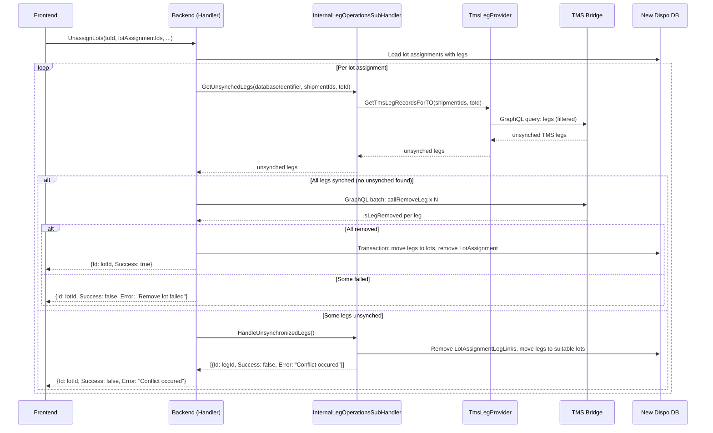

# Flow #5: Unassign Lots

**Date:** 2026-05-18
**Status:** Implemented (branch: `feature/unassing_transactions_implementation`, no PR linked yet)
**Concept Source:** [05-UnassignLots.md](../2026-04-08_Transactional_State_Verification_-_CreateTransportOrderFromLeg/05-UnassignLots.md)
**User Story:** #124362

---

## 1. Sync Detection

### Planned (Concept)

1. For each leg to be removed, query `V_DIS_Leg` with `LegId IN (:LegIds) AND TransportOrderId = :TO`
2. Verification uses **inverted logic**: absence of `TransportOrderId` = leg already removed
3. If all legs still assigned → safe to proceed (operation not yet executed)
4. If some legs missing → partial failure (only retry remaining legs)
5. If no legs assigned → idempotent (already done, return success)
6. Pre-check recommended because `RemoveLeg` is NOT idempotent (errors on already-removed legs)

### Implemented (Code)

1. Load lot assignments with legs from New Dispo DB
2. Per lot: `_internalLegOperationsHandler.GetUnsynchedLegs(databaseIdentifier, shipmentIds, transportOrderId)` → calls `TmsLegProvider.GetTmsLegRecordsForTO()` → returns legs NOT matching the expected TO
3. Filter: separate synched legs (still on this TO in TMS) from unsynched legs (NOT on this TO in TMS)
4. If ALL legs are synched (no unsynched legs found):
   a. Build `RemoveTmsLegRequestDto` with TMS leg IDs
   b. Call `_removeTmsLotsSubHandler.Remove()` → GraphQL batch `callRemoveLeg` per leg
   c. If batch reports success: local DB transaction (move legs back to suitable lots, remove LotAssignment)
   d. If batch fails: return `{ Success: false, Error: "Remove lot failed" }`
5. If SOME legs are unsynched:
   a. Call `_internalLegOperationsHandler.HandleUnsynchronizedLegs()`:
      - Match unsynched TMS legs back to New Dispo legs
      - For each unsynched leg: remove LotAssignmentLegLink, move leg to suitable lot
      - Return `UpsertOperationResponseDto { Success: false, Error: "Conflict occured" }` per leg
   b. Return per-lot result: `{ Success: false, Error: "Conflict occured" }`



---

## 2. Concept vs. Implementation

**Concept:** Absence-based verification — query `V_DIS_Leg` for legs still assigned to the target TO. Count remaining legs to detect partial failure. Recommended pre-checking because `RemoveLeg` is NOT idempotent (calling it for an already-removed leg raises an exception indistinguishable from a business rule failure).

**Implementation:** Inverted approach — queries TMS for legs that do NOT match the expected TO (unsynched legs). This is functionally equivalent to the concept's absence check but approaches it from the opposite direction: "find what's wrong" instead of "verify what's right." Auto-repairs unsynched legs by removing their local assignments and moving them to suitable lots. Synched legs proceed with TMS removal normally.

**vs. Option 1:** Overdelivered

**Difference:** Option 1 specified "show error, user retries." The implementation:
- Pre-checks state before TMS call (preventing non-idempotent retry errors)
- Auto-repairs unsynched legs (removes their local assignments)
- Proceeds with synched legs (partial execution — doesn't block all legs because some are unsynched)
- Returns per-item results (granular feedback)

The concept warned about `RemoveLeg` non-idempotency. The implementation correctly avoids this by pre-filtering — only synched legs are sent to TMS.

---

## 3. Option 1 Requirements

| Requirement | Status | Notes |
|-------------|--------|-------|
| State-checking query before TMS action | Done | `GetUnsynchedLegs()` filters before TMS call |
| Display error to user | Partial | Per-item `UpsertOperationResponseDto { Success: false, Error: "Conflict occured" }` — generic string |
| User manually retries | Replaced | Auto-repair + partial execution; synched legs are removed, unsynched repaired |
| Incident ID in error response | Not done | No incident/tracking ID |
| Structured error payload for Frontend | Partial | `UpsertOperationResponseDto { Id, Success, Error }` — structured but `Error` is a bare string |
| Support team can investigate | Not done | No structured logging |
| Monitoring for failure frequency | Not done | No metrics |

---

## 4. Retry Effect

**Polly retry has no effect on sync conflicts.** The sync check happens before TMS mutations. Unsynched legs never reach TMS — they're repaired locally. For the synched legs that go through TMS, Polly covers transient failures on the GraphQL `callRemoveLeg` calls (connection errors, timeouts, 502/503/504). But the overall sync detection and repair is not retried — it runs once per request.

**Polly does protect the TMS removal calls.** Each `callRemoveLeg` within the batch is a GraphQL call through `GraphQLQueryService.SendQuery()` which uses the Polly pipeline. If a single leg removal hits a transient error, Polly retries it up to 3 times before reporting failure.

---

## 5. Error Information & Data Reaching Frontend

### Implemented

```json
[
  { "id": "<lotAssignmentId>", "success": true },
  { "id": "<lotAssignmentId>", "success": false, "error": "Remove lot failed" },
  { "id": "<lotAssignmentId>", "success": false, "error": "Conflict occured" }
]
```

- HTTP 200 with `List<UpsertOperationResponseDto>`
- Three possible outcomes per lot:
  - `success: true` — all legs removed from TMS and local state cleaned up
  - `error: "Remove lot failed"` — TMS batch removal reported at least one `isLegRemoved = false`
  - `error: "Conflict occured"` — some legs were out of sync, auto-repaired locally
- No per-leg breakdown in the lot-level response (the internal `HandleUnsynchronizedLegs` returns per-leg results, but the lot handler rolls them up)

### Desired / Possible (VA suggestion)

Data available at the sync check point but not surfaced:

| Field | Available | Surfaced | Could Be Useful For |
|-------|-----------|----------|---------------------|
| Which specific legs were unsynched | Yes (from `GetUnsynchedLegs`) | No (rolled up to lot level) | "Legs A and B were already removed" |
| What TO the legs are actually on | Yes (from `TmsLegRecord`) | No | "Leg A is now on TO Y (was expected on TO X)" |
| How many legs synched vs. unsynched | Yes | No | "3 of 5 legs removed, 2 were already unassigned" |

**VA suggestion:** Surface per-leg results at the API level. The internal `HandleUnsynchronizedLegs()` already returns per-leg `UpsertOperationResponseDto` — this data is discarded at the lot handler level. Passing it through would enable the frontend to show: "Lot partially unassigned: 3 legs removed, 2 were already unassigned in TMS."

**AC check (#123326):**
- AC1 "Snackbar" — possible, but lot-level error is generic
- AC2 "Auto-refresh" — backend repairs state, data ready on refresh
- AC3 "Edge cases" — partial sync conflict is an edge case; handled but poorly communicated
- AC4 "No auto-retry" — correct, synched legs are processed in one pass

---

## 6. UX Scenarios

### Scenario A: All legs synched — normal removal

| Step | What Happens |
|------|-------------|
| User unassigns a lot from a TO | Frontend calls endpoint with lotAssignmentIds |
| Backend checks: all legs still assigned to this TO in TMS | No unsynched legs found |
| Backend removes via TMS batch | `callRemoveLeg` x N |
| Backend cleans up locally | Legs moved back to lot, LotAssignment removed |
| Frontend shows | Success |

### Scenario B: Some legs already removed in TMS (out of sync)

| Step | What Happens |
|------|-------------|
| User unassigns a lot with 5 legs | Frontend calls endpoint |
| Backend detects: 2 legs are NOT on this TO in TMS | `GetUnsynchedLegs` returns 2 legs |
| Backend auto-repairs 2 unsynched legs | Removes their LotAssignmentLegLinks, moves to suitable lots |
| Backend does NOT call TMS for the remaining 3 synched legs | Because some legs were unsynched, entire lot takes the unsynch path |
| Backend returns | `{Id: lotId, Success: false, Error: "Conflict occured"}` |
| Frontend shows snackbar | "Conflict detected. Page refreshed. Please retry." |
| User retries | On refresh, only 3 legs remain assigned — next attempt should succeed |

**Important:** When any legs are unsynched, the implementation does NOT proceed with TMS removal for the synched legs. It repairs the unsynched legs and reports a conflict for the whole lot. The user must retry to remove the remaining synched legs.

### Scenario C: All legs already removed in TMS

| Step | What Happens |
|------|-------------|
| Backend detects: all 5 legs are NOT on this TO in TMS | All are unsynched |
| Backend auto-repairs all 5 | Removes all LotAssignmentLegLinks, moves to suitable lots |
| Backend returns | `{Id: lotId, Success: false, Error: "Conflict occured"}` |
| On retry | Nothing left to unassign — operation is effectively complete |

---

## 7. Open Questions

1. **All-or-nothing behavior per lot.** If even one leg is unsynched, the entire lot takes the conflict path and none of the synched legs are removed from TMS. The concept's partial execution model (remove what can be removed) is only partially implemented. Should synched legs be processed even when some are unsynched?

2. **"Conflict occured" typo.** The error string has a typo ("occured" → "occurred"). Minor, but if it's displayed to users, it should be fixed.

3. **Empty LotAssignment cleanup.** `RemoveEmptyLotAssignments()` runs after handling unsynched legs — it removes LotAssignments with no remaining LegLinks. Is this safe if only some legs were unsynched?

4. **Per-leg results lost at lot level.** `HandleUnsynchronizedLegs` returns per-leg results, but the lot handler only reports lot-level success/failure. The frontend has no visibility into which specific legs were problematic.

---

*Analysis by Virtual Architect*
