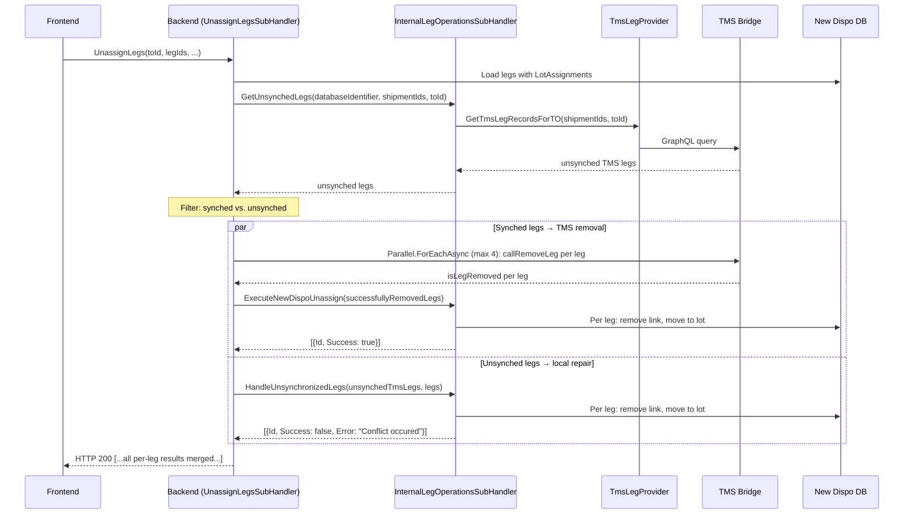

# Flow #6: Unassign Legs

**Date:** 2026-05-18
**Status:** Implemented (branch: `feature/unassing_transactions_implementation`, no PR linked yet)
**Concept Source:** [06-UnassignLegs.md](../2026-04-08_Transactional_State_Verification_-_CreateTransportOrderFromLeg/06-UnassignLegs.md)
**User Story:** #124363

---

## 1. Sync Detection

### Planned (Concept)

1. For each leg to be removed, query `V_DIS_Leg` with `LegId IN (:LegIds) AND TransportOrderId = :TO`
2. Inverted logic: absence of `TransportOrderId` = already removed
3. Key difference from Flow 5: legs are removed via `Parallel.ForEachAsync` (max 4 concurrent HTTP requests) instead of GraphQL batch
4. More granular failure tracking (per-leg) but higher partial failure risk (N independent HTTP requests)
5. Pre-check recommended: `RemoveLeg` is NOT idempotent

### Implemented (Code)

1. Load legs with LotAssignments from New Dispo DB
2. `_internalLegOperationsHandler.GetUnsynchedLegs(databaseIdentifier, shipmentIds, transportOrderId)` → queries TMS for legs NOT matching expected TO
3. Filter: separate synched legs from unsynched legs
4. For synched legs:
   a. Build `RemoveTmsLegRequestDto` with TMS leg IDs
   b. Call `_removeLegsSubHandler.Remove()` → `Parallel.ForEachAsync` (max 4 concurrent) → `callRemoveLeg` per leg
   c. For successfully removed legs: `_internalLegOperationsHandler.ExecuteNewDispoUnassign()` → per-leg: remove LotAssignmentLegLink, move to suitable lot, return `{ Success: true }`
   d. For failed removals: report `{ Success: false, Error: "Tms Leg removal failed." }`
5. For unsynched legs:
   a. `_internalLegOperationsHandler.HandleUnsynchronizedLegs()`:
      - Match unsynched TMS legs to New Dispo legs
      - `ExecuteNewDispoUnassign()` with `isSyncAttempt = true` → returns `{ Success: false, Error: "Conflict occured" }`
      - Remove empty LotAssignments
   b. Results appended to overall response



---

## 2. Concept vs. Implementation

**Concept:** Per-leg absence check — verify each leg's `TransportOrderId` after removal. Highlighted the difference from Flow 5: parallel HTTP requests (not GraphQL batch) give per-leg failure visibility but higher partial failure risk. Recommended pre-checking because `RemoveLeg` is NOT idempotent. Strategy 3 (full state snapshot) proposed detecting the edge case of legs reassigned to different TOs between retries.

**Implementation:** Pre-check via `GetUnsynchedLegs()` — inverted query finds legs NOT on the expected TO. Synched legs proceed to TMS removal (parallel HTTP, max 4 concurrent). Unsynched legs are auto-repaired locally. Results from both paths are merged into a single per-leg response list.

**vs. Option 1:** Overdelivered

**Difference:** Option 1 specified "show error, user retries." The implementation:
- Pre-filters before TMS call (avoids non-idempotent `RemoveLeg` errors)
- Auto-repairs unsynched legs locally
- Proceeds with synched legs in parallel (partial execution — doesn't block all legs)
- Returns per-leg results (Success + Error per leg)

**Key difference from Flow 5:** This flow processes synched and unsynched legs in parallel, returning merged results. Flow 5 takes an all-or-nothing approach per lot. Flow 6 is more granular.

---

## 3. Option 1 Requirements

| Requirement | Status | Notes |
|-------------|--------|-------|
| State-checking query before TMS action | Done | `GetUnsynchedLegs()` pre-filters before TMS call |
| Display error to user | Partial | Per-leg `UpsertOperationResponseDto` — but error strings are generic ("Conflict occured") |
| User manually retries | Replaced | Auto-repair for unsynched + execution for synched legs; mixed results returned |
| Incident ID in error response | Not done | No incident/tracking ID |
| Structured error payload for Frontend | Partial | `{ Id, Success, Error }` per leg — structured shape, generic content |
| Support team can investigate | Not done | No structured logging |
| Monitoring for failure frequency | Not done | No metrics |

---

## 4. Retry Effect

**Polly retry protects individual TMS removal calls.** Each `callRemoveLeg` via `Parallel.ForEachAsync` goes through `GraphQLQueryService.SendQuery()` which uses the Polly pipeline. If a single leg removal hits a transient error (timeout, 502), Polly retries it 3 times before reporting failure.

**Polly does NOT affect the sync detection.** The `GetUnsynchedLegs` pre-check runs once. If the TMS Bridge is transiently unavailable during the pre-check, Polly retries the GraphQL query — this covers the pre-check call itself.

**User-level retry:** If the user retries after partial failure, the next pre-check will correctly detect which legs are now unsynched (including legs that were successfully removed in the previous attempt) and skip them.

---

## 5. Error Information & Data Reaching Frontend

### Implemented

```json
[
  { "id": "<legId>", "success": true },
  { "id": "<legId>", "success": false, "error": "Conflict occured" },
  { "id": "<legId>", "success": false, "error": "Tms Leg removal failed." },
  { "id": "<legId>", "success": false, "error": "<exception message>" }
]
```

- HTTP 200 with `List<UpsertOperationResponseDto>`
- Per-leg granularity (each leg has its own success/failure status)
- Four possible outcomes per leg:
  1. `success: true` — removed from TMS and local state cleaned up
  2. `error: "Conflict occured"` — leg was out of sync, auto-repaired locally (with `isSyncAttempt = true`)
  3. `error: "Tms Leg removal failed."` — TMS returned `isLegRemoved = false`
  4. `error: <exception>` — unexpected error during local cleanup (catch-all)

### Desired / Possible (VA suggestion)

Data available at sync check point but not surfaced:

| Field | Available | Surfaced | Could Be Useful For |
|-------|-----------|----------|---------------------|
| Which TO the leg is actually on | Yes (from `TmsLegRecord.TransportOrderId`) | No | "Leg A is not on TO X — it's on TO Y" or "already removed" |
| Was the leg already removed vs. reassigned | Yes (null vs. different TO) | No | Distinguishing benign (already done) from concerning (reassigned) |
| Leg address/date info | Yes | No | Context for the conflict |

**VA suggestion:** Distinguish "already removed" (benign, `TransportOrderId = null`) from "on a different TO" (conflict, `TransportOrderId != expectedTO`) in the error response. Currently both are reported as "Conflict occured". The `GetUnsynchedLegs` query returns `TmsLegRecord` which has `TransportOrderId` — checking for null vs. non-null would differentiate these cases.

**AC check (#123326):**
- AC1 "Snackbar" — per-leg results can be summarized: "3 legs removed, 2 had conflicts"
- AC2 "Auto-refresh" — backend repairs state, ready on refresh
- AC3 "Edge cases" — partial success is a key edge case, well-handled at data level
- AC4 "No auto-retry" — correct, synched legs are processed in one pass

---

## 6. UX Scenarios

### Scenario A: All legs synched — normal removal

| Step | What Happens |
|------|-------------|
| User unassigns 5 legs from TO | Frontend calls endpoint with legIds |
| Backend checks: all 5 legs still on this TO in TMS | No unsynched legs |
| Backend removes via parallel HTTP (max 4 concurrent) | `callRemoveLeg` x 5 |
| All succeed | Local cleanup per leg |
| Frontend shows | All 5 legs: success |

### Scenario B: Mixed — some legs already removed in TMS

| Step | What Happens |
|------|-------------|
| User unassigns 5 legs | Backend detects: 2 legs NOT on this TO in TMS |
| Backend auto-repairs 2 unsynched legs | Removes their links, moves to lots |
| Backend removes 3 synched legs via TMS | Parallel HTTP calls |
| All 3 succeed | Local cleanup |
| Frontend receives | `[{leg1: true}, {leg2: true}, {leg3: true}, {leg4: "Conflict occured"}, {leg5: "Conflict occured"}]` |
| Frontend shows | "3 legs removed. 2 had conflicts (already unassigned). Page refreshed." |

### Scenario C: TMS removal partially fails

| Step | What Happens |
|------|-------------|
| Backend sends 4 synched legs to TMS | 3 succeed, 1 fails (TMS business rule or network) |
| Backend processes 3 successful + reports 1 failed | Plus any unsynched legs repaired |
| Frontend receives mixed results | `[{leg1: true}, {leg2: true}, {leg3: true}, {leg4: "Tms Leg removal failed."}, {leg5: "Conflict occured"}]` |
| User retries for failed leg | Next pre-check detects updated state |

---

## 7. Open Questions

1. **"Conflict occured" vs. "already removed" vs. "on different TO."** The current implementation treats all unsynched states identically. The concept (Strategy 3) proposed distinguishing `REMOVED`, `STILL_ASSIGNED`, and `REASSIGNED_TO_OTHER_TO`. The data for this distinction is available but not used.

2. **Race condition between pre-check and TMS call.** Between `GetUnsynchedLegs()` and `callRemoveLeg()`, another user could assign the leg to a different TO. The pre-check would show "synched", but the `RemoveLeg` call would remove the leg from the wrong context. This is documented as Q2 in the concept doc.

3. **"Conflict occured" typo.** Same as Flow 5.

4. **Parallel.ForEachAsync (max 4) vs. batch.** Flow 5 uses GraphQL batch (single HTTP request), Flow 6 uses parallel HTTP (multiple requests). The sync detection is identical, but the failure granularity differs. Should this be aligned?

---

*Analysis by Virtual Architect*
